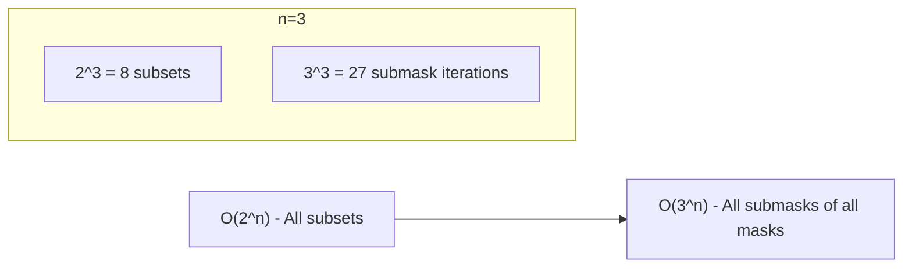

# Iterating Through Submasks

| Property | Value |
|----------|-------|
| Category | Dynamic Programming / Bit Manipulation |
| Subcategory | Bitmask Enumeration |
| Complexity (Time) | O(3^n) for all submasks of all masks |
| Complexity (Space) | O(1) per iteration |
| Input | Bitmask representing a set |
| Output | All submasks in decreasing order |

## Overview

**Iterating Through Submasks** is a technique to efficiently enumerate all subsets of a given subset (represented as a bitmask). Given a mask $m$ with $k$ bits set, there are $2^k$ submasks including the empty mask. This is crucial for bitmask DP problems where we need to consider all subset transitions.

## Mathematical Foundation

### Submask Definition

A mask $s$ is a submask of $m$ if:
$$s \land m = s$$

Equivalently, $s$ only has bits set that are also set in $m$.

### Example

For mask $m = 13$ (binary: $1101$):
- Submasks: $13, 12, 9, 8, 5, 4, 1, 0$
- Binary: $1101, 1100, 1001, 1000, 0101, 0100, 0001, 0000$

### Number of Submasks

For a mask with $k$ bits set: $2^k$ submasks (including 0).

### Key Formula

```
submask = (submask - 1) & mask
```

This formula efficiently generates the next smaller submask:
1. `submask - 1`: Flips trailing 1s and the rightmost 0
2. `& mask`: Keeps only bits that were in original mask

## Algorithm

### Iterating Submasks of a Single Mask

```
LIST-SUBMASKS(mask):
    submasks = []
    submask = mask
    
    while submask > 0:
        submasks.append(submask)
        submask = (submask - 1) AND mask
    
    submasks.append(0)  // Include empty submask if needed
    return submasks
```

### Iterating All Submasks of All Masks (0 to 2^n - 1)

```
ALL-SUBMASKS(n):
    total = 0
    
    for mask from 0 to 2^n - 1:
        submask = mask
        while submask > 0:
            // Process submask of mask
            total += 1
            submask = (submask - 1) AND mask
    
    return total  // Should be 3^n
```

## Complexity Analysis

| Operation | Time | Space |
|-----------|------|-------|
| Single mask (k bits) | O(2^k) | O(1) |
| All masks (n bits) | O(3^n) | O(1) |

### Why O(3^n)?

For n elements, considering all submasks of all masks:
- Each element can be: in mask but not submask, in both, or in neither
- 3 choices per element → 3^n total iterations

## Visual Representation

### Submasks of 13 (1101)

```
Binary Tree of Submasks:

            1101 (13)
           /    \
        1100    1001
        (12)     (9)
       /  \     /  \
    1000  0100 1000 0001
    (8)   (4)  (8)  (1)
      \    |    |
      0000 0000 0000
       (0)  (0)  (0)

Iteration order: 13 → 12 → 9 → 8 → 5 → 4 → 1 → (0)
```

### Bit-by-Bit Transition

```
mask = 1101 (13)

submask = 1101  (13)
(13-1) & 13 = 1100 & 1101 = 1100

submask = 1100  (12)
(12-1) & 13 = 1011 & 1101 = 1001

submask = 1001  (9)
(9-1) & 13 = 1000 & 1101 = 1000

submask = 1000  (8)
(8-1) & 13 = 0111 & 1101 = 0101

submask = 0101  (5)
(5-1) & 13 = 0100 & 1101 = 0100

submask = 0100  (4)
(4-1) & 13 = 0011 & 1101 = 0001

submask = 0001  (1)
(1-1) & 13 = 0000 & 1101 = 0000

submask = 0000  (0) → STOP
```

### State Space Comparison



## Implementation (from repository)

```python
def list_of_submasks(mask: int) -> list[int]:
    """
    Args:
        mask : number which shows mask ( always integer > 0, zero does not have any
            submasks )

    Returns:
        all_submasks : the list of submasks of mask (mask s is called submask of mask
        m if only bits that were included in original mask are set

    Raises:
        AssertionError: mask not positive integer

    >>> list_of_submasks(15)
    [15, 14, 13, 12, 11, 10, 9, 8, 7, 6, 5, 4, 3, 2, 1]
    >>> list_of_submasks(13)
    [13, 12, 9, 8, 5, 4, 1]
    >>> list_of_submasks(-7)  # doctest: +ELLIPSIS
    Traceback (most recent call last):
        ...
    AssertionError: mask needs to be positive integer, your input -7
    >>> list_of_submasks(0)  # doctest: +ELLIPSIS
    Traceback (most recent call last):
        ...
    AssertionError: mask needs to be positive integer, your input 0

    """

    assert isinstance(mask, int) and mask > 0, (
        f"mask needs to be positive integer, your input {mask}"
    )

    """
    first submask iterated will be mask itself then operation will be performed
    to get other submasks till we reach empty submask that is zero ( zero is not
    included in final submasks list )
    """
    all_submasks = []
    submask = mask

    while submask:
        all_submasks.append(submask)
        submask = (submask - 1) & mask

    return all_submasks
```

## Real-World Applications

### 1. Subset Sum with Subset Queries

```python
from typing import List, Dict, Set

def precompute_subset_sums(
    values: List[int]
) -> Dict[int, int]:
    """
    Precompute sum for every possible subset.
    
    >>> sums = precompute_subset_sums([1, 2, 4])
    >>> sums[7]  # All elements: 1 + 2 + 4
    7
    >>> sums[5]  # Elements 0 and 2: 1 + 4
    5
    """
    n = len(values)
    subset_sums = {}
    
    for mask in range(1 << n):
        total = 0
        for i in range(n):
            if mask & (1 << i):
                total += values[i]
        subset_sums[mask] = total
    
    return subset_sums


def find_best_partition(
    values: List[int],
    constraints: Dict[int, int]  # mask -> max_sum for that subset
) -> Dict:
    """
    Find partition respecting constraints on certain subsets.
    
    >>> values = [1, 2, 3]
    >>> constraints = {3: 4}  # Subset {0,1} must sum ≤ 4
    >>> result = find_best_partition(values, constraints)
    >>> 'valid' in result
    True
    """
    n = len(values)
    subset_sums = precompute_subset_sums(values)
    
    # Check all submasks for constraint violations
    valid_masks = []
    full_mask = (1 << n) - 1
    
    for mask in range(1 << n):
        valid = True
        
        # Check all constraint masks
        for constraint_mask, max_sum in constraints.items():
            # Get intersection of mask and constraint
            intersection = mask & constraint_mask
            if subset_sums.get(intersection, 0) > max_sum:
                valid = False
                break
        
        if valid:
            valid_masks.append(mask)
    
    return {
        'valid': True,
        'valid_subsets': len(valid_masks),
        'example_valid': valid_masks[:5]
    }


def optimal_subset_cover(
    n: int,
    subset_costs: Dict[int, float],
    required_mask: int
) -> Dict:
    """
    Find minimum cost to cover all elements in required_mask.
    Each subset (mask) has an associated cost.
    
    >>> costs = {1: 1.0, 2: 1.0, 3: 1.5}  # {0}, {1}, {0,1}
    >>> result = optimal_subset_cover(2, costs, 3)
    >>> result['min_cost'] <= 2.0  # At most cost of {0} + {1}
    True
    """
    INF = float('inf')
    
    # dp[mask] = min cost to cover elements in mask
    dp = {0: 0.0}
    
    for mask in range(1, required_mask + 1):
        if (mask & required_mask) != mask:
            continue  # Only consider submasks of required
        
        dp[mask] = INF
        
        # Try all submasks
        submask = mask
        while submask:
            if submask in subset_costs:
                remaining = mask ^ submask
                if remaining in dp:
                    dp[mask] = min(dp[mask], dp[remaining] + subset_costs[submask])
            submask = (submask - 1) & mask
    
    return {
        'min_cost': dp.get(required_mask, INF),
        'achievable': dp.get(required_mask, INF) < INF
    }
```

### 2. Team Formation / Task Assignment

```python
from typing import List, Dict, Tuple

def find_compatible_teams(
    people: List[str],
    compatibility: Dict[int, bool],  # mask -> is this group compatible?
    team_size: int
) -> List[List[str]]:
    """
    Find all compatible teams of given size.
    
    >>> people = ["A", "B", "C", "D"]
    >>> compat = {3: True, 5: True, 6: False}  # AB compatible, AC compatible, BC not
    >>> teams = find_compatible_teams(people, compat, 2)
    >>> sorted([sorted(t) for t in teams])
    [['A', 'B'], ['A', 'C']]
    """
    n = len(people)
    valid_teams = []
    
    for mask in range(1 << n):
        if bin(mask).count('1') != team_size:
            continue
        
        # Check if all submasks are compatible
        is_valid = True
        submask = mask
        
        while submask:
            if submask in compatibility and not compatibility[submask]:
                is_valid = False
                break
            submask = (submask - 1) & mask
        
        if is_valid:
            team = [people[i] for i in range(n) if mask & (1 << i)]
            valid_teams.append(team)
    
    return valid_teams


def optimal_project_teams(
    developers: List[str],
    skills: Dict[str, Set[str]],  # developer -> skills
    project_requirements: Set[str]
) -> Dict:
    """
    Find smallest team that covers all project requirements.
    
    >>> devs = ["Alice", "Bob", "Carol"]
    >>> skills = {"Alice": {"Python"}, "Bob": {"Java"}, "Carol": {"Python", "Java"}}
    >>> reqs = {"Python", "Java"}
    >>> result = optimal_project_teams(devs, skills, reqs)
    >>> result['team_size'] <= 2
    True
    """
    n = len(developers)
    
    # Convert skills to bitmask
    all_skills = list(project_requirements)
    skill_to_bit = {s: i for i, s in enumerate(all_skills)}
    
    required_mask = (1 << len(all_skills)) - 1
    
    # Each developer covers certain skills
    dev_coverage = []
    for dev in developers:
        coverage = 0
        for skill in skills.get(dev, set()):
            if skill in skill_to_bit:
                coverage |= (1 << skill_to_bit[skill])
        dev_coverage.append(coverage)
    
    # Find minimum team
    best_team = None
    best_size = n + 1
    
    for team_mask in range(1 << n):
        # Compute skill coverage
        coverage = 0
        for i in range(n):
            if team_mask & (1 << i):
                coverage |= dev_coverage[i]
        
        if coverage == required_mask:
            team_size = bin(team_mask).count('1')
            if team_size < best_size:
                best_size = team_size
                best_team = team_mask
    
    if best_team is None:
        return {'possible': False}
    
    return {
        'possible': True,
        'team_size': best_size,
        'team': [developers[i] for i in range(n) if best_team & (1 << i)]
    }
```

### 3. Subset DP Optimization

```python
from typing import List, Dict, Callable

def sum_over_subsets(
    values: List[int],
    combine: Callable[[int, int], int] = lambda a, b: a + b
) -> Dict[int, int]:
    """
    Compute function over all submasks efficiently.
    Sum over Subsets (SOS) DP.
    
    >>> result = sum_over_subsets([1, 2, 4])
    >>> result[7]  # Sum of all submasks of 111
    16
    """
    n = len(values)
    
    # dp[mask] = sum of values[submask] for all submasks
    dp = {}
    for mask in range(1 << n):
        # Initialize with single element sums
        total = 0
        for i in range(n):
            if mask & (1 << i):
                total = combine(total, values[i])
        dp[mask] = total
    
    # Actually compute SOS
    sos = [0] * (1 << n)
    for mask in range(1 << n):
        submask = mask
        while True:
            sos[mask] = combine(sos[mask], dp.get(submask, 0))
            if submask == 0:
                break
            submask = (submask - 1) & mask
    
    return {i: sos[i] for i in range(1 << n)}


def count_subset_with_property(
    n: int,
    has_property: Callable[[int], bool]
) -> Dict[int, int]:
    """
    Count submasks satisfying a property for each mask.
    
    >>> # Count submasks with even number of bits
    >>> is_even = lambda m: bin(m).count('1') % 2 == 0
    >>> counts = count_subset_with_property(3, is_even)
    >>> counts[7]  # Submasks of 111 with even bits: 0, 3, 5, 6
    4
    """
    counts = {}
    
    for mask in range(1 << n):
        count = 0
        submask = mask
        
        while True:
            if has_property(submask):
                count += 1
            if submask == 0:
                break
            submask = (submask - 1) & mask
        
        counts[mask] = count
    
    return counts
```

## Variations

### Generator Version

```python
def submask_generator(mask: int):
    """
    Memory-efficient generator for submasks.
    
    >>> list(submask_generator(5))
    [5, 4, 1, 0]
    """
    submask = mask
    while submask:
        yield submask
        submask = (submask - 1) & mask
    yield 0
```

### Proper Submasks (excluding mask itself)

```python
def proper_submasks(mask: int) -> List[int]:
    """
    Get submasks excluding the mask itself.
    
    >>> proper_submasks(5)
    [4, 1, 0]
    """
    result = []
    submask = (mask - 1) & mask
    while submask:
        result.append(submask)
        submask = (submask - 1) & mask
    result.append(0)
    return result
```

### Non-empty Submasks

```python
def nonempty_submasks(mask: int) -> List[int]:
    """
    Get all non-empty submasks.
    
    >>> nonempty_submasks(5)
    [5, 4, 1]
    """
    result = []
    submask = mask
    while submask:
        result.append(submask)
        submask = (submask - 1) & mask
    return result
```

## Common Pitfalls

1. **Empty submask**: The while loop stops at 0, handle if needed
2. **Mask = 0**: No submasks, handle as special case
3. **Negative masks**: Not valid, use assertions
4. **Complexity**: O(3^n) can be slow for n > 20

## References

- [CP Algorithms - Submask Enumeration](https://cp-algorithms.com/algebra/all-submasks.html)
- [Sum over Subsets DP](https://codeforces.com/blog/entry/45223)

## See Also

- [Bitmask DP](bitmask.md) - General bitmask dynamic programming
- [Traveling Salesman](../graphs/tsp.md) - Uses submask iteration
- [Set Cover](../greedy/set_cover.md) - Related problem
