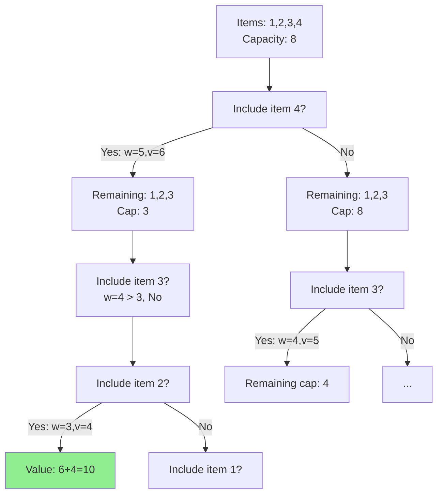

# 0/1 Knapsack Problem

| Property | Value |
|----------|-------|
| Category | Dynamic Programming |
| Subcategory | Optimization / Selection |
| Complexity (Time) | O(nW) |
| Complexity (Space) | O(nW) or O(W) optimized |
| Input | Weights, values, capacity |
| Output | Maximum value achievable |

## Overview

The **0/1 Knapsack Problem** is a classic combinatorial optimization problem where we must select items to maximize total value without exceeding a weight capacity. Each item can either be taken completely (1) or not taken at all (0).

This is one of the most important problems in computer science, serving as a foundation for understanding NP-complete problems and pseudo-polynomial algorithms.

## Mathematical Foundation

### Problem Definition

Given:
- $n$ items with weights $w_1, w_2, ..., w_n$
- Values $v_1, v_2, ..., v_n$
- Knapsack capacity $W$

Find binary vector $x = (x_1, x_2, ..., x_n)$ where $x_i \in \{0, 1\}$ that:

**Maximizes:**
$$\sum_{i=1}^{n} v_i \cdot x_i$$

**Subject to:**
$$\sum_{i=1}^{n} w_i \cdot x_i \leq W$$

### Recurrence Relation

Let $dp[i][w]$ = maximum value using items $1$ to $i$ with capacity $w$:

$$dp[i][w] = \begin{cases} 
0 & \text{if } i = 0 \text{ or } w = 0 \\
dp[i-1][w] & \text{if } w_i > w \\
\max(dp[i-1][w], v_i + dp[i-1][w-w_i]) & \text{otherwise}
\end{cases}$$

### Optimal Substructure

For each item $i$, we have two choices:
1. **Exclude item $i$**: Optimal value = $dp[i-1][w]$
2. **Include item $i$**: Optimal value = $v_i + dp[i-1][w-w_i]$ (if $w_i \leq w$)

The overall optimal is the maximum of these choices.

## Algorithm Approaches

### 1. Recursive with Memoization (Top-Down)

```
KNAPSACK-MEMO(weights, values, W):
    n = length(weights)
    memo = empty map
    
    function SOLVE(i, w):
        if i < 0 or w <= 0:
            return 0
        
        if (i, w) in memo:
            return memo[(i, w)]
        
        // Cannot include item i
        if weights[i] > w:
            result = SOLVE(i-1, w)
        else:
            // Max of including or excluding item i
            exclude = SOLVE(i-1, w)
            include = values[i] + SOLVE(i-1, w - weights[i])
            result = max(exclude, include)
        
        memo[(i, w)] = result
        return result
    
    return SOLVE(n-1, W)
```

### 2. Tabulation (Bottom-Up)

```
KNAPSACK-DP(weights, values, W):
    n = length(weights)
    dp = 2D array of size (n+1) × (W+1), initialized to 0
    
    for i from 1 to n:
        for w from 0 to W:
            if weights[i-1] <= w:
                // Choose max of including or excluding item
                include = values[i-1] + dp[i-1][w - weights[i-1]]
                exclude = dp[i-1][w]
                dp[i][w] = max(include, exclude)
            else:
                // Cannot include item, carry forward
                dp[i][w] = dp[i-1][w]
    
    return dp[n][W]
```

### 3. Space-Optimized (1D Array)

```
KNAPSACK-OPTIMIZED(weights, values, W):
    n = length(weights)
    dp = array of size (W+1), initialized to 0
    
    for i from 0 to n-1:
        // Traverse backwards to avoid using updated values
        for w from W down to weights[i]:
            dp[w] = max(dp[w], values[i] + dp[w - weights[i]])
    
    return dp[W]
```

### 4. Solution Reconstruction

```
KNAPSACK-WITH-SOLUTION(weights, values, W):
    n = length(weights)
    dp = 2D array of size (n+1) × (W+1), initialized to 0
    
    // Build DP table
    for i from 1 to n:
        for w from 0 to W:
            if weights[i-1] <= w:
                dp[i][w] = max(dp[i-1][w], 
                              values[i-1] + dp[i-1][w - weights[i-1]])
            else:
                dp[i][w] = dp[i-1][w]
    
    // Backtrack to find selected items
    selected = empty list
    w = W
    for i from n down to 1:
        if dp[i][w] != dp[i-1][w]:
            selected.append(i-1)  // Item was included
            w = w - weights[i-1]
    
    return dp[n][W], reverse(selected)
```

## Complexity Analysis

| Approach | Time | Space | Notes |
|----------|------|-------|-------|
| Brute Force | O(2^n) | O(n) | Try all subsets |
| Memoization | O(nW) | O(nW) | Top-down DP |
| Tabulation | O(nW) | O(nW) | Bottom-up DP |
| Space-Optimized | O(nW) | O(W) | 1D array |
| Meet-in-Middle | O(n·2^(n/2)) | O(2^(n/2)) | For large W |

### Pseudo-polynomial Note

The O(nW) complexity is **pseudo-polynomial** because W is not polynomial in the input size. The input size is O(n log W) bits, making this exponential in input size when W is large.

## Visual Representation

### DP Table Construction

```
Items: [(w=2, v=3), (w=3, v=4), (w=4, v=5), (w=5, v=6)]
Capacity W = 8

        Capacity w →
        0    1    2    3    4    5    6    7    8
    ┌────────────────────────────────────────────────┐
i=0 │ 0    0    0    0    0    0    0    0    0      │
    │                                                 │
i=1 │ 0    0    3    3    3    3    3    3    3      │ item 1: w=2, v=3
    │         [✓]                                     │
i=2 │ 0    0    3    4    4    7    7    7    7      │ item 2: w=3, v=4
    │              [✓]      [3+4]                     │
i=3 │ 0    0    3    4    5    7    8    9    9      │ item 3: w=4, v=5
    │                   [✓]      [3+5]                │
i=4 │ 0    0    3    4    5    7    8    9   10      │ item 4: w=5, v=6
    │                                        [4+6]   │
    └────────────────────────────────────────────────┘
                                               ↑
                                        Answer: 10
```

### Decision Tree



### Backtracking Visualization

```
dp[4][8] = 10, dp[3][8] = 9 → Different! Item 4 selected
    w = 8 - 5 = 3
    
dp[3][3] = 4, dp[2][3] = 4 → Same! Item 3 NOT selected

dp[2][3] = 4, dp[1][3] = 3 → Different! Item 2 selected
    w = 3 - 3 = 0

dp[1][0] = 0 → Done

Selected items: [4, 2] with values [6, 4] = 10
```

## Implementation (from repository)

```python
def mf_knapsack(i: int, wt: list, val: list, j: int) -> int:
    """
    Memoized recursive knapsack.
    
    Uses global dp array 'f' for memoization.
    
    >>> # Setup global array first
    >>> f = [[0] * 10 for _ in range(10)]
    >>> mf_knapsack(3, [2, 3, 4], [3, 4, 5], 5)
    7
    """
    global f
    
    if f[i][j] < 0:
        if j < wt[i - 1]:
            val = mf_knapsack(i - 1, wt, val, j)
        else:
            val = max(
                mf_knapsack(i - 1, wt, val, j),
                mf_knapsack(i - 1, wt, val, j - wt[i - 1]) + val[i - 1]
            )
        f[i][j] = val
    
    return f[i][j]


def knapsack(w: int, wt: list, val: list, n: int) -> int:
    """
    Bottom-up dynamic programming solution for 0/1 Knapsack.
    
    Args:
        w: Maximum weight capacity
        wt: List of item weights
        val: List of item values
        n: Number of items
    
    Returns:
        Maximum value achievable within weight constraint
    
    >>> knapsack(50, [10, 20, 30], [60, 100, 120], 3)
    220
    """
    dp = [[0] * (w + 1) for _ in range(n + 1)]
    
    for i in range(1, n + 1):
        for w_curr in range(1, w + 1):
            if wt[i - 1] <= w_curr:
                dp[i][w_curr] = max(
                    val[i - 1] + dp[i - 1][w_curr - wt[i - 1]],
                    dp[i - 1][w_curr]
                )
            else:
                dp[i][w_curr] = dp[i - 1][w_curr]
    
    return dp[n][w]


def knapsack_with_example_solution(w: int, wt: list, val: list) -> tuple:
    """
    Knapsack with solution reconstruction.
    
    Returns both optimal value and the indices of selected items.
    
    >>> knapsack_with_example_solution(50, [10, 20, 30], [60, 100, 120])
    (220, [1, 2])
    """
    n = len(wt)
    dp = [[0] * (w + 1) for _ in range(n + 1)]
    
    # Build DP table
    for i in range(1, n + 1):
        for w_curr in range(w + 1):
            if wt[i - 1] <= w_curr:
                dp[i][w_curr] = max(
                    val[i - 1] + dp[i - 1][w_curr - wt[i - 1]],
                    dp[i - 1][w_curr]
                )
            else:
                dp[i][w_curr] = dp[i - 1][w_curr]
    
    # Backtrack to find solution
    selected = []
    w_remaining = w
    for i in range(n, 0, -1):
        if dp[i][w_remaining] != dp[i - 1][w_remaining]:
            selected.append(i - 1)
            w_remaining -= wt[i - 1]
    
    selected.reverse()
    return dp[n][w], selected
```

## Real-World Applications

### 1. Portfolio Optimization

```python
from dataclasses import dataclass
from typing import List, Tuple

@dataclass
class Investment:
    name: str
    cost: int       # Investment amount (thousands)
    return_: float  # Expected return
    risk: float     # Risk score

def optimize_portfolio(
    investments: List[Investment],
    budget: int,
    max_risk: float
) -> Tuple[float, List[str]]:
    """
    Select investments to maximize returns within budget and risk.
    
    This is a variant of knapsack with additional constraints.
    
    >>> investments = [
    ...     Investment("Stocks A", 10, 1.15, 0.3),
    ...     Investment("Bonds", 20, 1.05, 0.1),
    ...     Investment("Real Estate", 30, 1.20, 0.4),
    ...     Investment("Crypto", 15, 1.50, 0.8),
    ... ]
    >>> value, selected = optimize_portfolio(investments, 40, 0.4)
    >>> len(selected) > 0
    True
    """
    n = len(investments)
    
    # Filter investments that exceed risk tolerance
    valid = [(i, inv) for i, inv in enumerate(investments) 
             if inv.risk <= max_risk]
    
    if not valid:
        return 0.0, []
    
    # Create filtered lists
    indices = [i for i, _ in valid]
    costs = [investments[i].cost for i in indices]
    values = [investments[i].return_ * investments[i].cost for i in indices]
    
    m = len(valid)
    
    # Standard knapsack DP
    dp = [[0.0] * (budget + 1) for _ in range(m + 1)]
    
    for i in range(1, m + 1):
        for w in range(budget + 1):
            if costs[i-1] <= w:
                dp[i][w] = max(
                    dp[i-1][w],
                    values[i-1] + dp[i-1][w - costs[i-1]]
                )
            else:
                dp[i][w] = dp[i-1][w]
    
    # Backtrack
    selected = []
    w = budget
    for i in range(m, 0, -1):
        if dp[i][w] != dp[i-1][w]:
            selected.append(investments[indices[i-1]].name)
            w -= costs[i-1]
    
    return dp[m][budget], selected
```

### 2. Resource Allocation in Cloud Computing

```python
from dataclasses import dataclass
from typing import List, Tuple

@dataclass
class Task:
    id: str
    memory_gb: int
    cpu_units: int
    priority: int  # Higher is better

def allocate_tasks_to_server(
    tasks: List[Task],
    memory_limit: int,
    cpu_limit: int
) -> Tuple[int, List[str]]:
    """
    Allocate tasks to maximize priority within resource constraints.
    
    This is a 2-dimensional knapsack problem.
    
    >>> tasks = [
    ...     Task("web", 2, 1, 10),
    ...     Task("db", 4, 2, 15),
    ...     Task("cache", 1, 1, 8),
    ...     Task("api", 3, 2, 12),
    ... ]
    >>> priority, allocated = allocate_tasks_to_server(tasks, 6, 4)
    >>> priority > 0
    True
    """
    n = len(tasks)
    
    # 3D DP: dp[i][m][c] = max priority using first i tasks
    # with m memory and c CPU available
    dp = [[[0 for _ in range(cpu_limit + 1)] 
           for _ in range(memory_limit + 1)] 
          for _ in range(n + 1)]
    
    for i in range(1, n + 1):
        task = tasks[i - 1]
        for m in range(memory_limit + 1):
            for c in range(cpu_limit + 1):
                # Option 1: Don't allocate task
                dp[i][m][c] = dp[i-1][m][c]
                
                # Option 2: Allocate task if resources available
                if task.memory_gb <= m and task.cpu_units <= c:
                    new_val = (task.priority + 
                              dp[i-1][m - task.memory_gb][c - task.cpu_units])
                    dp[i][m][c] = max(dp[i][m][c], new_val)
    
    # Backtrack to find allocated tasks
    allocated = []
    m, c = memory_limit, cpu_limit
    for i in range(n, 0, -1):
        task = tasks[i - 1]
        if (task.memory_gb <= m and task.cpu_units <= c and
            dp[i][m][c] != dp[i-1][m][c]):
            allocated.append(task.id)
            m -= task.memory_gb
            c -= task.cpu_units
    
    return dp[n][memory_limit][cpu_limit], allocated
```

### 3. Feature Selection in Machine Learning

```python
from typing import List, Tuple, Callable
import math

def select_features_knapsack(
    feature_names: List[str],
    importance_scores: List[float],
    computation_costs: List[int],
    max_computation: int
) -> Tuple[float, List[str]]:
    """
    Select ML features to maximize importance within computation budget.
    
    Common in real-time prediction systems with latency constraints.
    
    >>> features = ['age', 'income', 'location', 'history', 'clicks']
    >>> scores = [0.2, 0.3, 0.15, 0.25, 0.1]
    >>> costs = [1, 3, 2, 4, 2]
    >>> score, selected = select_features_knapsack(features, scores, costs, 7)
    >>> score > 0
    True
    """
    n = len(feature_names)
    
    # Scale scores to integers for DP (multiply by 1000)
    int_scores = [int(s * 1000) for s in importance_scores]
    
    # Standard 0/1 knapsack
    dp = [[0] * (max_computation + 1) for _ in range(n + 1)]
    
    for i in range(1, n + 1):
        for w in range(max_computation + 1):
            if computation_costs[i-1] <= w:
                dp[i][w] = max(
                    dp[i-1][w],
                    int_scores[i-1] + dp[i-1][w - computation_costs[i-1]]
                )
            else:
                dp[i][w] = dp[i-1][w]
    
    # Backtrack
    selected = []
    w = max_computation
    for i in range(n, 0, -1):
        if dp[i][w] != dp[i-1][w]:
            selected.append(feature_names[i-1])
            w -= computation_costs[i-1]
    
    return dp[n][max_computation] / 1000, selected
```

### 4. Cutting Stock Problem (1D)

```python
def cutting_stock_knapsack(
    stock_length: int,
    piece_lengths: List[int],
    piece_values: List[int]
) -> Tuple[int, List[int]]:
    """
    Cut stock material to maximize value with minimum waste.
    
    Used in manufacturing (steel, lumber, fabric).
    
    >>> lengths = [3, 5, 8]
    >>> values = [10, 15, 25]
    >>> value, cuts = cutting_stock_knapsack(12, lengths, values)
    >>> value
    40
    """
    n = len(piece_lengths)
    
    # Use unbounded knapsack since we can use same cut multiple times
    dp = [0] * (stock_length + 1)
    parent = [-1] * (stock_length + 1)  # Track which piece was used
    
    for w in range(1, stock_length + 1):
        for i in range(n):
            if piece_lengths[i] <= w:
                new_val = piece_values[i] + dp[w - piece_lengths[i]]
                if new_val > dp[w]:
                    dp[w] = new_val
                    parent[w] = i
    
    # Reconstruct cutting pattern
    cuts = []
    w = stock_length
    while w > 0 and parent[w] != -1:
        cuts.append(piece_lengths[parent[w]])
        w -= piece_lengths[parent[w]]
    
    return dp[stock_length], cuts
```

## Variations

### Unbounded Knapsack (Items can be selected multiple times)

```python
def unbounded_knapsack(W: int, weights: List[int], values: List[int]) -> int:
    """
    Each item can be selected unlimited times.
    
    >>> unbounded_knapsack(8, [1, 3, 4, 5], [10, 40, 50, 70])
    110
    """
    dp = [0] * (W + 1)
    
    for w in range(1, W + 1):
        for i in range(len(weights)):
            if weights[i] <= w:
                dp[w] = max(dp[w], dp[w - weights[i]] + values[i])
    
    return dp[W]
```

### Fractional Knapsack (Greedy solution)

```python
def fractional_knapsack(W: int, weights: List[int], values: List[int]) -> float:
    """
    Items can be partially selected - solvable by greedy.
    
    >>> fractional_knapsack(50, [10, 20, 30], [60, 100, 120])
    240.0
    """
    items = [(v/w, w, v) for w, v in zip(weights, values)]
    items.sort(reverse=True)  # Sort by value density
    
    total_value = 0.0
    remaining = W
    
    for ratio, weight, value in items:
        if weight <= remaining:
            total_value += value
            remaining -= weight
        else:
            total_value += ratio * remaining
            break
    
    return total_value
```

## Common Pitfalls

1. **Off-by-one errors**: Careful indexing when items are 0-indexed vs 1-indexed
2. **Space optimization order**: Must iterate backwards for 1D optimization
3. **Integer overflow**: Large weights/values may overflow
4. **Pseudo-polynomial misconception**: O(nW) is not truly polynomial

## References

- [0-1 Knapsack - Wikipedia](https://en.wikipedia.org/wiki/Knapsack_problem)
- [Knapsack Problem Variants](https://en.wikipedia.org/wiki/List_of_knapsack_problems)
- CLRS Chapter 16.2 - 0-1 Knapsack Problem
- Kellerer et al., "Knapsack Problems" (2004)

## See Also

- [Coin Change](minimum_coin_change.md) - Unbounded variant
- [Subset Sum](sum_of_subset.md) - Binary knapsack
- [Partition Problem](minimum_partition.md) - Equal partition
