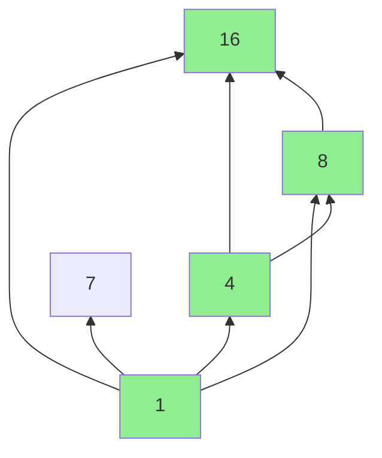

# Largest Divisible Subset

| Property | Value |
|----------|-------|
| Category | Dynamic Programming |
| Subcategory | Subsequence / Number Theory |
| Complexity (Time) | O(n²) |
| Complexity (Space) | O(n) |
| Input | Array of distinct positive integers |
| Output | Largest subset where every pair divides |

## Overview

The **Largest Divisible Subset** problem finds the biggest subset of a given array such that for any two elements $x$ and $y$ in the subset, either $x$ divides $y$ or $y$ divides $x$. This creates a chain of divisibility.

## Mathematical Foundation

### Divisibility Transitivity

Key insight: If $a | b$ and $b | c$, then $a | c$.

This means if we sort the array and build subsets where each element divides the next, we get valid chains.

### Problem Formulation

Given array $A = [a_1, a_2, ..., a_n]$, find subset $S \subseteq A$ maximizing $|S|$ such that:

$$\forall x, y \in S: x | y \text{ or } y | x$$

### Reduction to LIS-like Problem

After sorting:
- If $a_i | a_j$ where $i < j$, we can extend a chain ending at $i$ to include $j$
- This becomes similar to Longest Increasing Subsequence

### Recurrence

Let $dp[i]$ = length of longest divisible chain ending at $a_i$ (after sorting):

$$dp[i] = 1 + \max\{dp[j] : j < i \land a_j | a_i\}$$

## Algorithm Approaches

### 1. Brute Force (Exponential)

```
LARGEST-DIV-SUBSET-BRUTE(arr):
    best = []
    
    for each subset S of arr:
        if is_valid(S) and |S| > |best|:
            best = S
    
    return best

IS-VALID(S):
    for each pair (x, y) in S:
        if x does not divide y and y does not divide x:
            return false
    return true
```

### 2. Dynamic Programming (O(n²))

```
LARGEST-DIV-SUBSET-DP(arr):
    if arr is empty:
        return []
    
    // Sort to ensure smaller elements come first
    sort(arr)
    n = length(arr)
    
    // dp[i] = length of longest chain ending at i
    dp = array of n, all 1
    
    // parent[i] = previous index in chain
    parent = array where parent[i] = i
    
    // Fill DP table
    for i from 1 to n-1:
        for j from 0 to i-1:
            if arr[i] % arr[j] == 0 and dp[j] + 1 > dp[i]:
                dp[i] = dp[j] + 1
                parent[i] = j
    
    // Find index of maximum chain
    max_idx = argmax(dp)
    
    // Reconstruct chain
    result = []
    idx = max_idx
    while parent[idx] != idx:
        result.append(arr[idx])
        idx = parent[idx]
    result.append(arr[idx])
    
    return result
```

## Complexity Analysis

| Approach | Time | Space | Notes |
|----------|------|-------|-------|
| Brute Force | O(2^n × n²) | O(n) | Check all subsets |
| DP | O(n²) | O(n) | Similar to LIS |

## Visual Representation

### Example: [1, 16, 7, 8, 4]

```
After sorting: [1, 4, 7, 8, 16]

Divisibility relationships:
1 → 4 (1|4)
1 → 7 (1|7)
1 → 8 (1|8)
1 → 16 (1|16)
4 → 8 (4|8)
4 → 16 (4|16)
8 → 16 (8|16)

Chains:
[1] → length 1
[1, 4] → length 2
[1, 7] → length 2
[1, 4, 8] → length 3
[1, 4, 16] → length 3
[1, 4, 8, 16] → length 4 ✓ (longest)
[1, 8, 16] → length 3

Answer: [16, 8, 4, 1]
```

### DP Table

```
Sorted: [1, 4, 7, 8, 16]
Index:   0  1  2  3   4

dp:     [1, 2, 2, 3, 4]
parent: [0, 0, 0, 1, 3]

Reconstruction from index 4:
16 (idx=4) → parent[4]=3 → 8 (idx=3) → parent[3]=1 → 4 (idx=1) → parent[1]=0 → 1 (idx=0)

Result: [16, 8, 4, 1]
```

### Divisibility DAG



## Implementation (from repository)

```python
def largest_divisible_subset(items: list[int]) -> list[int]:
    """
    Algorithm to find the biggest subset in the given array such that for any 2 elements
    x and y in the subset, either x divides y or y divides x.
    >>> largest_divisible_subset([1, 16, 7, 8, 4])
    [16, 8, 4, 1]
    >>> largest_divisible_subset([1, 2, 3])
    [2, 1]
    >>> largest_divisible_subset([-1, -2, -3])
    [-3]
    >>> largest_divisible_subset([1, 2, 4, 8])
    [8, 4, 2, 1]
    >>> largest_divisible_subset((1, 2, 4, 8))
    [8, 4, 2, 1]
    >>> largest_divisible_subset([1, 1, 1])
    [1, 1, 1]
    >>> largest_divisible_subset([0, 0, 0])
    [0, 0, 0]
    >>> largest_divisible_subset([-1, -1, -1])
    [-1, -1, -1]
    >>> largest_divisible_subset([])
    []
    """
    # Sort the array in ascending order as the sequence does not matter we only have to
    # pick up a subset.
    items = sorted(items)

    number_of_items = len(items)

    # Initialize memo with 1s and hash with increasing numbers
    memo = [1] * number_of_items
    hash_array = list(range(number_of_items))

    # Iterate through the array
    for i, item in enumerate(items):
        for prev_index in range(i):
            if ((items[prev_index] != 0 and item % items[prev_index]) == 0) and (
                (1 + memo[prev_index]) > memo[i]
            ):
                memo[i] = 1 + memo[prev_index]
                hash_array[i] = prev_index

    ans = -1
    last_index = -1

    # Find the maximum length and its corresponding index
    for i, memo_item in enumerate(memo):
        if memo_item > ans:
            ans = memo_item
            last_index = i

    # Reconstruct the divisible subset
    if last_index == -1:
        return []
    result = [items[last_index]]
    while hash_array[last_index] != last_index:
        last_index = hash_array[last_index]
        result.append(items[last_index])

    return result
```

## Real-World Applications

### 1. Version Dependency Management

```python
from typing import List, Dict, Tuple, Set

def find_compatible_versions(
    versions: List[Tuple[str, int]],  # (name, version_number)
    compatibility: Dict[int, Set[int]]  # version -> compatible versions
) -> List[Tuple[str, int]]:
    """
    Find largest set of compatible versions.
    
    >>> versions = [("A", 1), ("A", 2), ("A", 4), ("A", 8)]
    >>> compat = {1: {2, 4, 8}, 2: {4, 8}, 4: {8}}
    >>> result = find_compatible_versions(versions, compat)
    >>> len(result) == 4
    True
    """
    # Sort by version number
    sorted_vers = sorted(versions, key=lambda x: x[1])
    n = len(sorted_vers)
    
    if n == 0:
        return []
    
    # dp[i] = length of longest compatible chain ending at i
    dp = [1] * n
    parent = list(range(n))
    
    for i in range(1, n):
        for j in range(i):
            v_j = sorted_vers[j][1]
            v_i = sorted_vers[i][1]
            
            # Check compatibility
            if v_j in compatibility and v_i in compatibility[v_j]:
                if dp[j] + 1 > dp[i]:
                    dp[i] = dp[j] + 1
                    parent[i] = j
    
    # Reconstruct
    max_idx = max(range(n), key=lambda x: dp[x])
    result = []
    idx = max_idx
    
    while parent[idx] != idx:
        result.append(sorted_vers[idx])
        idx = parent[idx]
    result.append(sorted_vers[idx])
    
    return result[::-1]


def build_dependency_chain(
    packages: List[str],
    version_numbers: Dict[str, int],
    divides_relation: bool = True
) -> Dict:
    """
    Build longest dependency chain using divisibility.
    
    >>> packages = ["core", "utils", "app", "extended"]
    >>> versions = {"core": 1, "utils": 2, "app": 4, "extended": 8}
    >>> result = build_dependency_chain(packages, versions)
    >>> len(result['chain']) == 4
    True
    """
    # Create (package, version) pairs
    items = [(p, version_numbers[p]) for p in packages]
    items.sort(key=lambda x: x[1])
    
    n = len(items)
    dp = [1] * n
    parent = list(range(n))
    
    for i in range(1, n):
        for j in range(i):
            # Check divisibility
            if items[j][1] != 0 and items[i][1] % items[j][1] == 0:
                if dp[j] + 1 > dp[i]:
                    dp[i] = dp[j] + 1
                    parent[i] = j
    
    # Reconstruct
    max_idx = max(range(n), key=lambda x: dp[x])
    chain = []
    idx = max_idx
    
    while True:
        chain.append(items[idx][0])
        if parent[idx] == idx:
            break
        idx = parent[idx]
    
    return {
        'chain': chain[::-1],
        'length': dp[max_idx],
        'base_version': items[0][1]
    }
```

### 2. Resource Scaling Tiers

```python
from typing import List, Dict

def find_scalable_resource_tiers(
    resource_sizes: List[int],
    names: Dict[int, str] = None
) -> Dict:
    """
    Find largest set of resource tiers where each divides the next.
    Useful for cloud instance sizing.
    
    >>> sizes = [1, 2, 4, 8, 16, 3, 6, 12]  # GB
    >>> result = find_scalable_resource_tiers(sizes)
    >>> result['max_tiers'] >= 4
    True
    """
    # Sort sizes
    sorted_sizes = sorted(set(resource_sizes))
    n = len(sorted_sizes)
    
    if n == 0:
        return {'max_tiers': 0, 'tiers': []}
    
    # DP
    dp = [1] * n
    parent = list(range(n))
    
    for i in range(1, n):
        for j in range(i):
            if sorted_sizes[i] % sorted_sizes[j] == 0:
                if dp[j] + 1 > dp[i]:
                    dp[i] = dp[j] + 1
                    parent[i] = j
    
    # Reconstruct best chain
    max_idx = max(range(n), key=lambda x: dp[x])
    tiers = []
    idx = max_idx
    
    while True:
        tiers.append(sorted_sizes[idx])
        if parent[idx] == idx:
            break
        idx = parent[idx]
    
    tiers.reverse()
    
    # Add names if provided
    named_tiers = []
    for t in tiers:
        name = names.get(t, f"{t}GB") if names else f"{t}GB"
        named_tiers.append({'size': t, 'name': name})
    
    return {
        'max_tiers': len(tiers),
        'tiers': tiers,
        'named_tiers': named_tiers,
        'scale_factors': [tiers[i+1] // tiers[i] for i in range(len(tiers)-1)]
    }


def optimize_memory_allocation(
    available_blocks: List[int],
    min_block: int = 1
) -> Dict:
    """
    Find optimal block sizes for buddy system memory allocation.
    
    >>> blocks = [1, 2, 4, 8, 16, 32, 64, 128]
    >>> result = optimize_memory_allocation(blocks)
    >>> result['chain_length'] == 8
    True
    """
    # Filter valid blocks
    valid = [b for b in available_blocks if b >= min_block]
    
    if not valid:
        return {'chain_length': 0, 'blocks': []}
    
    sorted_blocks = sorted(valid)
    n = len(sorted_blocks)
    
    dp = [1] * n
    parent = list(range(n))
    
    for i in range(1, n):
        for j in range(i):
            if sorted_blocks[i] % sorted_blocks[j] == 0:
                # For buddy system, prefer power of 2 relationships
                ratio = sorted_blocks[i] // sorted_blocks[j]
                if dp[j] + 1 > dp[i]:
                    dp[i] = dp[j] + 1
                    parent[i] = j
    
    # Reconstruct
    max_idx = max(range(n), key=lambda x: dp[x])
    chain = []
    idx = max_idx
    
    while True:
        chain.append(sorted_blocks[idx])
        if parent[idx] == idx:
            break
        idx = parent[idx]
    
    chain.reverse()
    
    return {
        'chain_length': len(chain),
        'blocks': chain,
        'is_power_of_2_chain': all(b & (b-1) == 0 for b in chain)
    }
```

### 3. Mathematical Factor Chains

```python
from typing import List, Dict, Set
from math import gcd
from functools import reduce

def longest_factor_chain(
    numbers: List[int]
) -> Dict:
    """
    Find longest chain where each number is a factor of the next.
    
    >>> result = longest_factor_chain([2, 3, 6, 12, 24, 5, 10])
    >>> result['chain']
    [2, 6, 12, 24]
    """
    if not numbers:
        return {'chain': [], 'length': 0}
    
    # Filter out zeros and sort
    valid = sorted([n for n in numbers if n > 0])
    n = len(valid)
    
    if n == 0:
        return {'chain': [], 'length': 0}
    
    dp = [1] * n
    parent = list(range(n))
    
    for i in range(1, n):
        for j in range(i):
            if valid[i] % valid[j] == 0:
                if dp[j] + 1 > dp[i]:
                    dp[i] = dp[j] + 1
                    parent[i] = j
    
    # Reconstruct
    max_idx = max(range(n), key=lambda x: dp[x])
    chain = []
    idx = max_idx
    
    while True:
        chain.append(valid[idx])
        if parent[idx] == idx:
            break
        idx = parent[idx]
    
    chain.reverse()
    
    # Compute LCM and GCD of chain
    chain_lcm = reduce(lambda a, b: a * b // gcd(a, b), chain)
    chain_gcd = reduce(gcd, chain)
    
    return {
        'chain': chain,
        'length': len(chain),
        'gcd': chain_gcd,
        'lcm': chain_lcm,
        'ratios': [chain[i+1] // chain[i] for i in range(len(chain)-1)]
    }


def all_divisibility_chains(
    numbers: List[int],
    min_length: int = 2
) -> List[List[int]]:
    """
    Find all maximal divisibility chains.
    
    >>> chains = all_divisibility_chains([1, 2, 4, 8, 3, 6], 2)
    >>> [1, 2, 4, 8] in chains
    True
    """
    if not numbers:
        return []
    
    sorted_nums = sorted(set(n for n in numbers if n > 0))
    n = len(sorted_nums)
    
    # Build adjacency for divisibility DAG
    children = {i: [] for i in range(n)}
    
    for i in range(n):
        for j in range(i + 1, n):
            if sorted_nums[j] % sorted_nums[i] == 0:
                children[i].append(j)
    
    # Find all maximal paths
    chains = []
    
    def dfs(node: int, path: List[int]):
        path.append(sorted_nums[node])
        
        # Check if maximal (no children in current path context)
        is_maximal = True
        for child in children[node]:
            dfs(child, path)
            is_maximal = False
        
        if is_maximal and len(path) >= min_length:
            chains.append(path.copy())
        
        path.pop()
    
    for i in range(n):
        dfs(i, [])
    
    # Remove non-maximal chains
    maximal = []
    for chain in chains:
        is_subset = False
        for other in chains:
            if chain != other and set(chain) < set(other):
                is_subset = True
                break
        if not is_subset:
            maximal.append(chain)
    
    return maximal
```

## Variations

### With Duplicates

The repository implementation handles duplicates by allowing chains like [1, 1, 1].

### Negative Numbers

For negative numbers, only chains of identical values are valid (as shown in the implementation).

## Common Pitfalls

1. **Not sorting first**: Order matters for the DP to work
2. **Zero handling**: x % 0 is undefined; handle specially
3. **Path reconstruction**: Track parent pointers correctly
4. **Negative numbers**: Divisibility behaves differently

## References

- [LeetCode 368 - Largest Divisible Subset](https://leetcode.com/problems/largest-divisible-subset/)
- [Divisibility and LIS](https://www.geeksforgeeks.org/largest-divisible-pairs-subset/)

## See Also

- [Longest Increasing Subsequence](longest_increasing_subsequence.md) - Similar DP structure
- [Integer Partition](integer_partition.md) - Related number theory
- [GCD and LCM](../maths/gcd.md) - Divisibility foundations
