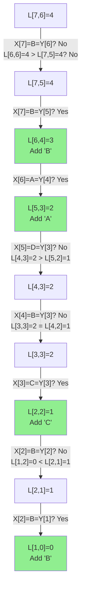

# Longest Common Subsequence (LCS)

| Property | Value |
|----------|-------|
| Category | Dynamic Programming |
| Subcategory | String/Sequence Matching |
| Complexity (Time) | O(mn) |
| Complexity (Space) | O(mn) or O(min(m,n)) optimized |
| Input | Two sequences |
| Output | Length and/or actual LCS |

## Overview

The **Longest Common Subsequence (LCS)** problem finds the longest sequence that appears in both input sequences in the same relative order (not necessarily contiguous). This is a fundamental algorithm in bioinformatics (DNA sequencing), version control systems (diff), and text comparison.

## Mathematical Foundation

### Problem Definition

Given sequences $X = x_1, x_2, ..., x_m$ and $Y = y_1, y_2, ..., y_n$, find the longest sequence $Z = z_1, z_2, ..., z_k$ such that $Z$ is a subsequence of both $X$ and $Y$.

### Subsequence vs Substring

- **Subsequence**: Elements in order but not necessarily contiguous
  - "ACE" is a subsequence of "ABCDE"
- **Substring**: Contiguous elements
  - "BCD" is a substring of "ABCDE"

### Recurrence Relation

Let $L[i][j]$ = length of LCS of $X[1..i]$ and $Y[1..j]$:

$$L[i][j] = \begin{cases} 
0 & \text{if } i = 0 \text{ or } j = 0 \\
L[i-1][j-1] + 1 & \text{if } x_i = y_j \\
\max(L[i-1][j], L[i][j-1]) & \text{if } x_i \neq y_j
\end{cases}$$

### Optimal Substructure

If the last characters match ($x_m = y_n$), then:
- LCS includes this character
- Problem reduces to finding LCS of $X[1..m-1]$ and $Y[1..n-1]$

If they don't match, the LCS is the longer of:
- LCS of $X[1..m-1]$ and $Y$
- LCS of $X$ and $Y[1..n-1]$

## Algorithm Approaches

### 1. Naive Recursion (Exponential)

```
LCS-RECURSIVE(X, Y, m, n):
    if m == 0 or n == 0:
        return 0
    
    if X[m-1] == Y[n-1]:
        return 1 + LCS-RECURSIVE(X, Y, m-1, n-1)
    else:
        return max(
            LCS-RECURSIVE(X, Y, m-1, n),
            LCS-RECURSIVE(X, Y, m, n-1)
        )
```

### 2. Memoization (Top-Down)

```
LCS-MEMO(X, Y):
    m = length(X)
    n = length(Y)
    memo = empty map
    
    function SOLVE(i, j):
        if i == 0 or j == 0:
            return 0
        
        if (i, j) in memo:
            return memo[(i, j)]
        
        if X[i-1] == Y[j-1]:
            result = 1 + SOLVE(i-1, j-1)
        else:
            result = max(SOLVE(i-1, j), SOLVE(i, j-1))
        
        memo[(i, j)] = result
        return result
    
    return SOLVE(m, n)
```

### 3. Tabulation (Bottom-Up)

```
LCS-TABULATION(X, Y):
    m = length(X)
    n = length(Y)
    
    // Create DP table
    L = 2D array of size (m+1) × (n+1), initialized to 0
    
    // Fill table
    for i from 1 to m:
        for j from 1 to n:
            if X[i-1] == Y[j-1]:
                L[i][j] = L[i-1][j-1] + 1
            else:
                L[i][j] = max(L[i-1][j], L[i][j-1])
    
    return L[m][n]
```

### 4. Subsequence Reconstruction

```
LCS-WITH-SEQUENCE(X, Y):
    m = length(X)
    n = length(Y)
    
    // Build DP table
    L = 2D array of size (m+1) × (n+1), initialized to 0
    
    for i from 1 to m:
        for j from 1 to n:
            if X[i-1] == Y[j-1]:
                L[i][j] = L[i-1][j-1] + 1
            else:
                L[i][j] = max(L[i-1][j], L[i][j-1])
    
    // Backtrack to find sequence
    lcs = empty string
    i = m, j = n
    
    while i > 0 and j > 0:
        if X[i-1] == Y[j-1]:
            lcs = X[i-1] + lcs    // Prepend character
            i = i - 1
            j = j - 1
        else if L[i-1][j] > L[i][j-1]:
            i = i - 1
        else:
            j = j - 1
    
    return L[m][n], lcs
```

### 5. Space-Optimized (Length Only)

```
LCS-SPACE-OPTIMIZED(X, Y):
    m = length(X)
    n = length(Y)
    
    // Use two rows instead of full table
    prev = array of size (n+1), initialized to 0
    curr = array of size (n+1), initialized to 0
    
    for i from 1 to m:
        for j from 1 to n:
            if X[i-1] == Y[j-1]:
                curr[j] = prev[j-1] + 1
            else:
                curr[j] = max(prev[j], curr[j-1])
        prev = copy of curr
    
    return curr[n]
```

## Complexity Analysis

| Approach | Time | Space | Notes |
|----------|------|-------|-------|
| Naive Recursion | O(2^(m+n)) | O(m+n) | Exponential |
| Memoization | O(mn) | O(mn) | Top-down |
| Tabulation | O(mn) | O(mn) | Bottom-up |
| Space-Optimized | O(mn) | O(min(m,n)) | Length only |
| Hirschberg's | O(mn) | O(min(m,n)) | Full sequence |

## Visual Representation

### DP Table Construction

```
X = "ABCBDAB"
Y = "BDCABA"

        ""   B   D   C   A   B   A
    ┌────────────────────────────────┐
 "" │  0   0   0   0   0   0   0     │
    │                                │
 A  │  0   0   0   0   1   1   1     │
    │                      ↖        │
 B  │  0   1   1   1   1   2   2     │
    │     ↖           ↖            │
 C  │  0   1   1   2   2   2   2     │
    │            ↖                  │
 B  │  0   1   1   2   2   3   3     │
    │     ↖              ↖         │
 D  │  0   1   2   2   2   3   3     │
    │        ↖                      │
 A  │  0   1   2   2   3   3   4     │
    │                 ↖        ↖   │
 B  │  0   1   2   2   3   4   4     │
    │                      ↖       │
    └────────────────────────────────┘

LCS Length = 4
```

### Backtracking Path



**LCS = "BCAB"** (reading bottom-up)

### Comparison Diagram

```
X: A B C B D A B
       ↓   ↓ ↓ ↓
LCS:   B C   A B
       ↑ ↑   ↑ ↑
Y: B D C A B A
```

## Implementation (from repository)

```python
def longest_common_subsequence(x: str, y: str) -> tuple:
    """
    Find the Longest Common Subsequence of two strings.
    
    Args:
        x: First string
        y: Second string
    
    Returns:
        Tuple of (lcs_length, lcs_string)
    
    >>> longest_common_subsequence("ABCBDAB", "BDCABA")
    (4, 'BCAB')
    >>> longest_common_subsequence("", "ABC")
    (0, '')
    >>> longest_common_subsequence("ABC", "ABC")
    (3, 'ABC')
    """
    m = len(x)
    n = len(y)
    
    # Create DP table
    L = [[0] * (n + 1) for _ in range(m + 1)]
    
    # Fill the table
    for i in range(1, m + 1):
        for j in range(1, n + 1):
            if x[i - 1] == y[j - 1]:
                L[i][j] = L[i - 1][j - 1] + 1
            else:
                L[i][j] = max(L[i - 1][j], L[i][j - 1])
    
    # Backtrack to find the actual subsequence
    lcs = []
    i, j = m, n
    
    while i > 0 and j > 0:
        if x[i - 1] == y[j - 1]:
            lcs.append(x[i - 1])
            i -= 1
            j -= 1
        elif L[i - 1][j] > L[i][j - 1]:
            i -= 1
        else:
            j -= 1
    
    lcs.reverse()
    return L[m][n], ''.join(lcs)
```

## Real-World Applications

### 1. Version Control - Diff Algorithm

```python
from typing import List, Tuple
from enum import Enum

class DiffOp(Enum):
    KEEP = ' '
    ADD = '+'
    DELETE = '-'

def diff_lines(old: List[str], new: List[str]) -> List[Tuple[DiffOp, str]]:
    """
    Generate diff between two versions of a file.
    
    Uses LCS to find unchanged lines, marks additions/deletions.
    
    >>> old = ["line1", "line2", "line3"]
    >>> new = ["line1", "modified", "line3", "line4"]
    >>> diff = diff_lines(old, new)
    >>> [(op.value, line) for op, line in diff]
    [(' ', 'line1'), ('-', 'line2'), ('+', 'modified'), (' ', 'line3'), ('+', 'line4')]
    """
    m, n = len(old), len(new)
    
    # Build LCS table
    L = [[0] * (n + 1) for _ in range(m + 1)]
    
    for i in range(1, m + 1):
        for j in range(1, n + 1):
            if old[i-1] == new[j-1]:
                L[i][j] = L[i-1][j-1] + 1
            else:
                L[i][j] = max(L[i-1][j], L[i][j-1])
    
    # Generate diff by backtracking
    diff = []
    i, j = m, n
    
    while i > 0 or j > 0:
        if i > 0 and j > 0 and old[i-1] == new[j-1]:
            diff.append((DiffOp.KEEP, old[i-1]))
            i -= 1
            j -= 1
        elif j > 0 and (i == 0 or L[i][j-1] >= L[i-1][j]):
            diff.append((DiffOp.ADD, new[j-1]))
            j -= 1
        else:
            diff.append((DiffOp.DELETE, old[i-1]))
            i -= 1
    
    diff.reverse()
    return diff


def format_unified_diff(old: List[str], new: List[str], 
                        context: int = 3) -> str:
    """
    Format diff in unified diff format.
    
    >>> old = ["a", "b", "c", "d"]
    >>> new = ["a", "x", "c", "d"]
    >>> print(format_unified_diff(old, new, context=1))
    @@ -1,4 +1,4 @@
     a
    -b
    +x
     c
    """
    diff = diff_lines(old, new)
    
    lines = []
    lines.append(f"@@ -{1},{len(old)} +{1},{len(new)} @@")
    
    for op, line in diff:
        lines.append(f"{op.value}{line}")
    
    return '\n'.join(lines)
```

### 2. Bioinformatics - DNA Sequence Alignment

```python
from typing import Tuple

def dna_similarity_score(seq1: str, seq2: str) -> Tuple[float, str]:
    """
    Calculate similarity between DNA sequences using LCS.
    
    Returns similarity ratio and the common subsequence.
    
    >>> score, lcs = dna_similarity_score("ATCGTACG", "ACGTACGT")
    >>> 0.8 < score <= 1.0
    True
    """
    m, n = len(seq1), len(seq2)
    
    # Build LCS table
    L = [[0] * (n + 1) for _ in range(m + 1)]
    
    for i in range(1, m + 1):
        for j in range(1, n + 1):
            if seq1[i-1] == seq2[j-1]:
                L[i][j] = L[i-1][j-1] + 1
            else:
                L[i][j] = max(L[i-1][j], L[i][j-1])
    
    lcs_length = L[m][n]
    
    # Backtrack
    lcs = []
    i, j = m, n
    while i > 0 and j > 0:
        if seq1[i-1] == seq2[j-1]:
            lcs.append(seq1[i-1])
            i -= 1
            j -= 1
        elif L[i-1][j] > L[i][j-1]:
            i -= 1
        else:
            j -= 1
    
    lcs.reverse()
    
    # Similarity is LCS length / max sequence length
    similarity = lcs_length / max(m, n)
    
    return similarity, ''.join(lcs)


def find_conserved_regions(sequences: list) -> list:
    """
    Find conserved regions across multiple DNA sequences.
    
    Uses iterative LCS to find common elements.
    
    >>> seqs = ["ATCGATCG", "ATCGATCG", "ATCGATCG"]
    >>> find_conserved_regions(seqs)
    ['ATCGATCG']
    """
    if not sequences:
        return []
    
    # Start with first sequence
    current_lcs = sequences[0]
    
    # Iteratively find LCS with each sequence
    for seq in sequences[1:]:
        _, current_lcs = dna_similarity_score(current_lcs, seq)
        if not current_lcs:
            return []
    
    return [current_lcs] if current_lcs else []
```

### 3. Spell Checker - Suggestion Generation

```python
from typing import List, Tuple

def spell_suggestions(word: str, dictionary: List[str], 
                     max_suggestions: int = 5) -> List[Tuple[str, float]]:
    """
    Generate spelling suggestions using LCS similarity.
    
    >>> suggestions = spell_suggestions("teh", ["the", "tea", "ten", "to"])
    >>> suggestions[0][0]  # Best match
    'the'
    """
    def lcs_length(s1: str, s2: str) -> int:
        m, n = len(s1), len(s2)
        if m == 0 or n == 0:
            return 0
        
        # Space-optimized LCS
        prev = [0] * (n + 1)
        curr = [0] * (n + 1)
        
        for i in range(1, m + 1):
            for j in range(1, n + 1):
                if s1[i-1] == s2[j-1]:
                    curr[j] = prev[j-1] + 1
                else:
                    curr[j] = max(prev[j], curr[j-1])
            prev, curr = curr, [0] * (n + 1)
        
        return prev[n]
    
    def similarity(s1: str, s2: str) -> float:
        lcs_len = lcs_length(s1.lower(), s2.lower())
        return 2.0 * lcs_len / (len(s1) + len(s2))
    
    # Calculate similarity for each word
    scored = [(w, similarity(word, w)) for w in dictionary]
    
    # Sort by similarity descending
    scored.sort(key=lambda x: x[1], reverse=True)
    
    return scored[:max_suggestions]
```

### 4. Plagiarism Detection

```python
from typing import List, Tuple

def detect_plagiarism(doc1: str, doc2: str, 
                     threshold: float = 0.7) -> Tuple[bool, float, str]:
    """
    Detect potential plagiarism between two documents.
    
    Uses word-level LCS for content comparison.
    
    >>> text1 = "The quick brown fox jumps over the lazy dog"
    >>> text2 = "The quick brown fox leaps over a lazy dog"
    >>> is_similar, score, _ = detect_plagiarism(text1, text2)
    >>> is_similar
    True
    """
    # Tokenize into words
    words1 = doc1.lower().split()
    words2 = doc2.lower().split()
    
    m, n = len(words1), len(words2)
    
    # Build LCS table
    L = [[0] * (n + 1) for _ in range(m + 1)]
    
    for i in range(1, m + 1):
        for j in range(1, n + 1):
            if words1[i-1] == words2[j-1]:
                L[i][j] = L[i-1][j-1] + 1
            else:
                L[i][j] = max(L[i-1][j], L[i][j-1])
    
    lcs_length = L[m][n]
    
    # Calculate similarity ratio
    similarity = 2.0 * lcs_length / (m + n)
    
    # Backtrack to find common words
    common = []
    i, j = m, n
    while i > 0 and j > 0:
        if words1[i-1] == words2[j-1]:
            common.append(words1[i-1])
            i -= 1
            j -= 1
        elif L[i-1][j] > L[i][j-1]:
            i -= 1
        else:
            j -= 1
    
    common.reverse()
    
    return similarity >= threshold, similarity, ' '.join(common)
```

## Variations

### All LCS (Multiple Solutions)

```python
def all_lcs(x: str, y: str) -> set:
    """
    Find all longest common subsequences.
    
    >>> sorted(all_lcs("ABCBDAB", "BDCABA"))
    ['BCAB', 'BCBA', 'BDAB']
    """
    m, n = len(x), len(y)
    
    # Build DP table
    L = [[0] * (n + 1) for _ in range(m + 1)]
    for i in range(1, m + 1):
        for j in range(1, n + 1):
            if x[i-1] == y[j-1]:
                L[i][j] = L[i-1][j-1] + 1
            else:
                L[i][j] = max(L[i-1][j], L[i][j-1])
    
    # Backtrack to find all LCS
    def backtrack(i: int, j: int) -> set:
        if i == 0 or j == 0:
            return {''}
        
        if x[i-1] == y[j-1]:
            return {s + x[i-1] for s in backtrack(i-1, j-1)}
        
        result = set()
        if L[i-1][j] >= L[i][j-1]:
            result.update(backtrack(i-1, j))
        if L[i][j-1] >= L[i-1][j]:
            result.update(backtrack(i, j-1))
        
        return result
    
    return backtrack(m, n)
```

### Shortest Common Supersequence (SCS)

```python
def shortest_common_supersequence(x: str, y: str) -> str:
    """
    Find shortest string that has both x and y as subsequences.
    
    Length(SCS) = len(x) + len(y) - len(LCS)
    
    >>> shortest_common_supersequence("AGGTAB", "GXTXAYB")
    'AGXGTXAYB'
    """
    m, n = len(x), len(y)
    
    # Build LCS table
    L = [[0] * (n + 1) for _ in range(m + 1)]
    for i in range(1, m + 1):
        for j in range(1, n + 1):
            if x[i-1] == y[j-1]:
                L[i][j] = L[i-1][j-1] + 1
            else:
                L[i][j] = max(L[i-1][j], L[i][j-1])
    
    # Build SCS by backtracking
    scs = []
    i, j = m, n
    
    while i > 0 and j > 0:
        if x[i-1] == y[j-1]:
            scs.append(x[i-1])
            i -= 1
            j -= 1
        elif L[i-1][j] > L[i][j-1]:
            scs.append(x[i-1])
            i -= 1
        else:
            scs.append(y[j-1])
            j -= 1
    
    # Add remaining characters
    while i > 0:
        scs.append(x[i-1])
        i -= 1
    while j > 0:
        scs.append(y[j-1])
        j -= 1
    
    return ''.join(reversed(scs))
```

## Common Pitfalls

1. **Confusing LCS with Longest Common Substring**: LCS allows gaps
2. **Off-by-one indexing**: DP table is (m+1)×(n+1) but strings are 0-indexed
3. **Backtracking direction**: Ensure correct handling of equal cells
4. **Memory for large strings**: Use space-optimized version

## References

- [LCS - Wikipedia](https://en.wikipedia.org/wiki/Longest_common_subsequence_problem)
- [Diff Algorithm](https://en.wikipedia.org/wiki/Diff)
- CLRS Chapter 15.4 - Longest Common Subsequence
- Hirschberg's Algorithm for linear space

## See Also

- [Edit Distance](edit_distance.md) - Similar DP structure
- [Longest Common Substring](longest_common_substring.md) - Contiguous version
- [Longest Palindromic Subsequence](longest_palindromic_subsequence.md) - LCS variant
