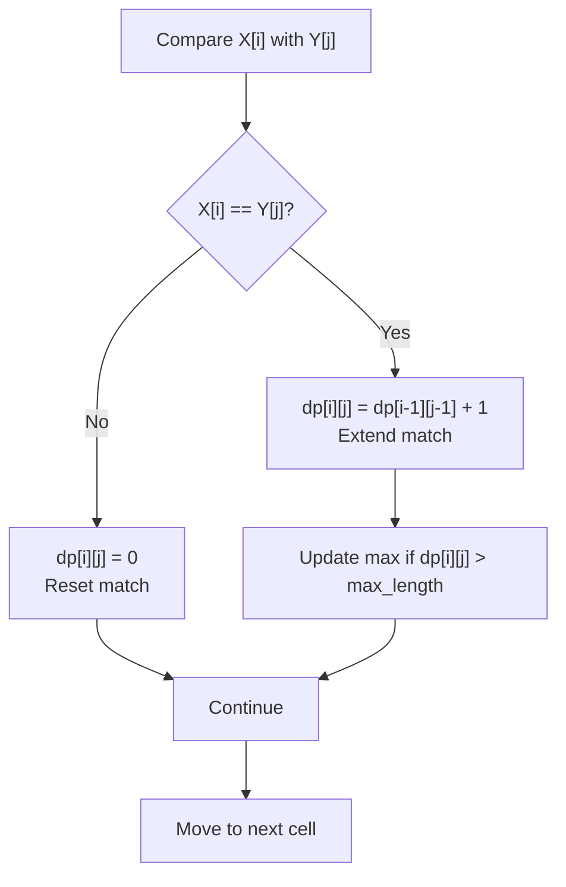

# Longest Common Substring

| Property | Value |
|----------|-------|
| Category | Dynamic Programming |
| Subcategory | String Matching |
| Complexity (Time) | O(m × n) |
| Complexity (Space) | O(m × n) or O(min(m, n)) |
| Input | Two strings |
| Output | Longest common contiguous substring |

## Overview

The **Longest Common Substring (LCSub)** problem finds the longest string that is a contiguous substring of both input strings. Unlike Longest Common Subsequence (LCS), the characters must appear consecutively.

## Mathematical Foundation

### Problem Definition

Given strings $X = x_1 x_2 ... x_m$ and $Y = y_1 y_2 ... y_n$:

Find the longest string $Z$ such that $Z$ is a contiguous substring of both $X$ and $Y$.

### Difference from LCS

- **LCS (Subsequence)**: Characters can be non-contiguous
  - "ACE" is a subsequence of "ABCDE"
- **LCSub (Substring)**: Characters must be contiguous
  - "BCD" is a substring of "ABCDE"

### Recurrence Relation

Let $dp[i][j]$ = length of longest common suffix of $X[1..i]$ and $Y[1..j]$:

$$dp[i][j] = \begin{cases}
dp[i-1][j-1] + 1 & \text{if } x_i = y_j \\
0 & \text{otherwise}
\end{cases}$$

### Answer

$$\text{LCSub length} = \max_{1 \leq i \leq m, 1 \leq j \leq n} dp[i][j]$$

## Algorithm Approaches

### 1. Brute Force (O(m × n × min(m,n)))

```
LCSUB-BRUTE(X, Y):
    max_length = 0
    result = ""
    
    for i from 0 to m-1:
        for j from 0 to n-1:
            length = 0
            while i + length < m and j + length < n and X[i + length] == Y[j + length]:
                length = length + 1
            
            if length > max_length:
                max_length = length
                result = X[i : i + length]
    
    return result
```

### 2. Dynamic Programming (O(m × n))

```
LCSUB-DP(X, Y):
    m = length(X)
    n = length(Y)
    dp = matrix of size (m+1) × (n+1), all zeros
    max_length = 0
    end_pos = 0
    
    for i from 1 to m:
        for j from 1 to n:
            if X[i-1] == Y[j-1]:
                dp[i][j] = dp[i-1][j-1] + 1
                if dp[i][j] > max_length:
                    max_length = dp[i][j]
                    end_pos = i
            else:
                dp[i][j] = 0
    
    return X[end_pos - max_length : end_pos]
```

### 3. Space-Optimized DP (O(min(m, n)))

```
LCSUB-SPACE-OPT(X, Y):
    // Ensure X is shorter for space efficiency
    if m > n:
        swap(X, Y)
        swap(m, n)
    
    prev = array of size m+1, all zeros
    max_length = 0
    end_pos = 0
    
    for j from 1 to n:
        curr = array of size m+1, all zeros
        for i from 1 to m:
            if X[i-1] == Y[j-1]:
                curr[i] = prev[i-1] + 1
                if curr[i] > max_length:
                    max_length = curr[i]
                    end_pos = i
        prev = curr
    
    return X[end_pos - max_length : end_pos]
```

### 4. Suffix Array/Tree (O((m + n) log(m + n)))

```
LCSUB-SUFFIX-ARRAY(X, Y):
    // Concatenate with separator
    S = X + "$" + Y
    
    // Build suffix array and LCP array
    SA = build_suffix_array(S)
    LCP = build_lcp_array(S, SA)
    
    max_length = 0
    result = ""
    
    for i from 1 to length(S)-1:
        // Check if adjacent suffixes are from different strings
        pos1 = SA[i-1]
        pos2 = SA[i]
        
        from_X_1 = pos1 < m
        from_X_2 = pos2 < m
        
        if from_X_1 != from_X_2:  // One from X, one from Y
            if LCP[i] > max_length:
                max_length = LCP[i]
                result = S[SA[i] : SA[i] + max_length]
    
    return result
```

## Complexity Analysis

| Approach | Time | Space | Notes |
|----------|------|-------|-------|
| Brute Force | O(m × n × min(m,n)) | O(1) | Compare all pairs |
| DP | O(m × n) | O(m × n) | Standard approach |
| Space-Optimized | O(m × n) | O(min(m, n)) | Two rows |
| Suffix Array | O((m+n) log(m+n)) | O(m + n) | Advanced |

## Visual Representation

### DP Table Example

```
X = "abcdef"
Y = "xabded"

         ""   x   a   b   d   e   d
    ""    0   0   0   0   0   0   0
    a     0   0   1   0   0   0   0
    b     0   0   0   2   0   0   0
    c     0   0   0   0   0   0   0
    d     0   0   0   0   1   0   1
    e     0   0   0   0   0   2   0
    f     0   0   0   0   0   0   0

Maximum value: 2 (at positions [2,3] and [5,6])
- "ab" (X[0:2] = Y[1:3])
- "de" (X[3:5] = Y[3:5])

Both are valid longest common substrings.
```

### Matching Visualization

```
X: a b c d e f
   └─┘     └─┘
     |       |
Y: x a b d e d
     └─┘ └─┘

Match 1: "ab" at X[0:2], Y[1:3]
Match 2: "de" at X[3:5], Y[3:5]

Both have length 2 → LCSub = "ab" or "de"
```

### State Transition



## Implementation (from repository)

```python
def longest_common_substring(text1: str, text2: str) -> str:
    """
    Finds the longest common substring between two strings.

    A substring is necessarily continuous.

    >>> longest_common_substring("", "")
    ''
    >>> longest_common_substring("a","")
    ''
    >>> longest_common_substring("", "a")
    ''
    >>> longest_common_substring("a", "a")
    'a'
    >>> longest_common_substring("abcdef", "bcd")
    'bcd'
    >>> longest_common_substring("abcdef", "xabded")
    'ab'
    >>> longest_common_substring("GeeksforGeeks", "GeeksQuiz")
    'Geeks'
    >>> longest_common_substring("abcdxyz", "xyzabcd")
    'abcd'
    >>> longest_common_substring("zxabcdezy", "yzabcdezx")
    'abcdez'
    >>> longest_common_substring("OldSite:GeeksforGeeks.org", "NewSite:GeeksQuiz.com")
    'Site:Geeks'
    >>> longest_common_substring(1, 1)
    Traceback (most recent call last):
        ...
    ValueError: longest_common_substring() takes two strings for inputs
    """

    if not (isinstance(text1, str) and isinstance(text2, str)):
        raise ValueError("longest_common_substring() takes two strings for inputs")

    if not text1 or not text2:
        return ""

    text1_length = len(text1)
    text2_length = len(text2)

    dp = [[0] * (text2_length + 1) for _ in range(text1_length + 1)]
    end_pos = 0
    max_length = 0

    for i in range(1, text1_length + 1):
        for j in range(1, text2_length + 1):
            if text1[i - 1] == text2[j - 1]:
                dp[i][j] = 1 + dp[i - 1][j - 1]
                if dp[i][j] > max_length:
                    end_pos = i
                    max_length = dp[i][j]

    return text1[end_pos - max_length : end_pos]
```

## Real-World Applications

### 1. Plagiarism Detection

```python
from typing import List, Tuple, Dict
import re

def detect_plagiarism(
    document1: str,
    document2: str,
    min_match_length: int = 20
) -> Dict:
    """
    Detect potential plagiarism between two documents.
    
    >>> doc1 = "The quick brown fox jumps over the lazy dog."
    >>> doc2 = "A quick brown fox jumps over a lazy cat."
    >>> result = detect_plagiarism(doc1, doc2, 10)
    >>> result['similarity_score'] > 0
    True
    """
    # Normalize texts
    def normalize(text: str) -> str:
        text = text.lower()
        text = re.sub(r'[^\w\s]', '', text)
        text = re.sub(r'\s+', ' ', text)
        return text.strip()
    
    norm1 = normalize(document1)
    norm2 = normalize(document2)
    
    # Find all common substrings above threshold
    matches = find_all_common_substrings(norm1, norm2, min_match_length)
    
    # Calculate similarity metrics
    total_matched = sum(len(m['substring']) for m in matches)
    
    return {
        'matches': matches,
        'total_matched_chars': total_matched,
        'similarity_score': total_matched / max(len(norm1), len(norm2)),
        'document1_coverage': total_matched / len(norm1) if norm1 else 0,
        'document2_coverage': total_matched / len(norm2) if norm2 else 0
    }


def find_all_common_substrings(
    text1: str,
    text2: str,
    min_length: int
) -> List[Dict]:
    """
    Find all common substrings above minimum length.
    
    >>> matches = find_all_common_substrings("abcdefgh", "xyzabcpqrdef", 3)
    >>> any(m['substring'] == 'abc' for m in matches)
    True
    """
    m, n = len(text1), len(text2)
    matches = []
    
    # DP approach with tracking all matches
    dp = [[0] * (n + 1) for _ in range(m + 1)]
    
    for i in range(1, m + 1):
        for j in range(1, n + 1):
            if text1[i-1] == text2[j-1]:
                dp[i][j] = dp[i-1][j-1] + 1
                
                # Check if this ends a significant match
                if dp[i][j] >= min_length:
                    # Check if this is end of match (next chars don't match)
                    if i == m or j == n or text1[i] != text2[j]:
                        substring = text1[i - dp[i][j]:i]
                        matches.append({
                            'substring': substring,
                            'length': dp[i][j],
                            'position1': i - dp[i][j],
                            'position2': j - dp[i][j]
                        })
    
    # Remove overlapping matches (keep longest)
    matches.sort(key=lambda x: -x['length'])
    filtered = []
    used1 = set()
    used2 = set()
    
    for match in matches:
        pos1_range = set(range(match['position1'], match['position1'] + match['length']))
        pos2_range = set(range(match['position2'], match['position2'] + match['length']))
        
        if not (pos1_range & used1) and not (pos2_range & used2):
            filtered.append(match)
            used1.update(pos1_range)
            used2.update(pos2_range)
    
    return filtered


def highlight_matches(
    document: str,
    matches: List[Dict],
    position_key: str = 'position1'
) -> str:
    """
    Highlight matched portions in document.
    
    >>> doc = "The quick brown fox"
    >>> matches = [{'substring': 'quick', 'position1': 4, 'length': 5}]
    >>> highlighted = highlight_matches(doc, matches)
    >>> '**quick**' in highlighted
    True
    """
    if not matches:
        return document
    
    # Sort by position
    sorted_matches = sorted(matches, key=lambda m: m[position_key])
    
    result = []
    last_end = 0
    
    for match in sorted_matches:
        start = match[position_key]
        end = start + match['length']
        
        # Add text before match
        result.append(document[last_end:start])
        # Add highlighted match
        result.append(f"**{document[start:end]}**")
        last_end = end
    
    # Add remaining text
    result.append(document[last_end:])
    
    return ''.join(result)
```

### 2. DNA Sequence Analysis

```python
from typing import List, Tuple, Dict, Optional

def find_conserved_regions(
    sequence1: str,
    sequence2: str,
    min_length: int = 10
) -> List[Dict]:
    """
    Find conserved (identical) regions between DNA sequences.
    
    >>> seq1 = "ATCGATCGATCG"
    >>> seq2 = "XXXATCGATYYY"
    >>> regions = find_conserved_regions(seq1, seq2, 5)
    >>> any(r['sequence'] == 'ATCGAT' for r in regions)
    True
    """
    m, n = len(sequence1), len(sequence2)
    dp = [[0] * (n + 1) for _ in range(m + 1)]
    
    regions = []
    
    for i in range(1, m + 1):
        for j in range(1, n + 1):
            if sequence1[i-1] == sequence2[j-1]:
                dp[i][j] = dp[i-1][j-1] + 1
            else:
                # End of a potential match
                if dp[i-1][j-1] >= min_length:
                    length = dp[i-1][j-1]
                    regions.append({
                        'sequence': sequence1[i-1-length:i-1],
                        'length': length,
                        'position1': i - 1 - length,
                        'position2': j - 1 - length
                    })
    
    # Check final positions
    for i in range(1, m + 1):
        for j in range(1, n + 1):
            if dp[i][j] >= min_length and (i == m or j == n):
                length = dp[i][j]
                regions.append({
                    'sequence': sequence1[i-length:i],
                    'length': length,
                    'position1': i - length,
                    'position2': j - length
                })
    
    # Remove duplicates
    seen = set()
    unique_regions = []
    for r in regions:
        key = (r['sequence'], r['position1'], r['position2'])
        if key not in seen:
            seen.add(key)
            unique_regions.append(r)
    
    return sorted(unique_regions, key=lambda x: -x['length'])


def analyze_repeat_sequences(
    dna: str,
    min_repeat_length: int = 5
) -> Dict:
    """
    Find repeated sequences within a single DNA strand.
    
    >>> dna = "ATCGATCGXXXXATCGATCG"
    >>> result = analyze_repeat_sequences(dna, 5)
    >>> 'repeats' in result
    True
    """
    n = len(dna)
    repeats = []
    
    # DP for self-comparison (excluding trivial diagonal)
    dp = [[0] * (n + 1) for _ in range(n + 1)]
    
    for i in range(1, n + 1):
        for j in range(i + 1, n + 1):  # j > i to avoid self-match
            if dna[i-1] == dna[j-1]:
                dp[i][j] = dp[i-1][j-1] + 1
                
                if dp[i][j] >= min_repeat_length:
                    # Check if match ends here
                    if i == n or j == n or dna[i] != dna[j] or j - i <= dp[i][j]:
                        length = dp[i][j]
                        if j - i > length:  # Non-overlapping
                            repeats.append({
                                'sequence': dna[i-length:i],
                                'length': length,
                                'occurrences': [i - length, j - length]
                            })
    
    # Consolidate repeats
    repeat_dict = {}
    for r in repeats:
        seq = r['sequence']
        if seq not in repeat_dict:
            repeat_dict[seq] = {
                'sequence': seq,
                'length': len(seq),
                'positions': set()
            }
        repeat_dict[seq]['positions'].update(r['occurrences'])
    
    # Find count of each repeat
    for seq in repeat_dict:
        repeat_dict[seq]['count'] = len(repeat_dict[seq]['positions'])
        repeat_dict[seq]['positions'] = sorted(repeat_dict[seq]['positions'])
    
    return {
        'repeats': list(repeat_dict.values()),
        'total_unique_repeats': len(repeat_dict),
        'longest_repeat': max(repeats, key=lambda x: x['length']) if repeats else None
    }


def find_motif_matches(
    sequence: str,
    motif: str,
    allow_gaps: bool = False
) -> List[Dict]:
    """
    Find all occurrences of a motif in a sequence.
    
    >>> find_motif_matches("ATCGATCGATCG", "ATCG")
    [{'position': 0, 'match': 'ATCG'}, {'position': 4, 'match': 'ATCG'}, {'position': 8, 'match': 'ATCG'}]
    """
    if not allow_gaps:
        # Simple substring search
        matches = []
        start = 0
        while True:
            pos = sequence.find(motif, start)
            if pos == -1:
                break
            matches.append({'position': pos, 'match': motif})
            start = pos + 1
        return matches
    
    # With gaps - use LCS approach
    # Implementation for gapped matching would go here
    return []
```

### 3. File Comparison / Diff Tool

```python
from typing import List, Tuple, Dict

def compare_files(
    content1: str,
    content2: str,
    context_lines: int = 3
) -> Dict:
    """
    Compare two file contents and find differences.
    
    >>> c1 = "line1\\nline2\\nline3"
    >>> c2 = "line1\\nmodified\\nline3"
    >>> diff = compare_files(c1, c2)
    >>> diff['num_changes'] > 0
    True
    """
    lines1 = content1.split('\n')
    lines2 = content2.split('\n')
    
    # Find matching blocks using LCS on lines
    m, n = len(lines1), len(lines2)
    dp = [[0] * (n + 1) for _ in range(m + 1)]
    
    for i in range(1, m + 1):
        for j in range(1, n + 1):
            if lines1[i-1] == lines2[j-1]:
                dp[i][j] = dp[i-1][j-1] + 1
    
    # Find all matching blocks
    matching_blocks = []
    
    for i in range(1, m + 1):
        for j in range(1, n + 1):
            if dp[i][j] > 0:
                # Check if this is end of a block
                if i == m or j == n or lines1[i] != lines2[j]:
                    length = dp[i][j]
                    matching_blocks.append({
                        'start1': i - length,
                        'start2': j - length,
                        'length': length
                    })
    
    # Generate diff
    changes = []
    used1 = set()
    used2 = set()
    
    # Sort blocks by length (prefer longer matches)
    matching_blocks.sort(key=lambda x: -x['length'])
    
    for block in matching_blocks:
        range1 = set(range(block['start1'], block['start1'] + block['length']))
        range2 = set(range(block['start2'], block['start2'] + block['length']))
        
        if not (range1 & used1) and not (range2 & used2):
            used1.update(range1)
            used2.update(range2)
    
    # Find deleted lines (in file1 but not matched)
    for i in range(m):
        if i not in used1:
            changes.append({
                'type': 'delete',
                'line_num': i + 1,
                'content': lines1[i]
            })
    
    # Find added lines (in file2 but not matched)
    for j in range(n):
        if j not in used2:
            changes.append({
                'type': 'add',
                'line_num': j + 1,
                'content': lines2[j]
            })
    
    return {
        'matching_blocks': matching_blocks,
        'changes': changes,
        'num_changes': len(changes),
        'similarity': len(used1) / max(m, n) if max(m, n) > 0 else 1.0
    }


def find_moved_blocks(
    old_content: str,
    new_content: str,
    min_block_size: int = 3
) -> List[Dict]:
    """
    Detect blocks of text that were moved (not just added/deleted).
    
    >>> old = "aaa\\nbbb\\nccc\\nddd"
    >>> new = "ccc\\nddd\\naaa\\nbbb"
    >>> moves = find_moved_blocks(old, new, 2)
    >>> len(moves) > 0
    True
    """
    old_lines = old_content.split('\n')
    new_lines = new_content.split('\n')
    
    # Find common line blocks
    m, n = len(old_lines), len(new_lines)
    common = []
    
    for i in range(m):
        for j in range(n):
            # Find length of matching block starting here
            length = 0
            while (i + length < m and j + length < n and 
                   old_lines[i + length] == new_lines[j + length]):
                length += 1
            
            if length >= min_block_size:
                common.append({
                    'old_start': i,
                    'new_start': j,
                    'length': length,
                    'content': '\n'.join(old_lines[i:i+length])
                })
    
    # Filter to find actual moves (position changed significantly)
    moves = []
    for block in common:
        # If positions are different, it's a move
        if block['old_start'] != block['new_start']:
            moves.append({
                'from_line': block['old_start'] + 1,
                'to_line': block['new_start'] + 1,
                'num_lines': block['length'],
                'content_preview': block['content'][:100]
            })
    
    return moves
```

## Variations

### All Common Substrings

```python
def all_common_substrings(text1: str, text2: str) -> List[str]:
    """
    Find all common substrings (not just longest).
    
    >>> sorted(all_common_substrings("abc", "bcd"))
    ['b', 'bc', 'c']
    """
    m, n = len(text1), len(text2)
    substrings = set()
    
    dp = [[0] * (n + 1) for _ in range(m + 1)]
    
    for i in range(1, m + 1):
        for j in range(1, n + 1):
            if text1[i-1] == text2[j-1]:
                dp[i][j] = dp[i-1][j-1] + 1
                # Add all substrings ending here
                for length in range(1, dp[i][j] + 1):
                    substrings.add(text1[i-length:i])
    
    return list(substrings)
```

### K Longest Common Substrings

```python
def k_longest_common_substrings(
    text1: str, 
    text2: str, 
    k: int
) -> List[str]:
    """
    Find k longest common substrings.
    
    >>> k_longest_common_substrings("abcdefgh", "xyzabcpqrdef", 2)
    ['abc', 'def']
    """
    import heapq
    
    m, n = len(text1), len(text2)
    heap = []  # Min heap of (length, substring)
    seen = set()
    
    dp = [[0] * (n + 1) for _ in range(m + 1)]
    
    for i in range(1, m + 1):
        for j in range(1, n + 1):
            if text1[i-1] == text2[j-1]:
                dp[i][j] = dp[i-1][j-1] + 1
                substring = text1[i - dp[i][j]:i]
                
                if substring not in seen:
                    seen.add(substring)
                    if len(heap) < k:
                        heapq.heappush(heap, (len(substring), substring))
                    elif len(substring) > heap[0][0]:
                        heapq.heapreplace(heap, (len(substring), substring))
    
    return [s for _, s in sorted(heap, reverse=True)]
```

## Common Pitfalls

1. **Confusing with LCS**: Substring ≠ Subsequence
2. **Empty strings**: Return empty string
3. **Tracking position**: Remember to track where max occurred
4. **Overlapping**: Decide if results can overlap

## References

- [Longest Common Substring - Wikipedia](https://en.wikipedia.org/wiki/Longest_common_substring_problem)
- [Suffix Arrays](https://en.wikipedia.org/wiki/Suffix_array)

## See Also

- [Longest Common Subsequence](longest_common_subsequence.md) - Non-contiguous variant
- [Edit Distance](edit_distance.md) - String similarity
- [KMP Algorithm](../strings/kmp.md) - Pattern matching
