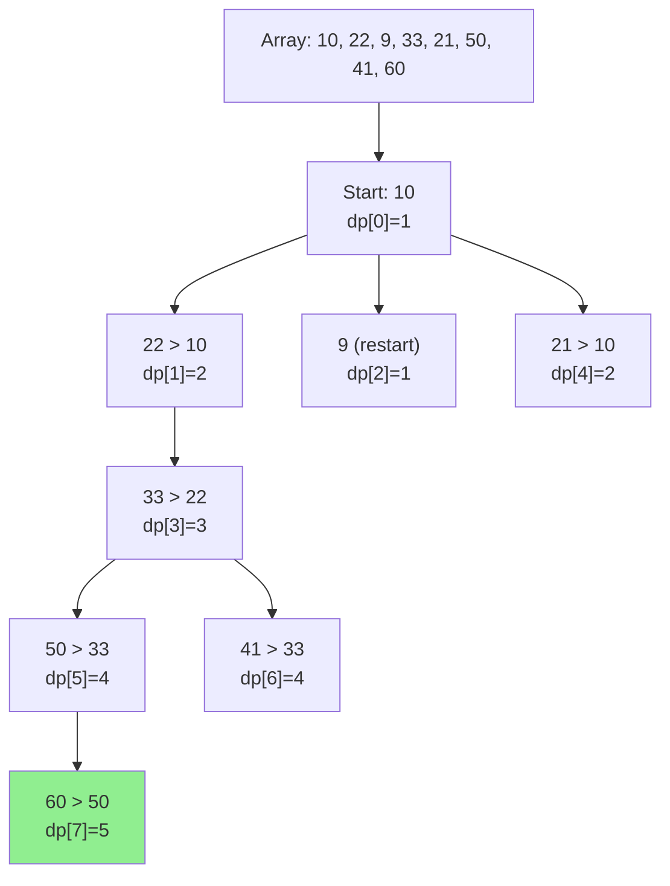

# Longest Increasing Subsequence (LIS)

| Property | Value |
|----------|-------|
| Category | Dynamic Programming |
| Subcategory | Array/Sequence |
| Complexity (Time) | O(n²) DP, O(n log n) optimized |
| Complexity (Space) | O(n) |
| Input | Array of numbers |
| Output | Length of LIS (and/or the subsequence) |

## Overview

The **Longest Increasing Subsequence (LIS)** problem finds the longest subsequence of a given sequence in which the elements are in strictly increasing order. Unlike substring, the elements don't need to be contiguous.

This is a classic dynamic programming problem with applications in patience sorting, version control, and bioinformatics.

## Mathematical Foundation

### Problem Definition

Given sequence $A = a_1, a_2, ..., a_n$, find the longest subsequence $L = l_1, l_2, ..., l_k$ such that:
- $l_1 < l_2 < ... < l_k$ (strictly increasing)
- $L$ is a subsequence of $A$ (maintains relative order)

### Recurrence Relation (O(n²) DP)

Let $dp[i]$ = length of LIS ending at index $i$:

$$dp[i] = 1 + \max_{j < i, A[j] < A[i]} dp[j]$$

If no such $j$ exists, $dp[i] = 1$.

The answer is $\max(dp[0], dp[1], ..., dp[n-1])$.

### Binary Search Approach (O(n log n))

Maintain array $tail$ where $tail[i]$ = smallest ending element for LIS of length $i+1$:
- For each element $x$:
  - If $x$ > all elements in $tail$: append $x$
  - Else: replace smallest element ≥ $x$ with $x$

Length of $tail$ = length of LIS.

## Algorithm Approaches

### 1. Recursive with Memoization

```
LIS-RECURSIVE(arr):
    n = length(arr)
    memo = array of size n, all -1
    
    function LIS-ENDING-AT(i):
        if memo[i] != -1:
            return memo[i]
        
        max_len = 1
        for j from 0 to i-1:
            if arr[j] < arr[i]:
                max_len = max(max_len, 1 + LIS-ENDING-AT(j))
        
        memo[i] = max_len
        return max_len
    
    result = 0
    for i from 0 to n-1:
        result = max(result, LIS-ENDING-AT(i))
    
    return result
```

### 2. Dynamic Programming (O(n²))

```
LIS-DP(arr):
    n = length(arr)
    if n == 0:
        return 0
    
    dp = array of size n, all initialized to 1
    
    for i from 1 to n-1:
        for j from 0 to i-1:
            if arr[j] < arr[i]:
                dp[i] = max(dp[i], dp[j] + 1)
    
    return max(dp)
```

### 3. Binary Search (O(n log n))

```
LIS-BINARY-SEARCH(arr):
    n = length(arr)
    if n == 0:
        return 0
    
    tail = empty array  // tail[i] = smallest end for LIS of length i+1
    
    for x in arr:
        pos = binary_search_left(tail, x)  // First position ≥ x
        
        if pos == length(tail):
            tail.append(x)
        else:
            tail[pos] = x
    
    return length(tail)
```

### 4. With Subsequence Reconstruction

```
LIS-WITH-SEQUENCE(arr):
    n = length(arr)
    if n == 0:
        return 0, []
    
    dp = array of size n, all 1
    parent = array of size n, all -1
    
    for i from 1 to n-1:
        for j from 0 to i-1:
            if arr[j] < arr[i] and dp[j] + 1 > dp[i]:
                dp[i] = dp[j] + 1
                parent[i] = j
    
    // Find index with maximum LIS
    max_idx = index of max(dp)
    max_len = dp[max_idx]
    
    // Reconstruct sequence
    sequence = []
    idx = max_idx
    while idx != -1:
        sequence.prepend(arr[idx])
        idx = parent[idx]
    
    return max_len, sequence
```

## Complexity Analysis

| Approach | Time | Space | Notes |
|----------|------|-------|-------|
| Brute Force | O(2^n) | O(n) | All subsequences |
| DP | O(n²) | O(n) | Standard approach |
| Binary Search | O(n log n) | O(n) | Optimal time |
| Patience Sort | O(n log n) | O(n) | Card game analogy |

## Visual Representation

### DP Table Construction

```
arr = [10, 22, 9, 33, 21, 50, 41, 60]

Index:    0    1    2    3    4    5    6    7
Value:   10   22    9   33   21   50   41   60
dp:       1    2    1    3    2    4    4    5

Building dp[]:
- dp[0] = 1 (10 alone)
- dp[1] = 2 (10 < 22, so dp[0]+1 = 2)
- dp[2] = 1 (9 < nothing before it that's smaller)
- dp[3] = 3 (10 < 33: dp[0]+1=2, 22 < 33: dp[1]+1=3)
- dp[4] = 2 (10 < 21: dp[0]+1=2)
- dp[5] = 4 (33 < 50: dp[3]+1=4)
- dp[6] = 4 (33 < 41: dp[3]+1=4)
- dp[7] = 5 (50 < 60: dp[5]+1=5, 41 < 60: dp[6]+1=5)

LIS length = 5
One LIS = [10, 22, 33, 50, 60]
```

### Binary Search Visualization

```
arr = [10, 22, 9, 33, 21, 50, 41, 60]

Processing each element:
┌────────────────────────────────────────────┐
│ x=10: tail=[]       → append    → [10]     │
│ x=22: tail=[10]     → append    → [10,22]  │
│ x=9:  tail=[10,22]  → replace 10 → [9,22]  │
│ x=33: tail=[9,22]   → append    → [9,22,33]│
│ x=21: tail=[9,22,33]→ replace 22 → [9,21,33]│
│ x=50: tail=[9,21,33]→ append    → [9,21,33,50]│
│ x=41: tail=[9,21,33,50]→replace 50→[9,21,33,41]│
│ x=60: tail=[9,21,33,41]→ append →[9,21,33,41,60]│
└────────────────────────────────────────────┘

LIS length = 5 (length of tail)
Note: tail is NOT the LIS, just stores smallest endings
```

### Subsequence Tree



## Implementation (from repository)

```python
def longest_subsequence(array: list) -> int:
    """
    Find the length of the longest increasing subsequence.
    
    Uses recursive approach with memoization.
    
    Args:
        array: List of numbers
    
    Returns:
        Length of the longest strictly increasing subsequence
    
    >>> longest_subsequence([10, 22, 9, 33, 21, 50, 41, 60])
    5
    >>> longest_subsequence([3, 2])
    1
    >>> longest_subsequence([3, 10, 2, 1, 20])
    3
    >>> longest_subsequence([])
    0
    """
    if not array:
        return 0
    
    n = len(array)
    
    def lis_ending_at(idx: int, memo: dict) -> int:
        """Return LIS length ending at given index."""
        if idx in memo:
            return memo[idx]
        
        max_len = 1
        for prev in range(idx):
            if array[prev] < array[idx]:
                max_len = max(max_len, 1 + lis_ending_at(prev, memo))
        
        memo[idx] = max_len
        return max_len
    
    memo = {}
    return max(lis_ending_at(i, memo) for i in range(n))
```

## Real-World Applications

### 1. Version Control - Finding Longest Unchanged Sequence

```python
from typing import List, Tuple

def find_stable_commits(commits: List[int]) -> Tuple[int, List[int]]:
    """
    Find longest sequence of commits with increasing stability scores.
    
    Useful for identifying stable development periods.
    
    >>> commits = [85, 90, 70, 92, 88, 95, 91, 98]
    >>> length, sequence = find_stable_commits(commits)
    >>> length
    5
    """
    n = len(commits)
    if n == 0:
        return 0, []
    
    dp = [1] * n
    parent = [-1] * n
    
    for i in range(1, n):
        for j in range(i):
            if commits[j] < commits[i] and dp[j] + 1 > dp[i]:
                dp[i] = dp[j] + 1
                parent[i] = j
    
    # Find max and reconstruct
    max_idx = max(range(n), key=lambda i: dp[i])
    
    sequence = []
    idx = max_idx
    while idx != -1:
        sequence.append(commits[idx])
        idx = parent[idx]
    
    sequence.reverse()
    return len(sequence), sequence


def find_best_release_path(versions: List[Tuple[str, int]]) -> List[str]:
    """
    Find best sequence of releases with increasing quality.
    
    >>> versions = [("v1.0", 80), ("v1.1", 85), ("v1.2", 75), ("v1.3", 90)]
    >>> find_best_release_path(versions)
    ['v1.0', 'v1.1', 'v1.3']
    """
    n = len(versions)
    if n == 0:
        return []
    
    scores = [v[1] for v in versions]
    
    dp = [1] * n
    parent = [-1] * n
    
    for i in range(1, n):
        for j in range(i):
            if scores[j] < scores[i] and dp[j] + 1 > dp[i]:
                dp[i] = dp[j] + 1
                parent[i] = j
    
    max_idx = max(range(n), key=lambda i: dp[i])
    
    path = []
    idx = max_idx
    while idx != -1:
        path.append(versions[idx][0])
        idx = parent[idx]
    
    path.reverse()
    return path
```

### 2. Stock Trading - Maximum Profit Sequence

```python
from typing import List, Tuple

def find_trading_opportunities(
    prices: List[float],
    timestamps: List[str]
) -> Tuple[int, List[Tuple[str, float]]]:
    """
    Find longest sequence of increasing prices for trend trading.
    
    >>> prices = [100, 110, 105, 120, 115, 130, 125, 140]
    >>> timestamps = ["9:00", "10:00", "11:00", "12:00", 
    ...               "13:00", "14:00", "15:00", "16:00"]
    >>> length, trades = find_trading_opportunities(prices, timestamps)
    >>> length
    5
    """
    n = len(prices)
    if n == 0:
        return 0, []
    
    dp = [1] * n
    parent = [-1] * n
    
    for i in range(1, n):
        for j in range(i):
            if prices[j] < prices[i] and dp[j] + 1 > dp[i]:
                dp[i] = dp[j] + 1
                parent[i] = j
    
    max_idx = max(range(n), key=lambda i: dp[i])
    
    sequence = []
    idx = max_idx
    while idx != -1:
        sequence.append((timestamps[idx], prices[idx]))
        idx = parent[idx]
    
    sequence.reverse()
    return len(sequence), sequence


def analyze_growth_periods(
    metrics: List[float],
    dates: List[str]
) -> dict:
    """
    Analyze company growth metrics for longest growth periods.
    
    >>> metrics = [1000, 1200, 1100, 1400, 1300, 1600]
    >>> dates = ["Q1", "Q2", "Q3", "Q4", "Q5", "Q6"]
    >>> result = analyze_growth_periods(metrics, dates)
    >>> result['growth_length']
    4
    """
    length, sequence = find_trading_opportunities(metrics, dates)
    
    if len(sequence) >= 2:
        start_value = sequence[0][1]
        end_value = sequence[-1][1]
        total_growth = (end_value - start_value) / start_value * 100
    else:
        total_growth = 0
    
    return {
        'growth_length': length,
        'sequence': sequence,
        'total_growth_percent': round(total_growth, 2)
    }
```

### 3. Scheduling - Task Dependencies

```python
from typing import List, Tuple

def longest_task_chain(tasks: List[Tuple[str, int, int]]) -> List[str]:
    """
    Find longest chain of non-overlapping tasks with increasing deadlines.
    
    tasks: List of (name, start_time, deadline)
    
    >>> tasks = [
    ...     ("A", 0, 3), ("B", 2, 5), ("C", 4, 7), 
    ...     ("D", 1, 4), ("E", 6, 9), ("F", 3, 6)
    ... ]
    >>> chain = longest_task_chain(tasks)
    >>> len(chain) >= 3
    True
    """
    # Sort by deadline
    sorted_tasks = sorted(enumerate(tasks), key=lambda x: x[1][2])
    n = len(sorted_tasks)
    
    dp = [1] * n
    parent = [-1] * n
    
    for i in range(1, n):
        _, (name_i, start_i, deadline_i) = sorted_tasks[i]
        
        for j in range(i):
            _, (name_j, start_j, deadline_j) = sorted_tasks[j]
            
            # Task j must end before task i starts
            if deadline_j <= start_i and dp[j] + 1 > dp[i]:
                dp[i] = dp[j] + 1
                parent[i] = j
    
    max_idx = max(range(n), key=lambda i: dp[i])
    
    chain = []
    idx = max_idx
    while idx != -1:
        original_idx = sorted_tasks[idx][0]
        chain.append(tasks[original_idx][0])
        idx = parent[idx]
    
    chain.reverse()
    return chain
```

### 4. Patience Sorting (Card Game Implementation)

```python
import bisect
from typing import List, Tuple

def patience_sort(arr: List[int]) -> Tuple[List[int], List[List[int]]]:
    """
    Patience sorting using LIS algorithm.
    
    Returns sorted array and the piles (visual representation).
    
    >>> sorted_arr, piles = patience_sort([7, 2, 5, 3, 8, 1])
    >>> sorted_arr
    [1, 2, 3, 5, 7, 8]
    """
    if not arr:
        return [], []
    
    piles = []
    pile_tops = []
    
    for card in arr:
        # Find pile to place card (leftmost pile with top >= card)
        pos = bisect.bisect_left(pile_tops, card)
        
        if pos == len(piles):
            # Create new pile
            piles.append([card])
            pile_tops.append(card)
        else:
            # Add to existing pile
            piles[pos].append(card)
            pile_tops[pos] = card
    
    # Merge piles (simplified - just return sorted)
    result = []
    for pile in piles:
        result.extend(pile)
    result.sort()
    
    return result, piles


def lis_with_patience(arr: List[int]) -> Tuple[int, List[int]]:
    """
    Find LIS using patience sorting with sequence reconstruction.
    
    >>> length, lis = lis_with_patience([10, 22, 9, 33, 21, 50, 41, 60])
    >>> length
    5
    """
    if not arr:
        return 0, []
    
    n = len(arr)
    # piles[i] = (value, previous index in sequence)
    piles = []
    pile_tops = []
    # Track how to reconstruct
    predecessors = [-1] * n
    pile_indices = []
    
    for i, x in enumerate(arr):
        pos = bisect.bisect_left(pile_tops, x)
        
        if pos > 0:
            # Previous element in LIS is top of previous pile
            predecessors[i] = pile_indices[pos - 1]
        
        if pos == len(piles):
            piles.append(i)
            pile_tops.append(x)
            pile_indices.append(i)
        else:
            piles[pos] = i
            pile_tops[pos] = x
            pile_indices[pos] = i
    
    # Reconstruct LIS
    lis_len = len(piles)
    lis = []
    idx = piles[-1]
    while idx != -1:
        lis.append(arr[idx])
        idx = predecessors[idx]
    
    lis.reverse()
    return lis_len, lis
```

## Variations

### Longest Non-Decreasing Subsequence

```python
def longest_non_decreasing(arr: List[int]) -> int:
    """
    Allow equal consecutive elements.
    
    >>> longest_non_decreasing([1, 2, 2, 3, 3, 3, 4])
    7
    """
    if not arr:
        return 0
    
    tail = []
    for x in arr:
        pos = bisect.bisect_right(tail, x)  # Use bisect_right
        if pos == len(tail):
            tail.append(x)
        else:
            tail[pos] = x
    
    return len(tail)
```

### Longest Decreasing Subsequence

```python
def longest_decreasing(arr: List[int]) -> int:
    """
    Find longest strictly decreasing subsequence.
    
    >>> longest_decreasing([9, 4, 3, 2, 5, 4, 3, 2])
    4
    """
    # Negate and find LIS
    return longest_subsequence([-x for x in arr])
```

### Longest Bitonic Subsequence

```python
def longest_bitonic(arr: List[int]) -> int:
    """
    Find longest subsequence that first increases then decreases.
    
    >>> longest_bitonic([1, 11, 2, 10, 4, 5, 2, 1])
    6
    """
    n = len(arr)
    if n < 3:
        return n
    
    # LIS ending at each position
    lis = [1] * n
    for i in range(1, n):
        for j in range(i):
            if arr[j] < arr[i]:
                lis[i] = max(lis[i], lis[j] + 1)
    
    # LDS starting at each position
    lds = [1] * n
    for i in range(n - 2, -1, -1):
        for j in range(i + 1, n):
            if arr[j] < arr[i]:
                lds[i] = max(lds[i], lds[j] + 1)
    
    # Max bitonic = max(lis[i] + lds[i] - 1)
    return max(lis[i] + lds[i] - 1 for i in range(n))
```

## Common Pitfalls

1. **Non-strict vs Strict**: Be clear about `<` vs `<=`
2. **Returning tail array**: The tail array in binary search is NOT the LIS
3. **Off-by-one**: Watch indices when reconstructing subsequence
4. **Equal elements**: Handle duplicates correctly based on requirements

## References

- [LIS - Wikipedia](https://en.wikipedia.org/wiki/Longest_increasing_subsequence)
- [Patience Sorting](https://en.wikipedia.org/wiki/Patience_sorting)
- [O(n log n) LIS - GeeksforGeeks](https://www.geeksforgeeks.org/longest-monotonically-increasing-subsequence-size-n-log-n/)

## See Also

- [Longest Common Subsequence](longest_common_subsequence.md) - Two sequence comparison
- [Maximum Subarray Sum](max_subarray_sum.md) - Contiguous sequence
- [Longest Palindromic Subsequence](longest_palindromic_subsequence.md) - Palindrome variant
