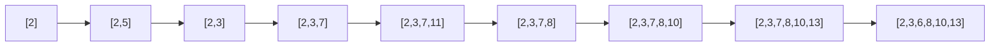

# Longest Increasing Subsequence (O(n log n))

| Property | Value |
|----------|-------|
| Category | Dynamic Programming |
| Subcategory | Subsequence / Binary Search |
| Complexity (Time) | O(n log n) |
| Complexity (Space) | O(n) |
| Input | Array of integers |
| Output | Length of longest increasing subsequence |

## Overview

The **Longest Increasing Subsequence (LIS)** problem finds the length of the longest subsequence where elements are in strictly increasing order. While the standard DP solution is O(n²), this optimized version achieves O(n log n) using binary search with a clever auxiliary array.

## Mathematical Foundation

### Problem Definition

Given sequence $A = [a_1, a_2, ..., a_n]$:

Find the longest subsequence $[a_{i_1}, a_{i_2}, ..., a_{i_k}]$ where:
- $i_1 < i_2 < ... < i_k$
- $a_{i_1} < a_{i_2} < ... < a_{i_k}$

### Key Insight

Maintain array `tail` where `tail[i]` = smallest ending element of all increasing subsequences of length `i+1`.

**Invariant**: `tail` is always sorted in increasing order.

### Binary Search Logic

For each element `x`:
1. If `x > tail[length-1]`: Extend longest subsequence
2. Otherwise: Find smallest `tail[i] >= x` and replace it

### Why This Works

By keeping the smallest possible ending value for each length:
- We maximize chances of extending the sequence
- Any future element that could extend a sequence ending with larger value can also extend one ending with smaller value

## Algorithm

### O(n log n) Algorithm

```
LIS-BINARY-SEARCH(arr):
    if arr is empty:
        return 0
    
    n = length(arr)
    tail = array of size n, all 0
    length = 1
    tail[0] = arr[0]
    
    for i from 1 to n-1:
        if arr[i] < tail[0]:
            // New smallest element
            tail[0] = arr[i]
        
        else if arr[i] > tail[length-1]:
            // Extend longest subsequence
            tail[length] = arr[i]
            length += 1
        
        else:
            // Find position to replace using binary search
            pos = CEIL-INDEX(tail, 0, length-1, arr[i])
            tail[pos] = arr[i]
    
    return length


CEIL-INDEX(arr, left, right, key):
    // Find smallest index i where arr[i] >= key
    while right - left > 1:
        mid = (left + right) / 2
        if arr[mid] >= key:
            right = mid
        else:
            left = mid
    return right
```

### With Path Reconstruction (O(n log n))

```
LIS-WITH-PATH(arr):
    n = length(arr)
    tail = array of size n
    tail_indices = array of size n
    parent = array of size n, all -1
    length = 0
    
    for i from 0 to n-1:
        // Binary search for position
        pos = lower_bound(tail[0:length], arr[i])
        
        tail[pos] = arr[i]
        tail_indices[pos] = i
        
        if pos > 0:
            parent[i] = tail_indices[pos - 1]
        
        if pos == length:
            length += 1
    
    // Reconstruct path
    path = []
    idx = tail_indices[length - 1]
    while idx != -1:
        path.append(arr[idx])
        idx = parent[idx]
    
    reverse(path)
    return (length, path)
```

## Complexity Analysis

| Approach | Time | Space | Notes |
|----------|------|-------|-------|
| Brute Force | O(2^n) | O(n) | Try all subsequences |
| DP | O(n²) | O(n) | Standard approach |
| Binary Search | O(n log n) | O(n) | Optimal |

### Why O(n log n)?

- Outer loop: O(n) iterations
- Binary search: O(log n) per iteration
- Total: O(n log n)

## Visual Representation

### Example: [2, 5, 3, 7, 11, 8, 10, 13, 6]

```
Processing each element:

i=0: arr[0]=2
     tail = [2]
     length = 1

i=1: arr[1]=5, 5 > 2
     tail = [2, 5]
     length = 2

i=2: arr[2]=3, 2 < 3 < 5, replace 5
     tail = [2, 3]
     length = 2

i=3: arr[3]=7, 7 > 3
     tail = [2, 3, 7]
     length = 3

i=4: arr[4]=11, 11 > 7
     tail = [2, 3, 7, 11]
     length = 4

i=5: arr[5]=8, 7 < 8 < 11, replace 11
     tail = [2, 3, 7, 8]
     length = 4

i=6: arr[6]=10, 10 > 8
     tail = [2, 3, 7, 8, 10]
     length = 5

i=7: arr[7]=13, 13 > 10
     tail = [2, 3, 7, 8, 10, 13]
     length = 6

i=8: arr[8]=6, 3 < 6 < 7, replace 7
     tail = [2, 3, 6, 8, 10, 13]
     length = 6

Final LIS length: 6
```

### Binary Search Illustration

```
Finding position for 8 in tail = [2, 3, 7, 11]:

left=0, right=3
mid=1: tail[1]=3 < 8 → left=1
mid=2: tail[2]=7 < 8 → left=2
mid=3: tail[3]=11 >= 8 → right=3

Result: pos=3, replace tail[3]=11 with 8
tail = [2, 3, 7, 8]
```

### State Evolution



## Implementation (from repository)

```python
def ceil_index(v, left, right, key):
    while right - left > 1:
        middle = (left + right) // 2
        if v[middle] >= key:
            right = middle
        else:
            left = middle
    return right


def longest_increasing_subsequence_length(v: list[int]) -> int:
    """
    >>> longest_increasing_subsequence_length([2, 5, 3, 7, 11, 8, 10, 13, 6])
    6
    >>> longest_increasing_subsequence_length([])
    0
    >>> longest_increasing_subsequence_length([0, 8, 4, 12, 2, 10, 6, 14, 1, 9, 5, 13,
    ...                                     3, 11, 7, 15])
    6
    >>> longest_increasing_subsequence_length([5, 4, 3, 2, 1])
    1
    """
    if len(v) == 0:
        return 0

    tail = [0] * len(v)
    length = 1

    tail[0] = v[0]

    for i in range(1, len(v)):
        if v[i] < tail[0]:
            tail[0] = v[i]
        elif v[i] > tail[length - 1]:
            tail[length] = v[i]
            length += 1
        else:
            tail[ceil_index(tail, -1, length - 1, v[i])] = v[i]

    return length
```

## Real-World Applications

### 1. Stock Trading - Longest Increasing Prices

```python
from typing import List, Dict, Tuple
from bisect import bisect_left

def analyze_price_trends(
    prices: List[float],
    dates: List[str] = None
) -> Dict:
    """
    Find longest increasing price trend.
    
    >>> prices = [100, 110, 105, 120, 115, 130, 140]
    >>> result = analyze_price_trends(prices)
    >>> result['lis_length'] >= 4
    True
    """
    n = len(prices)
    if n == 0:
        return {'lis_length': 0, 'trend': []}
    
    # Use O(n log n) LIS with path reconstruction
    tail = []
    tail_idx = []
    parent = [-1] * n
    
    for i in range(n):
        pos = bisect_left(tail, prices[i])
        
        if pos == len(tail):
            tail.append(prices[i])
            tail_idx.append(i)
        else:
            tail[pos] = prices[i]
            tail_idx[pos] = i
        
        if pos > 0:
            parent[i] = tail_idx[pos - 1]
    
    # Reconstruct trend
    trend_indices = []
    idx = tail_idx[-1] if tail_idx else -1
    while idx != -1:
        trend_indices.append(idx)
        idx = parent[idx]
    trend_indices.reverse()
    
    trend_prices = [prices[i] for i in trend_indices]
    trend_dates = [dates[i] for i in trend_indices] if dates else trend_indices
    
    return {
        'lis_length': len(tail),
        'trend_prices': trend_prices,
        'trend_dates': trend_dates,
        'growth': (trend_prices[-1] / trend_prices[0] - 1) * 100 if len(trend_prices) > 1 else 0
    }


def find_buy_sell_points(
    prices: List[float]
) -> Dict:
    """
    Use LIS to identify optimal buy points in uptrend.
    
    >>> prices = [10, 8, 12, 7, 15, 9, 20]
    >>> result = find_buy_sell_points(prices)
    >>> 'buy_indices' in result
    True
    """
    n = len(prices)
    if n < 2:
        return {'buy_indices': [], 'trend_length': 0}
    
    # Find LIS
    tail = []
    tail_idx = []
    parent = [-1] * n
    
    for i in range(n):
        pos = bisect_left(tail, prices[i])
        
        if pos == len(tail):
            tail.append(prices[i])
            tail_idx.append(i)
        else:
            tail[pos] = prices[i]
            tail_idx[pos] = i
        
        if pos > 0:
            parent[i] = tail_idx[pos - 1]
    
    # Get LIS indices
    lis_indices = []
    idx = tail_idx[-1] if tail_idx else -1
    while idx != -1:
        lis_indices.append(idx)
        idx = parent[idx]
    lis_indices.reverse()
    
    return {
        'buy_indices': lis_indices[:-1],  # All except last
        'sell_index': lis_indices[-1] if lis_indices else -1,
        'trend_length': len(lis_indices)
    }
```

### 2. Activity Scheduling

```python
from typing import List, Dict, Tuple
from bisect import bisect_left

def longest_chain_of_events(
    events: List[Tuple[int, int]]  # (start, end) times
) -> Dict:
    """
    Find longest chain where each event starts after previous ends.
    
    >>> events = [(1, 2), (2, 3), (3, 4), (1, 3), (2, 4)]
    >>> result = longest_chain_of_events(events)
    >>> result['chain_length'] >= 2
    True
    """
    if not events:
        return {'chain_length': 0, 'chain': []}
    
    # Sort by end time
    sorted_events = sorted(enumerate(events), key=lambda x: x[1][1])
    
    # LIS on start times where start > previous end
    # Use modified LIS
    tail_end = []  # End times of chains
    tail_idx = []
    parent = [-1] * len(events)
    
    for orig_idx, (start, end) in sorted_events:
        # Find longest chain that can be extended
        # We need start > previous_end
        pos = bisect_left(tail_end, start)
        
        if pos > 0:
            # Can extend a chain
            if pos == len(tail_end):
                tail_end.append(end)
                tail_idx.append(orig_idx)
            else:
                if end < tail_end[pos]:
                    tail_end[pos] = end
                    tail_idx[pos] = orig_idx
            
            # Find parent (chain we're extending)
            parent[orig_idx] = tail_idx[pos - 1]
        else:
            # Start new chain or update first
            if not tail_end or end < tail_end[0]:
                if not tail_end:
                    tail_end.append(end)
                    tail_idx.append(orig_idx)
                else:
                    tail_end[0] = end
                    tail_idx[0] = orig_idx
    
    # Reconstruct chain
    chain_indices = []
    idx = tail_idx[-1] if tail_idx else -1
    while idx != -1:
        chain_indices.append(idx)
        idx = parent[idx]
    chain_indices.reverse()
    
    return {
        'chain_length': len(tail_end),
        'chain': [events[i] for i in chain_indices]
    }


def maximize_non_overlapping(
    intervals: List[Tuple[int, int, float]]  # (start, end, value)
) -> Dict:
    """
    Find maximum value non-overlapping intervals using LIS-like approach.
    
    >>> intervals = [(0, 3, 10), (1, 2, 5), (3, 5, 8), (4, 6, 7)]
    >>> result = maximize_non_overlapping(intervals)
    >>> result['max_value'] >= 13  # (1,2,5) + (3,5,8)
    True
    """
    if not intervals:
        return {'max_value': 0, 'selected': []}
    
    # Sort by end time
    sorted_intervals = sorted(intervals, key=lambda x: x[1])
    n = len(sorted_intervals)
    
    # dp[i] = max value ending with interval i
    dp = [0] * n
    parent = [-1] * n
    
    # For each interval, find best previous non-overlapping
    end_times = [sorted_intervals[i][1] for i in range(n)]
    
    for i in range(n):
        start_i, end_i, value_i = sorted_intervals[i]
        
        # Find latest interval that ends before start_i
        pos = bisect_left(end_times, start_i)
        
        if pos > 0:
            # Find best dp value in [0, pos-1]
            best_j = max(range(pos), key=lambda j: dp[j])
            dp[i] = dp[best_j] + value_i
            parent[i] = best_j
        else:
            dp[i] = value_i
    
    # Find maximum
    max_idx = max(range(n), key=lambda i: dp[i])
    
    # Reconstruct
    selected = []
    idx = max_idx
    while idx != -1:
        selected.append(sorted_intervals[idx])
        idx = parent[idx]
    selected.reverse()
    
    return {
        'max_value': dp[max_idx],
        'selected': selected
    }
```

### 3. Box Stacking / Russian Dolls

```python
from typing import List, Dict, Tuple
from bisect import bisect_left

def max_envelope_nesting(
    envelopes: List[Tuple[int, int]]  # (width, height)
) -> int:
    """
    Find maximum number of envelopes that can be nested.
    Uses LIS on heights after sorting by width.
    
    >>> envelopes = [(5, 4), (6, 4), (6, 7), (2, 3)]
    >>> max_envelope_nesting(envelopes)
    3
    """
    if not envelopes:
        return 0
    
    # Sort by width ascending, then height descending
    # Descending height ensures same-width envelopes don't nest
    sorted_env = sorted(envelopes, key=lambda x: (x[0], -x[1]))
    
    # LIS on heights
    heights = [e[1] for e in sorted_env]
    
    tail = []
    for h in heights:
        pos = bisect_left(tail, h)
        if pos == len(tail):
            tail.append(h)
        else:
            tail[pos] = h
    
    return len(tail)


def box_stacking_3d(
    boxes: List[Tuple[int, int, int]]  # (length, width, height)
) -> Dict:
    """
    Maximum height stack where each box is strictly smaller in all dimensions.
    
    >>> boxes = [(4, 6, 7), (1, 2, 3), (4, 5, 6), (10, 12, 32)]
    >>> result = box_stacking_3d(boxes)
    >>> result['max_height'] >= 35
    True
    """
    if not boxes:
        return {'max_height': 0, 'stack': []}
    
    # Generate all rotations
    rotations = []
    for i, (l, w, h) in enumerate(boxes):
        dims = sorted([l, w, h], reverse=True)
        # Three possible bases
        rotations.append((dims[0], dims[1], dims[2], i))  # l×w base
        rotations.append((dims[0], dims[2], dims[1], i))  # l×h base  
        rotations.append((dims[1], dims[2], dims[0], i))  # w×h base
    
    # Sort by base area descending
    rotations.sort(key=lambda x: x[0] * x[1], reverse=True)
    
    n = len(rotations)
    # dp[i] = max height with rotation i on top
    dp = [r[2] for r in rotations]  # Initialize with own height
    parent = [-1] * n
    
    for i in range(1, n):
        for j in range(i):
            # Can stack i on j if i's base is strictly smaller
            if (rotations[i][0] < rotations[j][0] and 
                rotations[i][1] < rotations[j][1]):
                if dp[j] + rotations[i][2] > dp[i]:
                    dp[i] = dp[j] + rotations[i][2]
                    parent[i] = j
    
    # Find maximum
    max_idx = max(range(n), key=lambda i: dp[i])
    
    # Reconstruct stack
    stack = []
    idx = max_idx
    while idx != -1:
        stack.append(rotations[idx])
        idx = parent[idx]
    stack.reverse()
    
    return {
        'max_height': dp[max_idx],
        'stack': [(r[0], r[1], r[2]) for r in stack],  # (base_l, base_w, height)
        'original_boxes': [boxes[r[3]] for r in stack]
    }
```

## Variations

### Non-Decreasing (≤ instead of <)

Use `bisect_right` instead of `bisect_left`:

```python
from bisect import bisect_right

def longest_non_decreasing_subsequence(arr: List[int]) -> int:
    tail = []
    for x in arr:
        pos = bisect_right(tail, x)
        if pos == len(tail):
            tail.append(x)
        else:
            tail[pos] = x
    return len(tail)
```

### Longest Decreasing Subsequence

Negate values or reverse comparison:

```python
def longest_decreasing_subsequence(arr: List[int]) -> int:
    negated = [-x for x in arr]
    return longest_increasing_subsequence_length(negated)
```

## Common Pitfalls

1. **Strictly vs Non-strictly increasing**: Different binary search functions
2. **Tail array interpretation**: Tail doesn't contain an actual LIS
3. **Path reconstruction**: Requires additional tracking
4. **Edge cases**: Empty array, all same elements

## References

- [LIS in O(n log n) - GeeksforGeeks](https://www.geeksforgeeks.org/longest-monotonically-increasing-subsequence-size-n-log-n/)
- [Patience Sorting](https://en.wikipedia.org/wiki/Patience_sorting)

## See Also

- [Longest Increasing Subsequence (O(n²))](longest_increasing_subsequence.md) - Standard DP
- [Largest Divisible Subset](largest_divisible_subset.md) - Related problem
- [Longest Common Subsequence](longest_common_subsequence.md) - Another subsequence problem
