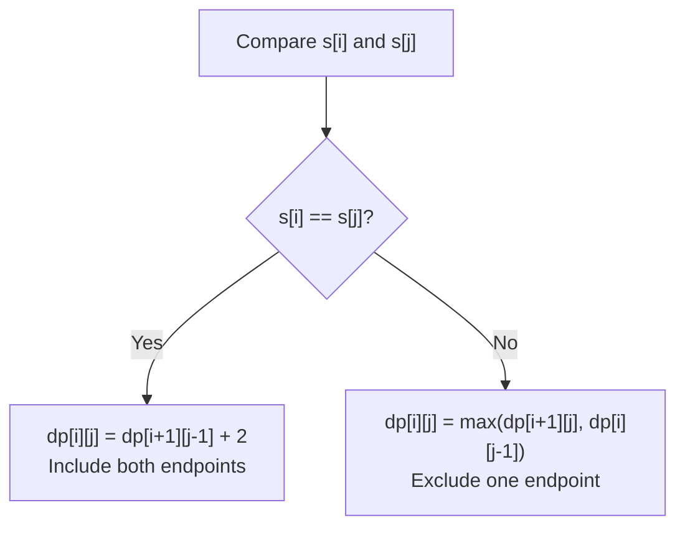

# Longest Palindromic Subsequence

| Property | Value |
|----------|-------|
| Category | Dynamic Programming |
| Subcategory | String / Subsequence |
| Complexity (Time) | O(n²) |
| Complexity (Space) | O(n²) or O(n) optimized |
| Input | String |
| Output | Length of longest palindromic subsequence |

## Overview

The **Longest Palindromic Subsequence (LPS)** problem finds the length of the longest subsequence of a string that reads the same forwards and backwards. Unlike palindromic substrings, the characters don't need to be contiguous.

## Mathematical Foundation

### Problem Definition

Given string $S = s_1 s_2 ... s_n$:

Find the longest subsequence $P$ of $S$ such that $P = \text{reverse}(P)$.

### Key Insight

**LPS(S) = LCS(S, reverse(S))**

The longest palindromic subsequence of S equals the longest common subsequence of S and its reverse.

### Recurrence Relation

Let $dp[i][j]$ = LPS of $S[i..j]$:

$$dp[i][j] = \begin{cases}
1 & \text{if } i = j \\
2 + dp[i+1][j-1] & \text{if } s_i = s_j \\
\max(dp[i+1][j], dp[i][j-1]) & \text{otherwise}
\end{cases}$$

### Alternative: LCS Approach

$$dp[i][j] = \begin{cases}
dp[i-1][j-1] + 1 & \text{if } S[i-1] = S'[j-1] \\
\max(dp[i-1][j], dp[i][j-1]) & \text{otherwise}
\end{cases}$$

Where $S' = \text{reverse}(S)$.

## Algorithm Approaches

### 1. Direct DP (Interval-based)

```
LPS-INTERVAL(s):
    n = length(s)
    dp = matrix n × n, all 0
    
    // Base: single characters are palindromes of length 1
    for i from 0 to n-1:
        dp[i][i] = 1
    
    // Fill by increasing length
    for length from 2 to n:
        for i from 0 to n-length:
            j = i + length - 1
            if s[i] == s[j]:
                dp[i][j] = dp[i+1][j-1] + 2
            else:
                dp[i][j] = max(dp[i+1][j], dp[i][j-1])
    
    return dp[0][n-1]
```

### 2. LCS with Reversed String

```
LPS-VIA-LCS(s):
    n = length(s)
    rev = reverse(s)
    
    dp = matrix (n+1) × (n+1), all 0
    
    for i from 1 to n:
        for j from 1 to n:
            if s[i-1] == rev[j-1]:
                dp[i][j] = dp[i-1][j-1] + 1
            else:
                dp[i][j] = max(dp[i-1][j], dp[i][j-1])
    
    return dp[n][n]
```

### 3. Space-Optimized (O(n))

```
LPS-SPACE-OPT(s):
    n = length(s)
    rev = reverse(s)
    
    prev = array of n+1 zeros
    curr = array of n+1 zeros
    
    for i from 1 to n:
        for j from 1 to n:
            if s[i-1] == rev[j-1]:
                curr[j] = prev[j-1] + 1
            else:
                curr[j] = max(prev[j], curr[j-1])
        
        swap(prev, curr)
    
    return prev[n]
```

## Complexity Analysis

| Approach | Time | Space | Notes |
|----------|------|-------|-------|
| Interval DP | O(n²) | O(n²) | Direct approach |
| LCS | O(n²) | O(n²) | Reduction to LCS |
| Space-Optimized | O(n²) | O(n) | Two rows |

## Visual Representation

### Example: "bbbab"

```
String: b b b a b
Index:  0 1 2 3 4

Possible palindromic subsequences:
- "b" (length 1)
- "bb" (positions 0,1 or 1,2 or 0,4 etc.)
- "bbb" (positions 0,1,2 or 0,1,4 etc.)
- "bbbb" (positions 0,1,2,4) ← Longest!

LPS = 4 (subsequence "bbbb")
```

### DP Table (Interval Method)

```
      b   b   b   a   b
    +---+---+---+---+---+
b   | 1 | 2 | 3 | 3 | 4 |
    +---+---+---+---+---+
b   |   | 1 | 2 | 2 | 3 |
    +---+---+---+---+---+
b   |   |   | 1 | 1 | 3 |
    +---+---+---+---+---+
a   |   |   |   | 1 | 1 |
    +---+---+---+---+---+
b   |   |   |   |   | 1 |
    +---+---+---+---+---+

dp[0][4] = 4 (answer)
```

### LCS Table (s vs reverse(s))

```
s = "bbbab", rev = "babbb"

         ""  b   a   b   b   b
    ""    0   0   0   0   0   0
    b     0   1   1   1   1   1
    b     0   1   1   2   2   2
    b     0   1   1   2   3   3
    a     0   1   2   2   3   3
    b     0   1   2   3   3   4

dp[5][5] = 4
```

### State Transition Diagram



## Implementation (from repository)

```python
def longest_palindromic_subsequence(input_string: str) -> int:
    """
    This function returns the longest palindromic subsequence in a string
    >>> longest_palindromic_subsequence("bbbab")
    4
    >>> longest_palindromic_subsequence("bbabcbcab")
    7
    """
    n = len(input_string)
    rev = input_string[::-1]
    m = len(rev)
    dp = [[-1] * (m + 1) for i in range(n + 1)]
    for i in range(n + 1):
        dp[i][0] = 0
    for i in range(m + 1):
        dp[0][i] = 0

    # create and initialise dp array
    for i in range(1, n + 1):
        for j in range(1, m + 1):
            # If characters at i and j are the same
            # include them in the palindromic subsequence
            if input_string[i - 1] == rev[j - 1]:
                dp[i][j] = 1 + dp[i - 1][j - 1]
            else:
                dp[i][j] = max(dp[i - 1][j], dp[i][j - 1])

    return dp[n][m]
```

## Real-World Applications

### 1. DNA Sequence Analysis

```python
from typing import List, Dict, Tuple

def find_palindromic_regions(
    dna_sequence: str,
    min_length: int = 4
) -> List[Dict]:
    """
    Find palindromic regions in DNA (biologically significant).
    
    >>> regions = find_palindromic_regions("ATCGATCGAT", 4)
    >>> len(regions) > 0
    True
    """
    n = len(dna_sequence)
    results = []
    
    # For each starting position, find LPS
    for start in range(n - min_length + 1):
        for end in range(start + min_length, n + 1):
            substring = dna_sequence[start:end]
            lps_len = longest_palindromic_subsequence(substring)
            
            if lps_len >= min_length:
                results.append({
                    'start': start,
                    'end': end,
                    'sequence': substring,
                    'lps_length': lps_len,
                    'density': lps_len / len(substring)
                })
    
    # Remove overlapping regions, keep longest
    results.sort(key=lambda x: -x['lps_length'])
    filtered = []
    used_positions = set()
    
    for r in results:
        positions = set(range(r['start'], r['end']))
        if not (positions & used_positions):
            filtered.append(r)
            used_positions.update(positions)
    
    return filtered


def complementary_palindrome(dna: str) -> str:
    """
    Find palindrome considering DNA complementarity.
    
    >>> complementary_palindrome("GAATTC")  # EcoRI site
    'GAATTC'
    """
    complement = {'A': 'T', 'T': 'A', 'G': 'C', 'C': 'G'}
    rev_comp = ''.join(complement.get(c, c) for c in reversed(dna))
    
    # DNA palindrome: equals its reverse complement
    if dna == rev_comp:
        return dna
    
    # Find longest palindromic subsequence considering complement
    # This is more complex - using LCS approach
    n = len(dna)
    dp = [[0] * (n + 1) for _ in range(n + 1)]
    
    for i in range(1, n + 1):
        for j in range(1, n + 1):
            if dna[i-1] == rev_comp[j-1]:
                dp[i][j] = dp[i-1][j-1] + 1
            else:
                dp[i][j] = max(dp[i-1][j], dp[i][j-1])
    
    # Reconstruct
    i, j = n, n
    result = []
    while i > 0 and j > 0:
        if dna[i-1] == rev_comp[j-1]:
            result.append(dna[i-1])
            i -= 1
            j -= 1
        elif dp[i-1][j] > dp[i][j-1]:
            i -= 1
        else:
            j -= 1
    
    return ''.join(reversed(result))
```

### 2. Text Compression / Encoding

```python
from typing import List, Dict, Tuple

def palindrome_based_compression(
    text: str
) -> Dict:
    """
    Analyze text for palindromic structure that aids compression.
    
    >>> result = palindrome_based_compression("abracadabra")
    >>> 'lps_length' in result
    True
    """
    n = len(text)
    lps_len = longest_palindromic_subsequence(text)
    
    # Characters that form the LPS can be encoded once
    # Others need position encoding
    
    # Find the actual LPS
    lps = reconstruct_lps(text)
    
    # Calculate compression ratio
    original_bits = n * 8  # Assuming ASCII
    # LPS: store half + middle (if odd)
    lps_bits = (lps_len // 2 + lps_len % 2) * 8 + 16  # + overhead
    other_bits = (n - lps_len) * (8 + 4)  # char + position
    
    compressed_estimate = lps_bits + other_bits
    
    return {
        'original_length': n,
        'lps_length': lps_len,
        'lps': lps,
        'palindrome_ratio': lps_len / n,
        'estimated_compression': 1 - compressed_estimate / original_bits if original_bits > 0 else 0
    }


def reconstruct_lps(s: str) -> str:
    """
    Reconstruct the actual longest palindromic subsequence.
    
    >>> reconstruct_lps("bbbab")
    'bbbb'
    """
    n = len(s)
    if n == 0:
        return ""
    
    # DP table
    dp = [[0] * n for _ in range(n)]
    
    for i in range(n):
        dp[i][i] = 1
    
    for length in range(2, n + 1):
        for i in range(n - length + 1):
            j = i + length - 1
            if s[i] == s[j]:
                dp[i][j] = dp[i+1][j-1] + 2
            else:
                dp[i][j] = max(dp[i+1][j], dp[i][j-1])
    
    # Reconstruct
    result = [''] * dp[0][n-1]
    left, right = 0, dp[0][n-1] - 1
    i, j = 0, n - 1
    
    while i <= j:
        if i == j:
            result[left] = s[i]
            break
        elif s[i] == s[j]:
            result[left] = s[i]
            result[right] = s[j]
            left += 1
            right -= 1
            i += 1
            j -= 1
        elif dp[i+1][j] > dp[i][j-1]:
            i += 1
        else:
            j -= 1
    
    return ''.join(result)
```

### 3. Error Correction in Communications

```python
from typing import List, Dict, Tuple

def detect_transmission_errors(
    received: str,
    expected_palindrome_ratio: float = 0.5
) -> Dict:
    """
    Use palindromic properties to detect transmission errors.
    
    >>> result = detect_transmission_errors("abcba")  # Perfect palindrome
    >>> result['error_likelihood'] < 0.5
    True
    """
    n = len(received)
    lps_len = longest_palindromic_subsequence(received)
    actual_ratio = lps_len / n if n > 0 else 0
    
    # Compare with expected
    deviation = abs(actual_ratio - expected_palindrome_ratio)
    
    return {
        'received_length': n,
        'lps_length': lps_len,
        'palindrome_ratio': actual_ratio,
        'expected_ratio': expected_palindrome_ratio,
        'deviation': deviation,
        'error_likelihood': min(1.0, deviation * 2)  # Simple model
    }


def correct_single_error(s: str) -> Dict:
    """
    Try to correct single character error using palindrome properties.
    
    >>> result = correct_single_error("abcxa")  # Should be "abcba"
    >>> 'corrections' in result
    True
    """
    n = len(s)
    original_lps = longest_palindromic_subsequence(s)
    
    corrections = []
    
    # Try changing each character
    for i in range(n):
        for c in 'abcdefghijklmnopqrstuvwxyz':
            if c != s[i]:
                modified = s[:i] + c + s[i+1:]
                new_lps = longest_palindromic_subsequence(modified)
                
                if new_lps > original_lps:
                    corrections.append({
                        'position': i,
                        'original': s[i],
                        'corrected': c,
                        'result': modified,
                        'lps_improvement': new_lps - original_lps
                    })
    
    # Sort by improvement
    corrections.sort(key=lambda x: -x['lps_improvement'])
    
    return {
        'original': s,
        'original_lps': original_lps,
        'corrections': corrections[:5]  # Top 5 suggestions
    }


def check_data_integrity(
    data: str,
    checksum_type: str = 'lps'
) -> Dict:
    """
    Check data integrity using palindromic checksum.
    
    >>> result = check_data_integrity("dataXatad")  # X is error
    >>> result['integrity_score'] < 1.0
    True
    """
    n = len(data)
    
    if checksum_type == 'lps':
        lps = longest_palindromic_subsequence(data)
        # Perfect palindrome would have lps = n
        score = lps / n if n > 0 else 1.0
        
        return {
            'data_length': n,
            'lps_length': lps,
            'integrity_score': score,
            'is_perfect_palindrome': lps == n,
            'errors_estimated': n - lps
        }
    
    return {'error': 'Unknown checksum type'}
```

## Variations

### Minimum Insertions to Make Palindrome

```python
def min_insertions_palindrome(s: str) -> int:
    """
    Minimum insertions to make string palindrome = n - LPS(s).
    
    >>> min_insertions_palindrome("ab")
    1
    """
    return len(s) - longest_palindromic_subsequence(s)
```

### Count All Palindromic Subsequences

```python
def count_palindromic_subsequences(s: str) -> int:
    """
    Count distinct palindromic subsequences.
    
    >>> count_palindromic_subsequences("aab")
    4
    """
    n = len(s)
    dp = [[0] * n for _ in range(n)]
    
    for i in range(n):
        dp[i][i] = 1
    
    for length in range(2, n + 1):
        for i in range(n - length + 1):
            j = i + length - 1
            if s[i] == s[j]:
                dp[i][j] = dp[i+1][j] + dp[i][j-1] + 1
            else:
                dp[i][j] = dp[i+1][j] + dp[i][j-1] - dp[i+1][j-1]
    
    return dp[0][n-1]
```

## Common Pitfalls

1. **Subsequence vs Substring**: Subsequence doesn't require contiguity
2. **LCS reduction**: Remember reverse is needed
3. **Index handling**: Off-by-one errors in interval DP
4. **Space optimization**: Careful with row updates

## References

- [LeetCode 516 - Longest Palindromic Subsequence](https://leetcode.com/problems/longest-palindromic-subsequence/)
- [LCS to LPS Reduction](https://www.geeksforgeeks.org/longest-palindromic-subsequence-dp-12/)

## See Also

- [Longest Common Subsequence](longest_common_subsequence.md) - Related problem
- [Edit Distance](edit_distance.md) - String transformation
- [Longest Palindromic Substring](../strings/longest_palindrome_substring.md) - Contiguous version
