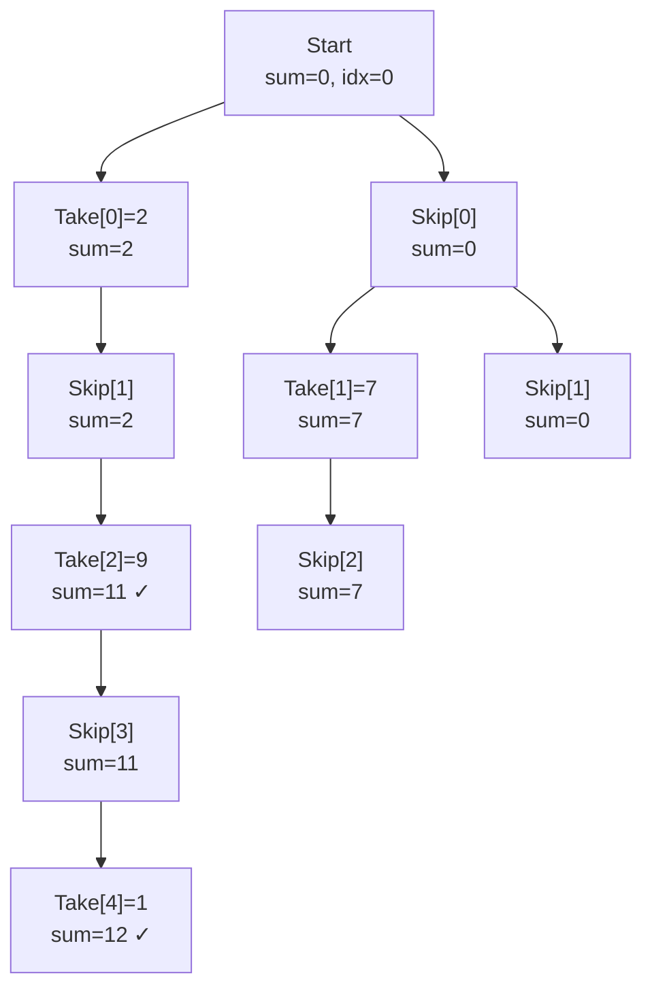

# Maximum Non-Adjacent Sum (House Robber)

| Property | Value |
|----------|-------|
| Category | Dynamic Programming |
| Subcategory | Linear / State Optimization |
| Complexity (Time) | O(n) |
| Complexity (Space) | O(1) |
| Input | Array of non-negative integers |
| Output | Maximum sum with no adjacent elements |

## Overview

The **Maximum Non-Adjacent Sum** problem (also known as the "House Robber" problem) finds the maximum sum of elements from an array such that no two selected elements are adjacent. This is a classic example of space-optimized dynamic programming.

## Mathematical Foundation

### Problem Definition

Given array $A = [a_0, a_1, ..., a_{n-1}]$ where $a_i \geq 0$:

$$\text{maximize } \sum_{i \in S} a_i$$

Subject to: If $i \in S$, then $(i-1) \notin S$ and $(i+1) \notin S$

### Recurrence Relation

Let $dp[i]$ = maximum sum using elements $a_0$ to $a_i$:

$$dp[i] = \max(dp[i-1], dp[i-2] + a_i)$$

**Interpretation**:
- Either skip $a_i$ (take $dp[i-1]$)
- Or include $a_i$ (take $dp[i-2] + a_i$)

### State Optimization

Instead of array, use two variables:
- $\text{max\_excluding}$ = max sum excluding previous element
- $\text{max\_including}$ = max sum including previous element

At each step:
$$\text{new\_including} = \text{max\_excluding} + a_i$$
$$\text{new\_excluding} = \max(\text{max\_including}, \text{max\_excluding})$$

## Algorithm Approaches

### 1. O(n) Space DP

```
MAX-NON-ADJACENT-DP(nums):
    n = length(nums)
    if n == 0: return 0
    if n == 1: return nums[0]
    
    dp = array of size n
    dp[0] = nums[0]
    dp[1] = max(nums[0], nums[1])
    
    for i from 2 to n-1:
        dp[i] = max(dp[i-1], dp[i-2] + nums[i])
    
    return dp[n-1]
```

### 2. O(1) Space Optimized

```
MAX-NON-ADJACENT-OPT(nums):
    max_including = 0  // Max sum including previous
    max_excluding = 0  // Max sum excluding previous
    
    for each num in nums:
        new_max_excluding = max(max_including, max_excluding)
        max_including = max_excluding + num
        max_excluding = new_max_excluding
    
    return max(max_including, max_excluding)
```

### 3. With Element Tracking

```
MAX-NON-ADJACENT-TRACK(nums):
    n = length(nums)
    dp = array of size n
    selected = array of size n (boolean)
    
    dp[0] = nums[0]
    selected[0] = true
    
    if nums[1] > nums[0]:
        dp[1] = nums[1]
        selected[1] = true
    else:
        dp[1] = nums[0]
        selected[1] = false
    
    for i from 2 to n-1:
        if dp[i-2] + nums[i] > dp[i-1]:
            dp[i] = dp[i-2] + nums[i]
            selected[i] = true
        else:
            dp[i] = dp[i-1]
            selected[i] = false
    
    // Reconstruct selection
    result = []
    i = n - 1
    while i >= 0:
        if selected[i]:
            result.prepend(i)
            i -= 2
        else:
            i -= 1
    
    return dp[n-1], result
```

## Complexity Analysis

| Approach | Time | Space | Notes |
|----------|------|-------|-------|
| Basic DP | O(n) | O(n) | Array storage |
| Optimized | O(n) | O(1) | Two variables |
| With tracking | O(n) | O(n) | Store selections |

## Visual Representation

### Example: [2, 7, 9, 3, 1]

```
Houses:  [2]  [7]  [9]  [3]  [1]
Index:    0    1    2    3    4

Decision at each house:
- House 0: Take 2, max = 2
- House 1: Take max(7, 2) = 7
- House 2: Take max(7, 2+9) = 11 (skip 7, take 2+9)
- House 3: Take max(11, 7+3) = 11 (skip 3)
- House 4: Take max(11, 11+1) = 12 (take 1)

Optimal: Houses 0, 2, 4 → 2 + 9 + 1 = 12
```

### State Evolution

```
        max_including  max_excluding
Start:       0              0
num=2:       2              0
num=7:       7              2
num=9:       11             7
num=3:       10             11
num=1:       12             11

Result: max(12, 11) = 12
```

### Decision Tree (Pruned)



## Implementation (from repository)

```python
def max_non_adjacent_sum(nums: list[int]) -> int:
    """
    Find the maximum non-adjacent sum of the array nums.

    >>> max_non_adjacent_sum([1, 2, 3, 4, 5])
    9
    >>> max_non_adjacent_sum([5, 1, 1, 5])
    10
    >>> max_non_adjacent_sum([])
    0
    >>> max_non_adjacent_sum([1])
    1
    >>> max_non_adjacent_sum([1, 2])
    2
    >>> max_non_adjacent_sum([1, 2, 3])
    4
    """
    if not nums:
        return 0

    max_including = 0  # max sum including the previous element
    max_excluding = 0  # max sum excluding the previous element

    for num in nums:
        # Calculate new max excluding (best of including or excluding previous)
        max_excluding, max_including = (
            max(max_including, max_excluding),
            max_excluding + num,
        )

    return max(max_excluding, max_including)
```

## Real-World Applications

### 1. Resource Scheduling

```python
from typing import List, Dict, Tuple
from dataclasses import dataclass

@dataclass
class Task:
    id: int
    duration: int
    value: int
    cooldown: int  # Time before next task can start

def max_value_scheduling(
    tasks: List[Task],
    time_slots: int
) -> Dict:
    """
    Schedule tasks with cooldown periods to maximize value.
    
    >>> tasks = [Task(0, 1, 10, 1), Task(1, 1, 5, 1), Task(2, 1, 15, 1)]
    >>> result = max_value_scheduling(tasks, 5)
    >>> result['max_value'] >= 25
    True
    """
    # Sort tasks by start time / slot
    # For simplicity, assume each task fits in one slot
    n = len(tasks)
    
    if n == 0:
        return {'max_value': 0, 'selected': []}
    
    values = [t.value for t in tasks]
    
    # Use DP similar to house robber
    # but with variable cooldown
    dp = [0] * n
    selected = [False] * n
    
    dp[0] = values[0]
    selected[0] = True
    
    for i in range(1, n):
        cooldown = tasks[i].cooldown
        
        # Option 1: Don't take this task
        skip = dp[i-1]
        
        # Option 2: Take this task
        prev_valid = i - cooldown - 1
        take = values[i]
        if prev_valid >= 0:
            take += dp[prev_valid]
        
        if take > skip:
            dp[i] = take
            selected[i] = True
        else:
            dp[i] = skip
            selected[i] = False
    
    # Reconstruct
    result_tasks = []
    i = n - 1
    while i >= 0:
        if selected[i]:
            result_tasks.append(tasks[i].id)
            i -= tasks[i].cooldown + 1
        else:
            i -= 1
    
    return {
        'max_value': dp[n-1],
        'selected': list(reversed(result_tasks))
    }


def server_utilization(
    requests: List[int],
    cooldown: int = 1
) -> Dict:
    """
    Maximize server request handling with cooldown.
    
    >>> result = server_utilization([10, 2, 15, 3, 20], 1)
    >>> result['total_processed'] >= 45
    True
    """
    n = len(requests)
    if n == 0:
        return {'total_processed': 0, 'handled': []}
    
    # dp[i] = max requests handled up to index i
    dp = [0] * n
    dp[0] = requests[0]
    
    for i in range(1, n):
        # Skip this request
        skip = dp[i-1]
        
        # Handle this request
        handle = requests[i]
        if i > cooldown:
            handle += dp[i - cooldown - 1]
        
        dp[i] = max(skip, handle)
    
    return {
        'total_processed': dp[n-1],
        'request_pattern': requests
    }
```

### 2. Investment Portfolio

```python
from typing import List, Dict, Tuple
from dataclasses import dataclass

@dataclass
class Investment:
    name: str
    return_rate: float
    risk_level: int  # 1-10
    lock_period: int  # months

def maximize_returns(
    investments: List[Investment],
    capital: float,
    months: int
) -> Dict:
    """
    Select investments where adjacent high-risk investments are avoided.
    
    >>> inv = [Investment("A", 0.1, 8, 1), Investment("B", 0.05, 3, 1)]
    >>> result = maximize_returns(inv, 1000, 6)
    >>> 'total_return' in result
    True
    """
    # Model: Can't take adjacent high-risk (risk >= 7) investments
    # to maintain portfolio stability
    
    HIGH_RISK_THRESHOLD = 7
    
    n = len(investments)
    values = [i.return_rate * capital for i in investments]
    is_high_risk = [i.risk_level >= HIGH_RISK_THRESHOLD for i in investments]
    
    # Modified house robber: can take adjacent only if not both high-risk
    dp = [0.0] * n
    selected = [False] * n
    
    dp[0] = values[0]
    selected[0] = True
    
    for i in range(1, n):
        # Option 1: Skip
        skip = dp[i-1]
        
        # Option 2: Take (only if not both high-risk adjacent)
        take = values[i]
        if i >= 1:
            # Check if we can take both i and i-1
            can_take_adjacent = not (is_high_risk[i] and is_high_risk[i-1] and selected[i-1])
            
            if can_take_adjacent:
                take += dp[i-1]
            elif i >= 2:
                take += dp[i-2]
        
        if take > skip:
            dp[i] = take
            selected[i] = True
        else:
            dp[i] = skip
            selected[i] = False
    
    # Calculate expected return
    total_return = dp[n-1] if n > 0 else 0
    
    return {
        'total_return': total_return,
        'selected_investments': [
            inv.name for i, inv in enumerate(investments) if selected[i]
        ],
        'return_rate': total_return / capital if capital > 0 else 0
    }


def stock_trading_cooldown(
    prices: List[int],
    cooldown_days: int = 1
) -> int:
    """
    Maximum profit with cooldown after selling.
    
    >>> stock_trading_cooldown([1, 2, 3, 0, 2], 1)
    3
    """
    n = len(prices)
    if n <= 1:
        return 0
    
    # States: hold, sold, rest
    hold = -prices[0]  # Holding stock
    sold = 0  # Just sold
    rest = 0  # In cooldown or ready to buy
    
    for i in range(1, n):
        prev_hold = hold
        prev_sold = sold
        prev_rest = rest
        
        hold = max(prev_hold, prev_rest - prices[i])
        sold = prev_hold + prices[i]
        rest = max(prev_rest, prev_sold)
    
    return max(sold, rest)
```

### 3. Security/Surveillance

```python
from typing import List, Dict, Tuple

def optimal_camera_placement(
    locations: List[Dict],
    min_gap: int = 1
) -> Dict:
    """
    Place security cameras maximizing coverage, with minimum gap.
    
    >>> locs = [{'coverage': 100}, {'coverage': 50}, {'coverage': 120}]
    >>> result = optimal_camera_placement(locs, 1)
    >>> result['total_coverage'] >= 220
    True
    """
    n = len(locations)
    if n == 0:
        return {'total_coverage': 0, 'cameras_placed': []}
    
    coverages = [loc['coverage'] for loc in locations]
    
    # Standard house robber with variable gap
    dp = [0] * n
    placed = [False] * n
    
    dp[0] = coverages[0]
    placed[0] = True
    
    for i in range(1, n):
        skip = dp[i-1]
        take = coverages[i]
        
        if i > min_gap:
            take += dp[i - min_gap - 1]
        
        if take > skip:
            dp[i] = take
            placed[i] = True
        else:
            dp[i] = skip
    
    # Reconstruct
    camera_positions = []
    i = n - 1
    while i >= 0:
        if placed[i] and (not camera_positions or 
                          camera_positions[-1] - i > min_gap):
            camera_positions.append(i)
            i -= min_gap + 1
        else:
            i -= 1
    
    return {
        'total_coverage': dp[n-1],
        'cameras_placed': list(reversed(camera_positions)),
        'num_cameras': len(camera_positions)
    }


def optimize_patrol_route(
    checkpoints: List[int],
    min_interval: int = 2
) -> Dict:
    """
    Select checkpoints for patrol maximizing security value.
    Adjacent checkpoints have overlap, so maintain minimum interval.
    
    >>> checkpoints = [5, 10, 3, 8, 15, 2, 12]
    >>> result = optimize_patrol_route(checkpoints, 2)
    >>> result['total_value'] >= 30
    True
    """
    n = len(checkpoints)
    if n == 0:
        return {'total_value': 0, 'route': []}
    
    # DP with gap of min_interval
    dp = [0] * n
    
    for i in range(n):
        take = checkpoints[i]
        if i > min_interval:
            take += dp[i - min_interval - 1]
        
        if i > 0:
            dp[i] = max(dp[i-1], take)
        else:
            dp[i] = take
    
    return {
        'total_value': dp[n-1],
        'checkpoint_count': n,
        'efficiency': dp[n-1] / sum(checkpoints) if sum(checkpoints) > 0 else 0
    }
```

## Variations

### Circular Array (House Robber II)

```python
def max_non_adjacent_circular(nums: List[int]) -> int:
    """
    Houses in a circle - first and last are adjacent.
    
    >>> max_non_adjacent_circular([2, 3, 2])
    3
    """
    if len(nums) == 1:
        return nums[0]
    
    def rob_linear(arr):
        if not arr:
            return 0
        inc, exc = 0, 0
        for num in arr:
            inc, exc = exc + num, max(inc, exc)
        return max(inc, exc)
    
    # Either exclude first or exclude last
    return max(rob_linear(nums[1:]), rob_linear(nums[:-1]))
```

### Tree Structure (House Robber III)

```python
def max_non_adjacent_tree(root) -> int:
    """
    Tree structure - can't rob directly connected nodes.
    """
    def dfs(node):
        if not node:
            return (0, 0)  # (rob, not_rob)
        
        left = dfs(node.left)
        right = dfs(node.right)
        
        rob = node.val + left[1] + right[1]
        not_rob = max(left) + max(right)
        
        return (rob, not_rob)
    
    return max(dfs(root))
```

## Common Pitfalls

1. **Empty array**: Return 0
2. **Single element**: Return that element
3. **Two elements**: Return max of both
4. **Circular case**: Split into two linear problems
5. **Variable cooldown**: Adjust index calculations

## References

- [LeetCode 198 - House Robber](https://leetcode.com/problems/house-robber/)
- [House Robber II (Circular)](https://leetcode.com/problems/house-robber-ii/)
- [House Robber III (Trees)](https://leetcode.com/problems/house-robber-iii/)

## See Also

- [Climbing Stairs](climbing_stairs.md) - Similar recurrence
- [Maximum Subarray Sum](max_subarray_sum.md) - Related optimization
- [Stock Trading Problems](../greedy/stock_trading.md) - State machine DP
