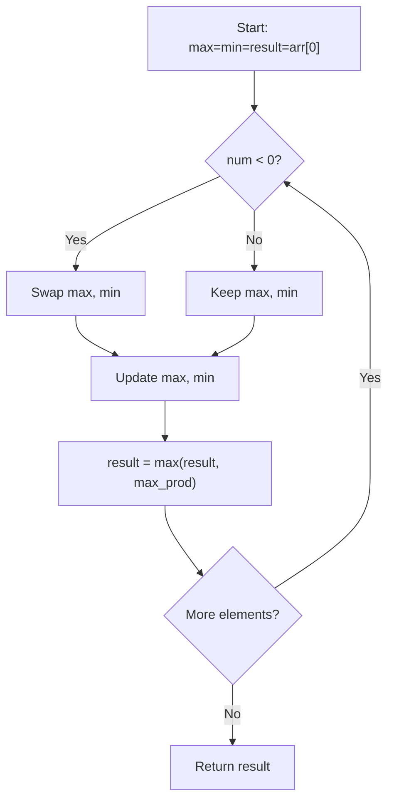

# Maximum Product Subarray

| Property | Value |
|----------|-------|
| Category | Dynamic Programming |
| Subcategory | Array Optimization |
| Complexity (Time) | O(n) |
| Complexity (Space) | O(1) |
| Input | Array of integers |
| Output | Maximum contiguous product |

## Overview

The **Maximum Product Subarray** problem finds the contiguous subarray within a one-dimensional array that has the largest product. Unlike the maximum sum problem, we must track both maximum and minimum products because negative numbers can flip signs.

## Mathematical Foundation

### Problem Definition

Given array $A = [a_1, a_2, ..., a_n]$, find:

$$\max_{1 \leq i \leq j \leq n} \prod_{k=i}^{j} a_k$$

### Key Insight

For products, a negative number can become positive when multiplied by another negative. Therefore:
- We track both **maximum** and **minimum** products ending at each position
- A large negative minimum can become the maximum after multiplying by a negative number

### Recurrence Relations

Let:
- $maxProd[i]$ = maximum product ending at index $i$
- $minProd[i]$ = minimum product ending at index $i$

$$maxProd[i] = \max(a_i, maxProd[i-1] \times a_i, minProd[i-1] \times a_i)$$

$$minProd[i] = \min(a_i, maxProd[i-1] \times a_i, minProd[i-1] \times a_i)$$

### Simplified Rule

When $a_i < 0$: swap $maxProd$ and $minProd$ before computing.

$$\text{if } a_i < 0: \text{swap}(maxProd, minProd)$$
$$maxProd = \max(a_i, maxProd \times a_i)$$
$$minProd = \min(a_i, minProd \times a_i)$$

## Algorithm Approaches

### 1. Brute Force (O(n²))

```
MAX-PRODUCT-BRUTE(arr):
    n = length(arr)
    max_prod = -infinity
    
    for i from 0 to n-1:
        product = 1
        for j from i to n-1:
            product = product × arr[j]
            max_prod = max(max_prod, product)
    
    return max_prod
```

### 2. Optimal DP (O(n))

```
MAX-PRODUCT-DP(arr):
    if arr is empty:
        return 0
    
    max_prod = min_prod = result = arr[0]
    
    for i from 1 to n-1:
        num = arr[i]
        
        if num < 0:
            swap(max_prod, min_prod)
        
        max_prod = max(num, max_prod × num)
        min_prod = min(num, min_prod × num)
        
        result = max(result, max_prod)
    
    return result
```

### 3. Two-Pass Solution

```
MAX-PRODUCT-TWO-PASS(arr):
    // Pass 1: Left to right
    max_left = -infinity
    product = 1
    for i from 0 to n-1:
        product = product × arr[i]
        max_left = max(max_left, product)
        if product == 0:
            product = 1
    
    // Pass 2: Right to left
    max_right = -infinity
    product = 1
    for i from n-1 to 0:
        product = product × arr[i]
        max_right = max(max_right, product)
        if product == 0:
            product = 1
    
    return max(max_left, max_right)
```

## Complexity Analysis

| Approach | Time | Space | Notes |
|----------|------|-------|-------|
| Brute Force | O(n²) | O(1) | Check all subarrays |
| Optimal DP | O(n) | O(1) | Track max/min |
| Two-Pass | O(n) | O(1) | Handle zeros |

## Visual Representation

### Algorithm Trace

```
Array: [2, 3, -2, 4]

Index:       0       1       2       3
Value:       2       3      -2       4

Processing:
┌─────────────────────────────────────────────────┐
│ i=0: num=2                                      │
│      max_prod = 2                               │
│      min_prod = 2                               │
│      result = 2                                 │
├─────────────────────────────────────────────────┤
│ i=1: num=3                                      │
│      max_prod = max(3, 2×3) = 6                 │
│      min_prod = min(3, 2×3) = 3                 │
│      result = 6                                 │
├─────────────────────────────────────────────────┤
│ i=2: num=-2 (negative! swap first)              │
│      swap: max=3, min=6                         │
│      max_prod = max(-2, 3×(-2)) = -2            │
│      min_prod = min(-2, 6×(-2)) = -12           │
│      result = 6                                 │
├─────────────────────────────────────────────────┤
│ i=3: num=4                                      │
│      max_prod = max(4, -2×4) = 4                │
│      min_prod = min(4, -12×4) = -48             │
│      result = 6                                 │
└─────────────────────────────────────────────────┘

Answer: 6 (subarray [2, 3])
```

### Effect of Negatives

```
Array: [2, 3, -2, 4, -1]

After processing [2, 3, -2, 4]:
  max_prod = 4, min_prod = -48

i=4: num=-1 (negative! swap first)
  After swap: max_prod = -48, min_prod = 4
  max_prod = max(-1, -48×(-1)) = 48  ← min became max!
  min_prod = min(-1, 4×(-1)) = -4
  result = 48

Final: 48 (subarray [2, 3, -2, 4, -1])
```

### State Machine View



## Implementation (from repository)

```python
def max_product_subarray(numbers: list[int]) -> int:
    """
    Returns the maximum product that can be obtained by multiplying a
    contiguous subarray of the given integer list `numbers`.

    Example:

    >>> max_product_subarray([2, 3, -2, 4])
    6
    >>> max_product_subarray((-2, 0, -1))
    0
    >>> max_product_subarray([2, 3, -2, 4, -1])
    48
    >>> max_product_subarray([-1])
    -1
    >>> max_product_subarray([0])
    0
    >>> max_product_subarray([])
    0
    >>> max_product_subarray("")
    0
    >>> max_product_subarray(None)
    0
    >>> max_product_subarray([2, 3, -2, 4.5, -1])
    Traceback (most recent call last):
        ...
    ValueError: numbers must be an iterable of integers
    >>> max_product_subarray("ABC")
    Traceback (most recent call last):
        ...
    ValueError: numbers must be an iterable of integers
    """
    if not numbers:
        return 0

    if not isinstance(numbers, (list, tuple)) or not all(
        isinstance(number, int) for number in numbers
    ):
        raise ValueError("numbers must be an iterable of integers")

    max_till_now = min_till_now = max_prod = numbers[0]

    for i in range(1, len(numbers)):
        # update the maximum and minimum subarray products
        number = numbers[i]
        if number < 0:
            max_till_now, min_till_now = min_till_now, max_till_now
        max_till_now = max(number, max_till_now * number)
        min_till_now = min(number, min_till_now * number)

        # update the maximum product found till now
        max_prod = max(max_prod, max_till_now)

    return max_prod
```

## Real-World Applications

### 1. Financial Analysis - Return Multipliers

```python
from typing import List, Tuple

def analyze_return_periods(returns: List[float]) -> dict:
    """
    Analyze investment return periods to find best/worst multiplicative periods.
    
    Returns are expressed as multipliers (1.1 = 10% gain, 0.9 = 10% loss).
    
    >>> returns = [1.1, 1.2, 0.8, 1.15, 0.95]  # Daily return multipliers
    >>> result = analyze_return_periods(returns)
    >>> result['best_period_multiplier'] > 1
    True
    """
    if not returns:
        return {'best_period_multiplier': 1, 'worst_period_multiplier': 1}
    
    # Convert to log space for numerical stability, then convert back
    # Or use the direct product approach
    
    max_prod = min_prod = result_max = result_min = returns[0]
    best_end = worst_end = 0
    
    for i in range(1, len(returns)):
        r = returns[i]
        
        # For products > 0, no swap needed unless one crosses zero
        candidates_max = [r, max_prod * r, min_prod * r]
        candidates_min = [r, max_prod * r, min_prod * r]
        
        old_max = max_prod
        max_prod = max(candidates_max)
        min_prod = min(candidates_min)
        
        if max_prod > result_max:
            result_max = max_prod
            best_end = i
        
        if min_prod < result_min:
            result_min = min_prod
            worst_end = i
    
    return {
        'best_period_multiplier': result_max,
        'best_period_end': best_end,
        'worst_period_multiplier': result_min,
        'worst_period_end': worst_end,
        'total_multiplier': 1.0
    }


def find_best_investment_window(
    daily_returns: List[float],
    window_size: int = None
) -> Tuple[float, int, int]:
    """
    Find contiguous period with best multiplicative returns.
    
    >>> returns = [1.05, 0.98, 1.1, 1.02, 0.95, 1.08, 1.03]
    >>> mult, start, end = find_best_investment_window(returns)
    >>> mult > 1
    True
    """
    n = len(daily_returns)
    if n == 0:
        return 1.0, 0, 0
    
    # Track products with indices
    max_prod = daily_returns[0]
    min_prod = daily_returns[0]
    result = daily_returns[0]
    
    best_start = best_end = 0
    curr_start_max = curr_start_min = 0
    
    for i in range(1, n):
        r = daily_returns[i]
        
        # Calculate candidates
        extend_max = max_prod * r
        extend_min = min_prod * r
        
        # Determine new max
        if r >= extend_max and r >= extend_min:
            max_prod = r
            curr_start_max = i
        elif extend_max >= r and extend_max >= extend_min:
            max_prod = extend_max
        else:
            max_prod = extend_min
            curr_start_max = curr_start_min
        
        # Determine new min
        if r <= extend_max and r <= extend_min:
            min_prod = r
            curr_start_min = i
        elif extend_min <= r and extend_min <= extend_max:
            min_prod = extend_min
        else:
            min_prod = extend_max
            old_start = curr_start_max
            curr_start_min = curr_start_max
        
        if max_prod > result:
            result = max_prod
            best_start = curr_start_max
            best_end = i
    
    return result, best_start, best_end
```

### 2. Signal Processing - Gain Calculation

```python
from typing import List, Tuple, Optional
import math

def find_max_gain_chain(gains: List[float]) -> Tuple[float, List[int]]:
    """
    Find contiguous chain of amplifiers with maximum total gain.
    
    Gains can be negative (phase inversion) or positive (amplification).
    
    >>> gains = [2, -3, 4, -1, 2]  # Amplifier gains
    >>> total, indices = find_max_gain_chain(gains)
    >>> total
    48
    """
    if not gains:
        return 0, []
    
    n = len(gains)
    
    # dp[i] = (max_prod ending at i, start index for that max)
    # Also track min for negatives
    max_prod = [0] * n
    min_prod = [0] * n
    max_start = [0] * n
    min_start = [0] * n
    
    max_prod[0] = min_prod[0] = gains[0]
    max_start[0] = min_start[0] = 0
    
    result = gains[0]
    result_start = result_end = 0
    
    for i in range(1, n):
        g = gains[i]
        
        # Candidates for max
        candidates = [
            (g, i),
            (max_prod[i-1] * g, max_start[i-1]),
            (min_prod[i-1] * g, min_start[i-1])
        ]
        
        # Find max
        best = max(candidates, key=lambda x: x[0])
        max_prod[i] = best[0]
        max_start[i] = best[1]
        
        # Find min
        worst = min(candidates, key=lambda x: x[0])
        min_prod[i] = worst[0]
        min_start[i] = worst[1]
        
        if max_prod[i] > result:
            result = max_prod[i]
            result_start = max_start[i]
            result_end = i
    
    return result, list(range(result_start, result_end + 1))


def calculate_signal_power(
    samples: List[float],
    amplifiers: List[float]
) -> dict:
    """
    Calculate signal power after passing through amplifier chain.
    
    >>> samples = [1.0, 2.0, -1.0, 0.5]
    >>> amps = [2, -1, 3, -2]  # Amplifier gains
    >>> result = calculate_signal_power(samples, amps)
    >>> 'max_amplified_power' in result
    True
    """
    # Input signal power
    input_power = sum(s ** 2 for s in samples)
    
    # Find best amplifier chain
    max_gain_squared, indices = find_max_gain_chain([a ** 2 for a in amplifiers])
    
    # Actual gain (product of selected amplifiers)
    selected_gains = [amplifiers[i] for i in indices] if indices else [1]
    actual_gain = 1
    for g in selected_gains:
        actual_gain *= g
    
    return {
        'input_power': input_power,
        'max_amplified_power': input_power * (actual_gain ** 2),
        'gain': actual_gain,
        'selected_amplifiers': indices,
        'db_gain': 20 * math.log10(abs(actual_gain)) if actual_gain != 0 else float('-inf')
    }
```

### 3. Image Processing - Contrast Enhancement

```python
from typing import List, Tuple
import math

def find_optimal_filter_chain(
    filter_gains: List[float]
) -> Tuple[float, List[int]]:
    """
    Find optimal sequence of image filters for maximum contrast.
    
    Each filter has a gain factor (can be negative for inversion).
    
    >>> filters = [1.5, -0.8, 2.0, 1.2, -1.5]
    >>> gain, chain = find_optimal_filter_chain(filters)
    >>> gain > 0  # Want positive gain for non-inverted image
    True
    """
    if not filter_gains:
        return 1.0, []
    
    n = len(filter_gains)
    
    # Track both max positive and max negative products
    max_pos = [0.0] * n  # Maximum positive product ending at i
    max_neg = [0.0] * n  # Maximum negative product ending at i (closest to 0)
    min_neg = [0.0] * n  # Minimum negative product (most negative)
    
    pos_start = [0] * n
    neg_start = [0] * n
    
    # Initialize
    g = filter_gains[0]
    if g > 0:
        max_pos[0] = g
        pos_start[0] = 0
    elif g < 0:
        min_neg[0] = g
        neg_start[0] = 0
    
    result = max_pos[0] if max_pos[0] > 0 else 0
    result_indices = [0] if result > 0 else []
    
    for i in range(1, n):
        g = filter_gains[i]
        
        if g > 0:
            # Positive filter
            if max_pos[i-1] > 0:
                max_pos[i] = max(g, max_pos[i-1] * g)
                pos_start[i] = pos_start[i-1] if max_pos[i-1] * g > g else i
            else:
                max_pos[i] = g
                pos_start[i] = i
            
            if min_neg[i-1] < 0:
                min_neg[i] = min_neg[i-1] * g
                neg_start[i] = neg_start[i-1]
        
        elif g < 0:
            # Negative filter - flips signs
            if min_neg[i-1] < 0:
                new_pos = min_neg[i-1] * g  # Negative × Negative = Positive
                if new_pos > max_pos[i]:
                    max_pos[i] = new_pos
                    pos_start[i] = neg_start[i-1]
            
            if max_pos[i-1] > 0:
                min_neg[i] = max_pos[i-1] * g
                neg_start[i] = pos_start[i-1]
            else:
                min_neg[i] = g
                neg_start[i] = i
        
        if max_pos[i] > result:
            result = max_pos[i]
            result_indices = list(range(pos_start[i], i + 1))
    
    return result, result_indices


def optimize_image_pipeline(
    operations: List[dict]
) -> dict:
    """
    Optimize image processing pipeline for contrast.
    
    >>> ops = [
    ...     {'name': 'sharpen', 'gain': 1.5},
    ...     {'name': 'denoise', 'gain': 0.9},
    ...     {'name': 'contrast', 'gain': 2.0}
    ... ]
    >>> result = optimize_image_pipeline(ops)
    >>> result['total_gain'] > 1
    True
    """
    gains = [op['gain'] for op in operations]
    total_gain, indices = find_optimal_filter_chain(gains)
    
    selected_ops = [operations[i] for i in indices]
    
    return {
        'total_gain': total_gain,
        'selected_operations': selected_ops,
        'operation_indices': indices,
        'skipped_operations': [
            operations[i] for i in range(len(operations)) if i not in indices
        ]
    }
```

## Variations

### Maximum Product with at Most K Elements

```python
def max_product_k_elements(arr: List[int], k: int) -> int:
    """
    Maximum product of at most k contiguous elements.
    
    >>> max_product_k_elements([2, 3, -2, 4], 2)
    6
    """
    if not arr or k <= 0:
        return 0
    
    n = len(arr)
    result = float('-inf')
    
    for length in range(1, min(k, n) + 1):
        product = 1
        for i in range(length):
            product *= arr[i]
        result = max(result, product)
        
        for i in range(length, n):
            product = product // arr[i - length] * arr[i]
            result = max(result, product)
    
    return result
```

### Maximum Product Excluding Zeros

```python
def max_product_no_zeros(arr: List[int]) -> int:
    """
    Maximum product considering zeros as delimiters.
    
    >>> max_product_no_zeros([2, 0, 3, -2, 4])
    4
    """
    def max_product_segment(segment: List[int]) -> int:
        if not segment:
            return 0
        max_p = min_p = result = segment[0]
        for num in segment[1:]:
            if num < 0:
                max_p, min_p = min_p, max_p
            max_p = max(num, max_p * num)
            min_p = min(num, min_p * num)
            result = max(result, max_p)
        return result
    
    segments = []
    current = []
    for num in arr:
        if num == 0:
            if current:
                segments.append(current)
                current = []
        else:
            current.append(num)
    if current:
        segments.append(current)
    
    if not segments:
        return 0
    
    return max(max_product_segment(seg) for seg in segments)
```

## Common Pitfalls

1. **Forgetting to swap**: Negative numbers require swapping max/min
2. **Zeros**: Reset product tracking at zeros
3. **All negatives**: Handle correctly (return largest negative if odd count)
4. **Single element**: Base case handling

## References

- [Maximum Product Subarray - LeetCode](https://leetcode.com/problems/maximum-product-subarray/)
- [Kadane's Algorithm](https://en.wikipedia.org/wiki/Maximum_subarray_problem)

## See Also

- [Maximum Subarray Sum](max_subarray_sum.md) - Sum version (Kadane's)
- [Best Time to Buy and Sell Stock](stock_profit.md) - Related optimization
- [House Robber](house_robber.md) - Non-adjacent maximum
