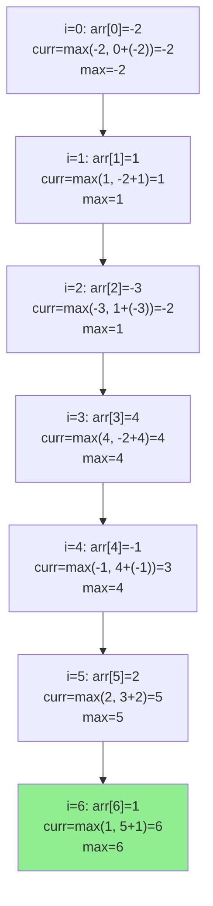

# Maximum Subarray Sum (Kadane's Algorithm)

| Property | Value |
|----------|-------|
| Category | Dynamic Programming |
| Subcategory | Array Optimization |
| Complexity (Time) | O(n) |
| Complexity (Space) | O(1) |
| Input | Array of numbers |
| Output | Maximum contiguous sum |

## Overview

The **Maximum Subarray Sum** problem finds the contiguous subarray within a one-dimensional array that has the largest sum. **Kadane's Algorithm** solves this elegantly in linear time with constant space.

This is one of the most elegant DP solutions, demonstrating how a complex problem can have a simple, optimal solution.

## Mathematical Foundation

### Problem Definition

Given array $A = [a_1, a_2, ..., a_n]$, find indices $i$ and $j$ such that:

$$\max_{1 \leq i \leq j \leq n} \sum_{k=i}^{j} a_k$$

### Recurrence Relation

Let $dp[i]$ = maximum subarray sum ending at index $i$:

$$dp[i] = \max(a_i, dp[i-1] + a_i)$$

At each position, we either:
- Start a new subarray at $a_i$
- Extend the previous subarray by adding $a_i$

### Global Maximum

$$\text{answer} = \max_{1 \leq i \leq n} dp[i]$$

### Key Insight

If $dp[i-1] < 0$, it's better to start fresh at $a_i$ because adding a negative sum will only decrease the total.

## Algorithm Approaches

### 1. Brute Force (O(n³))

```
MAX-SUBARRAY-BRUTE(arr):
    n = length(arr)
    max_sum = -infinity
    
    for i from 0 to n-1:
        for j from i to n-1:
            current_sum = 0
            for k from i to j:
                current_sum = current_sum + arr[k]
            max_sum = max(max_sum, current_sum)
    
    return max_sum
```

### 2. Optimized Brute Force (O(n²))

```
MAX-SUBARRAY-N2(arr):
    n = length(arr)
    max_sum = -infinity
    
    for i from 0 to n-1:
        current_sum = 0
        for j from i to n-1:
            current_sum = current_sum + arr[j]
            max_sum = max(max_sum, current_sum)
    
    return max_sum
```

### 3. Kadane's Algorithm (O(n))

```
KADANE(arr):
    n = length(arr)
    max_sum = -infinity
    current_sum = 0
    
    for i from 0 to n-1:
        current_sum = max(arr[i], current_sum + arr[i])
        max_sum = max(max_sum, current_sum)
    
    return max_sum
```

### 4. With Subarray Indices

```
KADANE-WITH-INDICES(arr):
    n = length(arr)
    max_sum = -infinity
    current_sum = 0
    
    start = 0
    end = 0
    temp_start = 0
    
    for i from 0 to n-1:
        if current_sum < 0:
            current_sum = arr[i]
            temp_start = i
        else:
            current_sum = current_sum + arr[i]
        
        if current_sum > max_sum:
            max_sum = current_sum
            start = temp_start
            end = i
    
    return max_sum, start, end
```

### 5. Handling Empty Subarrays

```
KADANE-ALLOW-EMPTY(arr):
    max_sum = 0  // Empty subarray has sum 0
    current_sum = 0
    
    for num in arr:
        current_sum = max(0, current_sum + num)
        max_sum = max(max_sum, current_sum)
    
    return max_sum
```

## Complexity Analysis

| Approach | Time | Space | Notes |
|----------|------|-------|-------|
| Brute Force | O(n³) | O(1) | Three nested loops |
| Optimized | O(n²) | O(1) | Two nested loops |
| Kadane's | O(n) | O(1) | Optimal |
| Divide & Conquer | O(n log n) | O(log n) | Alternative approach |

## Visual Representation

### Kadane's Algorithm Trace

```
Array: [-2, 1, -3, 4, -1, 2, 1, -5, 4]

Index:    0    1    2    3    4    5    6    7    8
Value:   -2    1   -3    4   -1    2    1   -5    4

current:  -2    1   -2    4    3    5    6    1    5
          ↑    ↑         ↑                   ↑
        start start   start               dropped
        
max_sum: -2    1    1    4    4    5    6    6    6

                          └──────────────┘
                          Maximum subarray: [4, -1, 2, 1]
                          Sum: 6
```

### Decision at Each Step



### State Transition

```
For each element arr[i]:

    Previous state: current_sum from arr[0..i-1]
    
    Choice 1: Start new subarray
    ┌─────────────────────────────────┐
    │  new_current = arr[i]           │
    │  (Discard previous, start fresh)│
    └─────────────────────────────────┘
    
    Choice 2: Extend current subarray
    ┌─────────────────────────────────┐
    │  new_current = current + arr[i] │
    │  (Add arr[i] to existing sum)   │
    └─────────────────────────────────┘
    
    Decision: current_sum = max(Choice 1, Choice 2)
```

## Implementation (from repository)

```python
from collections.abc import Sequence


def max_subarray_sum(
    arr: Sequence[float], 
    allow_empty_subarrays: bool = False
) -> float:
    """
    Solves the maximum subarray sum problem using Kadane's algorithm.
    
    Args:
        arr: the given array of numbers
        allow_empty_subarrays: if True, considers empty subarrays (sum=0)

    Returns:
        Maximum contiguous subarray sum

    >>> max_subarray_sum([2, 8, 9])
    19
    >>> max_subarray_sum([0, 0])
    0
    >>> max_subarray_sum([-1.0, 0.0, 1.0])
    1.0
    >>> max_subarray_sum([1, 2, 3, 4, -2])
    10
    >>> max_subarray_sum([-2, 1, -3, 4, -1, 2, 1, -5, 4])
    6
    >>> max_subarray_sum([2, 3, -9, 8, -2])
    8
    >>> max_subarray_sum([-2, -3, -1, -4, -6])
    -1
    >>> max_subarray_sum([-2, -3, -1, -4, -6], allow_empty_subarrays=True)
    0
    >>> max_subarray_sum([])
    0
    """
    if not arr:
        return 0

    max_sum = 0 if allow_empty_subarrays else float("-inf")
    curr_sum = 0.0
    
    for num in arr:
        curr_sum = max(0 if allow_empty_subarrays else num, curr_sum + num)
        max_sum = max(max_sum, curr_sum)

    return max_sum
```

## Real-World Applications

### 1. Stock Trading - Maximum Profit Period

```python
from typing import List, Tuple

def max_profit_period(prices: List[float]) -> Tuple[float, int, int]:
    """
    Find the period with maximum cumulative profit.
    
    Uses daily changes and Kadane's algorithm.
    
    >>> prices = [100, 113, 110, 85, 105, 102, 86, 63, 81, 101, 94, 106, 101]
    >>> profit, start, end = max_profit_period(prices)
    >>> profit > 0
    True
    """
    if len(prices) < 2:
        return 0, 0, 0
    
    # Calculate daily changes
    changes = [prices[i] - prices[i-1] for i in range(1, len(prices))]
    
    # Apply Kadane's with indices
    max_profit = float('-inf')
    current_profit = 0
    start = end = temp_start = 0
    
    for i, change in enumerate(changes):
        if current_profit < 0:
            current_profit = change
            temp_start = i
        else:
            current_profit += change
        
        if current_profit > max_profit:
            max_profit = current_profit
            start = temp_start
            end = i + 1  # +1 because changes array is offset
    
    return max_profit, start, end + 1


def find_best_trading_window(
    prices: List[float],
    window_size: int
) -> Tuple[float, int]:
    """
    Find best fixed-size trading window.
    
    >>> prices = [10, 12, 8, 15, 13, 20, 18]
    >>> profit, start = find_best_trading_window(prices, 3)
    >>> profit > 0
    True
    """
    if len(prices) < window_size:
        return 0, 0
    
    changes = [prices[i] - prices[i-1] for i in range(1, len(prices))]
    
    # Sliding window sum
    window_sum = sum(changes[:window_size-1])
    max_profit = window_sum
    best_start = 0
    
    for i in range(window_size - 1, len(changes)):
        window_sum += changes[i]
        if i >= window_size:
            window_sum -= changes[i - window_size + 1]
        
        if window_sum > max_profit:
            max_profit = window_sum
            best_start = i - window_size + 2
    
    return max_profit, best_start
```

### 2. Image Processing - Brightest Region

```python
from typing import List, Tuple
import numpy as np

def find_brightest_row_segment(
    image_row: List[int],
    threshold: int = 128
) -> Tuple[int, int, int]:
    """
    Find the brightest contiguous segment in an image row.
    
    Brightness relative to threshold (positive = bright, negative = dark).
    
    >>> row = [100, 200, 220, 180, 50, 30, 150, 190]
    >>> brightness, start, end = find_brightest_row_segment(row, 128)
    >>> start <= end
    True
    """
    # Convert to brightness relative to threshold
    relative = [pixel - threshold for pixel in image_row]
    
    # Apply Kadane's
    max_brightness = float('-inf')
    current = 0
    start = end = temp_start = 0
    
    for i, val in enumerate(relative):
        if current < 0:
            current = val
            temp_start = i
        else:
            current += val
        
        if current > max_brightness:
            max_brightness = current
            start = temp_start
            end = i
    
    return max_brightness, start, end


def find_brightest_region_2d(
    image: List[List[int]],
    threshold: int = 128
) -> Tuple[int, Tuple[int, int, int, int]]:
    """
    Find brightest rectangular region using 2D Kadane's.
    
    Returns (brightness, (top, left, bottom, right)).
    
    >>> image = [
    ...     [100, 150, 200],
    ...     [180, 220, 190],
    ...     [50, 80, 60]
    ... ]
    >>> brightness, region = find_brightest_region_2d(image)
    >>> brightness > 0
    True
    """
    if not image or not image[0]:
        return 0, (0, 0, 0, 0)
    
    rows, cols = len(image), len(image[0])
    max_brightness = float('-inf')
    best_region = (0, 0, 0, 0)
    
    for left in range(cols):
        # Accumulate columns from left to right
        row_sums = [0] * rows
        
        for right in range(left, cols):
            # Add current column to row sums
            for i in range(rows):
                row_sums[i] += image[i][right] - threshold
            
            # Apply 1D Kadane's on row_sums
            current = 0
            temp_top = 0
            
            for bottom in range(rows):
                if current < 0:
                    current = row_sums[bottom]
                    temp_top = bottom
                else:
                    current += row_sums[bottom]
                
                if current > max_brightness:
                    max_brightness = current
                    best_region = (temp_top, left, bottom, right)
    
    return max_brightness, best_region
```

### 3. Network Traffic Analysis

```python
from typing import List, Tuple
from datetime import datetime

def find_peak_traffic_period(
    timestamps: List[datetime],
    traffic_deltas: List[float]
) -> Tuple[float, datetime, datetime]:
    """
    Find period with maximum cumulative traffic increase.
    
    >>> from datetime import datetime
    >>> times = [datetime(2024, 1, 1, i) for i in range(10)]
    >>> deltas = [10, -5, 20, 15, -30, 25, 10, -5, -10, 5]
    >>> total, start, end = find_peak_traffic_period(times, deltas)
    >>> total
    35
    """
    max_traffic = float('-inf')
    current = 0
    start_idx = end_idx = temp_start = 0
    
    for i, delta in enumerate(traffic_deltas):
        if current < 0:
            current = delta
            temp_start = i
        else:
            current += delta
        
        if current > max_traffic:
            max_traffic = current
            start_idx = temp_start
            end_idx = i
    
    return max_traffic, timestamps[start_idx], timestamps[end_idx]


def analyze_bandwidth_usage(
    measurements: List[float],
    baseline: float
) -> dict:
    """
    Analyze bandwidth usage patterns.
    
    >>> measurements = [80, 120, 150, 90, 70, 110, 130, 85]
    >>> result = analyze_bandwidth_usage(measurements, 100)
    >>> 'max_surge' in result
    True
    """
    # Relative to baseline
    relative = [m - baseline for m in measurements]
    
    # Find maximum surge (positive)
    max_surge = max_surge_sum = 0
    for val in relative:
        max_surge_sum = max(0, max_surge_sum + val)
        max_surge = max(max_surge, max_surge_sum)
    
    # Find maximum dip (negative) - negate and apply Kadane
    max_dip = max_dip_sum = 0
    for val in relative:
        max_dip_sum = max(0, max_dip_sum - val)  # Negate
        max_dip = max(max_dip, max_dip_sum)
    
    return {
        'max_surge': max_surge,
        'max_dip': max_dip,
        'average': sum(measurements) / len(measurements),
        'baseline': baseline
    }
```

### 4. Financial Analysis - Cumulative Returns

```python
from typing import List, Dict

def analyze_returns(daily_returns: List[float]) -> Dict:
    """
    Analyze investment returns using Kadane's algorithm.
    
    >>> returns = [0.02, -0.01, 0.03, 0.015, -0.02, 0.01, 0.025, -0.005]
    >>> result = analyze_returns(returns)
    >>> result['best_period_return'] > 0
    True
    """
    # Find best consecutive period
    max_return = current = 0
    best_start = best_end = temp_start = 0
    
    for i, r in enumerate(daily_returns):
        if current < 0:
            current = r
            temp_start = i
        else:
            current += r
        
        if current > max_return:
            max_return = current
            best_start = temp_start
            best_end = i
    
    # Find worst consecutive period (negate returns)
    min_return = current = 0
    worst_start = worst_end = temp_start = 0
    
    for i, r in enumerate(daily_returns):
        if current > 0:
            current = -r
            temp_start = i
        else:
            current -= r
        
        if current > min_return:
            min_return = current
            worst_start = temp_start
            worst_end = i
    
    return {
        'best_period_return': max_return,
        'best_period': (best_start, best_end),
        'worst_period_return': -min_return,
        'worst_period': (worst_start, worst_end),
        'total_return': sum(daily_returns),
        'num_positive_days': sum(1 for r in daily_returns if r > 0)
    }
```

## Variations

### Maximum Circular Subarray Sum

```python
def max_circular_subarray_sum(arr: List[int]) -> int:
    """
    Maximum subarray sum in a circular array.
    
    >>> max_circular_subarray_sum([5, -3, 5])
    10
    >>> max_circular_subarray_sum([-3, -2, -1])
    -1
    """
    n = len(arr)
    if n == 0:
        return 0
    
    # Case 1: Max subarray is not circular (standard Kadane)
    max_kadane = current = arr[0]
    for i in range(1, n):
        current = max(arr[i], current + arr[i])
        max_kadane = max(max_kadane, current)
    
    # Case 2: Max subarray is circular
    # Total sum - minimum subarray sum
    total_sum = sum(arr)
    
    # Find minimum subarray
    min_kadane = current = arr[0]
    for i in range(1, n):
        current = min(arr[i], current + arr[i])
        min_kadane = min(min_kadane, current)
    
    # If all elements are negative, return max_kadane
    if min_kadane == total_sum:
        return max_kadane
    
    return max(max_kadane, total_sum - min_kadane)
```

### Maximum Product Subarray

```python
def max_product_subarray(arr: List[int]) -> int:
    """
    Maximum product of contiguous subarray.
    
    >>> max_product_subarray([2, 3, -2, 4])
    6
    >>> max_product_subarray([-2, 0, -1])
    0
    """
    if not arr:
        return 0
    
    max_prod = min_prod = result = arr[0]
    
    for i in range(1, len(arr)):
        if arr[i] < 0:
            max_prod, min_prod = min_prod, max_prod
        
        max_prod = max(arr[i], max_prod * arr[i])
        min_prod = min(arr[i], min_prod * arr[i])
        
        result = max(result, max_prod)
    
    return result
```

## Common Pitfalls

1. **All negative numbers**: Standard Kadane returns max single element
2. **Empty subarrays**: Decide if sum=0 is valid answer
3. **Integer overflow**: Watch for large sums
4. **Resetting current_sum**: Reset when negative, not zero

## References

- [Maximum Subarray - Wikipedia](https://en.wikipedia.org/wiki/Maximum_subarray_problem)
- [Kadane's Algorithm - GeeksforGeeks](https://www.geeksforgeeks.org/largest-sum-contiguous-subarray/)
- Bentley, J. (1984). Programming Pearls

## See Also

- [Maximum Product Subarray](max_product_subarray.md) - Product variant
- [Best Time to Buy and Sell Stock](stock_profit.md) - Related problem
- [Longest Increasing Subsequence](longest_increasing_subsequence.md) - Subsequence problem
