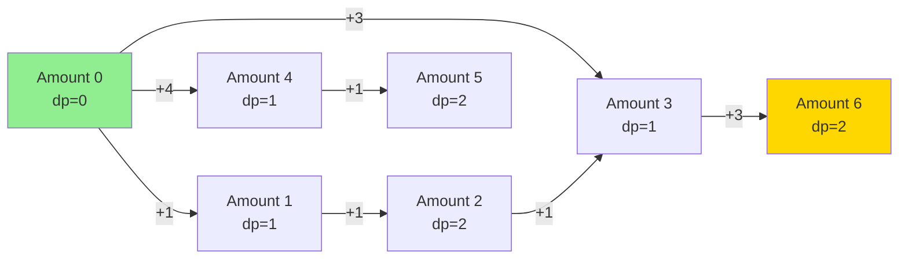

# Coin Change (Minimum Coins / Count Ways)

| Property | Value |
|----------|-------|
| Category | Dynamic Programming |
| Subcategory | Combinatorics / Optimization |
| Complexity (Time) | O(n × amount) |
| Complexity (Space) | O(amount) |
| Input | Coin denominations, target amount |
| Output | Count of ways / Minimum coins |

## Overview

The **Coin Change** problem has two common variants:
1. **Count Ways**: Count the number of distinct ways to make change for an amount
2. **Minimum Coins**: Find the minimum number of coins needed

This is a classic unbounded knapsack problem where each coin can be used unlimited times. It's widely used in currency systems, resource allocation, and optimization.

## Mathematical Foundation

### Problem Definition

Given:
- Set of coin denominations $C = \{c_1, c_2, ..., c_n\}$
- Target amount $A$

**Variant 1 - Count Ways:**
Find the number of combinations to make amount $A$.

**Variant 2 - Minimum Coins:**
Find minimum number of coins to make amount $A$.

### Recurrence Relations

**Count Ways** - Let $dp[i]$ = number of ways to make amount $i$:

$$dp[i] = \sum_{j: c_j \leq i} dp[i - c_j]$$

Base case: $dp[0] = 1$ (one way to make 0: use no coins)

**Minimum Coins** - Let $dp[i]$ = minimum coins for amount $i$:

$$dp[i] = \min_{j: c_j \leq i} \{dp[i - c_j] + 1\}$$

Base case: $dp[0] = 0$, $dp[i] = \infty$ for $i > 0$ initially

### Counting Combinations vs Permutations

- **Combinations**: Order doesn't matter (1+2 = 2+1)
  - Process coins in outer loop, amounts in inner loop
- **Permutations**: Order matters (1+2 ≠ 2+1)
  - Process amounts in outer loop, coins in inner loop

## Algorithm Approaches

### 1. Count Ways (Combinations)

```
COIN-CHANGE-COUNT(coins, amount):
    n = length(coins)
    
    // dp[i] = number of ways to make amount i
    dp = array of size (amount + 1), initialized to 0
    dp[0] = 1  // One way to make 0
    
    // Process each coin
    for coin in coins:
        for i from coin to amount:
            dp[i] = dp[i] + dp[i - coin]
    
    return dp[amount]
```

### 2. Count Permutations

```
COIN-CHANGE-PERMUTATIONS(coins, amount):
    dp = array of size (amount + 1), initialized to 0
    dp[0] = 1
    
    // Process each amount
    for i from 1 to amount:
        for coin in coins:
            if coin <= i:
                dp[i] = dp[i] + dp[i - coin]
    
    return dp[amount]
```

### 3. Minimum Coins

```
COIN-CHANGE-MIN(coins, amount):
    // dp[i] = minimum coins needed for amount i
    dp = array of size (amount + 1), initialized to infinity
    dp[0] = 0
    
    for i from 1 to amount:
        for coin in coins:
            if coin <= i and dp[i - coin] != infinity:
                dp[i] = min(dp[i], dp[i - coin] + 1)
    
    if dp[amount] == infinity:
        return -1  // Not possible
    return dp[amount]
```

### 4. Minimum Coins with Reconstruction

```
COIN-CHANGE-WITH-COINS(coins, amount):
    dp = array of size (amount + 1), initialized to infinity
    parent = array of size (amount + 1), initialized to -1
    dp[0] = 0
    
    for i from 1 to amount:
        for coin in coins:
            if coin <= i and dp[i - coin] + 1 < dp[i]:
                dp[i] = dp[i - coin] + 1
                parent[i] = coin  // Track which coin was used
    
    if dp[amount] == infinity:
        return -1, []
    
    // Reconstruct coins used
    used_coins = []
    curr = amount
    while curr > 0:
        used_coins.append(parent[curr])
        curr = curr - parent[curr]
    
    return dp[amount], used_coins
```

## Complexity Analysis

| Variant | Time | Space | Notes |
|---------|------|-------|-------|
| Count Ways | O(n × amount) | O(amount) | n = number of coins |
| Count Permutations | O(amount × n) | O(amount) | Same complexity |
| Minimum Coins | O(n × amount) | O(amount) | |
| With Reconstruction | O(n × amount) | O(amount) | Track parent |

## Visual Representation

### Count Ways Example

```
Coins = [1, 2, 5]
Amount = 5

Processing coin 1:
dp: [1, 1, 1, 1, 1, 1]
    (1 way to make each amount using only 1s)

Processing coin 2:
dp: [1, 1, 2, 2, 3, 3]
    Amount 2: 1+1 or 2 → 2 ways
    Amount 3: 1+1+1 or 1+2 → 2 ways
    Amount 4: 1+1+1+1 or 1+1+2 or 2+2 → 3 ways

Processing coin 5:
dp: [1, 1, 2, 2, 3, 4]
    Amount 5: 3 ways from before + 1 (just 5) → 4 ways

Answer: 4 ways
Ways: {1+1+1+1+1, 1+1+1+2, 1+2+2, 5}
```

### Minimum Coins Example

```
Coins = [1, 3, 4]
Amount = 6

  Amount:  0   1   2   3   4   5   6
  dp:     [0   1   2   1   1   2   2]

Calculation:
- dp[1] = dp[0] + 1 = 1 (use coin 1)
- dp[2] = dp[1] + 1 = 2 (use coin 1)
- dp[3] = min(dp[2]+1, dp[0]+1) = 1 (use coin 3)
- dp[4] = min(dp[3]+1, dp[1]+1, dp[0]+1) = 1 (use coin 4)
- dp[5] = min(dp[4]+1, dp[2]+1) = 2 (use coins 1+4 or 3+2)
- dp[6] = min(dp[5]+1, dp[3]+1, dp[2]+1) = 2 (use coins 3+3)

Answer: 2 coins (3 + 3)
```

### State Transition Diagram



## Implementation (from repository)

```python
def dp_count(s: list, n: int) -> int:
    """
    Count the number of ways to make change for amount n using coins s.
    
    This counts combinations (order doesn't matter).
    
    Args:
        s: List of coin denominations (sorted ascending)
        n: Target amount
    
    Returns:
        Number of ways to make change for amount n
    
    >>> dp_count([1, 2, 3], 4)
    4
    >>> dp_count([2, 5, 3, 6], 10)
    5
    >>> dp_count([1, 2, 5], 5)
    4
    >>> dp_count([1, 5, 10, 25], 63)
    424
    """
    # dp[i] represents number of ways to get amount i
    dp = [0] * (n + 1)
    dp[0] = 1  # One way to make 0: use no coins
    
    # Process each coin denomination
    for coin in s:
        for amount in range(coin, n + 1):
            dp[amount] += dp[amount - coin]
    
    return dp[n]
```

## Real-World Applications

### 1. Currency System - Change Making

```python
from typing import List, Tuple, Dict

def make_change(amount: int, 
                denominations: List[int] = None) -> Dict:
    """
    Make change for a given amount with US coin denominations.
    
    Returns breakdown of coins used.
    
    >>> result = make_change(87)
    >>> result['total_coins']
    6
    >>> result['breakdown']['quarters']
    3
    """
    if denominations is None:
        denominations = [25, 10, 5, 1]  # quarters, dimes, nickels, pennies
    
    n = len(denominations)
    
    # dp[i] = (min_coins, last_coin_used)
    dp = [(float('inf'), -1) for _ in range(amount + 1)]
    dp[0] = (0, -1)
    
    for i in range(1, amount + 1):
        for j, coin in enumerate(denominations):
            if coin <= i and dp[i - coin][0] + 1 < dp[i][0]:
                dp[i] = (dp[i - coin][0] + 1, j)
    
    # Reconstruct
    coin_names = ['quarters', 'dimes', 'nickels', 'pennies']
    breakdown = {name: 0 for name in coin_names}
    
    curr = amount
    while curr > 0:
        coin_idx = dp[curr][1]
        breakdown[coin_names[coin_idx]] += 1
        curr -= denominations[coin_idx]
    
    return {
        'amount': amount,
        'total_coins': dp[amount][0],
        'breakdown': breakdown
    }


def calculate_cash_drawer(sales: List[int], 
                         payments: List[int]) -> Dict:
    """
    Calculate required coins in cash drawer for a day's transactions.
    
    >>> sales = [299, 450, 175]
    >>> payments = [300, 500, 200]
    >>> result = calculate_cash_drawer(sales, payments)
    >>> result['total_change_needed']
    76
    """
    total_change = sum(p - s for s, p in zip(sales, payments))
    
    change_details = make_change(total_change)
    
    return {
        'total_change_needed': total_change,
        'coin_breakdown': change_details['breakdown'],
        'total_coins': change_details['total_coins']
    }
```

### 2. Payment Processing - Split Payments

```python
from typing import List, Tuple

def find_payment_combinations(
    amount: int,
    payment_methods: List[Tuple[str, int]]
) -> List[List[Tuple[str, int]]]:
    """
    Find all ways to split a payment across methods.
    
    Each method has a (name, unit) where unit is the denomination.
    
    >>> methods = [("Credit", 100), ("Cash", 50), ("Points", 10)]
    >>> combos = find_payment_combinations(200, methods)
    >>> len(combos) > 0
    True
    """
    units = [m[1] for m in payment_methods]
    n = len(units)
    
    # Use backtracking to find all combinations
    all_combinations = []
    
    def backtrack(remaining: int, start: int, current: List[Tuple[str, int]]):
        if remaining == 0:
            all_combinations.append(current.copy())
            return
        if remaining < 0:
            return
        
        for i in range(start, n):
            name, unit = payment_methods[i]
            if unit <= remaining:
                current.append((name, unit))
                backtrack(remaining - unit, i, current)
                current.pop()
    
    backtrack(amount, 0, [])
    return all_combinations


def optimize_transaction_fees(
    amount: int,
    methods: List[Tuple[str, int, float]]  # (name, max_amount, fee_percent)
) -> Dict:
    """
    Minimize fees when paying across multiple payment methods.
    
    >>> methods = [
    ...     ("Credit", 1000, 2.5),
    ...     ("Debit", 500, 1.0),
    ...     ("Cash", float('inf'), 0)
    ... ]
    >>> result = optimize_transaction_fees(750, methods)
    >>> result['total_fee'] < 20
    True
    """
    # Sort by fee percentage
    sorted_methods = sorted(methods, key=lambda x: x[2])
    
    allocation = {}
    remaining = amount
    total_fee = 0
    
    for name, max_amt, fee_pct in sorted_methods:
        if remaining <= 0:
            break
        
        use_amount = min(remaining, max_amt)
        allocation[name] = use_amount
        total_fee += use_amount * (fee_pct / 100)
        remaining -= use_amount
    
    return {
        'amount': amount,
        'allocation': allocation,
        'total_fee': round(total_fee, 2)
    }
```

### 3. Resource Allocation

```python
from typing import List, Dict

def allocate_compute_units(
    required_capacity: int,
    instance_types: List[Tuple[str, int, float]]  # (type, capacity, cost)
) -> Dict:
    """
    Allocate cloud compute instances to meet capacity requirement.
    
    >>> instances = [
    ...     ("small", 2, 0.10),
    ...     ("medium", 4, 0.18),
    ...     ("large", 8, 0.32)
    ... ]
    >>> result = allocate_compute_units(20, instances)
    >>> result['total_capacity'] >= 20
    True
    """
    capacities = [i[1] for i in instance_types]
    costs = [i[2] for i in instance_types]
    n = len(instance_types)
    
    # dp[i] = (min_cost, list of instance indices)
    dp = [(float('inf'), []) for _ in range(required_capacity + 1)]
    dp[0] = (0, [])
    
    for cap in range(1, required_capacity + 1):
        for i in range(n):
            if capacities[i] <= cap:
                prev_cost, prev_instances = dp[cap - capacities[i]]
                new_cost = prev_cost + costs[i]
                if new_cost < dp[cap][0]:
                    dp[cap] = (new_cost, prev_instances + [i])
    
    # Also check if we can overprovision cheaper
    min_cost, best_allocation = dp[required_capacity]
    
    for overage in range(1, max(capacities) + 1):
        if required_capacity + overage <= len(dp) - 1:
            cost, alloc = dp[required_capacity + overage]
            if cost < min_cost:
                min_cost = cost
                best_allocation = alloc
    
    # Count instances
    allocation_count = {}
    for idx in best_allocation:
        name = instance_types[idx][0]
        allocation_count[name] = allocation_count.get(name, 0) + 1
    
    total_capacity = sum(capacities[i] for i in best_allocation)
    
    return {
        'allocation': allocation_count,
        'total_capacity': total_capacity,
        'total_cost': round(min_cost, 2)
    }
```

### 4. Vending Machine Logic

```python
from typing import List, Tuple, Optional

class VendingMachine:
    """
    Vending machine with optimal change dispensing.
    """
    
    def __init__(self, coin_inventory: Dict[int, int]):
        """
        Initialize with coin inventory.
        
        >>> vm = VendingMachine({100: 10, 25: 20, 10: 30, 5: 40, 1: 50})
        """
        self.inventory = coin_inventory
        self.denominations = sorted(coin_inventory.keys(), reverse=True)
    
    def dispense_change(self, amount: int) -> Optional[Dict[int, int]]:
        """
        Dispense optimal change considering inventory.
        
        >>> vm = VendingMachine({25: 5, 10: 5, 5: 5, 1: 10})
        >>> change = vm.dispense_change(67)
        >>> sum(k * v for k, v in change.items()) if change else 0
        67
        """
        # Use DP with inventory constraints
        # dp[i] = (min_coins, coins_used_dict) or None if impossible
        dp = [None] * (amount + 1)
        dp[0] = {}
        
        for i in range(1, amount + 1):
            best = None
            
            for coin in self.denominations:
                if coin > i:
                    continue
                
                prev = dp[i - coin]
                if prev is None:
                    continue
                
                # Check inventory constraint
                used = prev.get(coin, 0)
                if used >= self.inventory.get(coin, 0):
                    continue
                
                new_coins = prev.copy()
                new_coins[coin] = used + 1
                total = sum(new_coins.values())
                
                if best is None or total < sum(best.values()):
                    best = new_coins
            
            dp[i] = best
        
        result = dp[amount]
        
        # Update inventory
        if result:
            for coin, count in result.items():
                self.inventory[coin] -= count
        
        return result
    
    def can_make_change(self, amount: int) -> bool:
        """Check if change can be made without actually dispensing."""
        # Save inventory
        saved = self.inventory.copy()
        result = self.dispense_change(amount)
        # Restore inventory
        self.inventory = saved
        return result is not None
```

## Variations

### Bounded Coin Change (Limited Quantities)

```python
def bounded_coin_change(coins: List[int], 
                       counts: List[int], 
                       amount: int) -> int:
    """
    Minimum coins when each denomination has limited quantity.
    
    >>> bounded_coin_change([1, 2, 5], [5, 3, 2], 11)
    3
    """
    dp = [float('inf')] * (amount + 1)
    dp[0] = 0
    
    for coin, count in zip(coins, counts):
        # Process in reverse to handle bounded quantities
        for i in range(amount, coin - 1, -1):
            for k in range(1, min(count, i // coin) + 1):
                if dp[i - k * coin] != float('inf'):
                    dp[i] = min(dp[i], dp[i - k * coin] + k)
    
    return dp[amount] if dp[amount] != float('inf') else -1
```

### Coin Change with K Coins Exactly

```python
def coin_change_k_coins(coins: List[int], amount: int, k: int) -> bool:
    """
    Check if amount can be made with exactly k coins.
    
    >>> coin_change_k_coins([1, 2, 5], 11, 3)
    True
    """
    # dp[i][j] = can make amount i with exactly j coins
    dp = [[False] * (k + 1) for _ in range(amount + 1)]
    dp[0][0] = True
    
    for i in range(1, amount + 1):
        for j in range(1, k + 1):
            for coin in coins:
                if coin <= i and dp[i - coin][j - 1]:
                    dp[i][j] = True
                    break
    
    return dp[amount][k]
```

## Common Pitfalls

1. **Combinations vs Permutations**: Loop order matters!
2. **Base case**: dp[0] = 1 for counting, dp[0] = 0 for minimum
3. **Impossible cases**: Handle infinity/impossible properly
4. **Integer overflow**: Use appropriate data types for large amounts

## References

- [Coin Change - Wikipedia](https://en.wikipedia.org/wiki/Change-making_problem)
- [Unbounded Knapsack](https://en.wikipedia.org/wiki/Knapsack_problem#Unbounded_knapsack_problem)
- [Dynamic Programming - GeeksforGeeks](https://www.geeksforgeeks.org/coin-change-dp-7/)

## See Also

- [Knapsack](knapsack.md) - Bounded selection problem
- [Subset Sum](sum_of_subset.md) - Binary selection
- [Rod Cutting](rod_cutting.md) - Similar unbounded structure
