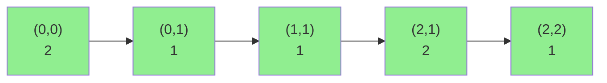

# Minimum Cost Path

| Property | Value |
|----------|-------|
| Category | Dynamic Programming |
| Subcategory | Grid / Path |
| Complexity (Time) | O(m × n) |
| Complexity (Space) | O(1) in-place or O(m × n) |
| Input | 2D matrix with costs |
| Output | Minimum path cost from top-left to bottom-right |

## Overview

The **Minimum Cost Path** problem finds the path from the top-left corner to the bottom-right corner of a matrix that minimizes the total cost. Movement is restricted to right or down directions only.

## Mathematical Foundation

### Problem Definition

Given matrix $M$ of size $m \times n$:

Find path from $(0,0)$ to $(m-1, n-1)$ minimizing:

$$\text{cost} = \sum_{(i,j) \in \text{path}} M[i][j]$$

### Recurrence Relation

Let $dp[i][j]$ = minimum cost to reach cell $(i, j)$:

$$dp[i][j] = M[i][j] + \min(dp[i-1][j], dp[i][j-1])$$

**Base cases**:
- $dp[0][0] = M[0][0]$
- $dp[0][j] = dp[0][j-1] + M[0][j]$ (first row)
- $dp[i][0] = dp[i-1][0] + M[i][0]$ (first column)

## Algorithm

```
MINIMUM-COST-PATH(matrix):
    m = rows(matrix)
    n = cols(matrix)
    
    // Preprocess first row
    for j from 1 to n-1:
        matrix[0][j] += matrix[0][j-1]
    
    // Preprocess first column
    for i from 1 to m-1:
        matrix[i][0] += matrix[i-1][0]
    
    // Fill rest of matrix
    for i from 1 to m-1:
        for j from 1 to n-1:
            matrix[i][j] += min(matrix[i-1][j], matrix[i][j-1])
    
    return matrix[m-1][n-1]
```

## Visual Representation

### Example

```
Original:        After DP:
[2, 1, 4]       [2, 3, 7]
[2, 1, 3]   →   [4, 4, 7]
[3, 2, 1]       [7, 6, 7]

Minimum path: 2→1→1→2→1 = 7
Path: (0,0)→(0,1)→(1,1)→(2,1)→(2,2)
```

### Grid Visualization



## Implementation (from repository)

```python
def minimum_cost_path(matrix: list[list[int]]) -> int:
    """
    Find the minimum cost traced by all possible paths from top left to bottom right in
    a given matrix

    >>> minimum_cost_path([[2, 1], [3, 1], [4, 2]])
    6

    >>> minimum_cost_path([[2, 1, 4], [2, 1, 3], [3, 2, 1]])
    7
    """

    # preprocessing the first row
    for i in range(1, len(matrix[0])):
        matrix[0][i] += matrix[0][i - 1]

    # preprocessing the first column
    for i in range(1, len(matrix)):
        matrix[i][0] += matrix[i - 1][0]

    # updating the path cost for current position
    for i in range(1, len(matrix)):
        for j in range(1, len(matrix[0])):
            matrix[i][j] += min(matrix[i - 1][j], matrix[i][j - 1])

    return matrix[-1][-1]
```

## Real-World Applications

### 1. Route Planning

```python
def optimal_delivery_route(
    city_grid: list[list[int]]
) -> dict:
    """
    Find minimum fuel cost route through city grid.
    
    >>> grid = [[1, 2, 3], [4, 5, 6], [7, 8, 9]]
    >>> result = optimal_delivery_route(grid)
    >>> result['min_cost'] == 21
    True
    """
    import copy
    matrix = copy.deepcopy(city_grid)
    
    m, n = len(matrix), len(matrix[0])
    
    for j in range(1, n):
        matrix[0][j] += matrix[0][j-1]
    for i in range(1, m):
        matrix[i][0] += matrix[i-1][0]
    
    for i in range(1, m):
        for j in range(1, n):
            matrix[i][j] += min(matrix[i-1][j], matrix[i][j-1])
    
    # Reconstruct path
    path = [(m-1, n-1)]
    i, j = m-1, n-1
    while i > 0 or j > 0:
        if i == 0:
            j -= 1
        elif j == 0:
            i -= 1
        elif matrix[i-1][j] < matrix[i][j-1]:
            i -= 1
        else:
            j -= 1
        path.append((i, j))
    
    return {
        'min_cost': matrix[m-1][n-1],
        'path': list(reversed(path))
    }
```

### 2. Image Processing (Seam Carving)

```python
def find_minimum_energy_seam(
    energy_map: list[list[int]]
) -> list[int]:
    """
    Find minimum energy vertical seam for content-aware resizing.
    
    >>> energy = [[1, 4, 3], [5, 2, 6], [3, 1, 2]]
    >>> seam = find_minimum_energy_seam(energy)
    >>> len(seam) == 3
    True
    """
    import copy
    m, n = len(energy_map), len(energy_map[0])
    dp = copy.deepcopy(energy_map)
    
    # Fill DP - can move down-left, down, down-right
    for i in range(1, m):
        for j in range(n):
            candidates = [dp[i-1][j]]
            if j > 0:
                candidates.append(dp[i-1][j-1])
            if j < n-1:
                candidates.append(dp[i-1][j+1])
            dp[i][j] += min(candidates)
    
    # Find minimum in last row
    min_j = min(range(n), key=lambda j: dp[m-1][j])
    
    # Backtrack to find seam
    seam = [min_j]
    for i in range(m-1, 0, -1):
        j = seam[-1]
        candidates = [(dp[i-1][j], j)]
        if j > 0:
            candidates.append((dp[i-1][j-1], j-1))
        if j < n-1:
            candidates.append((dp[i-1][j+1], j+1))
        seam.append(min(candidates)[1])
    
    return list(reversed(seam))
```

## Variations

- **All 4 directions**: Use BFS/Dijkstra instead
- **Diagonal movement**: Add $dp[i-1][j-1]$ to min
- **Path reconstruction**: Track parent cells

## See Also

- [Unique Paths](unique_paths.md) - Count paths instead of minimize
- [Triangle Minimum Path](triangle.md) - Triangular grid version
