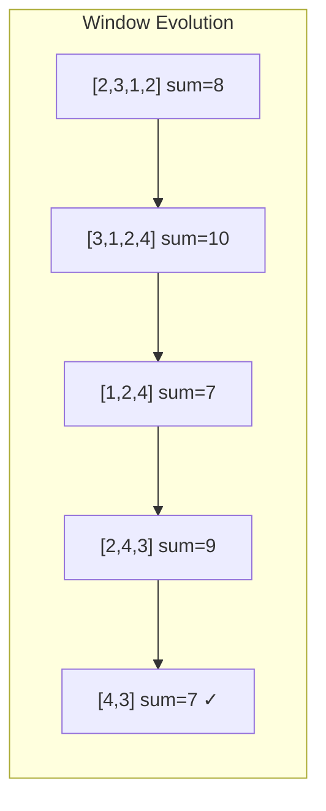

# Minimum Size Subarray Sum

| Property | Value |
|----------|-------|
| Category | Dynamic Programming / Sliding Window |
| Subcategory | Array / Two Pointers |
| Complexity (Time) | O(n) |
| Complexity (Space) | O(1) |
| Input | Target sum and array of integers |
| Output | Minimum length subarray with sum ≥ target |

## Overview

The **Minimum Size Subarray Sum** problem finds the shortest contiguous subarray whose sum is at least the target value. This uses the sliding window technique, which can be viewed as an optimized form of dynamic programming.

## Mathematical Foundation

### Problem Definition

Given array $A = [a_0, a_1, ..., a_{n-1}]$ and target $T$:

Find minimum $r - l + 1$ such that:

$$\sum_{i=l}^{r} a_i \geq T$$

### Sliding Window Invariant

Maintain window $[left, right]$ where:
- Expand right to increase sum
- Shrink left while sum ≥ target
- Track minimum window size

### Complexity Insight

Each element is visited at most twice:
- Once when right pointer passes it
- Once when left pointer passes it

Total: $O(2n) = O(n)$

## Algorithm

```
MINIMUM-SUBARRAY-SUM(target, nums):
    left = right = curr_sum = 0
    min_len = infinity
    
    while right < length(nums):
        // Expand window
        curr_sum += nums[right]
        
        // Shrink window while valid
        while curr_sum >= target AND left <= right:
            min_len = min(min_len, right - left + 1)
            curr_sum -= nums[left]
            left += 1
        
        right += 1
    
    return min_len if min_len != infinity else 0
```

## Visual Representation

### Example: target=7, nums=[2, 3, 1, 2, 4, 3]

```
Step 1: [2] 3 1 2 4 3    sum=2 < 7, expand
Step 2: [2 3] 1 2 4 3    sum=5 < 7, expand
Step 3: [2 3 1] 2 4 3    sum=6 < 7, expand
Step 4: [2 3 1 2] 4 3    sum=8 ≥ 7, len=4, shrink
Step 5: 2 [3 1 2] 4 3    sum=6 < 7, expand
Step 6: 2 [3 1 2 4] 3    sum=10 ≥ 7, len=4, shrink
Step 7: 2 3 [1 2 4] 3    sum=7 ≥ 7, len=3, shrink
Step 8: 2 3 1 [2 4] 3    sum=6 < 7, expand
Step 9: 2 3 1 [2 4 3]    sum=9 ≥ 7, len=3, shrink
Step 10: 2 3 1 2 [4 3]   sum=7 ≥ 7, len=2 ✓

Minimum length = 2 (subarray [4, 3])
```

### Sliding Window Diagram



## Implementation (from repository)

```python
import sys


def minimum_subarray_sum(target: int, numbers: list[int]) -> int:
    """
    Return the length of the shortest contiguous subarray in a list of numbers whose sum
    is at least target.  Reference: https://stackoverflow.com/questions/8269916

    >>> minimum_subarray_sum(7, [2, 3, 1, 2, 4, 3])
    2
    >>> minimum_subarray_sum(7, [2, 3, -1, 2, 4, -3])
    4
    >>> minimum_subarray_sum(11, [1, 1, 1, 1, 1, 1, 1, 1])
    0
    >>> minimum_subarray_sum(10, [1, 2, 3, 4, 5, 6, 7])
    2
    >>> minimum_subarray_sum(5, [1, 1, 1, 1, 1, 5])
    1
    """
    if not numbers:
        return 0
    if target == 0 and target in numbers:
        return 0
    if not isinstance(numbers, (list, tuple)) or not all(
        isinstance(number, int) for number in numbers
    ):
        raise ValueError("numbers must be an iterable of integers")

    left = right = curr_sum = 0
    min_len = sys.maxsize

    while right < len(numbers):
        curr_sum += numbers[right]
        while curr_sum >= target and left <= right:
            min_len = min(min_len, right - left + 1)
            curr_sum -= numbers[left]
            left += 1
        right += 1

    return 0 if min_len == sys.maxsize else min_len
```

## Real-World Applications

### 1. Network Bandwidth Monitoring

```python
def find_burst_window(
    bandwidth_samples: list[int],
    threshold: int
) -> dict:
    """
    Find shortest period where bandwidth exceeds threshold.
    
    >>> samples = [100, 200, 150, 300, 250, 400]
    >>> result = find_burst_window(samples, 500)
    >>> result['window_size'] <= 3
    True
    """
    n = len(bandwidth_samples)
    if n == 0:
        return {'found': False}
    
    left = right = curr_sum = 0
    min_len = float('inf')
    best_start = -1
    
    while right < n:
        curr_sum += bandwidth_samples[right]
        
        while curr_sum >= threshold and left <= right:
            if right - left + 1 < min_len:
                min_len = right - left + 1
                best_start = left
            curr_sum -= bandwidth_samples[left]
            left += 1
        
        right += 1
    
    if min_len == float('inf'):
        return {'found': False}
    
    return {
        'found': True,
        'window_size': min_len,
        'start_index': best_start,
        'end_index': best_start + min_len - 1,
        'total_bandwidth': sum(bandwidth_samples[best_start:best_start + min_len])
    }
```

### 2. Production Target Achievement

```python
def minimum_shifts_for_target(
    daily_production: list[int],
    target_output: int
) -> dict:
    """
    Find minimum consecutive shifts to meet production target.
    
    >>> production = [50, 75, 100, 80, 90, 120]
    >>> result = minimum_shifts_for_target(production, 200)
    >>> result['min_shifts'] <= 3
    True
    """
    n = len(daily_production)
    left = right = curr_sum = 0
    min_shifts = float('inf')
    
    while right < n:
        curr_sum += daily_production[right]
        
        while curr_sum >= target_output and left <= right:
            min_shifts = min(min_shifts, right - left + 1)
            curr_sum -= daily_production[left]
            left += 1
        
        right += 1
    
    return {
        'min_shifts': min_shifts if min_shifts != float('inf') else -1,
        'achievable': min_shifts != float('inf'),
        'total_output': sum(daily_production)
    }
```

## Variations

### With Negative Numbers (Deque-based)

```python
from collections import deque

def min_subarray_sum_with_negatives(
    target: int,
    nums: list[int]
) -> int:
    """
    Handle negative numbers using prefix sums and monotonic deque.
    
    >>> min_subarray_sum_with_negatives(7, [2, -1, 5, 4, -3])
    2
    """
    n = len(nums)
    prefix = [0] * (n + 1)
    for i in range(n):
        prefix[i + 1] = prefix[i] + nums[i]
    
    min_len = float('inf')
    dq = deque()  # Monotonic increasing deque of indices
    
    for i in range(n + 1):
        # Check if we can form valid subarray
        while dq and prefix[i] - prefix[dq[0]] >= target:
            min_len = min(min_len, i - dq.popleft())
        
        # Maintain monotonic property
        while dq and prefix[i] <= prefix[dq[-1]]:
            dq.pop()
        
        dq.append(i)
    
    return min_len if min_len != float('inf') else 0
```

## Common Pitfalls

1. **No valid subarray**: Return 0 or -1
2. **Negative numbers**: Basic sliding window doesn't work
3. **Off-by-one**: Window size is `right - left + 1`
4. **Empty input**: Handle edge case

## See Also

- [Maximum Subarray Sum](max_subarray_sum.md) - Related problem (Kadane's)
- [Longest Substring Without Repeating](../strings/longest_substring.md) - Similar technique
- [Subarray Sum Equals K](subarray_sum_k.md) - Exact sum version
