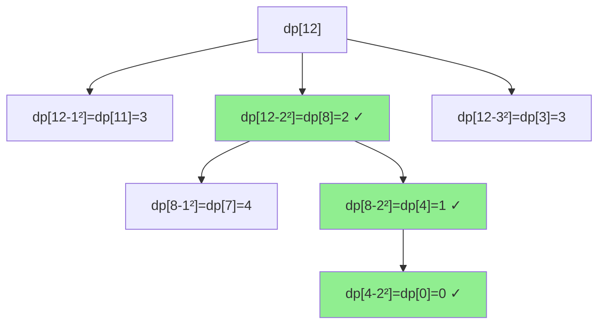

# Minimum Squares to Represent a Number

| Property | Value |
|----------|-------|
| Category | Dynamic Programming |
| Subcategory | Number Theory |
| Complexity (Time) | O(n√n) |
| Complexity (Space) | O(n) |
| Input | Non-negative integer n |
| Output | Minimum count of perfect squares summing to n |

## Overview

The **Minimum Squares to Represent a Number** problem (also known as "Perfect Squares") finds the minimum number of perfect square numbers that sum to a given number n. This is related to Lagrange's Four Square Theorem.

## Mathematical Foundation

### Lagrange's Four Square Theorem

Every positive integer can be represented as the sum of at most four perfect squares:

$$\forall n \in \mathbb{N}: n = a^2 + b^2 + c^2 + d^2$$

### Recurrence Relation

Let $dp[n]$ = minimum squares needed for $n$:

$$dp[n] = 1 + \min_{j=1}^{\lfloor\sqrt{n}\rfloor} dp[n - j^2]$$

**Base case**: $dp[0] = 0$

### Special Cases

- If $n$ is a perfect square: $dp[n] = 1$
- By Legendre's theorem: $dp[n] = 4$ iff $n = 4^a(8b + 7)$

## Algorithm

```
MINIMUM-SQUARES(n):
    if n == 0:
        return 1
    
    dp = array of size n+1, all -1
    dp[0] = 0
    
    for i from 1 to n:
        min_count = infinity
        root = floor(sqrt(i))
        
        for j from 1 to root:
            current = 1 + dp[i - j*j]
            min_count = min(min_count, current)
        
        dp[i] = min_count
    
    return dp[n]
```

## Visual Representation

### Example: n = 12

```
Perfect squares ≤ 12: 1, 4, 9

dp[0] = 0 (base)
dp[1] = 1 + dp[0] = 1         (1²)
dp[2] = 1 + dp[1] = 2         (1² + 1²)
dp[3] = 1 + dp[2] = 3         (1² + 1² + 1²)
dp[4] = 1 + dp[0] = 1         (2²)
dp[5] = 1 + dp[4] = 2         (2² + 1²)
dp[6] = 1 + dp[5] = 3         (2² + 1² + 1²)
dp[7] = 1 + dp[6] = 4         (2² + 1² + 1² + 1²)
dp[8] = 1 + dp[4] = 2         (2² + 2²)
dp[9] = 1 + dp[0] = 1         (3²)
dp[10] = 1 + dp[9] = 2        (3² + 1²)
dp[11] = 1 + dp[10] = 3       (3² + 1² + 1²)
dp[12] = 1 + dp[8] = 3        (2² + 2² + 2²)

Answer for 12: 3 squares (4 + 4 + 4)
```

### DP State Transitions



## Implementation (from repository)

```python
import math
import sys


def minimum_squares_to_represent_a_number(number: int) -> int:
    """
    Count the number of minimum squares to represent a number

    >>> minimum_squares_to_represent_a_number(25)
    1
    >>> minimum_squares_to_represent_a_number(37)
    2
    >>> minimum_squares_to_represent_a_number(21)
    3
    >>> minimum_squares_to_represent_a_number(58)
    2
    >>> minimum_squares_to_represent_a_number(0)
    1
    """
    if number != int(number):
        raise ValueError("the value of input must be a natural number")
    if number < 0:
        raise ValueError("the value of input must not be a negative number")
    if number == 0:
        return 1
    answers = [-1] * (number + 1)
    answers[0] = 0
    for i in range(1, number + 1):
        answer = sys.maxsize
        root = int(math.sqrt(i))
        for j in range(1, root + 1):
            current_answer = 1 + answers[i - (j**2)]
            answer = min(answer, current_answer)
        answers[i] = answer
    return answers[number]
```

## Real-World Applications

### 1. Tile Layout Optimization

```python
def optimal_square_tiles(
    area: int
) -> dict:
    """
    Find minimum square tiles to cover an area.
    
    >>> result = optimal_square_tiles(12)
    >>> result['min_tiles'] == 3
    True
    """
    import math
    
    if area <= 0:
        return {'min_tiles': 0, 'tiles': []}
    
    # DP to find minimum
    dp = [0] * (area + 1)
    parent = [-1] * (area + 1)
    
    for i in range(1, area + 1):
        dp[i] = i  # Worst case: all 1x1 tiles
        parent[i] = 1
        
        root = int(math.sqrt(i))
        for j in range(2, root + 1):
            sq = j * j
            if dp[i - sq] + 1 < dp[i]:
                dp[i] = dp[i - sq] + 1
                parent[i] = j
    
    # Reconstruct tiles
    tiles = []
    remaining = area
    while remaining > 0:
        tile_size = parent[remaining]
        tiles.append(tile_size)
        remaining -= tile_size * tile_size
    
    return {
        'min_tiles': dp[area],
        'tiles': tiles,
        'tile_sizes': list(set(tiles)),
        'tile_areas': [t*t for t in tiles]
    }
```

### 2. Currency/Denomination System

```python
def square_denominations(
    amount: int
) -> dict:
    """
    If only square denominations existed (1, 4, 9, 16, 25...),
    find minimum coins needed.
    
    >>> result = square_denominations(100)
    >>> result['min_coins'] == 1
    True
    """
    import math
    
    if amount <= 0:
        return {'min_coins': 0}
    
    # Generate square denominations up to amount
    denominations = []
    i = 1
    while i * i <= amount:
        denominations.append(i * i)
        i += 1
    
    dp = [float('inf')] * (amount + 1)
    dp[0] = 0
    
    for i in range(1, amount + 1):
        for denom in denominations:
            if denom > i:
                break
            dp[i] = min(dp[i], dp[i - denom] + 1)
    
    return {
        'min_coins': dp[amount],
        'denominations_available': denominations,
        'largest_used': int(math.sqrt(amount)) ** 2
    }
```

### 3. Resource Packaging

```python
def pack_in_square_containers(
    total_items: int,
    max_container_size: int = None
) -> dict:
    """
    Pack items into square-capacity containers (1, 4, 9, 16...).
    
    >>> result = pack_in_square_containers(50)
    >>> result['min_containers'] <= 3
    True
    """
    import math
    
    if total_items <= 0:
        return {'min_containers': 0, 'containers': []}
    
    if max_container_size:
        limit = min(int(math.sqrt(total_items)), int(math.sqrt(max_container_size)))
    else:
        limit = int(math.sqrt(total_items))
    
    # DP
    dp = [float('inf')] * (total_items + 1)
    dp[0] = 0
    choice = [0] * (total_items + 1)
    
    for i in range(1, total_items + 1):
        for j in range(1, limit + 1):
            sq = j * j
            if sq > i:
                break
            if dp[i - sq] + 1 < dp[i]:
                dp[i] = dp[i - sq] + 1
                choice[i] = sq
    
    # Reconstruct
    containers = []
    remaining = total_items
    while remaining > 0:
        containers.append(choice[remaining])
        remaining -= choice[remaining]
    
    return {
        'min_containers': dp[total_items],
        'containers': containers,
        'container_sizes': sorted(set(containers), reverse=True)
    }
```

## Variations

### BFS Approach (Level-order)

```python
from collections import deque

def num_squares_bfs(n: int) -> int:
    """
    BFS approach - find shortest path to 0.
    
    >>> num_squares_bfs(12)
    3
    """
    if n <= 0:
        return 0
    
    squares = []
    i = 1
    while i * i <= n:
        squares.append(i * i)
        i += 1
    
    queue = deque([(n, 0)])  # (remaining, steps)
    visited = {n}
    
    while queue:
        remaining, steps = queue.popleft()
        
        for sq in squares:
            next_val = remaining - sq
            if next_val == 0:
                return steps + 1
            if next_val > 0 and next_val not in visited:
                visited.add(next_val)
                queue.append((next_val, steps + 1))
    
    return -1
```

### Mathematical (O(√n))

```python
def num_squares_math(n: int) -> int:
    """
    Mathematical approach using number theory.
    
    >>> num_squares_math(12)
    3
    """
    import math
    
    # Check if perfect square
    if int(math.sqrt(n)) ** 2 == n:
        return 1
    
    # Check Legendre's three-square theorem condition
    # n = 4^a(8b + 7) means n needs 4 squares
    temp = n
    while temp % 4 == 0:
        temp //= 4
    if temp % 8 == 7:
        return 4
    
    # Check if sum of two squares
    for i in range(1, int(math.sqrt(n)) + 1):
        remainder = n - i * i
        if int(math.sqrt(remainder)) ** 2 == remainder:
            return 2
    
    return 3
```

## Common Pitfalls

1. **Zero handling**: Convention varies (0 or 1)
2. **Square root precision**: Use `int(math.sqrt(n))` carefully
3. **Starting from 1**: Don't include 0² = 0
4. **Memory for large n**: Consider BFS for very large n

## Complexity Notes

- **Time**: O(n√n) - for each number, check √n squares
- **Space**: O(n) for DP array
- **Mathematical**: O(√n) using Lagrange's theorem

## References

- [LeetCode 279 - Perfect Squares](https://leetcode.com/problems/perfect-squares/)
- [Lagrange's Four Square Theorem](https://en.wikipedia.org/wiki/Lagrange%27s_four-square_theorem)
- [Legendre's Three-Square Theorem](https://en.wikipedia.org/wiki/Legendre%27s_three-square_theorem)

## See Also

- [Coin Change](minimum_coin_change.md) - Similar unbounded DP
- [Climbing Stairs](climbing_stairs.md) - Related counting problem
- [Integer Partition](integer_partition.md) - Partition into parts
