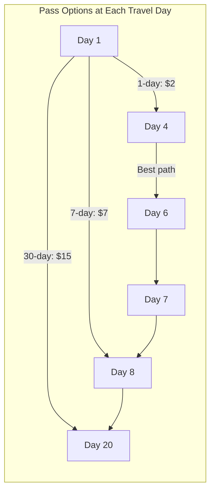
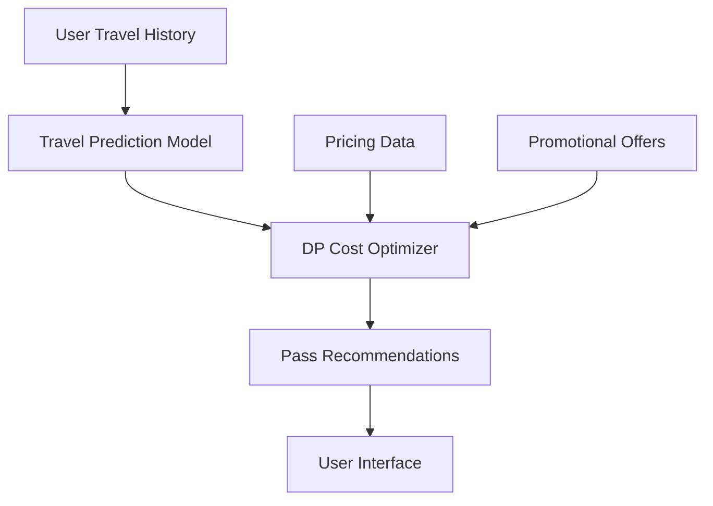

# Minimum Cost for Tickets

## Overview
| Property | Value |
|----------|-------|
| **Category** | Dynamic Programming |
| **Complexity (Time)** | O(max(days)) or O(n) |
| **Complexity (Space)** | O(max(days)) or O(n) |
| **Input** | Travel days array, Ticket costs array |
| **Output** | Minimum cost to cover all travel days |
| **Source** | [minimum_tickets_cost.py](../../../dynamic_programming/minimum_tickets_cost.py) |

## 1. Mathematical Foundation

### 1.1 Problem Definition

Given:
- An array `days` where `days[i]` is a day you will travel
- An array `costs` where:
  - `costs[0]` = 1-day pass cost
  - `costs[1]` = 7-day pass cost  
  - `costs[2]` = 30-day pass cost

Find the minimum cost to travel on all given days.

$$
\text{minimize} \sum_{i} c_i \cdot x_i
$$

Subject to: All travel days must be covered by at least one pass.

### 1.2 Recurrence Relation

Let $dp[i]$ = minimum cost to cover all travel days from day 1 to day $i$.

$$
dp[i] = 
\begin{cases}
dp[i-1] & \text{if day } i \text{ is not a travel day} \\
\min\begin{cases}
dp[i-1] + costs[0] \\
dp[\max(0, i-7)] + costs[1] \\
dp[\max(0, i-30)] + costs[2]
\end{cases} & \text{if day } i \text{ is a travel day}
\end{cases}
$$

### 1.3 Optimal Substructure

The problem exhibits optimal substructure because:
- The minimum cost to cover days $[1, i]$ depends only on the minimum costs for smaller subproblems
- Each pass choice at day $i$ extends a previous optimal solution

## 2. Algorithm Description

### 2.1 Intuition

At each travel day, we have three choices:
1. Buy a 1-day pass (covers only today)
2. Buy a 7-day pass (covers today and next 6 days)
3. Buy a 30-day pass (covers today and next 29 days)

We choose the option that minimizes total cost.

### 2.2 Step-by-Step Process

1. Create DP array indexed by calendar days
2. Convert travel days to a set for O(1) lookup
3. For each day, compute minimum cost considering all pass options
4. Return cost for the last travel day

## 3. Pseudocode

```
ALGORITHM MinimumTicketsCost(days, costs)
    INPUT: days - array of travel days
           costs - array [1-day, 7-day, 30-day] pass costs
    OUTPUT: Minimum total cost
    
    1. travel_days ← SET(days)
    2. last_day ← MAX(days)
    3. dp ← array of size (last_day + 1), initialized to 0
    
    4. for day ← 1 to last_day do
           if day NOT IN travel_days then
               dp[day] ← dp[day - 1]
           else
               // Consider all three pass options
               cost_1day ← dp[day - 1] + costs[0]
               cost_7day ← dp[MAX(0, day - 7)] + costs[1]
               cost_30day ← dp[MAX(0, day - 30)] + costs[2]
               dp[day] ← MIN(cost_1day, cost_7day, cost_30day)
           end if
       end for
    
    5. return dp[last_day]
```

### Alternative: Sparse DP Approach

```
ALGORITHM MinimumTicketsCostSparse(days, costs)
    INPUT: days - sorted array of travel days
           costs - array of pass costs
    OUTPUT: Minimum total cost
    
    1. n ← LENGTH(days)
    2. dp ← array of size (n + 1), initialized to 0
    3. durations ← [1, 7, 30]
    
    4. for i ← 0 to n-1 do
           dp[i + 1] ← INFINITY
           for k ← 0 to 2 do
               // Find the earliest day not covered by pass bought at i
               j ← i
               while j < n AND days[j] < days[i] + durations[k] do
                   j ← j + 1
               end while
               dp[j] ← MIN(dp[j], dp[i] + costs[k])
           end for
       end for
    
    5. return dp[n]
```

## 4. Complexity Analysis

### 4.1 Time Complexity

| Approach | Complexity | Explanation |
|----------|------------|-------------|
| Calendar-based | O(max(days)) | Iterate through all calendar days |
| Sparse | O(n) | Only process travel days |
| With Binary Search | O(n log n) | Finding coverage boundaries |

### 4.2 Space Complexity

| Approach | Complexity | Notes |
|----------|------------|-------|
| Calendar-based | O(max(days)) | Array for all calendar days |
| Sparse | O(n) | Array only for travel days |
| Optimized | O(30) = O(1) | Sliding window of 30 days |

## 5. Visual Representation

### Example: days = [1,4,6,7,8,20], costs = [2,7,15]

```
Calendar:  1  2  3  4  5  6  7  8  ... 20
Travel:    ✓        ✓     ✓  ✓  ✓      ✓
           
DP Values:
Day 1:  min(0+2, 0+7, 0+15) = 2  (1-day pass)
Day 4:  min(2+2, 0+7, 0+15) = 4  (1-day pass)
Day 6:  min(4+2, 0+7, 0+15) = 6  (1-day pass)
Day 7:  min(6+2, 2+7, 0+15) = 8  (1-day pass)
        or 7 (7-day from day 1)
Day 8:  min(7+2, 2+7, 0+15) = 9  (1-day pass)
Day 20: min(9+2, 9+7, 0+15) = 11 (1-day pass)
```



## 6. Implementation Notes

### 6.1 Key Data Structures

- **Set**: O(1) lookup for travel days
- **DP Array**: Stores minimum cost up to each day
- **Sliding Window** (optimized): Only keep last 30 days

### 6.2 Edge Cases

| Edge Case | Handling |
|-----------|----------|
| Single travel day | Return min(costs) |
| Consecutive days ≤ 7 | Consider 7-day pass |
| Consecutive days ≤ 30 | Consider 30-day pass |
| 30-day pass cheaper than 7×1-day | Always use 30-day |
| Large gaps between travel days | Reset coverage windows |

## 7. Comparison with Related Algorithms

| Problem | Time | Space | Key Difference |
|---------|------|-------|----------------|
| Minimum Tickets Cost | O(D) | O(D) | Fixed pass durations |
| Coin Change | O(n×amount) | O(amount) | Unlimited coins |
| House Robber | O(n) | O(1) | Adjacent constraint |
| Jump Game II | O(n) | O(1) | Variable jumps |

## 8. Real-World Software Engineering Applications

### 8.1 Industry Use Cases

1. **Public Transportation Systems**
   - Metro/subway pass optimization
   - Bus pass recommendations
   - Multi-modal transit planning

2. **Subscription Services**
   - Streaming service bundling
   - Software license optimization
   - Cloud service cost planning

3. **Travel & Booking Platforms**
   - Flight pass optimization
   - Hotel loyalty program planning
   - Rail pass recommendations

4. **Telecommunications**
   - Mobile data plan optimization
   - Roaming package selection
   - Pay-as-you-go vs. subscription

5. **Gym & Fitness**
   - Membership tier recommendations
   - Class pass optimization
   - Facility access planning

### 8.2 Production Example

```python
class TransitPassOptimizer:
    """
    Optimize transit pass purchases for commuters.
    Real-world application in transit apps.
    """
    
    def __init__(self, pass_options: dict):
        """
        pass_options: {duration_days: cost}
        Example: {1: 3.50, 7: 20, 30: 75}
        """
        self.durations = sorted(pass_options.keys())
        self.costs = [pass_options[d] for d in self.durations]
    
    def optimize(self, travel_dates: list[int]) -> tuple[float, list]:
        """
        Returns (minimum_cost, list_of_passes_to_buy)
        """
        # Implementation using DP approach
        pass
```

### 8.3 System Design Considerations



## 9. References

- [LeetCode Problem 983: Minimum Cost For Tickets](https://leetcode.com/problems/minimum-cost-for-tickets/)
- Bellman, R. (1954). "The Theory of Dynamic Programming"
- [Wikipedia: Dynamic Programming](https://en.wikipedia.org/wiki/Dynamic_programming)
