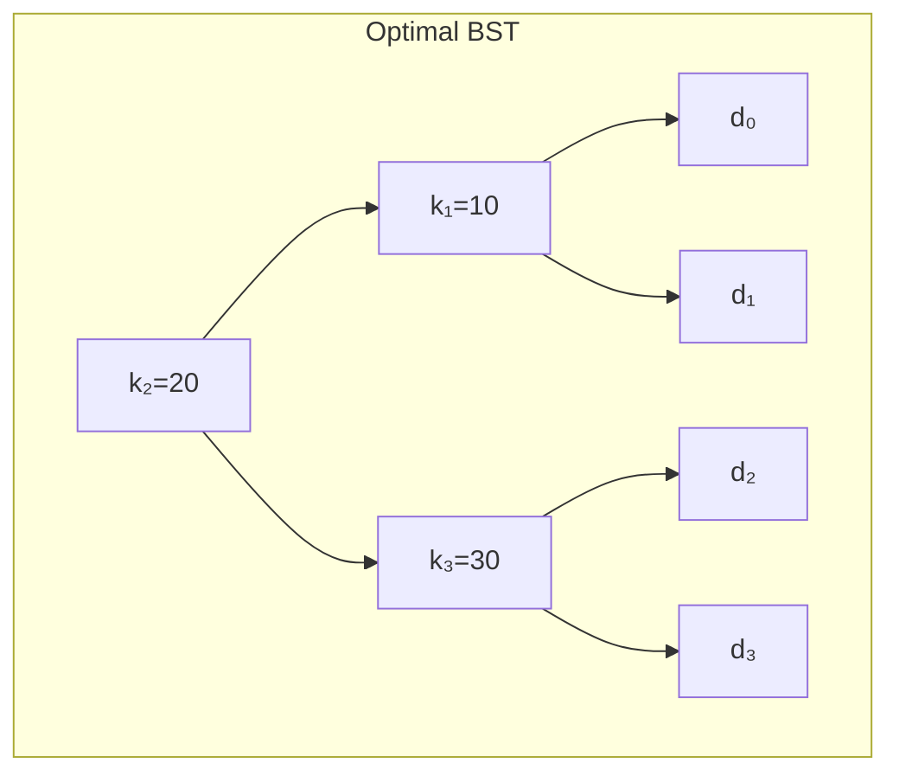
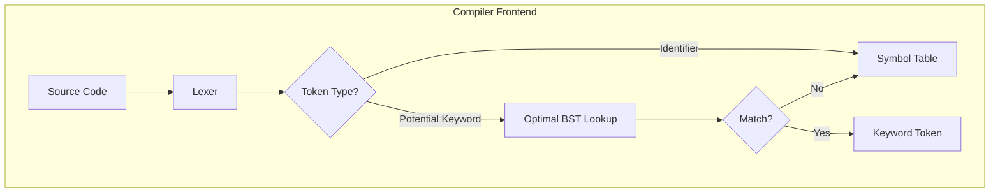

# Optimal Binary Search Tree

## Overview
| Property | Value |
|----------|-------|
| **Category** | Dynamic Programming, Tree Optimization |
| **Complexity (Time)** | O(n³) standard, O(n²) with Knuth's optimization |
| **Complexity (Space)** | O(n²) |
| **Input** | Keys with access frequencies |
| **Output** | Minimum expected search cost BST structure |
| **Source** | [optimal_binary_search_tree.py](../../../dynamic_programming/optimal_binary_search_tree.py) |

## 1. Mathematical Foundation

### 1.1 Problem Definition

Given:
- $n$ sorted keys: $k_1 < k_2 < ... < k_n$
- Search probabilities: $p_i$ = probability of searching for key $k_i$
- Miss probabilities: $q_i$ = probability of searching for key between $k_i$ and $k_{i+1}$

Construct a BST that minimizes the expected search cost:

$$
E[\text{cost}] = \sum_{i=1}^{n} p_i \cdot (\text{depth}(k_i) + 1) + \sum_{i=0}^{n} q_i \cdot (\text{depth}(d_i) + 1)
$$

where $d_i$ represents dummy nodes for unsuccessful searches.

### 1.2 Recurrence Relation

Let $e[i,j]$ = expected cost of optimal BST for keys $k_i$ through $k_j$
Let $w[i,j]$ = sum of all probabilities for keys in range $[i,j]$

$$
w[i,j] = \sum_{l=i}^{j} p_l + \sum_{l=i-1}^{j} q_l
$$

**Base Case:**
$$e[i,i-1] = q_{i-1}$$

**Recurrence:**
$$e[i,j] = \min_{i \leq r \leq j} \{e[i,r-1] + e[r+1,j] + w[i,j]\}$$

The $w[i,j]$ term accounts for the depth increase when keys become children.

### 1.3 Root Selection

Store the optimal root choice:
$$root[i,j] = \argmin_{i \leq r \leq j} \{e[i,r-1] + e[r+1,j]\}$$

### 1.4 Knuth's Optimization

**Key insight:** The optimal root for range $[i,j]$ lies between optimal roots for $[i,j-1]$ and $[i+1,j]$:

$$root[i,j-1] \leq root[i,j] \leq root[i+1,j]$$

This reduces time complexity from O(n³) to O(n²).

## 2. Algorithm Description

### 2.1 Intuition

More frequently accessed keys should be closer to the root. The algorithm tries every possible root for each subtree, choosing the one that minimizes expected search cost when combined with optimal left and right subtrees.

### 2.2 Step-by-Step Process

1. Initialize base cases (single dummy nodes)
2. Build up solutions for increasing subtree sizes
3. For each range, try all possible roots
4. Select root that minimizes total expected cost
5. Reconstruct tree from root choices

## 3. Pseudocode

```
ALGORITHM OptimalBST(p, q, n)
    INPUT: 
        p[1..n] - key access probabilities
        q[0..n] - miss probabilities (dummy nodes)
        n - number of keys
    OUTPUT: 
        e[1..n+1, 0..n] - expected costs
        root[1..n, 1..n] - optimal root choices
    
    // Initialize tables
    1. e ← 2D array [n+2 × n+1]
    2. w ← 2D array [n+2 × n+1]
    3. root ← 2D array [n+1 × n+1]
    
    // Base cases: single dummy nodes
    4. for i ← 1 to n+1 do
           e[i,i-1] ← q[i-1]
           w[i,i-1] ← q[i-1]
       end for
    
    // Build optimal BSTs of increasing size
    5. for length ← 1 to n do
           for i ← 1 to n-length+1 do
               j ← i + length - 1
               e[i,j] ← ∞
               w[i,j] ← w[i,j-1] + p[j] + q[j]
               
               // Try each key as root
               for r ← i to j do
                   cost ← e[i,r-1] + e[r+1,j] + w[i,j]
                   if cost < e[i,j] then
                       e[i,j] ← cost
                       root[i,j] ← r
                   end if
               end for
           end for
       end for
    
    6. return e, root
```

### Knuth-Optimized Version

```
ALGORITHM OptimalBSTKnuth(p, q, n)
    // ... same initialization ...
    
    5. for length ← 1 to n do
           for i ← 1 to n-length+1 do
               j ← i + length - 1
               e[i,j] ← ∞
               w[i,j] ← w[i,j-1] + p[j] + q[j]
               
               // Knuth's optimization: restrict root search
               if length = 1 then
                   r_low ← i
                   r_high ← i
               else
                   r_low ← root[i,j-1]
                   r_high ← root[i+1,j]
               end if
               
               for r ← r_low to r_high do
                   cost ← e[i,r-1] + e[r+1,j] + w[i,j]
                   if cost < e[i,j] then
                       e[i,j] ← cost
                       root[i,j] ← r
                   end if
               end for
           end for
       end for
```

### Tree Construction

```
ALGORITHM ConstructOptimalBST(root, i, j, parent, direction)
    INPUT: root table, range [i,j], parent info
    OUTPUT: Constructed BST
    
    if i ≤ j then
        r ← root[i,j]
        
        if parent = NIL then
            PRINT "k" + r + " is the root"
        else if direction = "left" then
            PRINT "k" + r + " is left child of k" + parent
        else
            PRINT "k" + r + " is right child of k" + parent
        end if
        
        ConstructOptimalBST(root, i, r-1, r, "left")
        ConstructOptimalBST(root, r+1, j, r, "right")
    end if
```

## 4. Complexity Analysis

### 4.1 Time Complexity

| Algorithm | Complexity | Explanation |
|-----------|------------|-------------|
| Standard | O(n³) | Three nested loops |
| Knuth-optimized | O(n²) | Monotonicity of roots |
| With preprocessing | O(n²) | Prefix sums for w[i,j] |

### 4.2 Space Complexity

| Storage | Complexity | Purpose |
|---------|------------|---------|
| e table | O(n²) | Expected costs |
| w table | O(n²) | Weight sums |
| root table | O(n²) | Root choices |
| **Total** | **O(n²)** | |

## 5. Visual Representation

### Example: Keys {10, 20, 30} with probabilities

```
Keys:  k₁=10, k₂=20, k₃=30
p:     p₁=0.3, p₂=0.2, p₃=0.1
q:     q₀=0.1, q₁=0.1, q₂=0.1, q₃=0.1

w table:
        j=0   j=1   j=2   j=3
   i=1  0.1   0.5   0.8   1.0
   i=2        0.1   0.4   0.6
   i=3              0.1   0.3
   i=4                    0.1

e table (optimal costs):
        j=0   j=1   j=2   j=3
   i=1  0.1   0.6   1.3   1.9
   i=2        0.1   0.5   0.9
   i=3              0.1   0.4
   i=4                    0.1
```

**Optimal BST Structure:**

```
        20 (root)
       /  \
      10   30
     / \   / \
    d₀ d₁ d₂ d₃

Expected cost: 1.9
```



## 6. Implementation Notes

### 6.1 Key Data Structures

| Structure | Purpose |
|-----------|---------|
| 2D Array e | Store expected search costs |
| 2D Array w | Store probability sums |
| 2D Array root | Store optimal root choices |

### 6.2 Probability Normalization

Ensure probabilities sum to 1:
$$\sum_{i=1}^{n} p_i + \sum_{i=0}^{n} q_i = 1$$

### 6.3 Edge Cases

| Edge Case | Handling |
|-----------|----------|
| Single key | Root is that key |
| Equal probabilities | Any valid BST |
| All misses (q) | Reduces to weighted external path length |
| Zero miss probability | Simplifies to successful search only |

## 7. Comparison with Related Algorithms

| Algorithm | Optimizes | Time | Application |
|-----------|-----------|------|-------------|
| Optimal BST | Expected search | O(n²) | Static data |
| Huffman Coding | Prefix codes | O(n log n) | Compression |
| Splay Trees | Amortized access | O(log n)* | Dynamic data |
| AVL/Red-Black | Worst-case height | O(log n) | Balanced BST |

*Amortized per operation

## 8. Real-World Software Engineering Applications

### 8.1 Industry Use Cases

1. **Compiler Design**
   - Keyword lookup tables
   - Symbol table organization
   - Parse tree optimization
   - Reserved word recognition

2. **Database Systems**
   - Index structure optimization
   - Query plan caching
   - Frequently accessed record placement
   - B-tree variant selection

3. **Network Routing**
   - IP prefix lookup tables
   - Routing table organization
   - Packet classification
   - Firewall rule ordering

4. **Natural Language Processing**
   - Dictionary lookup optimization
   - Morphological analysis
   - Spell checker dictionaries
   - Autocomplete structures

5. **Configuration Systems**
   - Setting lookup optimization
   - Feature flag hierarchies
   - Permission tree structures
   - Menu organization

### 8.2 Production Example

```python
class OptimizedKeywordLookup:
    """
    Compiler keyword lookup using optimal BST structure.
    Used in lexer/parser implementations.
    """
    
    def __init__(self, keywords: dict[str, float]):
        """
        Initialize with keywords and their access frequencies.
        
        Args:
            keywords: {keyword: frequency}
            Example: {'if': 0.15, 'else': 0.10, 'while': 0.08, ...}
        """
        self.keywords = sorted(keywords.keys())
        self.frequencies = [keywords[k] for k in self.keywords]
        self.root_structure = self._build_optimal_bst()
    
    def _build_optimal_bst(self) -> dict:
        """
        Build optimal BST structure based on frequencies.
        Returns root indices for tree construction.
        """
        # Optimal BST algorithm
        pass
    
    def lookup(self, token: str) -> bool:
        """
        Check if token is a keyword.
        Optimized path based on access frequency.
        
        >>> lookup = OptimizedKeywordLookup(keywords)
        >>> lookup.lookup('if')
        True
        >>> lookup.lookup('variable')
        False
        """
        pass
```

### 8.3 System Integration



### 8.4 Cache-Aware Implementation

```python
class CacheOptimalBST:
    """
    Cache-friendly optimal BST for modern CPUs.
    Uses van Emde Boas layout for better cache performance.
    """
    
    def __init__(self, keys, probabilities):
        self.structure = self._build_veb_layout(
            self._compute_optimal_bst(keys, probabilities)
        )
    
    def _build_veb_layout(self, tree):
        """
        Arrange tree nodes in van Emde Boas layout
        for cache-efficient traversal.
        """
        pass
```

## 9. Extensions

### 9.1 Nearly Optimal BST

When O(n²) is too slow:
- Mehlhorn's algorithm: O(n) time, approximation ratio 1.5
- Weight-balanced trees: O(n log n) construction

### 9.2 Dynamic Optimal BST

For changing access patterns:
- Splay trees (self-adjusting)
- Tango trees
- Multi-splay trees

## 10. References

- Cormen, T. et al. "Introduction to Algorithms" - Chapter 15
- Knuth, D.E. (1971). "Optimum binary search trees"
- Mehlhorn, K. (1975). "Nearly optimal binary search trees"
- [Wikipedia: Optimal Binary Search Tree](https://en.wikipedia.org/wiki/Optimal_binary_search_tree)
