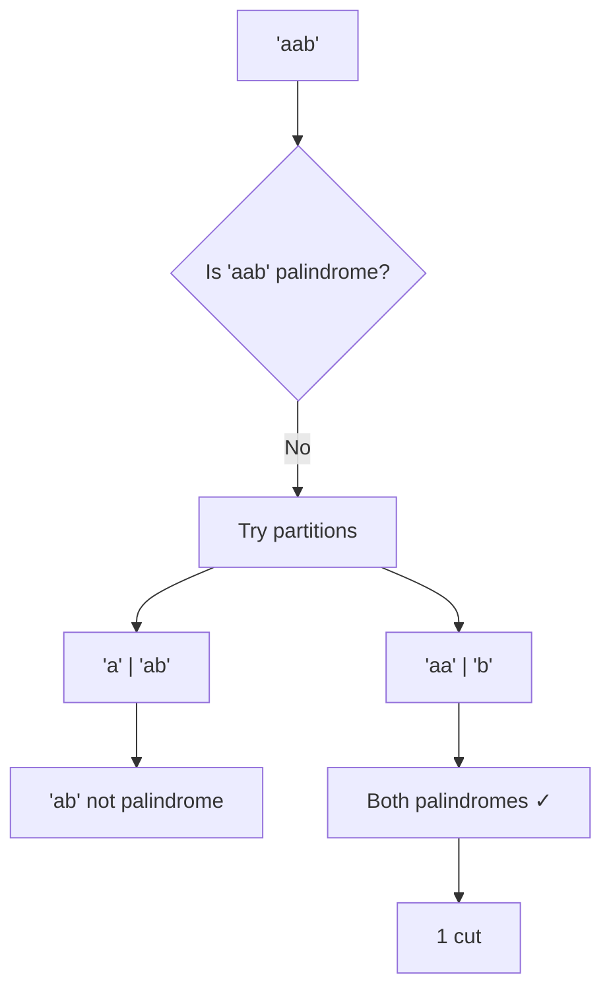
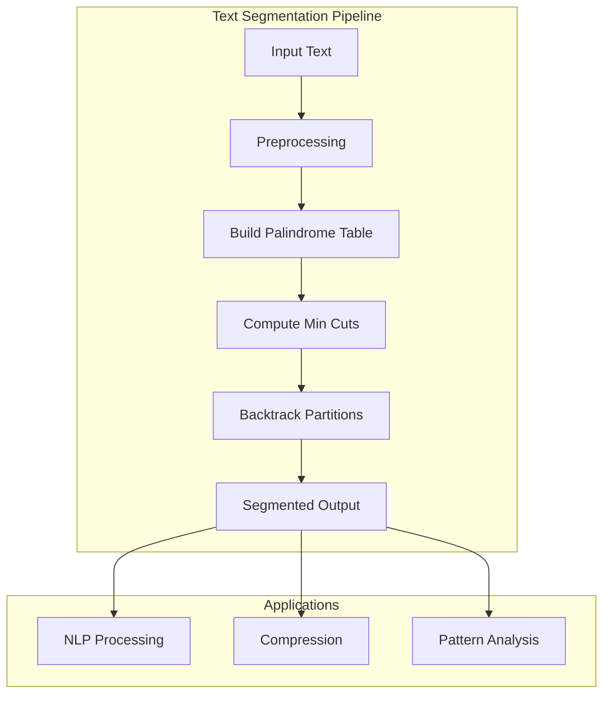

# Palindrome Partitioning

## Overview
| Property | Value |
|----------|-------|
| **Category** | Dynamic Programming, String Processing |
| **Complexity (Time)** | O(n²) |
| **Complexity (Space)** | O(n²) |
| **Input** | String s |
| **Output** | Minimum cuts for palindrome partitioning |
| **Source** | [palindrome_partitioning.py](../../../dynamic_programming/palindrome_partitioning.py) |

## 1. Mathematical Foundation

### 1.1 Problem Definition

Given a string $s$ of length $n$, find the minimum number of cuts needed to partition $s$ such that every substring in the partition is a palindrome.

$$
\text{minCut}(s) = \min \{k : s = p_1 \cdot p_2 \cdot ... \cdot p_{k+1}, \text{ each } p_i \text{ is palindrome}\}
$$

### 1.2 Recurrence Relation

Let $cut[i]$ = minimum cuts needed for substring $s[0..i]$

**Base Case:**
$$cut[i] = i \quad \text{(worst case: cut after each character)}$$

**Recurrence:**
$$cut[i] = \min_{0 \leq j \leq i} \begin{cases}
0 & \text{if } s[0..i] \text{ is palindrome} \\
cut[j-1] + 1 & \text{if } s[j..i] \text{ is palindrome}
\end{cases}$$

### 1.3 Palindrome Check Optimization

Precompute palindrome table $isPalin[i][j]$ = true if $s[i..j]$ is palindrome:

$$isPalin[i][j] = \begin{cases}
\text{true} & \text{if } i \geq j \\
s[i] = s[j] \land isPalin[i+1][j-1] & \text{otherwise}
\end{cases}$$

## 2. Algorithm Description

### 2.1 Intuition

A single character is always a palindrome. We build up from there, checking if extending the current palindrome substring allows fewer cuts. Precomputing palindrome status avoids redundant checks.

### 2.2 Step-by-Step Process

1. Build palindrome lookup table (O(n²))
2. Initialize cut array with worst case
3. For each position, find minimum cuts
4. Return final cut value

## 3. Pseudocode

### 3.1 Main Algorithm

```
ALGORITHM PalindromePartitioning(s)
    INPUT: String s of length n
    OUTPUT: Minimum number of cuts
    
    // Build palindrome lookup table
    1. isPalin ← 2D array [n × n], initialized to false
    
    // Single characters and pairs
    2. for i ← 0 to n-1 do
           isPalin[i][i] ← true
           if i < n-1 AND s[i] = s[i+1] then
               isPalin[i][i+1] ← true
           end if
       end for
    
    // Longer palindromes
    3. for length ← 3 to n do
           for i ← 0 to n-length do
               j ← i + length - 1
               if s[i] = s[j] AND isPalin[i+1][j-1] then
                   isPalin[i][j] ← true
               end if
           end for
       end for
    
    // Compute minimum cuts
    4. cut ← array of size n
    5. for i ← 0 to n-1 do
           if isPalin[0][i] then
               cut[i] ← 0  // Entire prefix is palindrome
           else
               cut[i] ← i  // Worst case
               for j ← 1 to i do
                   if isPalin[j][i] AND cut[j-1] + 1 < cut[i] then
                       cut[i] ← cut[j-1] + 1
                   end if
               end for
           end if
       end for
    
    6. return cut[n-1]
```

### 3.2 Optimized Single-Pass Algorithm

```
ALGORITHM PalindromePartitioningOptimized(s)
    INPUT: String s of length n
    OUTPUT: Minimum number of cuts
    
    1. cut ← array of size n, where cut[i] = i (worst case)
    2. isPalin ← 2D array [n × n], initialized to false
    
    // Expand around centers
    3. for center ← 0 to n-1 do
           // Odd-length palindromes (center at single char)
           for delta ← 0 to min(center, n-1-center) do
               i ← center - delta
               j ← center + delta
               if s[i] ≠ s[j] then break
               
               isPalin[i][j] ← true
               if i = 0 then
                   cut[j] ← 0
               else
                   cut[j] ← MIN(cut[j], cut[i-1] + 1)
               end if
           end for
           
           // Even-length palindromes (center between chars)
           for delta ← 0 to min(center, n-2-center) do
               i ← center - delta
               j ← center + 1 + delta
               if s[i] ≠ s[j] then break
               
               isPalin[i][j] ← true
               if i = 0 then
                   cut[j] ← 0
               else
                   cut[j] ← MIN(cut[j], cut[i-1] + 1)
               end if
           end for
       end for
    
    4. return cut[n-1]
```

## 4. Complexity Analysis

### 4.1 Time Complexity

| Phase | Complexity | Explanation |
|-------|------------|-------------|
| Palindrome table | O(n²) | Check all substrings |
| Minimum cuts | O(n²) | Check all partitions |
| **Total** | **O(n²)** | |

### 4.2 Space Complexity

| Storage | Complexity | Notes |
|---------|------------|-------|
| isPalin table | O(n²) | Boolean matrix |
| cut array | O(n) | Minimum cuts |
| **Total** | **O(n²)** | |

### 4.3 Space Optimization

The palindrome table can be computed on-the-fly using center expansion, reducing space to O(n).

## 5. Visual Representation

### Example: s = "aab"

```
Palindrome Table:
        j=0   j=1   j=2
   i=0   T     T     F
   i=1         T     F
   i=2               T

isPalin[0][0] = 'a' ✓
isPalin[1][1] = 'a' ✓
isPalin[2][2] = 'b' ✓
isPalin[0][1] = 'aa' ✓
isPalin[1][2] = 'ab' ✗
isPalin[0][2] = 'aab' ✗

Cut Array Computation:
cut[0] = 0  (s[0..0]='a' is palindrome)
cut[1] = 0  (s[0..1]='aa' is palindrome)
cut[2] = min(2, cut[1]+1) = 1  (s[2]='b' is palindrome)

Result: 1 cut → "aa" | "b"
```



## 6. Implementation Notes

### 6.1 Key Data Structures

| Structure | Purpose |
|-----------|---------|
| Boolean Matrix | Palindrome lookup (O(1) query) |
| Integer Array | Minimum cuts to each position |

### 6.2 Edge Cases

| Edge Case | Result |
|-----------|--------|
| Empty string | 0 cuts |
| Single char | 0 cuts |
| All same chars | 0 cuts (entire string is palindrome) |
| No palindromes > 1 char | n-1 cuts |
| Already palindrome | 0 cuts |

## 7. Variants

### 7.1 All Palindrome Partitions

Return all possible palindrome partitions (backtracking):

```
ALGORITHM AllPalindromePartitions(s, start, current, result)
    if start = LENGTH(s) then
        ADD current TO result
        return
    end if
    
    for end ← start to LENGTH(s)-1 do
        if isPalindrome(s[start..end]) then
            current.ADD(s[start..end])
            AllPalindromePartitions(s, end+1, current, result)
            current.REMOVE_LAST()
        end if
    end for
```

### 7.2 Related Problems

| Problem | Difference |
|---------|------------|
| Palindrome Partitioning I | Return all partitions |
| Palindrome Partitioning II | Minimum cuts (this) |
| Palindrome Partitioning III | Exactly k palindromes |
| Palindrome Partitioning IV | Check if 3 palindromes possible |

## 8. Real-World Software Engineering Applications

### 8.1 Industry Use Cases

1. **Text Processing**
   - Text segmentation
   - Natural language processing
   - Sentence boundary detection
   - Word segmentation

2. **Bioinformatics**
   - DNA sequence analysis
   - Palindromic sequence detection
   - Restriction enzyme site finding
   - Genome annotation

3. **Data Compression**
   - Repetitive pattern detection
   - Dictionary-based compression
   - Run-length encoding optimization

4. **Cryptography**
   - Pattern analysis
   - Plaintext structure detection
   - Cipher analysis

5. **Code Analysis**
   - Code clone detection
   - Pattern matching in ASTs
   - Refactoring suggestions

### 8.2 Production Example

```python
class DNAAnalyzer:
    """
    Analyze DNA sequences for palindromic regions.
    Palindromic sequences are important in:
    - Restriction enzyme recognition sites
    - Hairpin loop formations
    - Genetic regulatory elements
    """
    
    def __init__(self, sequence: str):
        self.sequence = sequence.upper()
        self.complement = {'A': 'T', 'T': 'A', 'G': 'C', 'C': 'G'}
    
    def is_palindromic(self, start: int, end: int) -> bool:
        """
        Check if sequence[start:end+1] is a DNA palindrome.
        DNA palindromes read the same on complementary strand.
        
        Example: GAATTC is palindrome (reverse complement = GAATTC)
        """
        subseq = self.sequence[start:end+1]
        complement_rev = ''.join(
            self.complement[c] for c in reversed(subseq)
        )
        return subseq == complement_rev
    
    def find_restriction_sites(self) -> list:
        """
        Find potential restriction enzyme recognition sites.
        These are palindromic sequences of specific lengths.
        """
        sites = []
        for length in [4, 6, 8]:  # Common RE site lengths
            for i in range(len(self.sequence) - length + 1):
                if self.is_palindromic(i, i + length - 1):
                    sites.append((i, self.sequence[i:i+length]))
        return sites
```

### 8.3 System Design



## 9. Optimizations

### 9.1 Manacher's Algorithm Integration

Use Manacher's algorithm for O(n) palindrome detection:

```python
def manacher_preprocessing(s):
    """
    Find all palindromic substrings in O(n).
    Can be used to speed up partitioning.
    """
    # Transform: "abc" -> "^#a#b#c#$"
    t = '^#' + '#'.join(s) + '#$'
    p = [0] * len(t)
    center = right = 0
    
    for i in range(1, len(t) - 1):
        if i < right:
            p[i] = min(right - i, p[2 * center - i])
        while t[i + p[i] + 1] == t[i - p[i] - 1]:
            p[i] += 1
        if i + p[i] > right:
            center, right = i, i + p[i]
    
    return p
```

### 9.2 Early Termination

```python
# If string is already palindrome, return 0
if s == s[::-1]:
    return 0

# If only first/last char differs, at most 1 cut
# ... other optimizations
```

## 10. References

- [LeetCode Problem 132: Palindrome Partitioning II](https://leetcode.com/problems/palindrome-partitioning-ii/)
- [Wikipedia: Palindrome](https://en.wikipedia.org/wiki/Palindrome)
- Manacher, G. (1975). "A New Linear-Time 'On-Line' Algorithm for Finding the Smallest Initial Palindrome of a String"
