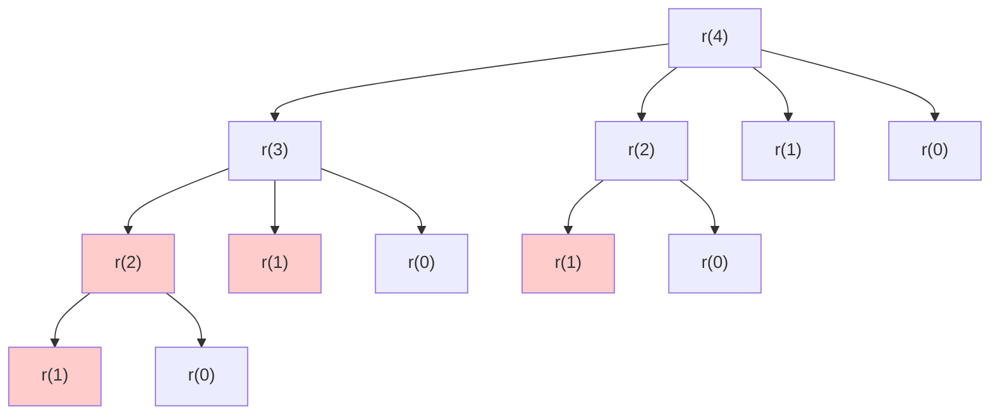

# Rod Cutting Problem

| Property | Value |
|----------|-------|
| Category | Dynamic Programming |
| Subcategory | Optimization |
| Complexity (Time) | O(n²) |
| Complexity (Space) | O(n) |
| Input | Rod length, price list |
| Output | Maximum revenue |

## Overview

The **Rod Cutting Problem** determines the maximum revenue obtainable by cutting a rod into pieces and selling them, given a price list for each piece length. This is a classic 1D unbounded knapsack variant demonstrating the evolution from naive recursion to optimal DP.

## Mathematical Foundation

### Problem Definition

Given:
- Rod of length $n$
- Prices $p_1, p_2, ..., p_n$ where $p_i$ is the price of length $i$

Find: Maximum revenue $r_n$ achievable by cutting the rod.

### Recurrence Relation

$$r_n = \max_{1 \leq i \leq n}(p_i + r_{n-i})$$

For the first cut of length $i$:
- Gain $p_i$ from selling that piece
- Recursively solve for remaining length $n-i$

### Base Case

$$r_0 = 0$$ (no rod means no revenue)

### Optimal Substructure

The optimal solution for length $n$ contains optimal solutions for smaller lengths. This is because:
1. Make an optimal first cut
2. The remaining piece must also be cut optimally

## Algorithm Approaches

### 1. Naive Recursive (O(2ⁿ))

```
CUT-ROD-NAIVE(prices, n):
    if n == 0:
        return 0
    
    max_revenue = -infinity
    for i from 1 to n:
        revenue = prices[i] + CUT-ROD-NAIVE(prices, n - i)
        max_revenue = max(max_revenue, revenue)
    
    return max_revenue
```

### 2. Top-Down Memoization (O(n²))

```
CUT-ROD-MEMOIZED(prices, n):
    memo = array of size n+1, initialized to -infinity
    return CUT-ROD-MEMO-AUX(prices, n, memo)

CUT-ROD-MEMO-AUX(prices, n, memo):
    if n == 0:
        return 0
    if memo[n] >= 0:
        return memo[n]
    
    max_revenue = -infinity
    for i from 1 to n:
        revenue = prices[i] + CUT-ROD-MEMO-AUX(prices, n - i, memo)
        max_revenue = max(max_revenue, revenue)
    
    memo[n] = max_revenue
    return max_revenue
```

### 3. Bottom-Up Tabulation (O(n²))

```
CUT-ROD-BOTTOM-UP(prices, n):
    revenue = array of size n+1
    revenue[0] = 0
    
    for j from 1 to n:
        max_revenue = -infinity
        for i from 1 to j:
            max_revenue = max(max_revenue, prices[i] + revenue[j - i])
        revenue[j] = max_revenue
    
    return revenue[n]
```

### 4. With Cut Reconstruction

```
CUT-ROD-EXTENDED(prices, n):
    revenue = array of size n+1
    first_cut = array of size n+1
    revenue[0] = 0
    
    for j from 1 to n:
        max_revenue = -infinity
        for i from 1 to j:
            if prices[i] + revenue[j - i] > max_revenue:
                max_revenue = prices[i] + revenue[j - i]
                first_cut[j] = i
        revenue[j] = max_revenue
    
    return revenue[n], first_cut

PRINT-CUT-SOLUTION(first_cut, n):
    cuts = []
    while n > 0:
        cuts.append(first_cut[n])
        n = n - first_cut[n]
    return cuts
```

## Complexity Analysis

| Approach | Time | Space | Subproblems |
|----------|------|-------|-------------|
| Naive Recursive | O(2ⁿ) | O(n) stack | Exponential overlap |
| Top-Down Memo | O(n²) | O(n) | n subproblems, O(n) each |
| Bottom-Up | O(n²) | O(n) | n subproblems, O(n) each |

### Why O(n²)?

- Outer loop: n iterations (rod lengths 1 to n)
- Inner loop: Up to n iterations (cut positions)
- Total: $\sum_{j=1}^{n} j = \frac{n(n+1)}{2} = O(n^2)$

## Visual Representation

### Problem Example

```
Rod length n = 5
Prices: p[1]=2, p[2]=5, p[3]=7, p[4]=8, p[5]=9

Possible cuttings for length 5:
┌─────────────────────┐
│ [5]                 │ = 9
│ [4,1]               │ = 8 + 2 = 10
│ [3,2]               │ = 7 + 5 = 12  ← Optimal
│ [3,1,1]             │ = 7 + 2 + 2 = 11
│ [2,2,1]             │ = 5 + 5 + 2 = 12  ← Also optimal
│ [2,1,1,1]           │ = 5 + 2 + 2 + 2 = 11
│ [1,1,1,1,1]         │ = 2 × 5 = 10
└─────────────────────┘
```

### DP Table Construction

```
Prices:  p[1]=2  p[2]=5  p[3]=7  p[4]=8  p[5]=9

Building revenue table:
┌───────┬─────────────────────────────────────────────┬─────────┐
│ j     │ Computation                                 │ r[j]    │
├───────┼─────────────────────────────────────────────┼─────────┤
│ 0     │ Base case                                   │ 0       │
│ 1     │ p[1]+r[0] = 2+0                            │ 2       │
│ 2     │ max(p[1]+r[1], p[2]+r[0])                  │         │
│       │ = max(2+2, 5+0) = max(4, 5)                │ 5       │
│ 3     │ max(p[1]+r[2], p[2]+r[1], p[3]+r[0])       │         │
│       │ = max(2+5, 5+2, 7+0) = max(7, 7, 7)        │ 7       │
│ 4     │ max(2+7, 5+5, 7+2, 8+0)                    │         │
│       │ = max(9, 10, 9, 8)                         │ 10      │
│ 5     │ max(2+10, 5+7, 7+5, 8+2, 9+0)              │         │
│       │ = max(12, 12, 12, 10, 9)                   │ 12      │
└───────┴─────────────────────────────────────────────┴─────────┘

Answer: r[5] = 12 (cut into [2,3] or [3,2])
```

### Recursion Tree (Naive)



*Red nodes show repeated subproblems*

## Implementation (from repository)

```python
def _enforce_args(n: int, prices: list) -> tuple[int, list]:
    """
    Validate arguments and handle zero-indexed prices.
    
    >>> _enforce_args(5, [1, 2, 3, 4, 5])
    (5, [0, 1, 2, 3, 4, 5])
    >>> _enforce_args(-1, [])
    Traceback (most recent call last):
        ...
    ValueError: n must be greater than 0
    """
    if n < 0:
        raise ValueError("n must be greater than 0")
    if not prices:
        return n, [0] + [0] * n
    return n, [0] + prices


def naive_cut_rod_recursive(n: int, prices: list) -> int:
    """
    Naive recursive solution O(2^n).
    
    Args:
        n: length of the rod
        prices: list of prices where prices[i-1] is price of length i
    
    Returns:
        Maximum obtainable value by cutting the rod
        
    >>> naive_cut_rod_recursive(4, [1, 5, 8, 9])
    10
    >>> naive_cut_rod_recursive(10, [1, 5, 8, 9, 10, 17, 17, 20, 24, 30])
    30
    """
    n, prices = _enforce_args(n, prices)
    
    if n == 0:
        return 0
    
    max_revenue = float("-inf")
    for i in range(1, n + 1):
        max_revenue = max(
            max_revenue,
            prices[i] + naive_cut_rod_recursive(n - i, prices[1:])
        )
    return max_revenue


def top_down_cut_rod(n: int, prices: list) -> int:
    """
    Top-down memoized solution O(n^2).
    
    >>> top_down_cut_rod(4, [1, 5, 8, 9])
    10
    >>> top_down_cut_rod(10, [1, 5, 8, 9, 10, 17, 17, 20, 24, 30])
    30
    """
    n, prices = _enforce_args(n, prices)
    memo = [float("-inf")] * (n + 1)
    return _top_down_cut_rod_aux(n, prices, memo)


def _top_down_cut_rod_aux(n: int, prices: list, memo: list) -> int:
    """Helper for memoized rod cutting."""
    if n == 0:
        return 0
    if memo[n] >= 0:
        return memo[n]
    
    max_revenue = float("-inf")
    for i in range(1, n + 1):
        max_revenue = max(
            max_revenue,
            prices[i] + _top_down_cut_rod_aux(n - i, prices, memo)
        )
    memo[n] = max_revenue
    return max_revenue


def bottom_up_cut_rod(n: int, prices: list) -> int:
    """
    Bottom-up tabulation solution O(n^2).
    
    >>> bottom_up_cut_rod(4, [1, 5, 8, 9])
    10
    >>> bottom_up_cut_rod(10, [1, 5, 8, 9, 10, 17, 17, 20, 24, 30])
    30
    """
    n, prices = _enforce_args(n, prices)
    revenue = [0] * (n + 1)
    
    for j in range(1, n + 1):
        max_revenue = float("-inf")
        for i in range(1, j + 1):
            max_revenue = max(max_revenue, prices[i] + revenue[j - i])
        revenue[j] = max_revenue
    
    return revenue[n]
```

## Real-World Applications

### 1. Inventory Pricing Optimization

```python
from typing import List, Tuple, Dict

def optimize_product_bundling(
    base_prices: List[float],
    bundle_discounts: Dict[int, float],
    target_quantity: int
) -> Tuple[float, List[int]]:
    """
    Optimize product bundling for maximum revenue.
    
    >>> prices = [10, 18, 25, 30]  # Single, 2-pack, 3-pack, 4-pack
    >>> discounts = {2: 0.1, 3: 0.15, 4: 0.2}  # Bulk discounts
    >>> revenue, bundles = optimize_product_bundling(prices, discounts, 4)
    >>> revenue >= 30
    True
    """
    n = target_quantity
    
    # Calculate effective prices with discounts
    effective_prices = [0] * (n + 1)
    for i in range(1, n + 1):
        if i <= len(base_prices):
            discount = bundle_discounts.get(i, 0)
            effective_prices[i] = base_prices[i-1] * (1 - discount)
        else:
            # Extrapolate price for larger bundles
            effective_prices[i] = base_prices[-1] * (i / len(base_prices))
    
    # DP for maximum revenue
    revenue = [0] * (n + 1)
    bundle_choice = [0] * (n + 1)
    
    for j in range(1, n + 1):
        max_rev = float('-inf')
        for i in range(1, j + 1):
            if effective_prices[i] + revenue[j - i] > max_rev:
                max_rev = effective_prices[i] + revenue[j - i]
                bundle_choice[j] = i
        revenue[j] = max_rev
    
    # Reconstruct bundles
    bundles = []
    remaining = n
    while remaining > 0:
        bundles.append(bundle_choice[remaining])
        remaining -= bundle_choice[remaining]
    
    return revenue[n], bundles


def optimal_package_sizes(
    unit_prices: List[float],
    shipping_costs: Dict[int, float],
    order_quantity: int
) -> Dict:
    """
    Optimize packaging for orders considering shipping costs.
    
    >>> prices = [5, 9, 12, 14]  # Price per unit for package sizes 1-4
    >>> shipping = {1: 3, 2: 4, 3: 5, 4: 5}  # Shipping by size
    >>> result = optimal_package_sizes(prices, shipping, 5)
    >>> 'total_cost' in result
    True
    """
    n = order_quantity
    total_cost = [float('inf')] * (n + 1)
    package_choice = [0] * (n + 1)
    total_cost[0] = 0
    
    for j in range(1, n + 1):
        for i in range(1, min(j + 1, len(unit_prices) + 1)):
            cost = unit_prices[i-1] * i + shipping_costs.get(i, 0)
            if total_cost[j - i] + cost < total_cost[j]:
                total_cost[j] = total_cost[j - i] + cost
                package_choice[j] = i
    
    # Reconstruct packages
    packages = []
    remaining = n
    while remaining > 0:
        packages.append(package_choice[remaining])
        remaining -= package_choice[remaining]
    
    return {
        'total_cost': total_cost[n],
        'packages': packages,
        'num_packages': len(packages)
    }
```

### 2. Resource Allocation

```python
from typing import List, Tuple, Dict

def allocate_compute_resources(
    task_sizes: List[int],
    compute_costs: Dict[int, float],
    total_capacity: int
) -> Tuple[float, List[Tuple[int, int]]]:
    """
    Allocate compute resources optimally.
    
    >>> sizes = [1, 2, 4, 8]  # VM sizes (cores)
    >>> costs = {1: 10, 2: 18, 4: 32, 8: 56}  # Cost per hour
    >>> cost, allocation = allocate_compute_resources(sizes, costs, 10)
    >>> cost > 0
    True
    """
    n = total_capacity
    
    # Invert: we want minimum cost, so negate prices
    min_cost = [float('inf')] * (n + 1)
    choice = [0] * (n + 1)
    min_cost[0] = 0
    
    for j in range(1, n + 1):
        for size in task_sizes:
            if size <= j and size in compute_costs:
                cost = compute_costs[size] + min_cost[j - size]
                if cost < min_cost[j]:
                    min_cost[j] = cost
                    choice[j] = size
    
    # Reconstruct allocation
    allocation = []
    remaining = n
    while remaining > 0 and choice[remaining] > 0:
        size = choice[remaining]
        allocation.append((size, compute_costs.get(size, 0)))
        remaining -= size
    
    return min_cost[n], allocation


def optimize_memory_allocation(
    block_sizes: List[int],
    performance_scores: Dict[int, float],
    total_memory: int
) -> Dict:
    """
    Optimize memory allocation for best performance.
    
    >>> blocks = [64, 128, 256, 512]  # MB
    >>> scores = {64: 10, 128: 25, 256: 45, 512: 80}
    >>> result = optimize_memory_allocation(blocks, scores, 1024)
    >>> result['total_score'] > 0
    True
    """
    n = total_memory
    
    # DP for maximum performance score
    score = [0] * (n + 1)
    block_choice = [0] * (n + 1)
    
    for j in range(1, n + 1):
        for size in block_sizes:
            if size <= j and size in performance_scores:
                if performance_scores[size] + score[j - size] > score[j]:
                    score[j] = performance_scores[size] + score[j - size]
                    block_choice[j] = size
    
    # Reconstruct allocation
    blocks_used = []
    remaining = n
    while remaining > 0 and block_choice[remaining] > 0:
        blocks_used.append(block_choice[remaining])
        remaining -= block_choice[remaining]
    
    return {
        'total_score': score[total_memory],
        'blocks': blocks_used,
        'utilization': sum(blocks_used) / total_memory if blocks_used else 0
    }
```

### 3. Manufacturing Optimization

```python
from typing import List, Dict, Tuple

def optimize_material_cutting(
    material_length: int,
    piece_lengths: List[int],
    piece_prices: List[float],
    cutting_cost: float = 0
) -> Dict:
    """
    Optimize cutting raw material for maximum profit.
    
    >>> length = 10  # meters of raw material
    >>> pieces = [1, 2, 3, 4]  # possible cut lengths
    >>> prices = [1, 5, 8, 9]  # sale prices
    >>> result = optimize_material_cutting(length, pieces, prices, 0.5)
    >>> result['profit'] > 0
    True
    """
    n = material_length
    
    # Build price array
    prices = [0] * (n + 1)
    for length, price in zip(piece_lengths, piece_prices):
        if length <= n:
            prices[length] = price - cutting_cost
    
    # DP for maximum revenue
    revenue = [0] * (n + 1)
    cut_at = [0] * (n + 1)
    num_cuts = [0] * (n + 1)
    
    for j in range(1, n + 1):
        max_rev = 0  # Option to not cut at all
        best_cut = 0
        
        for i in range(1, j + 1):
            if prices[i] > 0:  # Valid piece size
                potential = prices[i] + revenue[j - i]
                if potential > max_rev:
                    max_rev = potential
                    best_cut = i
        
        revenue[j] = max_rev
        cut_at[j] = best_cut
        if best_cut > 0:
            num_cuts[j] = 1 + num_cuts[j - best_cut]
    
    # Reconstruct cuts
    cuts = []
    remaining = n
    while remaining > 0 and cut_at[remaining] > 0:
        cuts.append(cut_at[remaining])
        remaining -= cut_at[remaining]
    
    waste = material_length - sum(cuts)
    
    return {
        'profit': revenue[n],
        'cuts': cuts,
        'num_cuts': len(cuts) - 1 if cuts else 0,
        'waste': waste,
        'efficiency': (material_length - waste) / material_length if material_length > 0 else 0
    }


def batch_production_planning(
    order_sizes: List[int],
    production_costs: Dict[int, float],
    setup_cost: float,
    total_demand: int
) -> Dict:
    """
    Plan batch production to minimize total cost.
    
    >>> sizes = [10, 25, 50, 100]  # batch sizes
    >>> costs = {10: 15, 25: 35, 50: 65, 100: 120}  # per batch
    >>> result = batch_production_planning(sizes, costs, 5, 200)
    >>> result['total_cost'] > 0
    True
    """
    n = total_demand
    
    # DP for minimum cost
    min_cost = [float('inf')] * (n + 1)
    batch_choice = [0] * (n + 1)
    min_cost[0] = 0
    
    for j in range(1, n + 1):
        for size in order_sizes:
            if size <= j:
                # Cost = setup + production + remaining
                cost = setup_cost + production_costs.get(size, float('inf'))
                total = cost + min_cost[j - size]
                
                if total < min_cost[j]:
                    min_cost[j] = total
                    batch_choice[j] = size
    
    # Reconstruct batches
    batches = []
    remaining = n
    while remaining > 0 and batch_choice[remaining] > 0:
        batches.append(batch_choice[remaining])
        remaining -= batch_choice[remaining]
    
    return {
        'total_cost': min_cost[total_demand],
        'batches': batches,
        'num_batches': len(batches),
        'total_setup_cost': len(batches) * setup_cost
    }
```

## Variations

### Rod Cutting with Limited Pieces

```python
def rod_cutting_limited(
    n: int,
    prices: List[int],
    limits: List[int]
) -> int:
    """
    Rod cutting with limited number of each piece size.
    
    >>> rod_cutting_limited(5, [2, 5, 7, 8, 9], [2, 1, 1, 1, 1])
    12
    """
    # Use 2D DP: dp[i][j] = max revenue using pieces 1..i for length j
    m = len(prices)
    dp = [[0] * (n + 1) for _ in range(m + 1)]
    
    for i in range(1, m + 1):
        for j in range(n + 1):
            # Don't use piece i
            dp[i][j] = dp[i-1][j]
            
            # Use piece i (up to limit times)
            for k in range(1, limits[i-1] + 1):
                if k * i <= j:
                    dp[i][j] = max(
                        dp[i][j],
                        dp[i-1][j - k * i] + k * prices[i-1]
                    )
    
    return dp[m][n]
```

### Minimum Cuts to Reach Target

```python
def min_cuts_to_value(
    n: int,
    prices: List[int],
    target_revenue: int
) -> int:
    """
    Minimum number of cuts to achieve at least target revenue.
    
    >>> min_cuts_to_value(10, [1, 5, 8, 9, 10, 17, 17, 20, 24, 30], 20)
    1
    """
    INF = float('inf')
    # dp[j] = (max_revenue, min_cuts_for_that_revenue)
    revenue = [0] * (n + 1)
    cuts = [0] * (n + 1)
    
    for j in range(1, n + 1):
        best_revenue = 0
        best_cuts = INF
        
        for i in range(1, j + 1):
            if i <= len(prices):
                rev = prices[i-1] + revenue[j - i]
                cut_count = 1 + cuts[j - i] if j - i > 0 else 0
                
                if rev > best_revenue or (rev == best_revenue and cut_count < best_cuts):
                    best_revenue = rev
                    best_cuts = cut_count
        
        revenue[j] = best_revenue
        cuts[j] = best_cuts
    
    if revenue[n] >= target_revenue:
        return cuts[n]
    return -1  # Cannot achieve target
```

## Common Pitfalls

1. **Off-by-one errors**: Prices array indexing (0-based vs 1-based)
2. **Zero-length handling**: Base case r[0] = 0
3. **Negative prices**: May require different handling
4. **Integer overflow**: For large n and prices

## References

- [Rod Cutting - CLRS](https://mitpress.mit.edu/books/introduction-algorithms)
- [Rod Cutting Problem - GeeksforGeeks](https://www.geeksforgeeks.org/cutting-a-rod-dp-13/)
- [Dynamic Programming Tutorial](https://web.stanford.edu/class/cs97si/04-dynamic-programming.pdf)

## See Also

- [0/1 Knapsack](knapsack.md) - Related bounded problem
- [Unbounded Knapsack](unbounded_knapsack.md) - Variant
- [Coin Change](minimum_coin_change.md) - Similar structure
