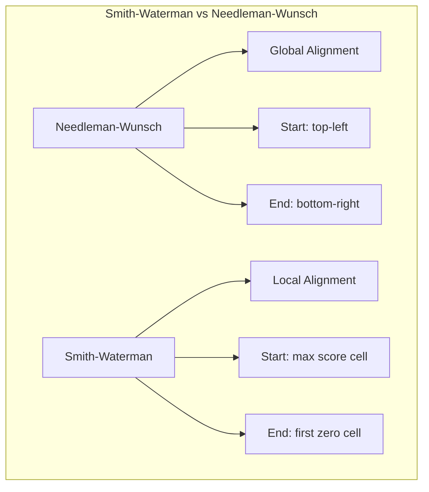
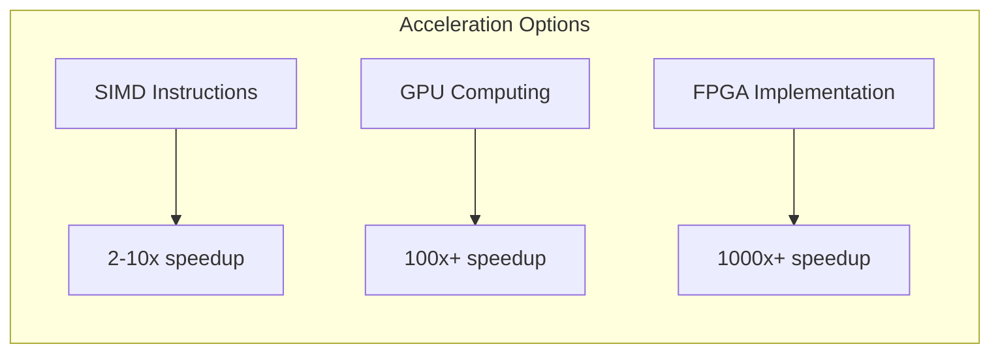

# Smith-Waterman Algorithm

## Overview
| Property | Value |
|----------|-------|
| **Category** | Dynamic Programming, Sequence Alignment |
| **Complexity (Time)** | O(m × n) |
| **Complexity (Space)** | O(m × n) |
| **Input** | Two sequences (strings/DNA/protein) |
| **Output** | Optimal local alignment |
| **Source** | [smith_waterman.py](../../../dynamic_programming/smith_waterman.py) |

## 1. Mathematical Foundation

### 1.1 Problem Definition

Given two sequences $A = a_1a_2...a_m$ and $B = b_1b_2...b_n$, find the highest-scoring local alignment. Unlike global alignment (Needleman-Wunsch), local alignment identifies the most similar subsequences.

**Scoring System:**
- Match score: $s(a_i, b_j) = +\alpha$ if $a_i = b_j$
- Mismatch penalty: $s(a_i, b_j) = -\beta$ if $a_i \neq b_j$
- Gap penalty: $g = -\gamma$ (linear) or $g(k) = -d - e(k-1)$ (affine)

### 1.2 Recurrence Relation

Let $H(i,j)$ be the maximum alignment score ending at position $(i,j)$:

$$
H(i,j) = \max \begin{cases}
0 & \text{(restart: local alignment)} \\
H(i-1, j-1) + s(a_i, b_j) & \text{(match/mismatch)} \\
H(i-1, j) + g & \text{(gap in B)} \\
H(i, j-1) + g & \text{(gap in A)}
\end{cases}
$$

**Key Difference from Needleman-Wunsch:** The zero option allows the alignment to restart, enabling local alignments.

### 1.3 Initialization

$$H(i, 0) = 0 \quad \forall i \in [0, m]$$
$$H(0, j) = 0 \quad \forall j \in [0, n]$$

### 1.4 Optimal Score

$$\text{Score}^* = \max_{i,j} H(i,j)$$

The alignment is found by backtracking from the maximum score cell until reaching a cell with value 0.

## 2. Algorithm Description

### 2.1 Intuition

The algorithm builds a scoring matrix where each cell represents the best local alignment ending at that position. The zero option allows "free" restarts, so poor-scoring regions don't drag down the score.

### 2.2 Step-by-Step Process

1. Initialize scoring matrix with zeros
2. Fill matrix using recurrence relation
3. Find maximum score position
4. Backtrack to construct alignment
5. Stop when reaching a cell with value 0

## 3. Pseudocode

```
ALGORITHM SmithWaterman(A, B, match, mismatch, gap)
    INPUT: 
        A - sequence of length m
        B - sequence of length n
        match - match score
        mismatch - mismatch penalty (negative)
        gap - gap penalty (negative)
    OUTPUT: 
        aligned_A, aligned_B - aligned sequences
        score - alignment score
    
    // Initialize matrix
    1. H ← 2D array [m+1 × n+1], initialized to 0
    2. max_score ← 0
    3. max_pos ← (0, 0)
    
    // Fill matrix
    4. for i ← 1 to m do
           for j ← 1 to n do
               // Compute score for match/mismatch
               if A[i] = B[j] then
                   diag ← H[i-1][j-1] + match
               else
                   diag ← H[i-1][j-1] + mismatch
               end if
               
               // Compute scores for gaps
               up ← H[i-1][j] + gap
               left ← H[i][j-1] + gap
               
               // Take maximum (including 0 for restart)
               H[i][j] ← MAX(0, diag, up, left)
               
               // Track maximum score position
               if H[i][j] > max_score then
                   max_score ← H[i][j]
                   max_pos ← (i, j)
               end if
           end for
       end for
    
    // Backtrack to construct alignment
    5. aligned_A ← ""
    6. aligned_B ← ""
    7. i, j ← max_pos
    
    8. while H[i][j] > 0 do
           if H[i][j] = H[i-1][j-1] + score(A[i], B[j]) then
               aligned_A ← A[i] + aligned_A
               aligned_B ← B[j] + aligned_B
               i ← i - 1
               j ← j - 1
           else if H[i][j] = H[i-1][j] + gap then
               aligned_A ← A[i] + aligned_A
               aligned_B ← "-" + aligned_B
               i ← i - 1
           else
               aligned_A ← "-" + aligned_A
               aligned_B ← B[j] + aligned_B
               j ← j - 1
           end if
       end while
    
    9. return aligned_A, aligned_B, max_score
```

## 4. Complexity Analysis

### 4.1 Time Complexity

| Phase | Complexity | Explanation |
|-------|------------|-------------|
| Matrix Fill | O(m × n) | Visit each cell once |
| Find Maximum | O(m × n) | Can be done during fill |
| Backtrack | O(m + n) | At most m+n steps |
| **Total** | **O(m × n)** | |

### 4.2 Space Complexity

| Approach | Complexity | Notes |
|----------|------------|-------|
| Standard | O(m × n) | Full matrix storage |
| Space-optimized | O(min(m,n)) | Two rows, no backtrack |
| With traceback | O(m × n) | Required for alignment |

## 5. Visual Representation

### Example: A = "ACACACTA", B = "AGCACACA"

Scoring: match = +2, mismatch = -1, gap = -1

```
        -    A    G    C    A    C    A    C    A
    -   0    0    0    0    0    0    0    0    0
    A   0    2    1    0    2    1    2    1    2
    C   0    1    1    3    2    4    3    4    3
    A   0    2    1    2    5    4    6    5    6
    C   0    1    1    3    4    7    6    8    7
    A   0    2    1    2    5    6    9    8   10
    C   0    1    1    3    4    7    8   11   10
    T   0    0    0    2    3    6    7   10   10
    A   0    2    1    1    4    5    8    9   12 ← Max
```

**Backtrack Path:**
```
        A    G    C    A    C    A    C    A
    A   ↖
    C        ↖    
    A             ↖   
    C                  ↖   
    A                       ↖   
    C                            ↖   
    T                                 
    A                            ↖    ↖
```

**Alignment Result:**
```
A-CACACTA
| ||||x||
AGCACAC-A

Score: 12
```



## 6. Implementation Notes

### 6.1 Key Data Structures

| Structure | Purpose |
|-----------|---------|
| Score Matrix | Store alignment scores |
| Direction Matrix | Store backtrack directions |
| Gap Functions | Handle affine gap penalties |

### 6.2 Affine Gap Penalty Extension

For biological realism, use affine gaps: $g(k) = -d - e(k-1)$

Requires three matrices:
- $H$: Best alignment ending with match/mismatch
- $E$: Best alignment ending with gap in A  
- $F$: Best alignment ending with gap in B

### 6.3 Edge Cases

| Edge Case | Handling |
|-----------|----------|
| Empty sequence | Return empty alignment |
| Identical sequences | Perfect diagonal alignment |
| No similarity | Return empty alignment (score ≤ 0) |
| Multiple max scores | Can find all or first |

## 7. Comparison with Related Algorithms

| Algorithm | Type | Zero Option | Use Case |
|-----------|------|-------------|----------|
| Smith-Waterman | Local | Yes | Finding conserved regions |
| Needleman-Wunsch | Global | No | Full sequence alignment |
| BLAST | Heuristic | N/A | Fast database search |
| FASTA | Heuristic | N/A | Fast similarity search |

## 8. Real-World Software Engineering Applications

### 8.1 Industry Use Cases

1. **Bioinformatics**
   - DNA sequence alignment
   - Protein sequence comparison
   - Gene finding
   - Mutation detection
   - Phylogenetic analysis

2. **Text Processing**
   - Plagiarism detection
   - Document similarity
   - Version control diff tools
   - Fuzzy string matching

3. **Speech Recognition**
   - Phoneme alignment
   - Speech-to-text correction
   - Pronunciation variation handling

4. **Computer Security**
   - Malware signature detection
   - Code clone detection
   - Pattern matching in logs

5. **Data Integration**
   - Schema matching
   - Record linkage
   - Entity resolution
   - Data deduplication

### 8.2 Production Tools Using Smith-Waterman

| Tool | Domain | Usage |
|------|--------|-------|
| EMBOSS Water | Bioinformatics | Pairwise local alignment |
| SSEARCH | Bioinformatics | Database similarity search |
| Exonerate | Genomics | Splice-aware alignment |
| BWA-SW | Genomics | Long read alignment |

### 8.3 Production Example

```python
class DNAAligner:
    """
    DNA sequence aligner for genomic analysis pipelines.
    Used in variant calling and gene annotation.
    """
    
    def __init__(self, match=2, mismatch=-1, gap=-1):
        self.match = match
        self.mismatch = mismatch
        self.gap = gap
        
        # Nucleotide substitution matrix (simplified)
        self.sub_matrix = self._init_substitution_matrix()
    
    def align(self, query: str, reference: str) -> dict:
        """
        Perform local alignment of query against reference.
        
        Returns:
            {
                'score': alignment score,
                'query_aligned': aligned query with gaps,
                'ref_aligned': aligned reference with gaps,
                'query_start': start position in query,
                'ref_start': start position in reference
            }
        """
        # Smith-Waterman implementation
        pass
    
    def find_variants(self, alignment: dict) -> list:
        """
        Extract variants (SNPs, indels) from alignment.
        Used in clinical genomics pipelines.
        """
        pass
```

### 8.4 Hardware Acceleration

Due to its O(mn) complexity, Smith-Waterman benefits from parallelization:



| Implementation | Speedup | Use Case |
|---------------|---------|----------|
| SSE/AVX SIMD | 2-10x | Desktop applications |
| CUDA/OpenCL | 100x+ | Large-scale analysis |
| FPGA | 1000x+ | Real-time sequencing |

## 9. References

- Smith, T.F. & Waterman, M.S. (1981). "Identification of common molecular subsequences"
- Gotoh, O. (1982). "An improved algorithm for matching biological sequences"
- [Wikipedia: Smith-Waterman Algorithm](https://en.wikipedia.org/wiki/Smith%E2%80%93Waterman_algorithm)
- [NCBI BLAST](https://blast.ncbi.nlm.nih.gov/Blast.cgi)
