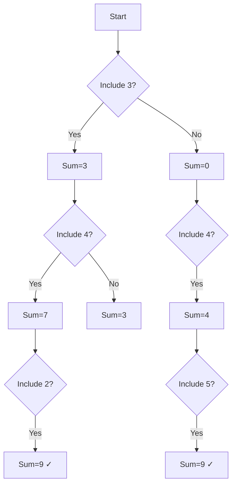
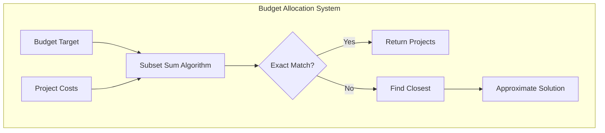

# Sum of Subsets

## Overview
| Property | Value |
|----------|-------|
| **Category** | Dynamic Programming, Subset Problems |
| **Complexity (Time)** | O(n × target) |
| **Complexity (Space)** | O(target) optimized |
| **Input** | Array of integers, target sum |
| **Output** | Boolean (subset exists) or count |
| **Source** | [sum_of_subset.py](../../../dynamic_programming/sum_of_subset.py) |

## 1. Mathematical Foundation

### 1.1 Problem Definition

Given a set $S = \{s_1, s_2, ..., s_n\}$ of $n$ positive integers and a target sum $T$, determine if there exists a subset $S' \subseteq S$ such that:

$$
\sum_{s_i \in S'} s_i = T
$$

### 1.2 Recurrence Relation

Let $dp[i][j]$ = true if a subset of $\{s_1, ..., s_i\}$ sums to $j$

**Base Cases:**
$$dp[0][0] = \text{true}$$
$$dp[i][0] = \text{true} \quad \forall i \text{ (empty subset)}$$
$$dp[0][j] = \text{false} \quad \forall j > 0$$

**Recurrence:**
$$
dp[i][j] = \begin{cases}
dp[i-1][j] & \text{if } s_i > j \text{ (can't include)} \\
dp[i-1][j] \lor dp[i-1][j-s_i] & \text{otherwise}
\end{cases}
$$

The two choices are:
1. **Exclude** $s_i$: subset sum must equal $j$ using $\{s_1,...,s_{i-1}\}$
2. **Include** $s_i$: subset sum must equal $j - s_i$ using $\{s_1,...,s_{i-1}\}$

### 1.3 NP-Completeness

The Subset Sum problem is **NP-Complete**:
- In NP: Solution can be verified in O(n) time
- NP-Hard: Reduces from 3-SAT
- The DP solution is **pseudo-polynomial**: polynomial in n and T, but T can be exponential in input size

## 2. Algorithm Description

### 2.1 Intuition

Build a table tracking which sums are achievable using subsets of the first i elements. For each new element, we can either include it or exclude it, creating new achievable sums.

### 2.2 Step-by-Step Process

1. Initialize base cases
2. For each element, update achievable sums
3. Check if target is achievable

## 3. Pseudocode

### 3.1 2D DP Approach

```
ALGORITHM SubsetSum(arr, n, target)
    INPUT: Array arr[1..n], integer target
    OUTPUT: true if subset with sum=target exists
    
    1. dp ← 2D array [n+1 × target+1], initialized to false
    
    // Base case: empty subset sums to 0
    2. for i ← 0 to n do
           dp[i][0] ← true
       end for
    
    // Fill DP table
    3. for i ← 1 to n do
           for j ← 1 to target do
               if arr[i] > j then
                   // Can't include current element
                   dp[i][j] ← dp[i-1][j]
               else
                   // Include OR exclude current element
                   dp[i][j] ← dp[i-1][j] OR dp[i-1][j - arr[i]]
               end if
           end for
       end for
    
    4. return dp[n][target]
```

### 3.2 Space-Optimized 1D DP

```
ALGORITHM SubsetSumOptimized(arr, n, target)
    INPUT: Array arr[1..n], integer target
    OUTPUT: true if subset with sum=target exists
    
    1. dp ← array [target+1], initialized to false
    2. dp[0] ← true
    
    // Process each element
    3. for i ← 1 to n do
           // Traverse backwards to avoid using same element twice
           for j ← target down to arr[i] do
               dp[j] ← dp[j] OR dp[j - arr[i]]
           end for
       end for
    
    4. return dp[target]
```

### 3.3 Count Subsets Variant

```
ALGORITHM CountSubsetSum(arr, n, target)
    INPUT: Array arr[1..n], integer target
    OUTPUT: Number of subsets with sum=target
    
    1. dp ← array [target+1], initialized to 0
    2. dp[0] ← 1  // Empty subset
    
    3. for i ← 1 to n do
           for j ← target down to arr[i] do
               dp[j] ← dp[j] + dp[j - arr[i]]
           end for
       end for
    
    4. return dp[target]
```

### 3.4 Find Actual Subset (Backtracking)

```
ALGORITHM FindSubset(arr, n, target, dp)
    INPUT: Array, target, filled DP table
    OUTPUT: List of elements in subset
    
    1. result ← []
    2. i ← n
    3. j ← target
    
    4. while i > 0 AND j > 0 do
           if dp[i][j] ≠ dp[i-1][j] then
               // Current element is included
               result.ADD(arr[i])
               j ← j - arr[i]
           end if
           i ← i - 1
       end while
    
    5. return result
```

## 4. Complexity Analysis

### 4.1 Time Complexity

| Approach | Complexity | Notes |
|----------|------------|-------|
| 2D DP | O(n × T) | Pseudo-polynomial |
| 1D DP | O(n × T) | Same, better constants |
| Backtracking | O(2ⁿ) | Exponential worst case |
| Meet-in-Middle | O(2^(n/2)) | Better for small T |

### 4.2 Space Complexity

| Approach | Complexity |
|----------|------------|
| 2D DP | O(n × T) |
| 1D DP | O(T) |
| Backtracking | O(n) |
| Meet-in-Middle | O(2^(n/2)) |

## 5. Visual Representation

### Example: arr = [3, 34, 4, 12, 5, 2], target = 9

```
DP Table (2D):
          0   1   2   3   4   5   6   7   8   9
    {}    T   F   F   F   F   F   F   F   F   F
    {3}   T   F   F   T   F   F   F   F   F   F
    {3,34}T   F   F   T   F   F   F   F   F   F
    {3,34,4}  T   F   F   T   T   F   F   T   F   F
    {3,34,4,12}   ...
    {3,34,4,12,5} T   F   F   T   T   T   F   T   T   T
    {3,34,4,12,5,2}   T   F   T   T   T   T   T   T   T   T
                                                          ↑
                                                        TRUE
Solution: {4, 5} or {3, 4, 2}
```



## 6. Implementation Notes

### 6.1 Key Optimizations

1. **Early termination**: If target found, return immediately
2. **Prune impossibles**: Skip if remaining sum < target
3. **Sort optimization**: Process larger elements first for early termination

### 6.2 Edge Cases

| Case | Result |
|------|--------|
| target = 0 | true (empty subset) |
| Empty array, target > 0 | false |
| All elements > target | false |
| Single element = target | true |
| Sum of all < target | false |

### 6.3 Handling Negative Numbers

Standard DP doesn't work with negatives. Options:
1. Offset all numbers to make positive
2. Use hash map instead of array
3. Split into positive and negative subsets

## 7. Related Problems

| Problem | Modification |
|---------|--------------|
| Partition Equal Subset Sum | target = sum(arr)/2 |
| Target Sum (+/-) | Count ways with + and - |
| Minimum Subset Sum Difference | Minimize |S1 - S2| |
| Count of Subset Sum | Return count, not boolean |
| Perfect Sum | Subsets with exactly k elements |

## 8. Real-World Software Engineering Applications

### 8.1 Industry Use Cases

1. **Resource Allocation**
   - Budget allocation across projects
   - Memory allocation in systems
   - Load balancing across servers
   - Task scheduling with constraints

2. **Cryptography**
   - Merkle-Hellman knapsack cryptosystem
   - Key generation
   - Cryptographic puzzles

3. **Finance**
   - Portfolio optimization
   - Invoice matching
   - Expense reconciliation
   - Budget fitting

4. **Gaming**
   - Puzzle generation (exact sum challenges)
   - Loot distribution
   - Achievement systems
   - Level design constraints

5. **Logistics**
   - Container packing
   - Shipment batching
   - Delivery route constraints
   - Inventory management

### 8.2 Production Example

```python
class BudgetAllocator:
    """
    Allocate budget across projects to hit target spending.
    Used in financial planning systems.
    """
    
    def __init__(self, projects: dict[str, int]):
        """
        Initialize with project costs.
        projects: {project_name: cost}
        """
        self.projects = projects
        self.costs = list(projects.values())
        self.names = list(projects.keys())
    
    def can_allocate_exactly(self, budget: int) -> bool:
        """
        Check if we can spend exactly the budget.
        
        >>> allocator = BudgetAllocator({'A': 100, 'B': 200, 'C': 150})
        >>> allocator.can_allocate_exactly(350)
        True  # A + C or B + C - A... depends on constraints
        """
        n = len(self.costs)
        dp = [False] * (budget + 1)
        dp[0] = True
        
        for cost in self.costs:
            for j in range(budget, cost - 1, -1):
                dp[j] = dp[j] or dp[j - cost]
        
        return dp[budget]
    
    def find_allocation(self, budget: int) -> list[str]:
        """
        Return projects that sum to exactly budget.
        """
        n = len(self.costs)
        dp = [[False] * (budget + 1) for _ in range(n + 1)]
        dp[0][0] = True
        
        for i in range(1, n + 1):
            for j in range(budget + 1):
                if self.costs[i-1] > j:
                    dp[i][j] = dp[i-1][j]
                else:
                    dp[i][j] = dp[i-1][j] or dp[i-1][j - self.costs[i-1]]
        
        if not dp[n][budget]:
            return []
        
        # Backtrack to find solution
        result = []
        i, j = n, budget
        while i > 0 and j > 0:
            if dp[i][j] != dp[i-1][j]:
                result.append(self.names[i-1])
                j -= self.costs[i-1]
            i -= 1
        
        return result


class InvoiceMatcher:
    """
    Match invoices to payments in accounting systems.
    Common in ERP and financial software.
    """
    
    def find_matching_invoices(self, invoices: list[float], 
                                payment: float, 
                                tolerance: float = 0.01) -> list[int]:
        """
        Find invoices that sum to payment amount.
        
        Returns list of invoice indices or empty if no match.
        """
        # Convert to cents for integer arithmetic
        int_invoices = [int(inv * 100) for inv in invoices]
        int_payment = int(payment * 100)
        
        # Apply subset sum algorithm
        # ... implementation
        pass
```

### 8.3 System Design



## 9. Optimizations for Special Cases

### 9.1 Meet-in-the-Middle (Small n, Large T)

```python
def subset_sum_mitm(arr, target):
    """
    Meet-in-the-middle for n ≤ 40.
    Time: O(2^(n/2)), Space: O(2^(n/2))
    """
    n = len(arr)
    mid = n // 2
    
    # Generate all subset sums for first half
    left_sums = set()
    for mask in range(1 << mid):
        s = sum(arr[i] for i in range(mid) if mask & (1 << i))
        left_sums.add(s)
    
    # Check if any right subset completes the target
    for mask in range(1 << (n - mid)):
        s = sum(arr[mid + i] for i in range(n - mid) if mask & (1 << i))
        if target - s in left_sums:
            return True
    
    return target in left_sums
```

### 9.2 Bitset Optimization

For better cache performance:
```python
from bitarray import bitarray

def subset_sum_bitset(arr, target):
    dp = bitarray(target + 1)
    dp.setall(0)
    dp[0] = 1
    
    for num in arr:
        dp |= (dp << num)[:target + 1]
    
    return dp[target]
```

## 10. References

- [Wikipedia: Subset Sum Problem](https://en.wikipedia.org/wiki/Subset_sum_problem)
- Cormen, T. et al. "Introduction to Algorithms" - Chapter 16
- [LeetCode Problem 416: Partition Equal Subset Sum](https://leetcode.com/problems/partition-equal-subset-sum/)
- Karp, R.M. (1972). "Reducibility among Combinatorial Problems"
