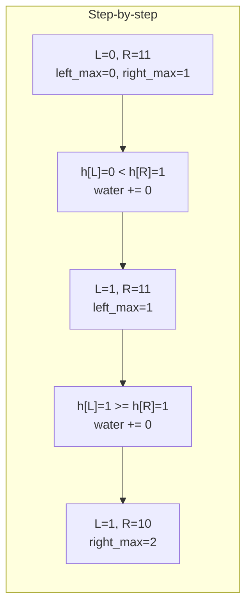

# Trapped Rainwater Problem

| Property | Value |
|----------|-------|
| Category | Dynamic Programming |
| Subcategory | Array/Two Pointers |
| Complexity (Time) | O(n) |
| Complexity (Space) | O(n) or O(1) |
| Input | Array of bar heights |
| Output | Total trapped water |

## Overview

The **Trapped Rainwater Problem** calculates how much water can be trapped between bars after rainfall, given an elevation map where each bar has width 1. This elegant problem can be solved using DP with precomputed maximums or optimally with two pointers.

## Mathematical Foundation

### Problem Definition

Given array $H = [h_0, h_1, ..., h_{n-1}]$ representing bar heights:

$$\text{water} = \sum_{i=0}^{n-1} \max(0, \min(leftMax_i, rightMax_i) - h_i)$$

Where:
- $leftMax_i = \max(h_0, h_1, ..., h_i)$
- $rightMax_i = \max(h_i, h_{i+1}, ..., h_{n-1})$

### Key Insight

Water trapped at position $i$ is bounded by the minimum of:
- Highest bar to the left
- Highest bar to the right

Minus the height of the current bar.

### Formula per Position

$$water_i = \min(leftMax_i, rightMax_i) - h_i$$

If this is negative, no water is trapped at position $i$.

## Algorithm Approaches

### 1. Brute Force (O(n²))

```
TRAP-WATER-BRUTE(heights):
    n = length(heights)
    water = 0
    
    for i from 0 to n-1:
        left_max = 0
        for j from 0 to i:
            left_max = max(left_max, heights[j])
        
        right_max = 0
        for j from i to n-1:
            right_max = max(right_max, heights[j])
        
        water = water + min(left_max, right_max) - heights[i]
    
    return water
```

### 2. DP with Precomputed Arrays (O(n))

```
TRAP-WATER-DP(heights):
    n = length(heights)
    if n == 0:
        return 0
    
    // Precompute left maximums
    left_max = array of size n
    left_max[0] = heights[0]
    for i from 1 to n-1:
        left_max[i] = max(left_max[i-1], heights[i])
    
    // Precompute right maximums
    right_max = array of size n
    right_max[n-1] = heights[n-1]
    for i from n-2 to 0:
        right_max[i] = max(right_max[i+1], heights[i])
    
    // Calculate water
    water = 0
    for i from 0 to n-1:
        water = water + min(left_max[i], right_max[i]) - heights[i]
    
    return water
```

### 3. Two-Pointer (O(n) time, O(1) space)

```
TRAP-WATER-TWO-POINTER(heights):
    if length(heights) < 3:
        return 0
    
    left = 0
    right = n - 1
    left_max = 0
    right_max = 0
    water = 0
    
    while left < right:
        if heights[left] < heights[right]:
            if heights[left] >= left_max:
                left_max = heights[left]
            else:
                water = water + left_max - heights[left]
            left = left + 1
        else:
            if heights[right] >= right_max:
                right_max = heights[right]
            else:
                water = water + right_max - heights[right]
            right = right - 1
    
    return water
```

### 4. Stack-Based (O(n))

```
TRAP-WATER-STACK(heights):
    stack = empty stack  // stores indices
    water = 0
    
    for i from 0 to n-1:
        while stack is not empty and heights[i] > heights[top(stack)]:
            top_idx = pop(stack)
            if stack is empty:
                break
            
            distance = i - top(stack) - 1
            bounded_height = min(heights[i], heights[top(stack)]) - heights[top_idx]
            water = water + distance × bounded_height
        
        push(stack, i)
    
    return water
```

## Complexity Analysis

| Approach | Time | Space | Notes |
|----------|------|-------|-------|
| Brute Force | O(n²) | O(1) | Recompute max each position |
| DP Arrays | O(n) | O(n) | Precompute left/right max |
| Two-Pointer | O(n) | O(1) | Optimal |
| Stack | O(n) | O(n) | Horizontal layer approach |

## Visual Representation

### Example Elevation Map

```
Heights: [0, 1, 0, 2, 1, 0, 1, 3, 2, 1, 2, 1]

Index:     0  1  2  3  4  5  6  7  8  9 10 11

         3 |              ██
         2 |        ██≈≈≈≈██ ██≈≈██
         1 |  ██≈≈██ ██≈≈██ ██ ██ ██ ██
         0 |══════════════════════════════
               0  1  0  2  1  0  1  3  2  1  2  1
               
≈ = trapped water
██ = bars

Total water trapped: 6 units
```

### DP Arrays Visualization

```
heights:    [0, 1, 0, 2, 1, 0, 1, 3, 2, 1, 2, 1]
left_max:   [0, 1, 1, 2, 2, 2, 2, 3, 3, 3, 3, 3]
right_max:  [3, 3, 3, 3, 3, 3, 3, 3, 2, 2, 2, 1]

Water at each position:
min(L,R) - h:
position 0: min(0,3) - 0 = 0
position 1: min(1,3) - 1 = 0
position 2: min(1,3) - 0 = 1  ← water!
position 3: min(2,3) - 2 = 0
position 4: min(2,3) - 1 = 1  ← water!
position 5: min(2,3) - 0 = 2  ← water!
position 6: min(2,3) - 1 = 1  ← water!
position 7: min(3,3) - 3 = 0
position 8: min(3,2) - 2 = 0
position 9: min(3,2) - 1 = 1  ← water!
position 10: min(3,2) - 2 = 0
position 11: min(3,1) - 1 = 0

Total: 0+0+1+0+1+2+1+0+0+1+0+0 = 6
```

### Two-Pointer Trace



## Implementation (from repository)

```python
def trapped_rainwater(heights: tuple[int, ...]) -> int:
    """
    The trapped_rainwater function calculates the total amount of rainwater that can be
    trapped given an array of bar heights.
    It uses a dynamic programming approach, determining the maximum height of bars on
    both sides for each bar, and then computing the trapped water above each bar.
    The function returns the total trapped water.

    >>> trapped_rainwater((0, 1, 0, 2, 1, 0, 1, 3, 2, 1, 2, 1))
    6
    >>> trapped_rainwater((7, 1, 5, 3, 6, 4))
    9
    >>> trapped_rainwater((7, 1, 5, 3, 6, -1))
    Traceback (most recent call last):
        ...
    ValueError: No height can be negative
    """
    if not heights:
        return 0
    if any(h < 0 for h in heights):
        raise ValueError("No height can be negative")
    length = len(heights)

    left_max = [0] * length
    left_max[0] = heights[0]
    for i, height in enumerate(heights[1:], start=1):
        left_max[i] = max(height, left_max[i - 1])

    right_max = [0] * length
    right_max[-1] = heights[-1]
    for i in range(length - 2, -1, -1):
        right_max[i] = max(heights[i], right_max[i + 1])

    return sum(
        min(left, right) - height
        for left, right, height in zip(left_max, right_max, heights)
    )
```

## Real-World Applications

### 1. Urban Drainage Planning

```python
from typing import List, Tuple, Dict

def analyze_drainage_capacity(
    terrain_heights: List[float],
    drain_positions: List[int]
) -> Dict:
    """
    Analyze water accumulation and drainage requirements.
    
    >>> heights = [2, 1, 0, 1, 3, 2, 1, 2, 1, 0, 1, 2]
    >>> drains = [5, 9]  # Drain positions
    >>> result = analyze_drainage_capacity(heights, drains)
    >>> 'total_capacity' in result
    True
    """
    n = len(terrain_heights)
    
    # Calculate water levels
    left_max = [0] * n
    right_max = [0] * n
    
    left_max[0] = terrain_heights[0]
    for i in range(1, n):
        left_max[i] = max(left_max[i-1], terrain_heights[i])
    
    right_max[-1] = terrain_heights[-1]
    for i in range(n-2, -1, -1):
        right_max[i] = max(right_max[i+1], terrain_heights[i])
    
    # Water at each position
    water_levels = [
        max(0, min(left_max[i], right_max[i]) - terrain_heights[i])
        for i in range(n)
    ]
    
    # Analyze segments between drains
    segments = []
    prev_drain = 0
    for drain in sorted(drain_positions + [n]):
        segment_water = sum(water_levels[prev_drain:drain])
        segments.append({
            'start': prev_drain,
            'end': drain,
            'water_volume': segment_water
        })
        prev_drain = drain
    
    return {
        'total_capacity': sum(water_levels),
        'water_distribution': water_levels,
        'segments': segments,
        'max_depth': max(water_levels) if water_levels else 0,
        'flood_risk_zones': [
            i for i, w in enumerate(water_levels) if w > 2  # Threshold
        ]
    }


def design_drainage_system(
    terrain: List[float],
    max_water_depth: float,
    drain_cost_per_unit: float
) -> Dict:
    """
    Design optimal drainage system to prevent flooding.
    
    >>> terrain = [3, 1, 2, 1, 4, 2, 1, 3, 1, 2]
    >>> result = design_drainage_system(terrain, 1.0, 100)
    >>> 'recommended_drains' in result
    True
    """
    n = len(terrain)
    
    # Calculate water without drains
    left_max = [terrain[0]]
    for h in terrain[1:]:
        left_max.append(max(left_max[-1], h))
    
    right_max = [0] * n
    right_max[-1] = terrain[-1]
    for i in range(n-2, -1, -1):
        right_max[i] = max(right_max[i+1], terrain[i])
    
    water_depth = [
        max(0, min(left_max[i], right_max[i]) - terrain[i])
        for i in range(n)
    ]
    
    # Find positions exceeding threshold
    problem_zones = [i for i, w in enumerate(water_depth) if w > max_water_depth]
    
    # Greedy drain placement
    drains = []
    covered = set()
    
    for zone in problem_zones:
        if zone not in covered:
            # Place drain at lowest point in neighborhood
            start = max(0, zone - 2)
            end = min(n, zone + 3)
            best_pos = min(range(start, end), key=lambda i: terrain[i])
            drains.append(best_pos)
            covered.update(range(start, end))
    
    return {
        'original_max_depth': max(water_depth),
        'problem_zones': problem_zones,
        'recommended_drains': drains,
        'estimated_cost': len(drains) * drain_cost_per_unit,
        'water_reduced': sum(water_depth[d] for d in drains)
    }
```

### 2. Container Loading Optimization

```python
from typing import List, Tuple

def calculate_container_fill(
    compartment_heights: List[int],
    liquid_level: int
) -> Dict:
    """
    Calculate liquid distribution in compartmentalized container.
    
    >>> heights = [3, 1, 2, 4, 1, 2, 3]  # Partition heights
    >>> result = calculate_container_fill(heights, 3)
    >>> result['total_liquid'] > 0
    True
    """
    n = len(compartment_heights)
    
    # Effective heights limited by liquid level
    effective = [min(h, liquid_level) for h in compartment_heights]
    
    # Calculate fill using trapped water logic
    left_max = [effective[0]]
    for h in effective[1:]:
        left_max.append(max(left_max[-1], h))
    
    right_max = [0] * n
    right_max[-1] = effective[-1]
    for i in range(n-2, -1, -1):
        right_max[i] = max(right_max[i+1], effective[i])
    
    fill_levels = [
        min(left_max[i], right_max[i])
        for i in range(n)
    ]
    
    liquid_volumes = [
        fill_levels[i] - compartment_heights[i]
        if fill_levels[i] > compartment_heights[i] else 0
        for i in range(n)
    ]
    
    return {
        'fill_levels': fill_levels,
        'liquid_per_compartment': liquid_volumes,
        'total_liquid': sum(liquid_volumes),
        'overflow': max(0, liquid_level - max(compartment_heights)),
        'capacity_utilization': sum(liquid_volumes) / (n * liquid_level) if liquid_level > 0 else 0
    }


def optimize_tank_partitions(
    tank_width: int,
    target_capacity: float,
    max_partition_height: int
) -> Dict:
    """
    Design tank partitions for target liquid capacity.
    
    >>> result = optimize_tank_partitions(10, 20, 5)
    >>> result['achieved_capacity'] >= 20
    True
    """
    # Try different partition configurations
    best_config = None
    best_waste = float('inf')
    
    for edge_height in range(1, max_partition_height + 1):
        for center_height in range(0, edge_height):
            # Create V-shaped or U-shaped profile
            heights = []
            half = tank_width // 2
            
            for i in range(half):
                h = edge_height - (edge_height - center_height) * i // half
                heights.append(h)
            
            heights.extend(heights[::-1])
            if tank_width % 2 == 1:
                heights.insert(half, center_height)
            
            # Calculate capacity
            n = len(heights)
            left_max = [heights[0]]
            for h in heights[1:]:
                left_max.append(max(left_max[-1], h))
            
            right_max = [0] * n
            right_max[-1] = heights[-1]
            for i in range(n-2, -1, -1):
                right_max[i] = max(right_max[i+1], heights[i])
            
            capacity = sum(
                max(0, min(left_max[i], right_max[i]) - heights[i])
                for i in range(n)
            )
            
            waste = abs(capacity - target_capacity)
            if capacity >= target_capacity and waste < best_waste:
                best_waste = waste
                best_config = {
                    'partition_heights': heights,
                    'achieved_capacity': capacity,
                    'edge_height': edge_height,
                    'center_height': center_height
                }
    
    return best_config or {'error': 'Cannot achieve target capacity'}
```

### 3. Terrain Analysis for Construction

```python
from typing import List, Dict, Tuple
import math

def analyze_construction_site(
    elevation_profile: List[float],
    sample_spacing: float = 1.0
) -> Dict:
    """
    Analyze terrain for construction planning.
    
    >>> elevations = [10, 8, 6, 7, 9, 5, 4, 6, 8, 7]
    >>> result = analyze_construction_site(elevations, 10.0)
    >>> 'water_accumulation_risk' in result
    True
    """
    n = len(elevation_profile)
    
    # Calculate potential water pooling
    left_max = [elevation_profile[0]]
    for h in elevation_profile[1:]:
        left_max.append(max(left_max[-1], h))
    
    right_max = [0] * n
    right_max[-1] = elevation_profile[-1]
    for i in range(n-2, -1, -1):
        right_max[i] = max(right_max[i+1], elevation_profile[i])
    
    pool_depths = [
        max(0, min(left_max[i], right_max[i]) - elevation_profile[i])
        for i in range(n)
    ]
    
    # Find significant depressions
    depressions = []
    in_depression = False
    start = 0
    
    for i, depth in enumerate(pool_depths):
        if depth > 0 and not in_depression:
            in_depression = True
            start = i
        elif depth == 0 and in_depression:
            depressions.append({
                'start': start * sample_spacing,
                'end': i * sample_spacing,
                'max_depth': max(pool_depths[start:i]),
                'volume': sum(pool_depths[start:i]) * sample_spacing
            })
            in_depression = False
    
    # Calculate fill requirements
    target_level = max(elevation_profile)
    fill_volume = sum(target_level - h for h in elevation_profile) * sample_spacing
    
    # Calculate cut requirements (if leveling to average)
    avg_level = sum(elevation_profile) / n
    cut_volume = sum(
        max(0, h - avg_level) for h in elevation_profile
    ) * sample_spacing
    
    return {
        'water_accumulation_risk': sum(pool_depths) * sample_spacing,
        'max_pool_depth': max(pool_depths),
        'depressions': depressions,
        'fill_to_level': fill_volume,
        'cut_to_average': cut_volume,
        'elevation_range': max(elevation_profile) - min(elevation_profile),
        'average_elevation': avg_level
    }


def plan_retaining_walls(
    terrain: List[float],
    target_elevation: float,
    max_wall_height: float
) -> List[Dict]:
    """
    Plan retaining wall placement for terracing.
    
    >>> terrain = [10, 12, 8, 6, 9, 11, 7, 5]
    >>> walls = plan_retaining_walls(terrain, 8, 3)
    >>> isinstance(walls, list)
    True
    """
    walls = []
    n = len(terrain)
    
    for i in range(n - 1):
        drop = terrain[i] - terrain[i + 1]
        
        if drop > 0:  # Downward slope
            if drop <= max_wall_height:
                # Single wall sufficient
                walls.append({
                    'position': i + 0.5,
                    'height': drop,
                    'type': 'single'
                })
            else:
                # Need multiple terraces
                num_walls = math.ceil(drop / max_wall_height)
                wall_height = drop / num_walls
                for w in range(num_walls):
                    walls.append({
                        'position': i + (w + 1) / (num_walls + 1),
                        'height': wall_height,
                        'type': 'terrace'
                    })
        
        elif drop < -max_wall_height:  # Steep upward, may need support
            walls.append({
                'position': i + 0.5,
                'height': -drop,
                'type': 'support'
            })
    
    return walls
```

## Variations

### 3D Container (Lake Basin)

```python
def trap_rain_water_3d(height_map: List[List[int]]) -> int:
    """
    Trapped water in 3D terrain (2D height map).
    Uses priority queue approach.
    
    >>> grid = [[1,4,3,1,3,2],[3,2,1,3,2,4],[2,3,3,2,3,1]]
    >>> trap_rain_water_3d(grid)
    4
    """
    import heapq
    
    if not height_map or not height_map[0]:
        return 0
    
    m, n = len(height_map), len(height_map[0])
    visited = [[False] * n for _ in range(m)]
    heap = []
    
    # Add border cells to heap
    for i in range(m):
        for j in [0, n - 1]:
            heapq.heappush(heap, (height_map[i][j], i, j))
            visited[i][j] = True
    for j in range(1, n - 1):
        for i in [0, m - 1]:
            heapq.heappush(heap, (height_map[i][j], i, j))
            visited[i][j] = True
    
    water = 0
    directions = [(0, 1), (0, -1), (1, 0), (-1, 0)]
    
    while heap:
        h, r, c = heapq.heappop(heap)
        
        for dr, dc in directions:
            nr, nc = r + dr, c + dc
            if 0 <= nr < m and 0 <= nc < n and not visited[nr][nc]:
                visited[nr][nc] = True
                water += max(0, h - height_map[nr][nc])
                heapq.heappush(heap, (max(h, height_map[nr][nc]), nr, nc))
    
    return water
```

## Common Pitfalls

1. **Negative heights**: Invalid input, should validate
2. **Empty array**: Return 0
3. **Single/two elements**: Cannot trap water
4. **Integer overflow**: For large arrays with tall bars

## References

- [Trapping Rain Water - LeetCode](https://leetcode.com/problems/trapping-rain-water/)
- [Container With Most Water](https://leetcode.com/problems/container-with-most-water/)

## See Also

- [Container With Most Water](container_most_water.md) - Related problem
- [Largest Rectangle in Histogram](largest_rectangle_histogram.md) - Stack approach
- [Maximum Subarray](max_subarray_sum.md) - Array DP
