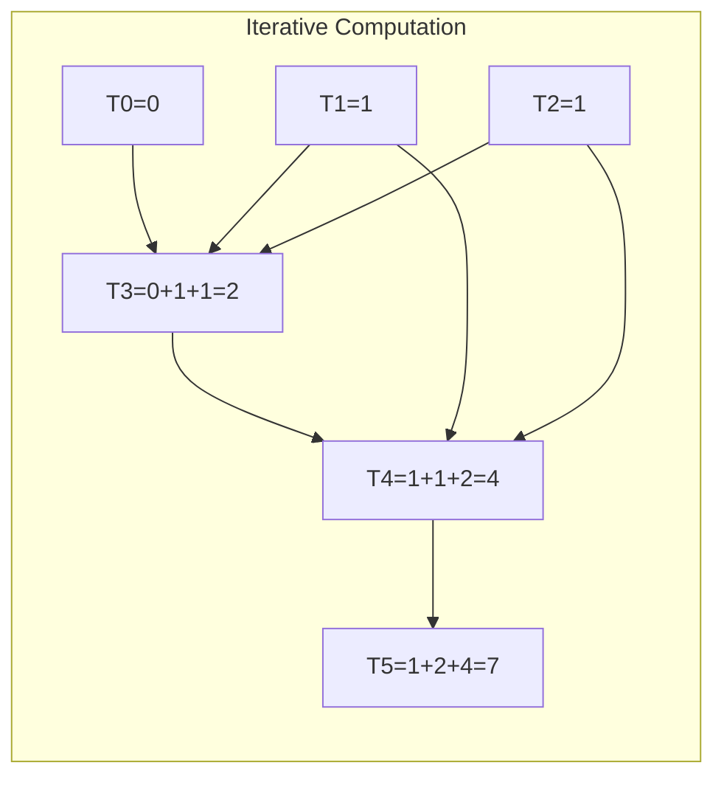

# Tribonacci Sequence

## Overview
| Property | Value |
|----------|-------|
| **Category** | Dynamic Programming, Number Sequences |
| **Complexity (Time)** | O(n) or O(log n) with matrix exponentiation |
| **Complexity (Space)** | O(1) |
| **Input** | Integer n |
| **Output** | n-th Tribonacci number |
| **Source** | [tribonacci.py](../../../dynamic_programming/tribonacci.py) |

## 1. Mathematical Foundation

### 1.1 Definition

The Tribonacci sequence is defined by the recurrence relation:

$$
T(n) = \begin{cases}
0 & \text{if } n = 0 \\
1 & \text{if } n = 1 \\
1 & \text{if } n = 2 \\
T(n-1) + T(n-2) + T(n-3) & \text{if } n > 2
\end{cases}
$$

**Sequence:** 0, 1, 1, 2, 4, 7, 13, 24, 44, 81, 149, 274, ...

### 1.2 Closed-Form Solution

The Tribonacci constant (analogous to golden ratio for Fibonacci):

$$
\tau = \frac{1 + \sqrt[3]{19 + 3\sqrt{33}} + \sqrt[3]{19 - 3\sqrt{33}}}{3} \approx 1.83929
$$

Closed form (Binet-like formula):

$$
T(n) = \text{round}\left(\frac{3\tau^n}{(\tau - 1)(2\tau^2 + 2\tau + 3)}\right)
$$

### 1.3 Matrix Exponentiation Form

$$
\begin{bmatrix}
T(n+2) \\
T(n+1) \\
T(n)
\end{bmatrix}
=
\begin{bmatrix}
1 & 1 & 1 \\
1 & 0 & 0 \\
0 & 1 & 0
\end{bmatrix}^n
\begin{bmatrix}
1 \\
1 \\
0
\end{bmatrix}
$$

### 1.4 Generating Function

$$
\sum_{n=0}^{\infty} T(n) x^n = \frac{x}{1 - x - x^2 - x^3}
$$

## 2. Algorithm Description

### 2.1 Intuition

Each Tribonacci number is the sum of the three preceding numbers. Unlike Fibonacci (2 terms), Tribonacci uses 3 terms, leading to faster growth.

### 2.2 Growth Rate Comparison

| n | Fibonacci | Tribonacci | Ratio (Trib/Fib) |
|---|-----------|------------|------------------|
| 5 | 5 | 7 | 1.4 |
| 10 | 55 | 149 | 2.7 |
| 15 | 610 | 3136 | 5.1 |
| 20 | 6765 | 66012 | 9.8 |

## 3. Pseudocode

### 3.1 Iterative (Space-Optimized)

```
ALGORITHM TribonacciIterative(n)
    INPUT: Non-negative integer n
    OUTPUT: n-th Tribonacci number
    
    1. if n = 0 then return 0
    2. if n ≤ 2 then return 1
    
    3. t0 ← 0, t1 ← 1, t2 ← 1
    
    4. for i ← 3 to n do
           t3 ← t0 + t1 + t2
           t0 ← t1
           t1 ← t2
           t2 ← t3
       end for
    
    5. return t2
```

### 3.2 Matrix Exponentiation (O(log n))

```
ALGORITHM TribonacciMatrix(n)
    INPUT: Non-negative integer n
    OUTPUT: n-th Tribonacci number
    
    1. if n = 0 then return 0
    2. if n ≤ 2 then return 1
    
    3. M ← [[1,1,1], [1,0,0], [0,1,0]]
    4. result ← MatrixPower(M, n-2)
    
    5. return result[0][0] + result[0][1]  // T(2)*M[0][0] + T(1)*M[0][1]

ALGORITHM MatrixPower(M, p)
    1. if p = 1 then return M
    2. if p is even then
           half ← MatrixPower(M, p/2)
           return MatrixMultiply(half, half)
       else
           return MatrixMultiply(M, MatrixPower(M, p-1))
       end if
```

### 3.3 Memoized Recursion

```
ALGORITHM TribonacciMemo(n, memo)
    INPUT: Integer n, memoization dictionary
    OUTPUT: n-th Tribonacci number
    
    1. if n IN memo then return memo[n]
    
    2. if n = 0 then return 0
    3. if n ≤ 2 then return 1
    
    4. result ← TribonacciMemo(n-1) + TribonacciMemo(n-2) + TribonacciMemo(n-3)
    5. memo[n] ← result
    
    6. return result
```

## 4. Complexity Analysis

### 4.1 Time Complexity

| Approach | Complexity | Notes |
|----------|------------|-------|
| Naive Recursion | O(3ⁿ) | Exponential, impractical |
| Memoization | O(n) | Linear with caching |
| Iterative | O(n) | Optimal for single query |
| Matrix Exponentiation | O(log n) | Optimal for large n |
| Closed Form | O(1) | Precision issues for large n |

### 4.2 Space Complexity

| Approach | Complexity | Notes |
|----------|------------|-------|
| Naive Recursion | O(n) | Call stack |
| Memoization | O(n) | Cache storage |
| Iterative | O(1) | Three variables |
| Matrix Exponentiation | O(log n) | Recursion stack |

## 5. Visual Representation

### Tribonacci Tree (Recursive)

```
                        T(6) = 13
                     /    |    \
                T(5)=7  T(4)=4  T(3)=2
               / | \    / | \   / | \
             T4 T3 T2  T3 T2 T1 T2 T1 T0
             4  2  1   2  1  1  1  1  0
```

### Value Growth

```
n:    0   1   2   3   4   5   6   7   8   9   10
T(n): 0   1   1   2   4   7  13  24  44  81  149
          ↑   ↑   └───┴───┘
          └───┴─────────── sum to get next
```



## 6. Implementation Notes

### 6.1 Key Observations

| Property | Value |
|----------|-------|
| Growth rate | ~1.839ⁿ |
| First non-trivial: | T(3) = 2 |
| Digits at n=100 | ~27 digits |
| Ratio Tₙ₊₁/Tₙ → | τ ≈ 1.83929 |

### 6.2 Edge Cases

| Input | Output | Notes |
|-------|--------|-------|
| n = 0 | 0 | Base case |
| n = 1 | 1 | Base case |
| n = 2 | 1 | Base case |
| n < 0 | Error/Extended | Can extend to negative indices |
| n very large | BigInt | Use arbitrary precision |

### 6.3 Integer Overflow

For n > 71 in 64-bit integers, overflow occurs. Use BigInt or modular arithmetic.

## 7. Generalization: n-Step Fibonacci

The Tribonacci is a specific case of n-step Fibonacci:

| Name | Formula | Sequence |
|------|---------|----------|
| Fibonacci | F(n) = F(n-1) + F(n-2) | 0,1,1,2,3,5,8... |
| Tribonacci | T(n) = T(n-1) + T(n-2) + T(n-3) | 0,1,1,2,4,7,13... |
| Tetranacci | Q(n) = sum of last 4 | 0,1,1,2,4,8,15... |
| Pentanacci | P(n) = sum of last 5 | 0,1,1,2,4,8,16... |

## 8. Real-World Software Engineering Applications

### 8.1 Industry Use Cases

1. **Algorithm Analysis**
   - Analyzing algorithms with 3-way branching
   - Complexity bounds for divide-and-conquer (3 subproblems)
   - Recurrence relation solving

2. **Computer Science Theory**
   - Counting problems with 3-step constraints
   - Path counting in graphs
   - State machine analysis

3. **Financial Modeling**
   - Trend analysis with 3-period lookback
   - Moving averages
   - Growth projections

4. **Combinatorics**
   - Tiling problems (1×3 tiles)
   - Counting sequences with constraints
   - Permutation enumeration

5. **Dynamic Systems**
   - Modeling systems with 3-state memory
   - Discrete dynamical systems
   - Population growth models

### 8.2 Production Example

```python
class SequenceAnalyzer:
    """
    Analyze growth patterns using Tribonacci-like sequences.
    Used in time series analysis and forecasting.
    """
    
    def __init__(self, lookback: int = 3):
        """
        Initialize with customizable lookback period.
        lookback=3 gives Tribonacci behavior.
        """
        self.lookback = lookback
        self.cache = {}
    
    def generalized_tribonacci(self, n: int, 
                                initial: tuple = (0, 1, 1)) -> int:
        """
        Compute n-th term of generalized Tribonacci.
        
        >>> analyzer = SequenceAnalyzer()
        >>> analyzer.generalized_tribonacci(10)
        149
        """
        if n < len(initial):
            return initial[n]
        
        if n in self.cache:
            return self.cache[n]
        
        # Build iteratively for efficiency
        values = list(initial)
        for i in range(len(initial), n + 1):
            values.append(sum(values[-self.lookback:]))
            # Keep only necessary values
            if len(values) > self.lookback + 1:
                values.pop(0)
        
        result = values[-1]
        self.cache[n] = result
        return result
    
    def growth_rate(self, n: int) -> float:
        """
        Compute growth rate at position n.
        Converges to Tribonacci constant τ ≈ 1.83929.
        """
        if n < 3:
            return float('inf')
        return self.generalized_tribonacci(n) / self.generalized_tribonacci(n-1)


class StepCounter:
    """
    Count ways to climb stairs with 1, 2, or 3 steps at a time.
    Classic application of Tribonacci sequence.
    """
    
    def count_ways(self, n: int) -> int:
        """
        Count distinct ways to climb n stairs.
        
        >>> counter = StepCounter()
        >>> counter.count_ways(4)
        7  # {1111, 112, 121, 211, 13, 31, 22}
        """
        if n <= 1:
            return 1
        if n == 2:
            return 2
        
        a, b, c = 1, 1, 2
        for _ in range(3, n + 1):
            a, b, c = b, c, a + b + c
        return c
```

### 8.3 System Integration

```mermaid
flowchart TD
    subgraph "Tribonacci Applications"
        A[Input n] --> B{n size?}
        B -->|Small| C[Iterative O(n)]
        B -->|Large| D[Matrix Expo O(log n)]
        C --> E[Result]
        D --> E
    end
    
    subgraph "Use Cases"
        E --> F[Combinatorics]
        E --> G[Algorithm Analysis]
        E --> H[Growth Modeling]
    end
```

## 9. Related Sequences

| Sequence | OEIS | Description |
|----------|------|-------------|
| Tribonacci | A000073 | Sum of 3 previous terms |
| Tribonacci-Lucas | A001644 | 3, 1, 3, 7, 11, 21... |
| Padovan | A000931 | P(n) = P(n-2) + P(n-3) |
| Perrin | A001608 | Similar to Padovan |

## 10. References

- [OEIS A000073: Tribonacci Numbers](https://oeis.org/A000073)
- Spickerman, W.R. (1982). "Binet's formula for the Tribonacci sequence"
- [Wikipedia: Generalizations of Fibonacci Numbers](https://en.wikipedia.org/wiki/Generalizations_of_Fibonacci_numbers)
- [LeetCode Problem 1137: N-th Tribonacci Number](https://leetcode.com/problems/n-th-tribonacci-number/)
