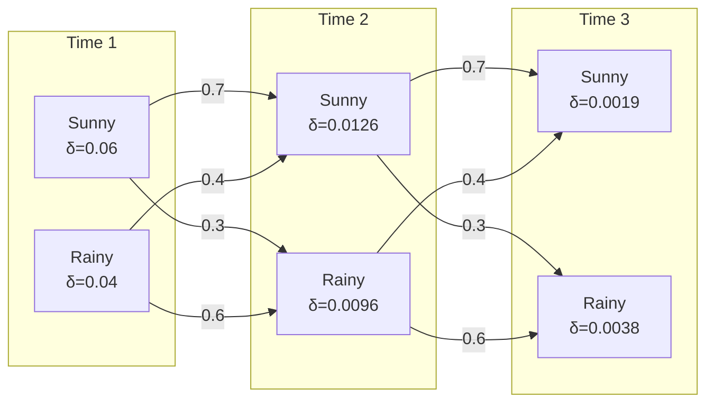
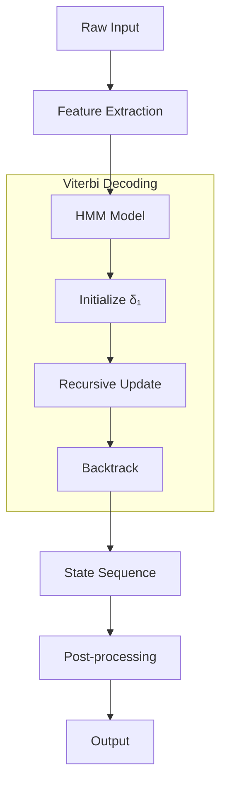

# Viterbi Algorithm

## Overview
| Property | Value |
|----------|-------|
| **Category** | Dynamic Programming, Hidden Markov Models |
| **Complexity (Time)** | O(T × N²) |
| **Complexity (Space)** | O(T × N) |
| **Input** | Observations, States, Transition/Emission Probabilities |
| **Output** | Most likely state sequence |
| **Source** | [viterbi.py](../../../dynamic_programming/viterbi.py) |

## 1. Mathematical Foundation

### 1.1 Problem Definition

Given a Hidden Markov Model (HMM) defined by:
- **States**: $S = \{s_1, s_2, ..., s_N\}$
- **Observations**: $O = \{o_1, o_2, ..., o_T\}$
- **Transition Probabilities**: $A = [a_{ij}]$ where $a_{ij} = P(s_j | s_i)$
- **Emission Probabilities**: $B = [b_j(k)]$ where $b_j(k) = P(o_k | s_j)$
- **Initial Probabilities**: $\pi = [\pi_i]$ where $\pi_i = P(s_i \text{ at } t=1)$

Find the most likely sequence of hidden states that produced the observations:

$$
Q^* = \argmax_{Q} P(Q | O, \lambda)
$$

where $\lambda = (A, B, \pi)$ is the HMM model.

### 1.2 Recurrence Relation

Define $\delta_t(i)$ as the probability of the most likely path ending in state $i$ at time $t$:

$$
\delta_1(i) = \pi_i \cdot b_i(o_1)
$$

$$
\delta_t(j) = \max_{1 \leq i \leq N} [\delta_{t-1}(i) \cdot a_{ij}] \cdot b_j(o_t)
$$

Track the path using backpointers:

$$
\psi_t(j) = \argmax_{1 \leq i \leq N} [\delta_{t-1}(i) \cdot a_{ij}]
$$

### 1.3 Final State and Backtracking

The most likely final state:
$$
q_T^* = \argmax_{1 \leq i \leq N} \delta_T(i)
$$

Backtrack to find the full sequence:
$$
q_t^* = \psi_{t+1}(q_{t+1}^*) \quad \text{for } t = T-1, T-2, ..., 1
$$

## 2. Algorithm Description

### 2.1 Intuition

The Viterbi algorithm finds the single best path through a trellis of states over time. Instead of summing over all possible paths (like forward algorithm), it takes the maximum, keeping only the best path to each state.

### 2.2 Step-by-Step Process

1. **Initialization**: Compute initial probabilities for all states at t=1
2. **Recursion**: For each time step, compute best path to each state
3. **Termination**: Find the most likely final state
4. **Backtracking**: Trace back through stored pointers to recover the path

## 3. Pseudocode

```
ALGORITHM Viterbi(observations, states, start_prob, trans_prob, emit_prob)
    INPUT: 
        observations - sequence O of length T
        states - set S of N states
        start_prob - initial probability π
        trans_prob - transition matrix A
        emit_prob - emission matrix B
    OUTPUT: 
        path - most likely state sequence
        probability - probability of this path
    
    1. T ← LENGTH(observations)
    2. N ← LENGTH(states)
    
    // Initialize
    3. delta ← 2D array [T × N]
    4. psi ← 2D array [T × N]  // backpointers
    
    5. for i ← 1 to N do
           delta[1][i] ← start_prob[i] × emit_prob[i][observations[1]]
           psi[1][i] ← 0
       end for
    
    // Recursion
    6. for t ← 2 to T do
           for j ← 1 to N do
               max_prob ← -∞
               max_state ← 0
               for i ← 1 to N do
                   prob ← delta[t-1][i] × trans_prob[i][j]
                   if prob > max_prob then
                       max_prob ← prob
                       max_state ← i
                   end if
               end for
               delta[t][j] ← max_prob × emit_prob[j][observations[t]]
               psi[t][j] ← max_state
           end for
       end for
    
    // Termination
    7. best_final_prob ← MAX(delta[T][*])
    8. best_final_state ← ARGMAX(delta[T][*])
    
    // Backtracking
    9. path ← array of size T
    10. path[T] ← best_final_state
    11. for t ← T-1 down to 1 do
            path[t] ← psi[t+1][path[t+1]]
        end for
    
    12. return path, best_final_prob
```

## 4. Complexity Analysis

### 4.1 Time Complexity

| Phase | Complexity | Explanation |
|-------|------------|-------------|
| Initialization | O(N) | Process N states |
| Recursion | O(T × N²) | T time steps, N² transitions per step |
| Backtracking | O(T) | Trace T steps |
| **Total** | **O(T × N²)** | Dominated by recursion |

### 4.2 Space Complexity

| Storage | Complexity | Notes |
|---------|------------|-------|
| Delta table | O(T × N) | Can reduce to O(N) if only need probability |
| Backpointers | O(T × N) | Required for path reconstruction |
| **Total** | **O(T × N)** | |

## 5. Visual Representation

### Example: Weather HMM

States: {Sunny, Rainy}
Observations: [Walk, Shop, Clean]

```
          t=1         t=2         t=3
         Walk        Shop        Clean
          
Sunny  ──●────────────●────────────●
         │ \        ↗ │ \        ↗ │
         │   \    /   │   \    /   │
         │     \/     │     \/     │
         │    /  \    │    /  \    │
         │  /      \  │  /      \  │
Rainy  ──●────────────●────────────●

δ₁(S) = 0.6 × 0.1 = 0.06
δ₁(R) = 0.4 × 0.1 = 0.04

δ₂(S) = max(0.06×0.7, 0.04×0.4) × 0.3 = 0.0126
δ₂(R) = max(0.06×0.3, 0.04×0.6) × 0.4 = 0.0096
```



## 6. Implementation Notes

### 6.1 Key Data Structures

| Structure | Purpose |
|-----------|---------|
| 2D Array (delta) | Store max probabilities |
| 2D Array (psi) | Store backpointers |
| Log probabilities | Prevent underflow |

### 6.2 Numerical Stability

**Use log probabilities to prevent underflow:**

$$
\log \delta_t(j) = \max_i [\log \delta_{t-1}(i) + \log a_{ij}] + \log b_j(o_t)
$$

### 6.3 Edge Cases

| Edge Case | Handling |
|-----------|----------|
| Zero probability | Use log domain, handle -∞ |
| Single observation | Return argmax of initial × emission |
| Unknown observation | Use smoothing or special handling |

## 7. Comparison with Related Algorithms

| Algorithm | Purpose | Time | Space |
|-----------|---------|------|-------|
| Viterbi | Most likely path | O(TN²) | O(TN) |
| Forward | Total probability | O(TN²) | O(N) |
| Forward-Backward | All marginals | O(TN²) | O(TN) |
| Baum-Welch | Parameter learning | O(I×TN²) | O(TN) |

## 8. Real-World Software Engineering Applications

### 8.1 Industry Use Cases

1. **Natural Language Processing**
   - Part-of-speech tagging
   - Named entity recognition
   - Word sense disambiguation
   - Morphological analysis

2. **Speech Recognition**
   - Phoneme sequence decoding
   - Acoustic model decoding
   - Speech-to-text systems
   - Voice assistants (Siri, Alexa)

3. **Bioinformatics**
   - Gene prediction
   - Protein secondary structure prediction
   - DNA sequence alignment
   - CpG island detection

4. **Computer Vision**
   - Gesture recognition
   - Action recognition in video
   - Object tracking
   - Facial expression analysis

5. **Finance**
   - Market regime detection
   - Credit rating transitions
   - Trading signal generation
   - Economic state modeling

6. **Network Analysis**
   - Error correction in communications
   - Protocol state detection
   - Anomaly detection
   - Quality of service prediction

### 8.2 Production Example

```python
class POSTagger:
    """
    Part-of-Speech tagger using Viterbi algorithm.
    Used in NLP pipelines for text processing.
    """
    
    def __init__(self, training_corpus):
        # Learn probabilities from training data
        self.states = ['NOUN', 'VERB', 'ADJ', 'ADV', 'DET', ...]
        self.start_prob = self._compute_start_prob(training_corpus)
        self.trans_prob = self._compute_trans_prob(training_corpus)
        self.emit_prob = self._compute_emit_prob(training_corpus)
    
    def tag(self, sentence: list[str]) -> list[str]:
        """
        Tag a sentence with POS tags.
        
        >>> tagger.tag(['The', 'cat', 'sat', 'on', 'the', 'mat'])
        ['DET', 'NOUN', 'VERB', 'PREP', 'DET', 'NOUN']
        """
        return viterbi(sentence, self.states, 
                      self.start_prob, self.trans_prob, self.emit_prob)
```

### 8.3 System Architecture



## 9. Extensions and Variants

### 9.1 Beam Search Viterbi
Prune unlikely states to reduce complexity:
- Time: O(T × B × N) where B is beam width
- Space: O(T × B)

### 9.2 Lazy Viterbi
Compute only when needed:
- Useful for very large state spaces
- On-demand probability computation

## 10. References

- Viterbi, A. (1967). "Error bounds for convolutional codes and an asymptotically optimum decoding algorithm"
- Rabiner, L. R. (1989). "A tutorial on hidden Markov models and selected applications in speech recognition"
- [Wikipedia: Viterbi Algorithm](https://en.wikipedia.org/wiki/Viterbi_algorithm)
- Manning, C. & Schütze, H. "Foundations of Statistical Natural Language Processing"
