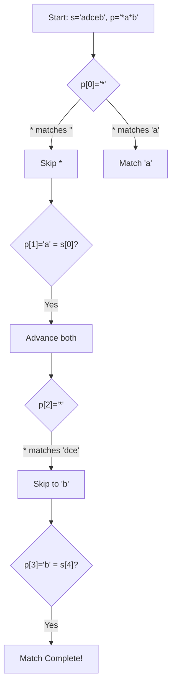
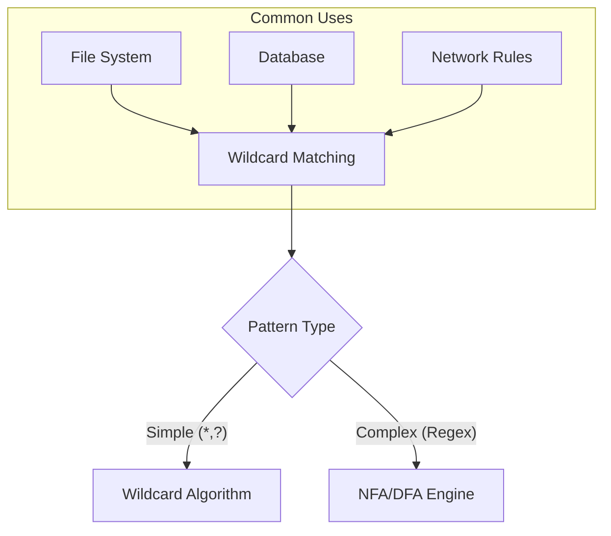

# Wildcard Pattern Matching

## Overview
| Property | Value |
|----------|-------|
| **Category** | Dynamic Programming, String Matching |
| **Complexity (Time)** | O(m × n) |
| **Complexity (Space)** | O(m × n) or O(n) optimized |
| **Input** | String s, Pattern p with wildcards |
| **Output** | Boolean (match result) |
| **Source** | [wildcard_matching.py](../../../dynamic_programming/wildcard_matching.py) |

## 1. Mathematical Foundation

### 1.1 Problem Definition

Given a string `s` and a pattern `p` with wildcard characters:
- `?` matches exactly one character
- `*` matches any sequence of characters (including empty)

Determine if the pattern matches the entire string.

$$
\text{match}(s, p) = 
\begin{cases}
\text{true} & \text{if } p \text{ matches } s \text{ completely} \\
\text{false} & \text{otherwise}
\end{cases}
$$

### 1.2 Recurrence Relation

Let $dp[i][j]$ = true if $s[0..i-1]$ matches $p[0..j-1]$

**Base Cases:**
$$dp[0][0] = \text{true}$$
$$dp[i][0] = \text{false} \quad \forall i > 0$$
$$dp[0][j] = dp[0][j-1] \quad \text{if } p[j-1] = '*'$$

**Recurrence:**

If $p[j-1] = '*'$:
$$dp[i][j] = dp[i-1][j] \lor dp[i][j-1]$$
- $dp[i-1][j]$: `*` matches current character (and possibly more)
- $dp[i][j-1]$: `*` matches empty sequence

If $p[j-1] = '?'$ or $p[j-1] = s[i-1]$:
$$dp[i][j] = dp[i-1][j-1]$$

Otherwise:
$$dp[i][j] = \text{false}$$

### 1.3 Key Insight

The `*` wildcard creates two branches:
1. Match zero characters: move only in pattern
2. Match one+ characters: stay in pattern, advance in string

## 2. Algorithm Description

### 2.1 Intuition

Build a 2D table tracking whether prefixes of the string match prefixes of the pattern. Handle `*` by considering it matches either nothing (skip in pattern) or something (consume string character).

### 2.2 Step-by-Step Process

1. Create boolean DP table
2. Initialize base cases (empty string/pattern)
3. Handle leading `*` patterns specially
4. Fill table using recurrence
5. Return final cell value

## 3. Pseudocode

### 3.1 Dynamic Programming Approach

```
ALGORITHM WildcardMatch(s, p)
    INPUT: String s of length m, Pattern p of length n
    OUTPUT: Boolean indicating match
    
    1. m ← LENGTH(s)
    2. n ← LENGTH(p)
    3. dp ← 2D array [m+1 × n+1], initialized to false
    
    // Base case: empty string matches empty pattern
    4. dp[0][0] ← true
    
    // Handle patterns starting with *
    5. for j ← 1 to n do
           if p[j-1] = '*' then
               dp[0][j] ← dp[0][j-1]
           end if
       end for
    
    // Fill DP table
    6. for i ← 1 to m do
           for j ← 1 to n do
               if p[j-1] = '*' then
                   // * matches empty OR * matches s[i-1] (and possibly more)
                   dp[i][j] ← dp[i][j-1] OR dp[i-1][j]
               else if p[j-1] = '?' OR s[i-1] = p[j-1] then
                   // Single character match
                   dp[i][j] ← dp[i-1][j-1]
               end if
           end for
       end for
    
    7. return dp[m][n]
```

### 3.2 Space-Optimized Approach

```
ALGORITHM WildcardMatchOptimized(s, p)
    INPUT: String s, Pattern p
    OUTPUT: Boolean indicating match
    
    1. m ← LENGTH(s)
    2. n ← LENGTH(p)
    3. prev ← array of size (n+1), initialized to false
    4. curr ← array of size (n+1)
    
    5. prev[0] ← true
    6. for j ← 1 to n do
           if p[j-1] = '*' then prev[j] ← prev[j-1]
       end for
    
    7. for i ← 1 to m do
           curr[0] ← false
           for j ← 1 to n do
               if p[j-1] = '*' then
                   curr[j] ← curr[j-1] OR prev[j]
               else if p[j-1] = '?' OR s[i-1] = p[j-1] then
                   curr[j] ← prev[j-1]
               else
                   curr[j] ← false
               end if
           end for
           SWAP(prev, curr)
       end for
    
    8. return prev[n]
```

### 3.3 Two-Pointer Greedy Approach (O(1) space)

```
ALGORITHM WildcardMatchGreedy(s, p)
    INPUT: String s, Pattern p
    OUTPUT: Boolean indicating match
    
    1. sIdx ← 0, pIdx ← 0
    2. starIdx ← -1, matchIdx ← 0
    
    3. while sIdx < LENGTH(s) do
           if pIdx < LENGTH(p) AND (p[pIdx] = '?' OR s[sIdx] = p[pIdx]) then
               // Characters match
               sIdx ← sIdx + 1
               pIdx ← pIdx + 1
           else if pIdx < LENGTH(p) AND p[pIdx] = '*' then
               // Found *, record position
               starIdx ← pIdx
               matchIdx ← sIdx
               pIdx ← pIdx + 1
           else if starIdx ≠ -1 then
               // Backtrack: * matches one more character
               pIdx ← starIdx + 1
               matchIdx ← matchIdx + 1
               sIdx ← matchIdx
           else
               // No match possible
               return false
           end if
       end while
    
    // Check remaining pattern characters (must all be *)
    4. while pIdx < LENGTH(p) AND p[pIdx] = '*' do
           pIdx ← pIdx + 1
       end while
    
    5. return pIdx = LENGTH(p)
```

## 4. Complexity Analysis

### 4.1 Time Complexity

| Approach | Best | Average | Worst |
|----------|------|---------|-------|
| DP | O(mn) | O(mn) | O(mn) |
| Greedy | O(m) | O(mn) | O(mn) |

### 4.2 Space Complexity

| Approach | Complexity | Notes |
|----------|------------|-------|
| Standard DP | O(m × n) | Full table |
| Optimized DP | O(n) | Two rows |
| Greedy | O(1) | Pointers only |

## 5. Visual Representation

### Example: s = "adceb", p = "*a*b"

```
        ""   *    a    *    b
   ""    T   T    F    F    F
   a     F   T    T    T    F
   d     F   T    F    T    F
   c     F   T    F    T    F
   e     F   T    F    T    F
   b     F   T    F    T    T ← Result
```



## 6. Implementation Notes

### 6.1 Key Data Structures

| Structure | Purpose |
|-----------|---------|
| 2D Boolean Array | DP table for subproblem results |
| Two Pointers | Track positions in string and pattern |
| Star/Match Index | Backtracking for greedy approach |

### 6.2 Edge Cases

| Edge Case | Expected Result |
|-----------|-----------------|
| s="", p="" | True |
| s="", p="*" | True |
| s="", p="?" | False |
| s="a", p="*" | True |
| s="abc", p="*****" | True |
| s="abc", p="*c*" | True |
| s="abc", p="*a" | False |

## 7. Comparison with Related Algorithms

| Algorithm | Wildcards | Time | Space |
|-----------|-----------|------|-------|
| Wildcard Matching | `?`, `*` | O(mn) | O(n) |
| Regex Matching | `.`, `*` | O(mn) | O(mn) |
| Glob Pattern | `?`, `*`, `[...]` | O(mn) | O(mn) |
| Exact Matching | None | O(m+n) | O(n) |

## 8. Real-World Software Engineering Applications

### 8.1 Industry Use Cases

1. **File Systems**
   - File globbing (ls *.txt)
   - Batch file operations
   - Search functionality
   - Backup inclusion/exclusion rules

2. **Database Systems**
   - SQL LIKE operator
   - Full-text search
   - Pattern-based queries
   - Data filtering

3. **Network Security**
   - URL filtering
   - Content inspection rules
   - Access control lists
   - Intrusion detection patterns

4. **Configuration Management**
   - .gitignore patterns
   - Build system rules
   - Deployment configurations
   - Log filtering

5. **Search Engines**
   - Query expansion
   - Fuzzy matching
   - Autocomplete suggestions
   - Pattern search

### 8.2 Libraries and Frameworks

| Technology | Implementation |
|------------|----------------|
| Python `fnmatch` | Unix shell-style wildcards |
| SQL LIKE | `%` and `_` wildcards |
| .gitignore | Git file exclusion patterns |
| Apache Ant | Path patterns |
| Elasticsearch | Wildcard queries |

### 8.3 Production Example

```python
class FileFilter:
    """
    File filtering using wildcard patterns.
    Used in backup systems, deployment tools, and IDEs.
    """
    
    def __init__(self, patterns: list[str]):
        """
        Initialize with list of patterns.
        Patterns support * and ? wildcards.
        """
        self.patterns = patterns
    
    def matches(self, filename: str) -> bool:
        """
        Check if filename matches any pattern.
        
        >>> filter = FileFilter(['*.py', 'test_*'])
        >>> filter.matches('main.py')
        True
        >>> filter.matches('test_utils.js')
        True
        >>> filter.matches('readme.md')
        False
        """
        return any(
            wildcard_match(filename, pattern) 
            for pattern in self.patterns
        )
    
    def filter_files(self, files: list[str]) -> list[str]:
        """
        Return files matching any pattern.
        Used in build systems and deployment scripts.
        """
        return [f for f in files if self.matches(f)]
```

### 8.4 System Integration



## 9. Optimizations

### 9.1 Pattern Preprocessing

- Collapse consecutive `*` into single `*`
- Check for simple cases (all `*`, no wildcards)
- Build deterministic automaton for reuse

### 9.2 Early Termination

```python
# Quick rejection checks
if '*' not in pattern:
    return len(s) == len(p) and all(
        p[i] == '?' or p[i] == s[i] 
        for i in range(len(s))
    )
```

## 10. References

- [LeetCode Problem 44: Wildcard Matching](https://leetcode.com/problems/wildcard-matching/)
- [Wikipedia: Glob (programming)](https://en.wikipedia.org/wiki/Glob_(programming))
- [Python fnmatch documentation](https://docs.python.org/3/library/fnmatch.html)
