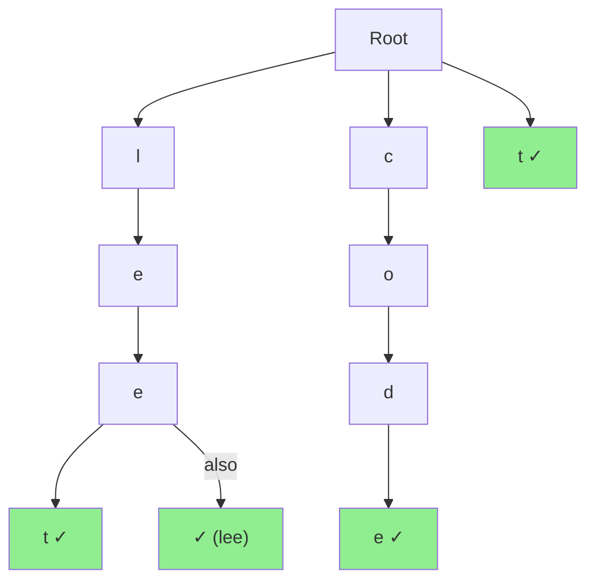

# Word Break Problem

| Property | Value |
|----------|-------|
| Category | Dynamic Programming |
| Subcategory | String/Pattern Matching |
| Complexity (Time) | O(n²) or O(n × m) |
| Complexity (Space) | O(n) or O(n × m) for Trie |
| Input | String, dictionary of words |
| Output | Boolean (can segment) |

## Overview

The **Word Break Problem** determines whether a string can be segmented into a space-separated sequence of dictionary words. This combines dynamic programming with string matching, often optimized using a Trie data structure.

## Mathematical Foundation

### Problem Definition

Given:
- String $s$ of length $n$
- Dictionary $D$ of valid words

Find: Can $s$ be segmented as $w_1 w_2 ... w_k$ where each $w_i \in D$?

### Recurrence Relation

Let $dp[i]$ = True if $s[0:i]$ can be segmented:

$$dp[i] = \bigvee_{j=0}^{i-1} (dp[j] \land s[j:i] \in D)$$

### Base Case

$$dp[0] = True$$ (empty string can be segmented)

### Decision

At each position $i$, we check all possible last words ending at $i$:
- If some prefix $s[0:j]$ is segmentable ($dp[j] = True$)
- And $s[j:i]$ is in dictionary
- Then $s[0:i]$ is segmentable

## Algorithm Approaches

### 1. Naive Recursive (Exponential)

```
WORD-BREAK-NAIVE(s, dict, start):
    if start == length(s):
        return True
    
    for end from start+1 to length(s):
        if s[start:end] in dict:
            if WORD-BREAK-NAIVE(s, dict, end):
                return True
    
    return False
```

### 2. Memoized Recursion (O(n²))

```
WORD-BREAK-MEMO(s, dict):
    memo = new HashMap()
    return WORD-BREAK-MEMO-AUX(s, dict, 0, memo)

WORD-BREAK-MEMO-AUX(s, dict, start, memo):
    if start == length(s):
        return True
    if start in memo:
        return memo[start]
    
    for end from start+1 to length(s):
        if s[start:end] in dict:
            if WORD-BREAK-MEMO-AUX(s, dict, end, memo):
                memo[start] = True
                return True
    
    memo[start] = False
    return False
```

### 3. Bottom-Up DP (O(n²))

```
WORD-BREAK-DP(s, dict):
    n = length(s)
    dp = array of size n+1, all False
    dp[0] = True
    
    for i from 1 to n:
        for j from 0 to i-1:
            if dp[j] and s[j:i] in dict:
                dp[i] = True
                break
    
    return dp[n]
```

### 4. Trie-Optimized (O(n × maxWordLen))

```
WORD-BREAK-TRIE(s, dict):
    trie = BUILD-TRIE(dict)
    n = length(s)
    dp = array of size n+1, all False
    dp[0] = True
    
    for i from 0 to n-1:
        if not dp[i]:
            continue
        
        node = trie.root
        for j from i to n-1:
            c = s[j]
            if c not in node.children:
                break
            node = node.children[c]
            if node.is_word:
                dp[j+1] = True
    
    return dp[n]
```

## Complexity Analysis

| Approach | Time | Space | Dictionary Lookup |
|----------|------|-------|-------------------|
| Naive | O(2ⁿ) | O(n) | O(k) per lookup |
| Memoized | O(n² × k) | O(n) | O(k) per lookup |
| Bottom-Up | O(n² × k) | O(n) | O(k) per lookup |
| With HashSet | O(n² × k) | O(n + m) | O(k) average |
| Trie-Optimized | O(n × L) | O(n + Σ|w|) | O(1) per char |

Where:
- n = string length
- k = average word length
- m = dictionary size
- L = max word length

## Visual Representation

### DP Table Construction

```
String: "leetcode"
Dictionary: {"leet", "code", "lee", "t"}

Index:    0   1   2   3   4   5   6   7   8
String:   ""  l   e   e   t   c   o   d   e
                      ↑               ↑
                    "leet"          "code"

dp[0] = True  (base case)
dp[1] = False (no word ends at 1)
dp[2] = False
dp[3] = False
dp[4] = True  (dp[0]=True, "leet" in dict)
        Also: (dp[3]=False, "t" in dict) → No
dp[5] = False
dp[6] = False
dp[7] = False
dp[8] = True  (dp[4]=True, "code" in dict)

Answer: dp[8] = True → "leet code"
```

### Trie Structure



### Decision Tree

```
"catsandog"
dict = {"cats", "cat", "sand", "and", "dog"}

               ""
              /  \
         "cat"   "cats"
          /  \      \
     "san"  "sand"  "and"
              |       |
            "og"    "og"
            (✗)     (✗)

Both paths fail at "og" → False
```

## Implementation (from repository)

```python
import functools
from typing import Any


def build_trie(words: list[str]) -> dict:
    """
    Build a trie from list of words.
    
    >>> trie = build_trie(["cat", "car", "card"])
    >>> "c" in trie
    True
    """
    trie: dict[str, Any] = {}
    for word in words:
        node = trie
        for char in word:
            if char not in node:
                node[char] = {}
            node = node[char]
        node["is_word"] = True
    return trie


def word_break(string: str, words: list[str]) -> bool:
    """
    Determine if string can be segmented into dictionary words.
    
    Uses Trie for efficient prefix matching and memoization.
    
    Args:
        string: Input string to segment
        words: List of valid dictionary words
    
    Returns:
        True if string can be segmented, False otherwise
    
    >>> word_break("leetcode", ["leet", "code"])
    True
    >>> word_break("applepenapple", ["apple", "pen"])
    True
    >>> word_break("catsandog", ["cats", "dog", "sand", "and", "cat"])
    False
    >>> word_break("cars", ["car", "ca", "rs"])
    True
    """
    trie = build_trie(words)

    @functools.cache
    def is_breakable(index: int) -> bool:
        """Check if string[index:] can be segmented."""
        if index == len(string):
            return True

        node = trie
        for i in range(index, len(string)):
            char = string[i]
            if char not in node:
                break
            node = node[char]
            if "is_word" in node and is_breakable(i + 1):
                return True

        return False

    return is_breakable(0)
```

## Real-World Applications

### 1. Natural Language Processing - Text Segmentation

```python
from typing import List, Tuple, Set, Dict
from functools import lru_cache

class TextSegmenter:
    """
    Segment continuous text into words (useful for languages without spaces).
    """
    
    def __init__(self, dictionary: Set[str]):
        """
        Initialize with dictionary.
        
        >>> segmenter = TextSegmenter({"hello", "world", "hell", "o"})
        >>> segmenter.can_segment("helloworld")
        True
        """
        self.trie = self._build_trie(dictionary)
        self.dictionary = dictionary
    
    def _build_trie(self, words: Set[str]) -> Dict:
        trie = {}
        for word in words:
            node = trie
            for char in word:
                node = node.setdefault(char, {})
            node['$'] = True  # End marker
        return trie
    
    def can_segment(self, text: str) -> bool:
        """Check if text can be segmented."""
        n = len(text)
        dp = [False] * (n + 1)
        dp[0] = True
        
        for i in range(n):
            if not dp[i]:
                continue
            node = self.trie
            for j in range(i, n):
                if text[j] not in node:
                    break
                node = node[text[j]]
                if '$' in node:
                    dp[j + 1] = True
        
        return dp[n]
    
    def segment_all(self, text: str) -> List[List[str]]:
        """
        Find all possible segmentations.
        
        >>> segmenter = TextSegmenter({"cat", "cats", "and", "sand", "dog"})
        >>> results = segmenter.segment_all("catsand")
        >>> ["cat", "sand"] in results or ["cats", "and"] in results
        True
        """
        results = []
        
        def backtrack(start: int, path: List[str]):
            if start == len(text):
                results.append(path[:])
                return
            
            node = self.trie
            for end in range(start, len(text)):
                if text[end] not in node:
                    break
                node = node[text[end]]
                if '$' in node:
                    path.append(text[start:end + 1])
                    backtrack(end + 1, path)
                    path.pop()
        
        backtrack(0, [])
        return results
    
    def segment_best(
        self, 
        text: str, 
        word_scores: Dict[str, float] = None
    ) -> List[str]:
        """
        Find best segmentation based on word scores.
        
        >>> segmenter = TextSegmenter({"ice", "cream", "icecream"})
        >>> scores = {"ice": 1, "cream": 1, "icecream": 3}
        >>> segmenter.segment_best("icecream", scores)
        ['icecream']
        """
        if word_scores is None:
            word_scores = {w: 1 for w in self.dictionary}
        
        n = len(text)
        dp = [float('-inf')] * (n + 1)
        dp[0] = 0
        parent = [-1] * (n + 1)
        
        for i in range(n):
            if dp[i] == float('-inf'):
                continue
            node = self.trie
            for j in range(i, n):
                if text[j] not in node:
                    break
                node = node[text[j]]
                if '$' in node:
                    word = text[i:j + 1]
                    score = dp[i] + word_scores.get(word, 0)
                    if score > dp[j + 1]:
                        dp[j + 1] = score
                        parent[j + 1] = i
        
        # Reconstruct
        if dp[n] == float('-inf'):
            return []
        
        words = []
        pos = n
        while pos > 0:
            prev = parent[pos]
            words.append(text[prev:pos])
            pos = prev
        
        return words[::-1]


def segment_chinese_text(text: str, dictionary: Set[str]) -> List[str]:
    """
    Segment Chinese text (no spaces between words).
    
    >>> dict_cn = {"中国", "人民", "中", "国人", "民"}
    >>> segment_chinese_text("中国人民", dict_cn)
    ['中国', '人民']
    """
    segmenter = TextSegmenter(dictionary)
    results = segmenter.segment_all(text)
    
    # Prefer fewer, longer words
    if not results:
        return []
    
    return min(results, key=lambda x: (len(x), -sum(len(w) for w in x)))
```

### 2. Spell Checking and Auto-correction

```python
from typing import List, Tuple, Optional
from functools import lru_cache
import heapq

class SpellChecker:
    """
    Spell checker using word break and edit distance.
    """
    
    def __init__(self, dictionary: List[str]):
        """
        Initialize spell checker.
        
        >>> checker = SpellChecker(["hello", "world", "help"])
        >>> checker.check("hello")
        True
        """
        self.words = set(dictionary)
        self.trie = self._build_trie(dictionary)
        self.max_word_len = max(len(w) for w in dictionary) if dictionary else 0
    
    def _build_trie(self, words: List[str]) -> dict:
        trie = {}
        for word in words:
            node = trie
            for char in word:
                node = node.setdefault(char, {})
            node['$'] = word
        return trie
    
    def check(self, word: str) -> bool:
        """Check if word is in dictionary."""
        return word.lower() in self.words
    
    def suggest_corrections(
        self, 
        word: str, 
        max_suggestions: int = 5
    ) -> List[Tuple[str, int]]:
        """
        Suggest corrections for misspelled word.
        
        >>> checker = SpellChecker(["hello", "help", "held", "hero"])
        >>> suggestions = checker.suggest_corrections("helo")
        >>> any(s[0] == "hello" for s in suggestions)
        True
        """
        word = word.lower()
        if word in self.words:
            return [(word, 0)]
        
        # Use BFS with edit distance
        suggestions = []
        
        for dict_word in self.words:
            dist = self._edit_distance(word, dict_word)
            if dist <= 2:  # Max edit distance threshold
                heapq.heappush(suggestions, (dist, dict_word))
        
        return [(w, d) for d, w in heapq.nsmallest(max_suggestions, suggestions)]
    
    @lru_cache(maxsize=10000)
    def _edit_distance(self, s1: str, s2: str) -> int:
        """Calculate edit distance between two strings."""
        if len(s1) < len(s2):
            return self._edit_distance(s2, s1)
        
        if len(s2) == 0:
            return len(s1)
        
        prev = list(range(len(s2) + 1))
        
        for i, c1 in enumerate(s1):
            curr = [i + 1]
            for j, c2 in enumerate(s2):
                cost = 0 if c1 == c2 else 1
                curr.append(min(
                    prev[j + 1] + 1,  # Delete
                    curr[j] + 1,       # Insert
                    prev[j] + cost     # Replace
                ))
            prev = curr
        
        return prev[-1]
    
    def segment_and_correct(
        self, 
        text: str
    ) -> Tuple[List[str], List[Tuple[str, str]]]:
        """
        Segment text and suggest corrections.
        
        >>> checker = SpellChecker(["the", "quick", "brown", "fox"])
        >>> words, corrections = checker.segment_and_correct("thequickbrown")
        >>> len(words) > 0
        True
        """
        # Try to segment
        n = len(text)
        dp = [False] * (n + 1)
        dp[0] = True
        parent = [-1] * (n + 1)
        
        for i in range(n):
            if not dp[i]:
                continue
            
            # Try exact matches
            node = self.trie
            for j in range(i, min(i + self.max_word_len, n)):
                if text[j] not in node:
                    break
                node = node[text[j]]
                if '$' in node:
                    dp[j + 1] = True
                    parent[j + 1] = i
        
        # Reconstruct if possible
        words = []
        corrections = []
        
        if dp[n]:
            pos = n
            while pos > 0:
                prev = parent[pos]
                words.append(text[prev:pos])
                pos = prev
            words = words[::-1]
        else:
            # Try with corrections
            words, corrections = self._segment_with_corrections(text)
        
        return words, corrections
    
    def _segment_with_corrections(
        self, 
        text: str
    ) -> Tuple[List[str], List[Tuple[str, str]]]:
        """Segment with fuzzy matching."""
        n = len(text)
        
        # dp[i] = (best_score, prev_index, word, corrected_word or None)
        dp = [(float('inf'), -1, '', None)] * (n + 1)
        dp[0] = (0, -1, '', None)
        
        for i in range(n):
            if dp[i][0] == float('inf'):
                continue
            
            for length in range(1, min(self.max_word_len + 2, n - i + 1)):
                substr = text[i:i + length]
                
                # Check exact match
                if substr in self.words:
                    score = dp[i][0]
                    if score < dp[i + length][0]:
                        dp[i + length] = (score, i, substr, None)
                else:
                    # Check for close matches
                    for word in self.words:
                        if abs(len(word) - length) <= 1:
                            dist = self._edit_distance(substr, word)
                            if dist <= 1:
                                score = dp[i][0] + dist
                                if score < dp[i + len(word)][0]:
                                    dp[i + length] = (score, i, word, substr)
        
        # Reconstruct
        words = []
        corrections = []
        pos = n
        
        while pos > 0:
            _, prev, word, original = dp[pos]
            words.append(word)
            if original:
                corrections.append((original, word))
            pos = prev
        
        return words[::-1], corrections[::-1]
```

### 3. URL and Path Parsing

```python
from typing import List, Tuple, Optional, Dict
import re

class PathSegmenter:
    """
    Segment concatenated paths and identifiers.
    """
    
    def __init__(self, known_segments: List[str]):
        """
        Initialize path segmenter.
        
        >>> segmenter = PathSegmenter(["user", "api", "v1", "profile"])
        >>> segmenter.segment_path("apiuserprofile")
        ['api', 'user', 'profile']
        """
        self.segments = set(known_segments)
        self.trie = self._build_trie(known_segments)
    
    def _build_trie(self, words: List[str]) -> Dict:
        trie = {}
        for word in words:
            node = trie
            for char in word.lower():
                node = node.setdefault(char, {})
            node['$'] = word
        return trie
    
    def segment_path(self, path: str) -> List[str]:
        """
        Segment concatenated path.
        
        >>> segmenter = PathSegmenter(["get", "user", "by", "id"])
        >>> segmenter.segment_path("getuserbyid")
        ['get', 'user', 'by', 'id']
        """
        path_lower = path.lower()
        n = len(path_lower)
        
        dp = [False] * (n + 1)
        dp[0] = True
        parent = [(-1, '')] * (n + 1)
        
        for i in range(n):
            if not dp[i]:
                continue
            
            node = self.trie
            for j in range(i, n):
                if path_lower[j] not in node:
                    break
                node = node[path_lower[j]]
                if '$' in node:
                    dp[j + 1] = True
                    parent[j + 1] = (i, node['$'])
        
        if not dp[n]:
            return [path]
        
        # Reconstruct
        result = []
        pos = n
        while pos > 0:
            prev, word = parent[pos]
            result.append(word)
            pos = prev
        
        return result[::-1]
    
    def segment_camel_case(self, identifier: str) -> List[str]:
        """
        Segment CamelCase identifier.
        
        >>> segmenter = PathSegmenter([])
        >>> segmenter.segment_camel_case("getUserById")
        ['get', 'User', 'By', 'Id']
        """
        # Split on case transitions
        parts = re.findall(r'[A-Z]?[a-z]+|[A-Z]+(?=[A-Z][a-z]|\d|\W|$)|\d+', identifier)
        return [p.lower() if i == 0 else p for i, p in enumerate(parts)]
    
    def normalize_api_endpoint(
        self, 
        endpoint: str
    ) -> Tuple[str, List[str]]:
        """
        Normalize and segment API endpoint.
        
        >>> segmenter = PathSegmenter(["users", "get", "profile"])
        >>> normalized, parts = segmenter.normalize_api_endpoint("/api/getusersprofile")
        >>> "users" in parts or "profile" in parts
        True
        """
        # Remove leading slash and common prefixes
        endpoint = endpoint.strip('/')
        endpoint = re.sub(r'^api/v\d+/', '', endpoint)
        
        # Split by slash first
        path_parts = endpoint.split('/')
        
        all_segments = []
        for part in path_parts:
            if part in self.segments:
                all_segments.append(part)
            else:
                # Try to segment concatenated parts
                segmented = self.segment_path(part)
                all_segments.extend(segmented)
        
        normalized = '/'.join(all_segments)
        return normalized, all_segments


def parse_compound_words(
    text: str, 
    base_words: List[str]
) -> List[str]:
    """
    Parse compound words in text.
    
    >>> words = ["sun", "flower", "sun", "light"]
    >>> parse_compound_words("sunflower", words)
    ['sun', 'flower']
    """
    segmenter = PathSegmenter(base_words)
    return segmenter.segment_path(text.lower())
```

## Variations

### Word Break II - All Segmentations

```python
def word_break_all(s: str, word_dict: List[str]) -> List[str]:
    """
    Return all possible segmentations.
    
    >>> word_break_all("catsanddog", ["cat", "cats", "and", "sand", "dog"])
    ['cat sand dog', 'cats and dog']
    """
    word_set = set(word_dict)
    memo = {}
    
    def backtrack(start: int) -> List[List[str]]:
        if start in memo:
            return memo[start]
        
        if start == len(s):
            return [[]]
        
        result = []
        for end in range(start + 1, len(s) + 1):
            word = s[start:end]
            if word in word_set:
                for rest in backtrack(end):
                    result.append([word] + rest)
        
        memo[start] = result
        return result
    
    return [' '.join(words) for words in backtrack(0)]
```

### Minimum Words Segmentation

```python
def min_words_break(s: str, word_dict: List[str]) -> int:
    """
    Minimum number of words to segment string.
    
    >>> min_words_break("leetcode", ["leet", "code", "leetcode"])
    1
    """
    word_set = set(word_dict)
    n = len(s)
    dp = [float('inf')] * (n + 1)
    dp[0] = 0
    
    for i in range(1, n + 1):
        for j in range(i):
            if dp[j] < float('inf') and s[j:i] in word_set:
                dp[i] = min(dp[i], dp[j] + 1)
    
    return dp[n] if dp[n] < float('inf') else -1
```

## Common Pitfalls

1. **Empty dictionary**: Handle gracefully
2. **Empty string**: Should return True
3. **Overlapping prefixes**: "car" vs "cars" - need proper backtracking
4. **Performance**: Use Trie for large dictionaries

## References

- [Word Break - LeetCode](https://leetcode.com/problems/word-break/)
- [Trie Data Structure](https://en.wikipedia.org/wiki/Trie)
- [Dynamic Programming - MIT OCW](https://ocw.mit.edu/courses/electrical-engineering-and-computer-science/6-006-introduction-to-algorithms-fall-2011/lecture-videos/lecture-19-dynamic-programming-i-fibonacci-shortest-paths/)

## See Also

- [Edit Distance](edit_distance.md) - String matching
- [Longest Common Subsequence](longest_common_subsequence.md) - String DP
- [Palindrome Partitioning](palindrome_partitioning.md) - Similar structure
