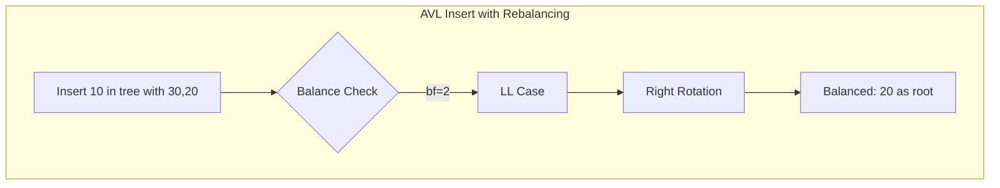

# AVL Tree

## Overview
| Property | Value |
|----------|-------|
| **Category** | Self-Balancing Binary Search Tree |
| **Search** | O(log n) guaranteed |
| **Insert** | O(log n) guaranteed |
| **Delete** | O(log n) guaranteed |
| **Space** | O(n) |
| **Source** | [avl_tree.py](../../../data_structures/binary_tree/avl_tree.py) |

## 1. Mathematical Foundation

### 1.1 Definition

An AVL tree (Adelson-Velsky and Landis) is a self-balancing BST where for every node:

$$
|\text{height}(\text{left}) - \text{height}(\text{right})| \leq 1
$$

This difference is called the **balance factor**:
$$
\text{bf}(v) = \text{height}(\text{left}(v)) - \text{height}(\text{right}(v))
$$

Valid balance factors: $\{-1, 0, +1\}$

### 1.2 Height Bound

For an AVL tree with $n$ nodes:
$$
\log_2(n+1) \leq h \leq 1.44 \log_2(n+2) - 0.328
$$

This guarantees O(log n) operations.

### 1.3 Minimum Nodes for Height h

The minimum number of nodes $N_h$ for an AVL tree of height $h$:
$$
N_h = N_{h-1} + N_{h-2} + 1
$$

With $N_0 = 1$ and $N_1 = 2$.

This is related to Fibonacci numbers:
$$
N_h = F_{h+3} - 1
$$

## 2. Node Structure

```
class AVLNode:
    key: T           // Comparable key
    value: V         // Associated value
    left: AVLNode    // Left child
    right: AVLNode   // Right child
    height: int      // Height of subtree (leaf = 1)
```

## 3. Rotations

### 3.1 Right Rotation (LL Case)

When left subtree is too tall on the left:

```
ALGORITHM RotateRight(y)
    INPUT: Node y (unbalanced, bf = +2)
    OUTPUT: New subtree root
    
        y                x
       / \              / \
      x   C    →       A   y
     / \                  / \
    A   B                B   C
    
    1. x ← y.left
    2. B ← x.right
    3. x.right ← y
    4. y.left ← B
    5. UpdateHeight(y)
    6. UpdateHeight(x)
    7. return x
```

### 3.2 Left Rotation (RR Case)

When right subtree is too tall on the right:

```
ALGORITHM RotateLeft(x)
    INPUT: Node x (unbalanced, bf = -2)
    OUTPUT: New subtree root
    
      x                   y
     / \                 / \
    A   y       →       x   C
       / \             / \
      B   C           A   B
    
    1. y ← x.right
    2. B ← y.left
    3. y.left ← x
    4. x.right ← B
    5. UpdateHeight(x)
    6. UpdateHeight(y)
    7. return y
```

### 3.3 Left-Right Rotation (LR Case)

```
ALGORITHM RotateLR(z)
    INPUT: Node z (bf = +2, left child bf = -1)
    OUTPUT: New subtree root
    
        z                z                y
       / \              / \              / \
      x   D    →       y   D    →       x   z
     / \              / \              / \ / \
    A   y            x   C            A  B C  D
       / \          / \
      B   C        A   B
    
    1. z.left ← RotateLeft(z.left)
    2. return RotateRight(z)
```

### 3.4 Right-Left Rotation (RL Case)

```
ALGORITHM RotateRL(z)
    INPUT: Node z (bf = -2, right child bf = +1)
    OUTPUT: New subtree root
    
      z                  z                  y
     / \                / \                / \
    A   x      →       A   y      →       z   x
       / \                / \            / \ / \
      y   D              B   x          A  B C  D
     / \                    / \
    B   C                  C   D
    
    1. z.right ← RotateRight(z.right)
    2. return RotateLeft(z)
```

## 4. Core Operations

### 4.1 Insert

```
ALGORITHM Insert(node, key, value)
    INPUT: AVL node, key-value pair
    OUTPUT: Updated subtree root
    
    // Standard BST insert
    1. if node = NIL then
           return CreateNode(key, value)
       end if
    
    2. if key < node.key then
           node.left ← Insert(node.left, key, value)
       else if key > node.key then
           node.right ← Insert(node.right, key, value)
       else
           node.value ← value  // Update existing
           return node
       end if
    
    // Update height
    3. UpdateHeight(node)
    
    // Get balance factor
    4. bf ← BalanceFactor(node)
    
    // Rebalance if needed
    5. if bf > 1 then
           if key < node.left.key then
               return RotateRight(node)      // LL
           else
               return RotateLR(node)         // LR
           end if
       end if
    
    6. if bf < -1 then
           if key > node.right.key then
               return RotateLeft(node)       // RR
           else
               return RotateRL(node)         // RL
           end if
       end if
    
    7. return node
```

### 4.2 Delete

```
ALGORITHM Delete(node, key)
    INPUT: AVL node, key to delete
    OUTPUT: Updated subtree root
    
    // Standard BST delete
    1. if node = NIL then return NIL
    
    2. if key < node.key then
           node.left ← Delete(node.left, key)
       else if key > node.key then
           node.right ← Delete(node.right, key)
       else
           // Node to delete found
           if node.left = NIL then
               return node.right
           else if node.right = NIL then
               return node.left
           else
               // Two children: get in-order successor
               successor ← Minimum(node.right)
               node.key ← successor.key
               node.value ← successor.value
               node.right ← Delete(node.right, successor.key)
           end if
       end if
    
    // Update height
    3. UpdateHeight(node)
    
    // Rebalance
    4. bf ← BalanceFactor(node)
    
    5. if bf > 1 then
           if BalanceFactor(node.left) >= 0 then
               return RotateRight(node)      // LL
           else
               return RotateLR(node)         // LR
           end if
       end if
    
    6. if bf < -1 then
           if BalanceFactor(node.right) <= 0 then
               return RotateLeft(node)       // RR
           else
               return RotateRL(node)         // RL
           end if
       end if
    
    7. return node
```

### 4.3 Helper Functions

```
ALGORITHM Height(node)
    if node = NIL then return 0
    return node.height

ALGORITHM UpdateHeight(node)
    node.height ← 1 + MAX(Height(node.left), Height(node.right))

ALGORITHM BalanceFactor(node)
    if node = NIL then return 0
    return Height(node.left) - Height(node.right)
```

## 5. Complexity Analysis

### 5.1 Time Complexity

| Operation | Complexity | Rotations |
|-----------|------------|-----------|
| Search | O(log n) | 0 |
| Insert | O(log n) | ≤ 2 |
| Delete | O(log n) | ≤ O(log n) |
| Min/Max | O(log n) | 0 |

### 5.2 Space Complexity

| Component | Space |
|-----------|-------|
| Tree storage | O(n) |
| Recursion stack | O(log n) |
| Height storage | O(n) extra per node |

### 5.3 Rotation Count

- **Insert**: At most 2 rotations (single or double)
- **Delete**: Up to O(log n) rotations (propagates up)

## 6. Visual Representation

### Insert Example

```
Insert sequence: 30, 20, 10, 25, 35, 40

Step 1: Insert 30         Step 2: Insert 20        Step 3: Insert 10
    30                        30                        30 (bf=2)
                             /                         /
                            20                        20 (bf=1)
                                                     /
                                                    10
                                                    
After LL rotation:
    20
   /  \
  10   30

Step 4: Insert 25         Step 5: Insert 35        Step 6: Insert 40
    20                        20                        20
   /  \                      /  \                      /  \
  10   30                   10   30                   10   30 (bf=-2)
       /                        /  \                      /  \
      25                       25   35                   25   35 (bf=-1)
                                                               \
                                                                40
After RR rotation on 30:
    20
   /  \
  10   35
      /  \
     30   40
    /
   25
```



## 7. Implementation Notes

### 7.1 Balance Factor Cases

| bf(node) | bf(child) | Case | Action |
|----------|-----------|------|--------|
| +2 | +1 or 0 | LL | Right rotation |
| +2 | -1 | LR | Left-Right rotation |
| -2 | -1 or 0 | RR | Left rotation |
| -2 | +1 | RL | Right-Left rotation |

### 7.2 Edge Cases

| Case | Handling |
|------|----------|
| Empty tree | Create root |
| Single rotation sufficient | LL or RR case |
| Double rotation needed | LR or RL case |
| Delete with rebalancing | May need multiple rotations |
| Duplicate keys | Update value or reject |

## 8. Comparison with Other Trees

| Tree | Balance | Insert Rotations | Delete Rotations | Height |
|------|---------|-----------------|------------------|--------|
| AVL | Strict (bf ≤ 1) | ≤ 2 | O(log n) | ~1.44 log n |
| Red-Black | Relaxed | ≤ 2 | ≤ 3 | ~2 log n |
| Splay | Amortized | Varies | Varies | O(n) worst |

**AVL vs Red-Black:**
- AVL: Better for read-heavy workloads (shorter height)
- Red-Black: Better for write-heavy workloads (fewer rotations on delete)

## 9. Real-World Software Engineering Applications

### 9.1 Industry Use Cases

1. **Database Systems**
   - In-memory database indexes
   - Query result caching
   - Transaction logs
   - Consistent read operations

2. **Memory Management**
   - Memory block allocation (Linux kernel)
   - Free memory tracking
   - Fragmentation management

3. **File Systems**
   - Directory indexing
   - File metadata storage
   - Journaling systems

4. **Language Runtimes**
   - Symbol tables
   - Garbage collection (object tracking)
   - Type checking structures

5. **Network Systems**
   - Routing table management
   - Connection tracking
   - Load balancer state

### 9.2 Production Example

```python
class AVLMemoryAllocator:
    """
    Memory allocator using AVL tree for free block management.
    Similar to Linux kernel's memory management.
    """
    
    def __init__(self, total_memory: int):
        self.free_blocks = AVLTree()  # Key: block size
        self.free_blocks.insert(total_memory, 0)  # One big free block
        self.allocated = {}
    
    def allocate(self, size: int) -> int | None:
        """
        Allocate memory block of given size.
        Uses best-fit strategy with AVL tree.
        
        Returns: Starting address or None if no space
        """
        # Find smallest block >= size (best fit)
        block = self.free_blocks.find_min_greater_equal(size)
        
        if block is None:
            return None
        
        block_size, address = block.key, block.value
        self.free_blocks.delete(block_size)
        
        # If block is larger, return excess to free list
        if block_size > size:
            excess_size = block_size - size
            self.free_blocks.insert(excess_size, address + size)
        
        self.allocated[address] = size
        return address
    
    def deallocate(self, address: int):
        """
        Free allocated memory block.
        Coalesces adjacent free blocks.
        """
        if address not in self.allocated:
            raise ValueError("Invalid address")
        
        size = self.allocated.pop(address)
        
        # Add back to free list (with potential coalescing)
        self.free_blocks.insert(size, address)
        self._coalesce_blocks()


class AVLIndexedSet:
    """
    Indexed set supporting efficient rank queries.
    Used in database query optimization.
    """
    
    def __init__(self):
        self.tree = AVLTree()
        # Each node stores subtree size for rank operations
    
    def insert(self, key):
        """Insert key and maintain subtree sizes."""
        self.tree.insert_with_size(key)
    
    def rank(self, key) -> int:
        """
        Return rank of key (number of elements smaller than key).
        O(log n) using augmented AVL tree.
        """
        return self.tree.count_smaller(key)
    
    def select(self, k: int):
        """
        Return k-th smallest element.
        O(log n) using augmented AVL tree.
        """
        return self.tree.select_kth(k)
```

### 9.3 System Integration

```mermaid
flowchart TD
    subgraph "AVL Tree Applications"
        A[Memory Request] --> B[AVL Free List]
        B --> C{Block Found?}
        C -->|Yes| D[Allocate & Split]
        C -->|No| E[Request More Memory]
        D --> F[Update AVL Tree]
        
        G[Database Query] --> H[AVL Index]
        H --> I[O(log n) Lookup]
        I --> J[Return Result]
    end
```

## 10. Advanced Topics

### 10.1 Concurrent AVL Trees

Thread-safe variants for multi-threaded applications:
- Lock-based: Fine-grained locking per node
- Lock-free: CAS operations for modifications
- Reader-writer locks: Multiple readers, exclusive writers

### 10.2 Persistent AVL Trees

Functional/immutable AVL trees:
- Path copying for modifications
- O(log n) space per update
- Support for time-travel queries

## 11. References

- Adelson-Velsky, G. & Landis, E.M. (1962). "An algorithm for the organization of information"
- Cormen, T. et al. "Introduction to Algorithms" - Chapter 13
- [Wikipedia: AVL Tree](https://en.wikipedia.org/wiki/AVL_tree)
- Knuth, D. "The Art of Computer Programming, Vol. 3"
