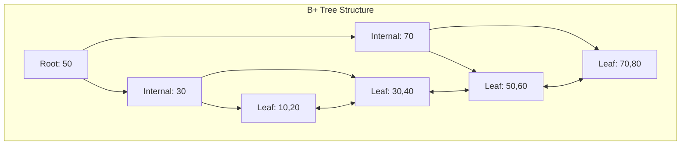

# B-Tree and B+ Tree

## Overview

| Property | B-Tree | B+ Tree |
|----------|--------|---------|
| **Search** | O(log n) | O(log n) |
| **Insert** | O(log n) | O(log n) |
| **Delete** | O(log n) | O(log n) |
| **Range Query** | O(log n + k) | O(log n + k) |
| **Space** | O(n) | O(n) |
| **Data Location** | All nodes | Leaves only |
| **Source** | [data_structures/binary_tree/](../../../data_structures/binary_tree/) |

## 1. Mathematical Foundation

### 1.1 B-Tree Definition

A **B-Tree of order $m$** is a self-balancing search tree where:

1. Every node has at most $m$ children
2. Every non-leaf node (except root) has at least $\lceil m/2 \rceil$ children
3. The root has at least 2 children if it is not a leaf
4. All leaves appear at the same level
5. A non-leaf node with $k$ children contains $k-1$ keys

### 1.2 Key Bounds

For a B-tree of order $m$ with height $h$:

**Minimum keys per node (non-root):**
$$t - 1 = \lceil m/2 \rceil - 1$$

**Maximum keys per node:**
$$m - 1$$

**Minimum number of keys at height $h$:**
$$n_{\min} = 2t^h - 1$$

**Maximum number of keys at height $h$:**
$$n_{\max} = m^{h+1} - 1$$

### 1.3 Height Bounds

For $n$ keys and minimum degree $t$:

$$h \leq \log_t \frac{n+1}{2}$$

This guarantees O(log n) operations.

### 1.4 B+ Tree Properties

B+ Tree extends B-Tree with:
1. **All data stored in leaf nodes**
2. **Internal nodes contain only keys** (for routing)
3. **Leaf nodes linked** in a doubly-linked list
4. **Supports efficient range queries**

## 2. B-Tree Node Structure

```
class BTreeNode:
    keys: array[0..2t-2] of KeyType    // Keys sorted
    children: array[0..2t-1] of Node   // Child pointers
    n: int                              // Current number of keys
    leaf: bool                          // True if leaf node
    
// Invariants:
// 1. keys[0] < keys[1] < ... < keys[n-1]
// 2. For internal nodes: children[i] contains keys < keys[i]
// 3. children[n] contains keys > keys[n-1]
```

## 3. B-Tree Operations

### 3.1 Search

```
ALGORITHM BTreeSearch(node, key)
    INPUT: Node to search, key to find
    OUTPUT: (node, index) if found, null otherwise
    
    1. i ← 0
    2. while i < node.n AND key > node.keys[i] do
           i ← i + 1
       end while
    
    3. if i < node.n AND key = node.keys[i] then
           return (node, i)
       end if
    
    4. if node.leaf then
           return null
       end if
    
    5. return BTreeSearch(node.children[i], key)
```

### 3.2 Insert

```
ALGORITHM BTreeInsert(tree, key)
    INPUT: B-tree, key to insert
    
    1. root ← tree.root
    
    2. if root.n = 2t - 1 then
           // Root is full, split it
           newRoot ← CreateNode()
           newRoot.leaf ← False
           newRoot.children[0] ← root
           SplitChild(newRoot, 0)
           tree.root ← newRoot
           InsertNonFull(newRoot, key)
       else
           InsertNonFull(root, key)
       end if


ALGORITHM InsertNonFull(node, key)
    INPUT: Non-full node, key to insert
    
    1. i ← node.n - 1
    
    2. if node.leaf then
           // Shift keys and insert
           while i ≥ 0 AND key < node.keys[i] do
               node.keys[i + 1] ← node.keys[i]
               i ← i - 1
           end while
           node.keys[i + 1] ← key
           node.n ← node.n + 1
       else
           // Find child to descend
           while i ≥ 0 AND key < node.keys[i] do
               i ← i - 1
           end while
           i ← i + 1
           
           if node.children[i].n = 2t - 1 then
               SplitChild(node, i)
               if key > node.keys[i] then
                   i ← i + 1
               end if
           end if
           InsertNonFull(node.children[i], key)
       end if


ALGORITHM SplitChild(parent, index)
    INPUT: Parent node, index of full child
    
    1. fullChild ← parent.children[index]
    2. newChild ← CreateNode()
    3. newChild.leaf ← fullChild.leaf
    4. newChild.n ← t - 1
    
    // Copy right half of keys to new child
    5. for j ← 0 to t - 2 do
           newChild.keys[j] ← fullChild.keys[j + t]
       end for
    
    // Copy right half of children if internal
    6. if NOT fullChild.leaf then
           for j ← 0 to t - 1 do
               newChild.children[j] ← fullChild.children[j + t]
           end for
       end if
    
    7. fullChild.n ← t - 1
    
    // Insert new child and median key into parent
    8. for j ← parent.n downto index + 1 do
           parent.children[j + 1] ← parent.children[j]
       end for
    9. parent.children[index + 1] ← newChild
    
    10. for j ← parent.n - 1 downto index do
            parent.keys[j + 1] ← parent.keys[j]
        end for
    11. parent.keys[index] ← fullChild.keys[t - 1]
    12. parent.n ← parent.n + 1
```

### 3.3 Delete (Simplified)

```
ALGORITHM BTreeDelete(node, key)
    INPUT: Node, key to delete
    
    1. i ← FindKeyIndex(node, key)
    
    2. if key in node.keys then
           if node.leaf then
               RemoveFromLeaf(node, i)
           else
               DeleteFromInternal(node, i)
           end if
       else
           if node.leaf then
               return  // Key not in tree
           end if
           
           // Ensure child has enough keys before descending
           if node.children[i].n < t then
               Fill(node, i)
           end if
           
           BTreeDelete(node.children[i], key)
       end if


ALGORITHM DeleteFromInternal(node, index)
    1. key ← node.keys[index]
    
    2. if node.children[index].n ≥ t then
           // Use predecessor
           pred ← GetPredecessor(node, index)
           node.keys[index] ← pred
           BTreeDelete(node.children[index], pred)
       else if node.children[index + 1].n ≥ t then
           // Use successor
           succ ← GetSuccessor(node, index)
           node.keys[index] ← succ
           BTreeDelete(node.children[index + 1], succ)
       else
           // Merge children
           MergeChildren(node, index)
           BTreeDelete(node.children[index], key)
       end if
```

## 4. B+ Tree Operations

### 4.1 Structure

```
class BPlusTreeNode:
    keys: array of KeyType
    leaf: bool
    
class BPlusInternalNode(BPlusTreeNode):
    children: array of BPlusTreeNode
    
class BPlusLeafNode(BPlusTreeNode):
    values: array of ValueType    // Data stored in leaves
    next: BPlusLeafNode           // Link to next leaf
    prev: BPlusLeafNode           // Link to previous leaf
```

### 4.2 Range Query

```
ALGORITHM RangeQuery(tree, low, high)
    INPUT: B+ tree, range [low, high]
    OUTPUT: All values in range
    
    1. result ← []
    
    // Find leaf containing low
    2. leaf ← FindLeaf(tree.root, low)
    
    // Traverse leaves collecting values in range
    3. while leaf ≠ null do
           for i ← 0 to leaf.n - 1 do
               if leaf.keys[i] > high then
                   return result
               end if
               if leaf.keys[i] ≥ low then
                   result.append(leaf.values[i])
               end if
           end for
           leaf ← leaf.next
       end while
    
    4. return result
```

## 5. Complexity Analysis

### 5.1 Time Complexity

| Operation | B-Tree | B+ Tree |
|-----------|--------|---------|
| Search | O(log n) | O(log n) |
| Insert | O(log n) | O(log n) |
| Delete | O(log n) | O(log n) |
| Range Query | O(log n + k) | O(log n + k) |
| Min/Max | O(log n) | O(log n) |
| Traversal | O(n) | O(n) |

Where $k$ is the number of elements in range.

### 5.2 I/O Complexity

For disk-based operations with block size $B$:

| Operation | Disk I/Os |
|-----------|-----------|
| Search | $O(\log_B n)$ |
| Insert | $O(\log_B n)$ |
| Range Query | $O(\log_B n + k/B)$ |

### 5.3 Space Complexity

- **B-Tree**: O(n) for keys and values
- **B+ Tree**: O(n) but with duplication of keys in internal nodes

## 6. Visual Representation

### 6.1 B-Tree Structure

```
B-Tree of order 3 (t=2):

                    [50]
                   /    \
           [20, 35]      [70, 85]
          /   |   \     /   |    \
       [10] [25,30] [40] [60] [75,80] [90,95]
       
Each node: 
- At least t-1 = 1 key
- At most 2t-1 = 3 keys
```

### 6.2 B+ Tree Structure

```
B+ Tree of order 3:

                    [50]
                   /    \
              [30]        [70]
             /    \      /    \
        [10,20] [30,40] [50,60] [70,80,90]
            ↔       ↔       ↔       
        Linked leaf nodes for range queries
```



### 6.3 Node Split

```
Before insert 25 (node full):
    [10, 20, 30]  (t=2, max=3)
    
Split:
    median = 20
    
After split:
        [20]
       /    \
    [10]    [25, 30]
```

## 7. Real-World Software Engineering Applications

### 7.1 Industry Use Cases

1. **Database Systems**
   - MySQL InnoDB uses B+ Trees
   - PostgreSQL indexes
   - SQLite database engine

2. **File Systems**
   - NTFS (Windows)
   - HFS+ (macOS)
   - ext4 (Linux) - uses extent trees (B-tree variant)

3. **Key-Value Stores**
   - LevelDB
   - RocksDB
   - LMDB

4. **Full-Text Search**
   - Elasticsearch indexes
   - Apache Lucene

5. **Distributed Systems**
   - Bigtable (Google)
   - Cassandra SSTable indexes

### 7.2 Implementation Examples

```python
from typing import Generic, TypeVar, Optional, Iterator, Any
from dataclasses import dataclass, field

K = TypeVar('K')  # Key type (must be comparable)
V = TypeVar('V')  # Value type


@dataclass
class BTreeNode(Generic[K, V]):
    """
    B-Tree node for order t.
    
    Each node has:
    - At least t-1 keys (except root)
    - At most 2t-1 keys
    - n+1 children if n keys (internal node)
    """
    t: int  # Minimum degree
    keys: list[K] = field(default_factory=list)
    values: list[V] = field(default_factory=list)  # Values at same index as keys
    children: list['BTreeNode[K, V]'] = field(default_factory=list)
    leaf: bool = True
    
    @property
    def n(self) -> int:
        """Number of keys."""
        return len(self.keys)
    
    def is_full(self) -> bool:
        """Check if node is full."""
        return self.n >= 2 * self.t - 1


class BTree(Generic[K, V]):
    """
    B-Tree implementation.
    
    >>> tree = BTree(2)  # Minimum degree 2
    >>> tree.insert(10, "ten")
    >>> tree.insert(20, "twenty")
    >>> tree.insert(5, "five")
    >>> tree.insert(15, "fifteen")
    >>> tree.search(10)
    'ten'
    >>> tree.search(15)
    'fifteen'
    >>> tree.search(100) is None
    True
    """
    
    def __init__(self, t: int = 2):
        """Initialize B-tree with minimum degree t."""
        if t < 2:
            raise ValueError("Minimum degree must be at least 2")
        self.t = t
        self.root: BTreeNode[K, V] = BTreeNode(t)
    
    def search(self, key: K) -> Optional[V]:
        """Search for key. O(log n)."""
        return self._search(self.root, key)
    
    def _search(self, node: BTreeNode[K, V], key: K) -> Optional[V]:
        """Recursive search."""
        i = 0
        while i < node.n and key > node.keys[i]:
            i += 1
        
        if i < node.n and key == node.keys[i]:
            return node.values[i]
        
        if node.leaf:
            return None
        
        return self._search(node.children[i], key)
    
    def insert(self, key: K, value: V) -> None:
        """Insert key-value pair. O(log n)."""
        root = self.root
        
        if root.is_full():
            # Root is full, create new root
            new_root: BTreeNode[K, V] = BTreeNode(self.t, leaf=False)
            new_root.children.append(root)
            self._split_child(new_root, 0)
            self.root = new_root
            self._insert_non_full(new_root, key, value)
        else:
            self._insert_non_full(root, key, value)
    
    def _insert_non_full(self, node: BTreeNode[K, V], key: K, value: V) -> None:
        """Insert into non-full node."""
        i = node.n - 1
        
        if node.leaf:
            # Insert into leaf
            node.keys.append(key)  # Placeholder
            node.values.append(value)
            
            while i >= 0 and key < node.keys[i]:
                node.keys[i + 1] = node.keys[i]
                node.values[i + 1] = node.values[i]
                i -= 1
            
            node.keys[i + 1] = key
            node.values[i + 1] = value
        else:
            # Find child to descend
            while i >= 0 and key < node.keys[i]:
                i -= 1
            i += 1
            
            if node.children[i].is_full():
                self._split_child(node, i)
                if key > node.keys[i]:
                    i += 1
            
            self._insert_non_full(node.children[i], key, value)
    
    def _split_child(self, parent: BTreeNode[K, V], index: int) -> None:
        """Split full child at index."""
        t = self.t
        full_child = parent.children[index]
        
        # Create new node with right half
        new_child: BTreeNode[K, V] = BTreeNode(t, leaf=full_child.leaf)
        
        # Copy right half of keys and values
        new_child.keys = full_child.keys[t:]
        new_child.values = full_child.values[t:]
        
        # Copy right half of children if internal
        if not full_child.leaf:
            new_child.children = full_child.children[t:]
            full_child.children = full_child.children[:t]
        
        # Get median
        median_key = full_child.keys[t - 1]
        median_value = full_child.values[t - 1]
        
        # Truncate full child
        full_child.keys = full_child.keys[:t - 1]
        full_child.values = full_child.values[:t - 1]
        
        # Insert new child and median into parent
        parent.children.insert(index + 1, new_child)
        parent.keys.insert(index, median_key)
        parent.values.insert(index, median_value)
    
    def inorder(self) -> Iterator[tuple[K, V]]:
        """Inorder traversal. O(n)."""
        yield from self._inorder(self.root)
    
    def _inorder(self, node: BTreeNode[K, V]) -> Iterator[tuple[K, V]]:
        """Recursive inorder."""
        for i in range(node.n):
            if not node.leaf:
                yield from self._inorder(node.children[i])
            yield (node.keys[i], node.values[i])
        
        if not node.leaf:
            yield from self._inorder(node.children[node.n])
    
    def __contains__(self, key: K) -> bool:
        return self.search(key) is not None


@dataclass
class BPlusLeafNode(Generic[K, V]):
    """B+ Tree leaf node storing data."""
    keys: list[K] = field(default_factory=list)
    values: list[V] = field(default_factory=list)
    next: Optional['BPlusLeafNode[K, V]'] = None
    prev: Optional['BPlusLeafNode[K, V]'] = None
    
    @property
    def n(self) -> int:
        return len(self.keys)


@dataclass 
class BPlusInternalNode(Generic[K]):
    """B+ Tree internal node for routing."""
    keys: list[K] = field(default_factory=list)
    children: list[Any] = field(default_factory=list)  # Internal or Leaf nodes
    
    @property
    def n(self) -> int:
        return len(self.keys)


class BPlusTree(Generic[K, V]):
    """
    B+ Tree implementation with linked leaves.
    
    >>> tree = BPlusTree(3)  # Order 3
    >>> for i in [10, 20, 5, 15, 25, 30]:
    ...     tree.insert(i, f"val_{i}")
    >>> tree.search(15)
    'val_15'
    >>> list(tree.range_query(10, 25))
    [(10, 'val_10'), (15, 'val_15'), (20, 'val_20'), (25, 'val_25')]
    """
    
    def __init__(self, order: int = 4):
        """Initialize with given order (max keys per node)."""
        if order < 3:
            raise ValueError("Order must be at least 3")
        self.order = order
        self.root: BPlusLeafNode[K, V] = BPlusLeafNode()
        self._first_leaf: BPlusLeafNode[K, V] = self.root
    
    def search(self, key: K) -> Optional[V]:
        """Search for key. O(log n)."""
        leaf = self._find_leaf(key)
        
        for i, k in enumerate(leaf.keys):
            if k == key:
                return leaf.values[i]
        
        return None
    
    def _find_leaf(self, key: K) -> BPlusLeafNode[K, V]:
        """Find leaf node that should contain key."""
        node = self.root
        
        while isinstance(node, BPlusInternalNode):
            i = 0
            while i < node.n and key >= node.keys[i]:
                i += 1
            node = node.children[i]
        
        return node
    
    def insert(self, key: K, value: V) -> None:
        """Insert key-value pair. O(log n)."""
        # Simple insertion for demonstration
        # Full implementation would handle splits
        leaf = self._find_leaf(key)
        
        # Find insertion position
        i = 0
        while i < leaf.n and leaf.keys[i] < key:
            i += 1
        
        # Check for duplicate
        if i < leaf.n and leaf.keys[i] == key:
            leaf.values[i] = value  # Update existing
            return
        
        # Insert
        leaf.keys.insert(i, key)
        leaf.values.insert(i, value)
        
        # Handle overflow (simplified - full impl would split)
        if leaf.n > self.order:
            self._split_leaf(leaf)
    
    def _split_leaf(self, leaf: BPlusLeafNode[K, V]) -> None:
        """Split overflowed leaf node."""
        mid = len(leaf.keys) // 2
        
        # Create new leaf with right half
        new_leaf: BPlusLeafNode[K, V] = BPlusLeafNode()
        new_leaf.keys = leaf.keys[mid:]
        new_leaf.values = leaf.values[mid:]
        
        # Update links
        new_leaf.next = leaf.next
        new_leaf.prev = leaf
        if leaf.next:
            leaf.next.prev = new_leaf
        leaf.next = new_leaf
        
        # Truncate old leaf
        leaf.keys = leaf.keys[:mid]
        leaf.values = leaf.values[:mid]
        
        # Promote key to parent (simplified - would need proper handling)
        # For demo, just update root if it was the leaf
        if self.root == leaf:
            new_root: BPlusInternalNode[K] = BPlusInternalNode()
            new_root.keys = [new_leaf.keys[0]]
            new_root.children = [leaf, new_leaf]
            self.root = new_root
    
    def range_query(self, low: K, high: K) -> Iterator[tuple[K, V]]:
        """
        Find all entries in range [low, high]. O(log n + k).
        
        This is the primary advantage of B+ trees - efficient range queries.
        """
        leaf = self._find_leaf(low)
        
        while leaf is not None:
            for i, key in enumerate(leaf.keys):
                if key > high:
                    return
                if key >= low:
                    yield (key, leaf.values[i])
            
            leaf = leaf.next
    
    def min_key(self) -> Optional[tuple[K, V]]:
        """Get minimum key-value. O(log n)."""
        leaf = self._first_leaf
        if leaf.n > 0:
            return (leaf.keys[0], leaf.values[0])
        return None
    
    def max_key(self) -> Optional[tuple[K, V]]:
        """Get maximum key-value. O(log n)."""
        leaf = self._find_leaf(float('inf'))  # type: ignore
        if leaf.n > 0:
            return (leaf.keys[-1], leaf.values[-1])
        return None
    
    def all_values(self) -> Iterator[tuple[K, V]]:
        """Iterate all values in order. O(n)."""
        leaf = self._first_leaf
        while leaf is not None:
            for i in range(leaf.n):
                yield (leaf.keys[i], leaf.values[i])
            leaf = leaf.next


# Database Index Simulation
class DatabaseIndex:
    """
    Simple database index using B+ tree.
    
    >>> idx = DatabaseIndex()
    >>> idx.insert_record(1, {"name": "Alice", "age": 30})
    >>> idx.insert_record(2, {"name": "Bob", "age": 25})
    >>> idx.insert_record(3, {"name": "Charlie", "age": 35})
    >>> idx.lookup(2)
    {'name': 'Bob', 'age': 25}
    >>> list(idx.range_scan(1, 2))
    [(1, {'name': 'Alice', 'age': 30}), (2, {'name': 'Bob', 'age': 25})]
    """
    
    def __init__(self):
        self.index = BPlusTree[int, dict](order=4)
    
    def insert_record(self, key: int, record: dict) -> None:
        """Insert record with primary key."""
        self.index.insert(key, record)
    
    def lookup(self, key: int) -> Optional[dict]:
        """Point lookup by primary key."""
        return self.index.search(key)
    
    def range_scan(self, start: int, end: int) -> Iterator[tuple[int, dict]]:
        """Scan records in key range."""
        yield from self.index.range_query(start, end)
    
    def full_scan(self) -> Iterator[tuple[int, dict]]:
        """Scan all records."""
        yield from self.index.all_values()
```

## 8. B-Tree vs B+ Tree Comparison

| Aspect | B-Tree | B+ Tree |
|--------|--------|---------|
| Data location | All nodes | Leaves only |
| Key duplication | No | Yes (internal routing) |
| Leaf linking | No | Yes |
| Range queries | Must traverse tree | Sequential leaf scan |
| Point queries | May terminate early | Always go to leaf |
| Space efficiency | Better | Slight overhead |
| Use case | General purpose | Database indexes |

## 9. References

- Bayer, R. & McCreight, E. (1972). "Organization and Maintenance of Large Ordered Indexes"
- Comer, D. (1979). "The Ubiquitous B-Tree" - ACM Computing Surveys
- Graefe, G. (2011). "Modern B-Tree Techniques"
- [Wikipedia: B-tree](https://en.wikipedia.org/wiki/B-tree)
- [Wikipedia: B+ tree](https://en.wikipedia.org/wiki/B%2B_tree)
