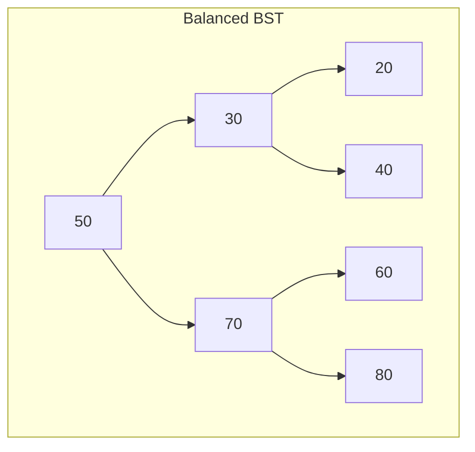

# Binary Search Tree (BST)

## Overview
| Property | Value |
|----------|-------|
| **Category** | Data Structure, Binary Tree |
| **Search** | O(log n) average, O(n) worst |
| **Insert** | O(log n) average, O(n) worst |
| **Delete** | O(log n) average, O(n) worst |
| **Space** | O(n) |
| **Source** | [binary_search_tree.py](../../../data_structures/binary_tree/binary_search_tree.py) |

## 1. Mathematical Foundation

### 1.1 Definition

A Binary Search Tree is a rooted binary tree where for each node:

$$
\forall x \in \text{left}(v): \text{key}(x) < \text{key}(v)
$$
$$
\forall x \in \text{right}(v): \text{key}(x) > \text{key}(v)
$$

### 1.2 Properties

1. **BST Property**: Left subtree contains smaller keys, right subtree contains larger keys
2. **In-order traversal** yields sorted sequence
3. **Height**: 
   - Best case: $h = \lfloor \log_2 n \rfloor$ (balanced)
   - Worst case: $h = n - 1$ (degenerate/linear)

### 1.3 Expected Height

For randomly built BST with n keys:
$$E[h] = O(\log n)$$

More precisely:
$$E[h] \approx 2.99 \ln n$$

## 2. Node Structure

```
class BSTNode:
    key: T           // Comparable key
    value: V         // Associated value (optional)
    left: BSTNode    // Left child (smaller keys)
    right: BSTNode   // Right child (larger keys)
    parent: BSTNode  // Parent node (optional)
```

## 3. Core Operations

### 3.1 Search

```
ALGORITHM Search(root, key)
    INPUT: BST root, search key
    OUTPUT: Node containing key or NIL
    
    1. current ← root
    
    2. while current ≠ NIL do
           if key = current.key then
               return current
           else if key < current.key then
               current ← current.left
           else
               current ← current.right
           end if
       end while
    
    3. return NIL
```

### 3.2 Insert

```
ALGORITHM Insert(root, key, value)
    INPUT: BST root, key-value pair
    OUTPUT: Updated root
    
    1. newNode ← CreateNode(key, value)
    
    2. if root = NIL then
           return newNode
       end if
    
    3. current ← root
    4. parent ← NIL
    
    5. while current ≠ NIL do
           parent ← current
           if key < current.key then
               current ← current.left
           else if key > current.key then
               current ← current.right
           else
               // Key exists, update value
               current.value ← value
               return root
           end if
       end while
    
    6. if key < parent.key then
           parent.left ← newNode
       else
           parent.right ← newNode
       end if
    
    7. return root
```

### 3.3 Delete

```
ALGORITHM Delete(root, key)
    INPUT: BST root, key to delete
    OUTPUT: Updated root
    
    1. node ← Search(root, key)
    2. if node = NIL then return root
    
    // Case 1: Leaf node
    3. if node.left = NIL AND node.right = NIL then
           ReplaceNode(node, NIL)
    
    // Case 2: One child
    4. else if node.left = NIL then
           ReplaceNode(node, node.right)
    5. else if node.right = NIL then
           ReplaceNode(node, node.left)
    
    // Case 3: Two children
    6. else
           successor ← Minimum(node.right)
           node.key ← successor.key
           node.value ← successor.value
           Delete(node.right, successor.key)
       end if
    
    7. return root

ALGORITHM Minimum(node)
    while node.left ≠ NIL do
        node ← node.left
    end while
    return node
```

### 3.4 Traversals

```
ALGORITHM InorderTraversal(node, result)
    if node ≠ NIL then
        InorderTraversal(node.left, result)
        result.append(node.key)
        InorderTraversal(node.right, result)
    end if
    // Result: sorted order

ALGORITHM PreorderTraversal(node, result)
    if node ≠ NIL then
        result.append(node.key)
        PreorderTraversal(node.left, result)
        PreorderTraversal(node.right, result)
    end if
    // Result: root before children (serialization)

ALGORITHM PostorderTraversal(node, result)
    if node ≠ NIL then
        PostorderTraversal(node.left, result)
        PostorderTraversal(node.right, result)
        result.append(node.key)
    end if
    // Result: children before root (deletion)
```

## 4. Complexity Analysis

### 4.1 Time Complexity

| Operation | Best | Average | Worst |
|-----------|------|---------|-------|
| Search | O(1) | O(log n) | O(n) |
| Insert | O(1) | O(log n) | O(n) |
| Delete | O(1) | O(log n) | O(n) |
| Min/Max | O(1) | O(log n) | O(n) |
| Successor | O(1) | O(log n) | O(n) |
| Traversal | O(n) | O(n) | O(n) |

### 4.2 Space Complexity

| Storage | Complexity |
|---------|------------|
| Tree nodes | O(n) |
| Recursive traversal | O(h) stack |
| Iterative traversal | O(h) explicit stack |

### 4.3 Amortized Analysis

For n random insertions followed by n random deletions:
- Expected total time: O(n log n)
- Each operation: O(log n) amortized

## 5. Visual Representation

### Example BST

```
Insert sequence: 50, 30, 70, 20, 40, 60, 80

        50
       /  \
      30   70
     / \   / \
    20 40 60 80

In-order: 20, 30, 40, 50, 60, 70, 80 (sorted!)
Pre-order: 50, 30, 20, 40, 70, 60, 80
Post-order: 20, 40, 30, 60, 80, 70, 50
```

### Degenerate Case

```
Insert sequence: 10, 20, 30, 40, 50 (sorted input)

    10
     \
     20
      \
      30
       \
       40
        \
        50

Height = n - 1 = 4 (worst case!)
```



## 6. Implementation Notes

### 6.1 Key Design Decisions

| Decision | Options | Trade-off |
|----------|---------|-----------|
| Parent pointer | Yes/No | Space vs. traversal ease |
| Duplicate keys | Allow/Reject | Depends on use case |
| Comparison | < or ≤ | Affects duplicate handling |
| Recursion | Recursive/Iterative | Stack space vs. clarity |

### 6.2 Edge Cases

| Case | Handling |
|------|----------|
| Empty tree | Return NIL or create root |
| Single node | Handle leaf deletion |
| Duplicate key | Update value or reject |
| Delete root | Update root reference |
| Unbalanced input | Consider self-balancing variant |

## 7. Comparison with Related Structures

| Structure | Balance | Operations | Use Case |
|-----------|---------|------------|----------|
| BST | No guarantee | O(log n) avg | General purpose |
| AVL Tree | Strict | O(log n) guaranteed | Read-heavy |
| Red-Black Tree | Relaxed | O(log n) guaranteed | Insert/delete-heavy |
| B-Tree | Disk-optimized | O(log n) | Databases |
| Skip List | Probabilistic | O(log n) expected | Concurrent access |

## 8. Real-World Software Engineering Applications

### 8.1 Industry Use Cases

1. **Database Indexing**
   - In-memory indexes
   - Query optimization
   - Range queries
   - Sorted data maintenance

2. **Symbol Tables**
   - Compiler symbol tables
   - Interpreter environments
   - IDE autocomplete
   - Variable scope management

3. **File Systems**
   - Directory structures
   - File indexing
   - Search functionality
   - Sorted file listings

4. **Networking**
   - Routing tables
   - IP address lookup
   - DNS caching
   - Packet classification

5. **Gaming**
   - Leaderboard management
   - Spatial partitioning (limited)
   - Game state management
   - Achievement systems

### 8.2 Production Example

```python
class SymbolTable:
    """
    Compiler symbol table using BST.
    Maps identifier names to their attributes.
    """
    
    def __init__(self):
        self.root = None
    
    def declare(self, name: str, var_type: str, scope: int) -> bool:
        """
        Declare a new variable in the symbol table.
        
        >>> table = SymbolTable()
        >>> table.declare('x', 'int', 0)
        True
        >>> table.declare('y', 'float', 0)
        True
        >>> table.lookup('x')
        {'type': 'int', 'scope': 0}
        """
        symbol = {'type': var_type, 'scope': scope}
        # BST insert implementation
        pass
    
    def lookup(self, name: str) -> dict | None:
        """
        Look up a variable by name.
        Returns attributes or None if not found.
        """
        # BST search implementation
        pass
    
    def get_sorted_symbols(self) -> list:
        """
        Return all symbols in sorted order.
        Uses in-order traversal.
        """
        # In-order traversal
        pass


class OrderBook:
    """
    Stock exchange order book using BST.
    Maintains buy/sell orders sorted by price.
    """
    
    def __init__(self):
        self.buy_orders = None   # BST: max price first
        self.sell_orders = None  # BST: min price first
    
    def add_order(self, order_type: str, price: float, quantity: int):
        """Add a buy or sell order."""
        pass
    
    def match_orders(self) -> list:
        """
        Match buy orders with sell orders.
        Uses BST min/max operations.
        """
        matches = []
        while (self.get_best_buy() is not None and 
               self.get_best_sell() is not None and
               self.get_best_buy().price >= self.get_best_sell().price):
            # Execute trade
            pass
        return matches
```

### 8.3 System Integration

```mermaid
flowchart TD
    subgraph "Database Index System"
        A[Query] --> B{Index Type?}
        B -->|Primary Key| C[BST/B-Tree Index]
        B -->|Range| D[BST Range Query]
        B -->|Full Scan| E[Sequential]
        C --> F[O(log n) Lookup]
        D --> G[O(log n + k) Range]
        E --> H[O(n) Scan]
    end
```

## 9. Extensions and Variants

### 9.1 Threaded BST
Add threads for efficient in-order traversal without recursion.

### 9.2 BST with Parent Pointers
Enables O(1) parent access for operations like successor finding.

### 9.3 Augmented BST
Add extra information (size, sum) to each node for order statistics.

```python
class AugmentedBSTNode:
    def __init__(self, key):
        self.key = key
        self.left = None
        self.right = None
        self.size = 1  # Subtree size for order statistics
    
    def select(self, k):
        """Find k-th smallest element in O(log n)."""
        left_size = self.left.size if self.left else 0
        if k == left_size + 1:
            return self.key
        elif k <= left_size:
            return self.left.select(k)
        else:
            return self.right.select(k - left_size - 1)
```

## 10. References

- Cormen, T. et al. "Introduction to Algorithms" - Chapter 12
- Knuth, D. "The Art of Computer Programming, Vol. 3" - Sorting and Searching
- [Wikipedia: Binary Search Tree](https://en.wikipedia.org/wiki/Binary_search_tree)
- Sedgewick, R. "Algorithms" - Chapter 3
