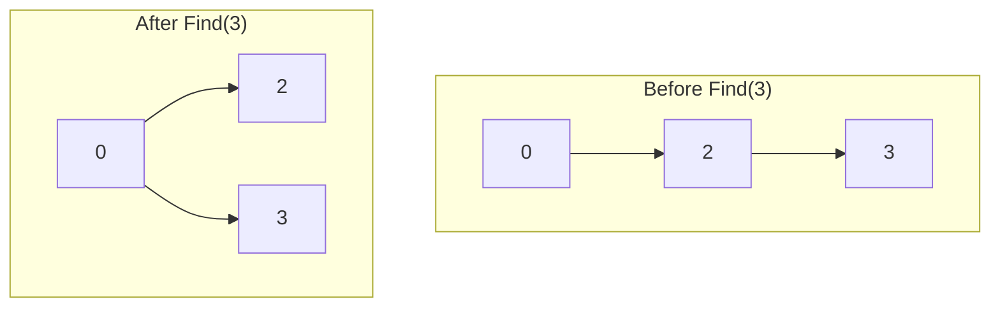

# Disjoint Set (Union-Find)

## Overview

| Property | Value |
|----------|-------|
| **Category** | Partition Data Structure |
| **Find** | O(α(n)) amortized |
| **Union** | O(α(n)) amortized |
| **Connected** | O(α(n)) amortized |
| **Space** | O(n) |
| **Source** | [disjoint_set.py](../../../data_structures/disjoint_set/disjoint_set.py) |

Note: α(n) is the inverse Ackermann function, which grows extremely slowly and is effectively constant (≤ 4) for all practical values of n.

## 1. Mathematical Foundation

### 1.1 Definition

A **Disjoint Set** (Union-Find) data structure maintains a collection of disjoint (non-overlapping) sets. It supports:

- **Make-Set(x)**: Create a new set containing only element x
- **Find(x)**: Return the representative (root) of the set containing x
- **Union(x, y)**: Merge the sets containing x and y

### 1.2 Mathematical Properties

Sets $S_1, S_2, ..., S_k$ are **disjoint** if:
$$
S_i \cap S_j = \emptyset \quad \forall i \neq j
$$

The collection forms a **partition** of universe $U$:
$$
U = S_1 \cup S_2 \cup ... \cup S_k
$$

### 1.3 Forest Representation

Each set is represented as a tree:
- Each element points to its parent
- Root points to itself (or has null parent)
- Root is the set representative

### 1.4 Inverse Ackermann Function

The amortized time complexity uses α(n), where:
- α(n) ≤ 4 for $n < 2^{65536}$
- Effectively O(1) for practical purposes

## 2. Basic Implementation

### 2.1 Data Structure

```
class DisjointSet:
    parent: array[n] of int    // parent[i] = parent of element i
    rank: array[n] of int      // rank[i] = upper bound on height
    // OR
    size: array[n] of int      // size[i] = number of elements in set
```

### 2.2 Make-Set

```
ALGORITHM MakeSet(x)
    INPUT: Element x
    
    1. parent[x] ← x    // x is its own parent (root)
    2. rank[x] ← 0      // Initial rank is 0
    3. size[x] ← 1      // Set contains only x
```

### 2.3 Find (with Path Compression)

```
ALGORITHM Find(x)
    INPUT: Element x
    OUTPUT: Representative of x's set
    
    // Path compression: make all nodes point directly to root
    1. if parent[x] ≠ x then
           parent[x] ← Find(parent[x])
       end if
    2. return parent[x]
```

Iterative version:
```
ALGORITHM FindIterative(x)
    // Find root
    1. root ← x
    2. while parent[root] ≠ root do
           root ← parent[root]
       end while
    
    // Path compression
    3. while parent[x] ≠ root do
           next ← parent[x]
           parent[x] ← root
           x ← next
       end while
    
    4. return root
```

### 2.4 Union by Rank

```
ALGORITHM Union(x, y)
    INPUT: Elements x and y
    OUTPUT: True if merged, False if already same set
    
    1. root_x ← Find(x)
    2. root_y ← Find(y)
    
    3. if root_x = root_y then
           return False  // Already in same set
       end if
    
    // Union by rank: attach smaller tree under larger
    4. if rank[root_x] < rank[root_y] then
           parent[root_x] ← root_y
       else if rank[root_x] > rank[root_y] then
           parent[root_y] ← root_x
       else
           parent[root_y] ← root_x
           rank[root_x] ← rank[root_x] + 1
       end if
    
    5. return True
```

### 2.5 Union by Size

```
ALGORITHM UnionBySize(x, y)
    INPUT: Elements x and y
    OUTPUT: True if merged, False if already same set
    
    1. root_x ← Find(x)
    2. root_y ← Find(y)
    
    3. if root_x = root_y then
           return False
       end if
    
    // Attach smaller tree under larger
    4. if size[root_x] < size[root_y] then
           parent[root_x] ← root_y
           size[root_y] ← size[root_y] + size[root_x]
       else
           parent[root_y] ← root_x
           size[root_x] ← size[root_x] + size[root_y]
       end if
    
    5. return True
```

## 3. Optimizations

### 3.1 Path Compression Variants

| Variant | Description | Complexity |
|---------|-------------|------------|
| Full | Point all to root | O(α(n)) |
| Path splitting | Point to grandparent | O(α(n)) |
| Path halving | Every other to grandparent | O(α(n)) |

#### Path Splitting

```
ALGORITHM FindPathSplitting(x)
    while parent[x] ≠ x do
        next ← parent[x]
        parent[x] ← parent[parent[x]]
        x ← next
    end while
    return x
```

#### Path Halving

```
ALGORITHM FindPathHalving(x)
    while parent[x] ≠ x do
        parent[x] ← parent[parent[x]]
        x ← parent[x]
    end while
    return x
```

### 3.2 Union Strategies

| Strategy | Comparison | Guarantees |
|----------|------------|------------|
| By rank | Tree height | O(log n) without compression |
| By size | Set size | O(log n) without compression |
| Random | None | O(n) worst case |

## 4. Complexity Analysis

### 4.1 Time Complexity

| Operation | Without Optimization | Union by Rank | + Path Compression |
|-----------|---------------------|---------------|-------------------|
| Make-Set | O(1) | O(1) | O(1) |
| Find | O(n) | O(log n) | O(α(n))* |
| Union | O(n) | O(log n) | O(α(n))* |

*Amortized over m operations on n elements.

### 4.2 Space Complexity

| Component | Space |
|-----------|-------|
| parent array | O(n) |
| rank/size array | O(n) |
| Total | O(n) |

## 5. Visual Representation

### Union-Find Operations Example

```
Initial: Make-Set for 0, 1, 2, 3, 4, 5

    0    1    2    3    4    5
   (self-loops not shown)

After Union(0, 1):
    0      2    3    4    5
    |
    1

After Union(2, 3):
    0      2      4    5
    |      |
    1      3

After Union(0, 2):
    0         4    5
   /|\
  1 2
    |
    3

After Union(4, 5):
    0         4
   /|\        |
  1 2         5
    |
    3

After Union(0, 4):
      0
    / | \
   1  2  4
      |  |
      3  5
```

### Path Compression

```
Before Find(3):
    0
    |
    2
    |
    3

After Find(3) with path compression:
      0
     /|\
    2 3 ...
```



## 6. Real-World Software Engineering Applications

### 6.1 Industry Use Cases

1. **Graph Algorithms**
   - Kruskal's MST algorithm
   - Cycle detection in undirected graphs
   - Connected components
   - Network connectivity

2. **Image Processing**
   - Connected component labeling
   - Image segmentation
   - Percolation simulation
   - Region merging

3. **Social Networks**
   - Friend groups/circles
   - Community detection
   - Account linking
   - Influence propagation

4. **Compilers**
   - Type inference (Hindley-Milner)
   - Equivalence of expressions
   - Register allocation
   - Variable aliasing

5. **Databases**
   - Record linkage
   - Entity resolution
   - Duplicate detection
   - Constraint satisfaction

### 6.2 Implementation Examples

```python
class DisjointSet:
    """
    Disjoint Set with union by rank and path compression.
    
    >>> ds = DisjointSet(5)
    >>> ds.union(0, 1)
    True
    >>> ds.union(2, 3)
    True
    >>> ds.connected(0, 1)
    True
    >>> ds.connected(0, 2)
    False
    >>> ds.union(0, 2)
    True
    >>> ds.connected(1, 3)
    True
    >>> ds.count_sets()
    2
    """
    
    def __init__(self, n: int):
        """Initialize n singleton sets."""
        self.parent = list(range(n))
        self.rank = [0] * n
        self._count = n  # Number of disjoint sets
    
    def find(self, x: int) -> int:
        """Find representative with path compression. O(α(n))"""
        if self.parent[x] != x:
            self.parent[x] = self.find(self.parent[x])
        return self.parent[x]
    
    def union(self, x: int, y: int) -> bool:
        """Union by rank. Returns False if already connected. O(α(n))"""
        root_x = self.find(x)
        root_y = self.find(y)
        
        if root_x == root_y:
            return False
        
        # Union by rank
        if self.rank[root_x] < self.rank[root_y]:
            self.parent[root_x] = root_y
        elif self.rank[root_x] > self.rank[root_y]:
            self.parent[root_y] = root_x
        else:
            self.parent[root_y] = root_x
            self.rank[root_x] += 1
        
        self._count -= 1
        return True
    
    def connected(self, x: int, y: int) -> bool:
        """Check if x and y are in the same set. O(α(n))"""
        return self.find(x) == self.find(y)
    
    def count_sets(self) -> int:
        """Return number of disjoint sets. O(1)"""
        return self._count


class DisjointSetWithSize:
    """
    Disjoint Set tracking set sizes.
    
    >>> ds = DisjointSetWithSize(5)
    >>> ds.union(0, 1)
    True
    >>> ds.get_size(0)
    2
    >>> ds.union(2, 3)
    True
    >>> ds.union(0, 2)
    True
    >>> ds.get_size(0)
    4
    """
    
    def __init__(self, n: int):
        self.parent = list(range(n))
        self.size = [1] * n
        self._count = n
    
    def find(self, x: int) -> int:
        """Find with path compression."""
        root = x
        while self.parent[root] != root:
            root = self.parent[root]
        
        # Path compression
        while self.parent[x] != root:
            next_x = self.parent[x]
            self.parent[x] = root
            x = next_x
        
        return root
    
    def union(self, x: int, y: int) -> bool:
        """Union by size."""
        root_x = self.find(x)
        root_y = self.find(y)
        
        if root_x == root_y:
            return False
        
        # Attach smaller to larger
        if self.size[root_x] < self.size[root_y]:
            root_x, root_y = root_y, root_x
        
        self.parent[root_y] = root_x
        self.size[root_x] += self.size[root_y]
        self._count -= 1
        return True
    
    def get_size(self, x: int) -> int:
        """Get size of set containing x."""
        return self.size[self.find(x)]


class DynamicConnectivity:
    """
    Dynamic connectivity using Union-Find.
    Useful for Kruskal's MST and cycle detection.
    
    >>> dc = DynamicConnectivity()
    >>> dc.add_edge(0, 1)
    False
    >>> dc.add_edge(1, 2)
    False
    >>> dc.add_edge(0, 2)  # Creates cycle
    True
    >>> dc.connected(0, 2)
    True
    """
    
    def __init__(self):
        self.parent: dict[int, int] = {}
        self.rank: dict[int, int] = {}
    
    def _ensure_node(self, x: int) -> None:
        """Create node if it doesn't exist."""
        if x not in self.parent:
            self.parent[x] = x
            self.rank[x] = 0
    
    def find(self, x: int) -> int:
        """Find with path compression."""
        self._ensure_node(x)
        if self.parent[x] != x:
            self.parent[x] = self.find(self.parent[x])
        return self.parent[x]
    
    def add_edge(self, x: int, y: int) -> bool:
        """Add edge. Returns True if it creates a cycle."""
        root_x = self.find(x)
        root_y = self.find(y)
        
        if root_x == root_y:
            return True  # Cycle detected
        
        # Union by rank
        if self.rank[root_x] < self.rank[root_y]:
            self.parent[root_x] = root_y
        elif self.rank[root_x] > self.rank[root_y]:
            self.parent[root_y] = root_x
        else:
            self.parent[root_y] = root_x
            self.rank[root_x] += 1
        
        return False
    
    def connected(self, x: int, y: int) -> bool:
        """Check if connected."""
        return self.find(x) == self.find(y)


def kruskal_mst(n: int, edges: list[tuple[int, int, int]]) -> list[tuple[int, int, int]]:
    """
    Kruskal's Minimum Spanning Tree using Union-Find.
    
    >>> edges = [(0, 1, 10), (0, 2, 6), (0, 3, 5), (1, 3, 15), (2, 3, 4)]
    >>> mst = kruskal_mst(4, edges)
    >>> sum(w for _, _, w in mst)
    19
    """
    # Sort edges by weight
    edges = sorted(edges, key=lambda e: e[2])
    
    ds = DisjointSet(n)
    mst = []
    
    for u, v, weight in edges:
        if ds.union(u, v):
            mst.append((u, v, weight))
            if len(mst) == n - 1:
                break
    
    return mst


class AccountsMerge:
    """
    Merge accounts with common emails using Union-Find.
    Classic interview problem.
    
    >>> accounts = [
    ...     ["John", "john@a.com", "john@b.com"],
    ...     ["John", "john@b.com", "john@c.com"],
    ...     ["Mary", "mary@a.com"]
    ... ]
    >>> merged = AccountsMerge().merge(accounts)
    >>> len(merged)
    2
    """
    
    def __init__(self):
        self.parent: dict[str, str] = {}
    
    def find(self, email: str) -> str:
        if email not in self.parent:
            self.parent[email] = email
        if self.parent[email] != email:
            self.parent[email] = self.find(self.parent[email])
        return self.parent[email]
    
    def union(self, email1: str, email2: str) -> None:
        root1 = self.find(email1)
        root2 = self.find(email2)
        if root1 != root2:
            self.parent[root1] = root2
    
    def merge(self, accounts: list[list[str]]) -> list[list[str]]:
        """Merge accounts with common emails."""
        email_to_name: dict[str, str] = {}
        
        # Union all emails in same account
        for account in accounts:
            name = account[0]
            first_email = account[1]
            
            for email in account[1:]:
                self.union(first_email, email)
                email_to_name[email] = name
        
        # Group emails by root
        from collections import defaultdict
        groups: dict[str, list[str]] = defaultdict(list)
        
        for email in email_to_name:
            root = self.find(email)
            groups[root].append(email)
        
        # Build result
        result = []
        for root, emails in groups.items():
            name = email_to_name[root]
            result.append([name] + sorted(emails))
        
        return result


class PercolationSimulation:
    """
    Percolation simulation using Union-Find.
    Used in physics, epidemiology, and material science.
    
    >>> perc = PercolationSimulation(3)
    >>> perc.open(0, 0)
    >>> perc.open(1, 0)
    >>> perc.open(2, 0)
    >>> perc.percolates()
    True
    """
    
    def __init__(self, n: int):
        self.n = n
        self.grid = [[False] * n for _ in range(n)]
        # +2 for virtual top and bottom
        self.uf = DisjointSet(n * n + 2)
        self.top = n * n      # Virtual top node
        self.bottom = n * n + 1  # Virtual bottom node
    
    def _index(self, row: int, col: int) -> int:
        return row * self.n + col
    
    def open(self, row: int, col: int) -> None:
        """Open a site."""
        if self.grid[row][col]:
            return
        
        self.grid[row][col] = True
        idx = self._index(row, col)
        
        # Connect to virtual top
        if row == 0:
            self.uf.union(idx, self.top)
        
        # Connect to virtual bottom
        if row == self.n - 1:
            self.uf.union(idx, self.bottom)
        
        # Connect to open neighbors
        for dr, dc in [(-1, 0), (1, 0), (0, -1), (0, 1)]:
            nr, nc = row + dr, col + dc
            if 0 <= nr < self.n and 0 <= nc < self.n and self.grid[nr][nc]:
                self.uf.union(idx, self._index(nr, nc))
    
    def is_open(self, row: int, col: int) -> bool:
        return self.grid[row][col]
    
    def is_full(self, row: int, col: int) -> bool:
        """Is site connected to top?"""
        if not self.grid[row][col]:
            return False
        return self.uf.connected(self._index(row, col), self.top)
    
    def percolates(self) -> bool:
        """Is there a path from top to bottom?"""
        return self.uf.connected(self.top, self.bottom)
```

## 7. Extensions

### 7.1 Weighted Quick-Union

Track extra information per set:
- Sum of elements
- Minimum/maximum element
- Set size (already shown)

### 7.2 Partial Persistence

Query past states of the structure:
- Store version history
- Answer "were x and y connected at time t?"

### 7.3 Fully Persistent

Allow modifications to past versions:
- More complex implementation
- Uses path copying or fat nodes

## 8. References

- Tarjan, R. E. (1975). "Efficiency of a Good But Not Linear Set Union Algorithm"
- Galler, B. & Fisher, M. (1964). "An Improved Equivalence Algorithm"
- Cormen, T. et al. "Introduction to Algorithms" - Chapter 21
- [Wikipedia: Disjoint-set data structure](https://en.wikipedia.org/wiki/Disjoint-set_data_structure)
