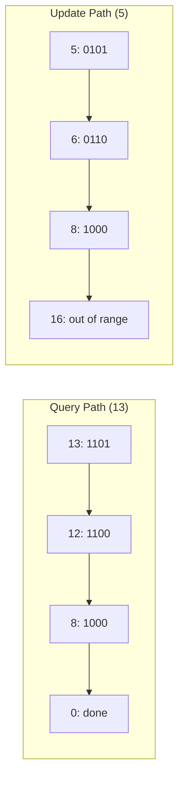

# Fenwick Tree (Binary Indexed Tree)

## Overview

| Property | Value |
|----------|-------|
| **Category** | Range Query Data Structure |
| **Build** | O(n) |
| **Prefix Query** | O(log n) |
| **Point Update** | O(log n) |
| **Space** | O(n) |
| **Source** | [fenwick_tree.py](../../../data_structures/binary_tree/fenwick_tree.py) |

## 1. Mathematical Foundation

### 1.1 Definition

A **Fenwick Tree** (Binary Indexed Tree, BIT) is a data structure that efficiently supports:
- **Prefix sum queries**: $\text{sum}(0, i) = \sum_{j=0}^{i} A[j]$
- **Point updates**: $A[i] \leftarrow A[i] + \delta$

Both operations run in O(log n) time with O(n) space.

### 1.2 Key Insight: Lowest Set Bit

The structure leverages the **lowest set bit** (LSB) of indices:

$$
\text{LSB}(i) = i \land (-i) = i \land (\sim i + 1)
$$

Examples:
- LSB(6) = LSB(110₂) = 2 = 10₂
- LSB(12) = LSB(1100₂) = 4 = 100₂
- LSB(8) = LSB(1000₂) = 8 = 1000₂

### 1.3 Index Responsibility

Each index $i$ (1-based) in the Fenwick tree stores the sum of elements in range:
$$
\text{BIT}[i] = \sum_{j=i-\text{LSB}(i)+1}^{i} A[j]
$$

The range length equals LSB(i):
- BIT[1] stores A[1] (1 element)
- BIT[2] stores A[1] + A[2] (2 elements)  
- BIT[3] stores A[3] (1 element)
- BIT[4] stores A[1] + A[2] + A[3] + A[4] (4 elements)

### 1.4 Range Coverage Visualization

```
Index:     1    2    3    4    5    6    7    8
Binary:  001  010  011  100  101  110  111 1000
LSB:       1    2    1    4    1    2    1    8

BIT[1] covers: [1, 1]     (1 element)
BIT[2] covers: [1, 2]     (2 elements)
BIT[3] covers: [3, 3]     (1 element)
BIT[4] covers: [1, 4]     (4 elements)
BIT[5] covers: [5, 5]     (1 element)
BIT[6] covers: [5, 6]     (2 elements)
BIT[7] covers: [7, 7]     (1 element)
BIT[8] covers: [1, 8]     (8 elements)
```

## 2. Tree Structure

### 2.1 Implicit Tree Representation

```
Array:     [_, 1, 3, 5, 7, 9, 11, 13, 15]  (1-indexed)
             0  1  2  3  4  5   6   7   8

Fenwick Tree responsibilities:

Index 8: ████████████████████████████████  covers [1,8]
Index 7: ░░░░░░░░░░░░░░░░░░░░░░░░░░░░████  covers [7,7]
Index 6: ░░░░░░░░░░░░░░░░████████░░░░░░░░  covers [5,6]
Index 5: ░░░░░░░░░░░░░░░░████░░░░░░░░░░░░  covers [5,5]
Index 4: ████████████████░░░░░░░░░░░░░░░░  covers [1,4]
Index 3: ░░░░░░░░████░░░░░░░░░░░░░░░░░░░░  covers [3,3]
Index 2: ████████░░░░░░░░░░░░░░░░░░░░░░░░  covers [1,2]
Index 1: ████░░░░░░░░░░░░░░░░░░░░░░░░░░░░  covers [1,1]

BIT values for sum:
BIT[1] = 1
BIT[2] = 1 + 3 = 4
BIT[3] = 5
BIT[4] = 1 + 3 + 5 + 7 = 16
BIT[5] = 9
BIT[6] = 9 + 11 = 20
BIT[7] = 13
BIT[8] = 1 + 3 + 5 + 7 + 9 + 11 + 13 + 15 = 64
```

### 2.2 Parent-Child Relationships

```
Tree visualization (for updates):

           8
        /  |  \
       4   6   7
      /|   |
     2 3   5
     |
     1

Parent of i = i + LSB(i)
- Parent of 1 = 1 + 1 = 2
- Parent of 2 = 2 + 2 = 4
- Parent of 4 = 4 + 4 = 8
- Parent of 3 = 3 + 1 = 4
```

## 3. Query Operation

### 3.1 Prefix Sum Query

To compute $\text{sum}(1, i)$, traverse indices by removing LSB:

```
ALGORITHM PrefixSum(BIT, i)
    INPUT: Fenwick tree BIT, index i (1-based)
    OUTPUT: Sum of elements from index 1 to i
    
    1. sum ← 0
    2. while i > 0 do
           sum ← sum + BIT[i]
           i ← i - LSB(i)        // Remove lowest set bit
       end while
    3. return sum


// Helper: Lowest Set Bit
FUNCTION LSB(i)
    return i AND (-i)
```

### 3.2 Query Trace Example

```
Query: PrefixSum(7)

i = 7 (111₂):  sum = BIT[7] = 13
               i = 7 - 1 = 6

i = 6 (110₂):  sum = 13 + BIT[6] = 13 + 20 = 33
               i = 6 - 2 = 4

i = 4 (100₂):  sum = 33 + BIT[4] = 33 + 16 = 49
               i = 4 - 4 = 0

i = 0: DONE

Result: 49 = 1 + 3 + 5 + 7 + 9 + 11 + 13 ✓
```

### 3.3 Range Sum Query

```
ALGORITHM RangeSum(BIT, l, r)
    INPUT: Fenwick tree BIT, range [l, r] (1-based)
    OUTPUT: Sum of elements from index l to r
    
    1. if l = 1 then
           return PrefixSum(BIT, r)
       end if
    2. return PrefixSum(BIT, r) - PrefixSum(BIT, l - 1)
```

## 4. Update Operation

### 4.1 Point Update

To update $A[i]$ by adding $\delta$, traverse indices by adding LSB:

```
ALGORITHM Update(BIT, n, i, delta)
    INPUT: Fenwick tree BIT, size n, index i, value delta
    
    1. while i ≤ n do
           BIT[i] ← BIT[i] + delta
           i ← i + LSB(i)        // Add lowest set bit
       end while
```

### 4.2 Update Trace Example

```
Update: Add delta=10 to index 3

i = 3 (011₂):  BIT[3] += 10
               i = 3 + 1 = 4

i = 4 (100₂):  BIT[4] += 10
               i = 4 + 4 = 8

i = 8 (1000₂): BIT[8] += 10
               i = 8 + 8 = 16

i = 16 > n: DONE

Updated indices: 3, 4, 8
```

## 5. Build Operation

### 5.1 Naive Build

```
ALGORITHM BuildNaive(arr)
    INPUT: Array arr of size n (0-indexed)
    OUTPUT: Fenwick tree BIT (1-indexed)
    
    1. BIT ← array of size n + 1, initialized to 0
    2. for i ← 1 to n do
           Update(BIT, n, i, arr[i - 1])
       end for
    3. return BIT
    
    // Time: O(n log n)
```

### 5.2 Linear Build

```
ALGORITHM BuildLinear(arr)
    INPUT: Array arr of size n (0-indexed)
    OUTPUT: Fenwick tree BIT (1-indexed)
    
    1. BIT ← [0, arr[0], arr[1], ..., arr[n-1]]  // 1-indexed
    
    2. for i ← 1 to n do
           parent ← i + LSB(i)
           if parent ≤ n then
               BIT[parent] ← BIT[parent] + BIT[i]
           end if
       end for
    
    3. return BIT
    
    // Time: O(n)
```

## 6. Complexity Analysis

### 6.1 Time Complexity

| Operation | Time |
|-----------|------|
| Build (naive) | O(n log n) |
| Build (optimized) | O(n) |
| Prefix Sum | O(log n) |
| Range Sum | O(log n) |
| Point Update | O(log n) |

### 6.2 Space Complexity

| Component | Space |
|-----------|-------|
| BIT array | O(n) |
| Additional | O(1) |

### 6.3 Comparison with Segment Tree

| Feature | Fenwick Tree | Segment Tree |
|---------|--------------|--------------|
| Space | n | 2n - 4n |
| Code complexity | Simple | Moderate |
| Prefix queries | O(log n) | O(log n) |
| Range queries | O(log n) | O(log n) |
| Range updates | Possible* | O(log n) with lazy |
| Flexibility | Sum-like only | Any associative |

*Fenwick tree can support range updates with two BITs

## 7. Visual Representation

### Query Path Visualization

```
Query PrefixSum(13):

Binary: 13 = 1101₂

Step 1: i = 13 (1101), add BIT[13]
Step 2: i = 12 (1100), add BIT[12]  
Step 3: i = 8  (1000), add BIT[8]
Step 4: i = 0  (0000), stop

Path: 13 → 12 → 8 → 0
      (removes one set bit each step)
```

### Update Path Visualization

```
Update index 5:

Binary: 5 = 0101₂

Step 1: i = 5  (0101), update BIT[5]
Step 2: i = 6  (0110), update BIT[6]
Step 3: i = 8  (1000), update BIT[8]
Step 4: i = 16 (10000), stop (> n)

Path: 5 → 6 → 8 → (done)
      (adds LSB each step)
```



## 8. Real-World Software Engineering Applications

### 8.1 Industry Use Cases

1. **Database Systems**
   - Cumulative frequency tables
   - Running aggregates
   - Histogram maintenance
   - Count inversions in logs

2. **Financial Systems**
   - Running totals and balances
   - Cumulative trading volume
   - P&L calculations
   - Portfolio value tracking

3. **Analytics Platforms**
   - Real-time cumulative metrics
   - Streaming percentile calculations
   - Event counting by time windows
   - Leaderboard ranking

4. **Gaming**
   - Score leaderboards with ranking
   - Cumulative achievement points
   - Real-time statistics
   - Dynamic difficulty adjustment

5. **Network Monitoring**
   - Packet count aggregation
   - Bandwidth utilization
   - Error rate tracking
   - Traffic pattern analysis

### 8.2 Implementation Examples

```python
class FenwickTree:
    """
    Binary Indexed Tree for prefix sum queries and point updates.
    
    >>> ft = FenwickTree([1, 3, 5, 7, 9])
    >>> ft.prefix_sum(3)  # sum of first 3 elements
    9
    >>> ft.range_sum(2, 4)  # sum of elements 2-4 (1-indexed)
    21
    >>> ft.update(2, 5)  # add 5 to index 2
    >>> ft.prefix_sum(3)
    14
    """
    
    def __init__(self, arr: list[int]):
        """Build Fenwick tree from array. O(n)"""
        self.n = len(arr)
        self.tree = [0] * (self.n + 1)
        
        # Copy array (1-indexed)
        for i in range(self.n):
            self.tree[i + 1] = arr[i]
        
        # Build tree in O(n)
        for i in range(1, self.n + 1):
            parent = i + (i & -i)
            if parent <= self.n:
                self.tree[parent] += self.tree[i]
    
    def update(self, i: int, delta: int) -> None:
        """Add delta to element at index i (1-indexed). O(log n)"""
        while i <= self.n:
            self.tree[i] += delta
            i += i & -i  # Add lowest set bit
    
    def prefix_sum(self, i: int) -> int:
        """Return sum of elements [1, i]. O(log n)"""
        total = 0
        while i > 0:
            total += self.tree[i]
            i -= i & -i  # Remove lowest set bit
        return total
    
    def range_sum(self, l: int, r: int) -> int:
        """Return sum of elements [l, r] (1-indexed). O(log n)"""
        return self.prefix_sum(r) - self.prefix_sum(l - 1)


class InversionCounter:
    """
    Count inversions in an array using Fenwick Tree.
    Inversion: pair (i, j) where i < j and arr[i] > arr[j]
    
    >>> counter = InversionCounter()
    >>> counter.count([2, 4, 1, 3, 5])  # Inversions: (2,1), (4,1), (4,3)
    3
    """
    
    def count(self, arr: list[int]) -> int:
        """Count inversions in O(n log n)"""
        if not arr:
            return 0
        
        # Coordinate compression
        sorted_unique = sorted(set(arr))
        rank = {v: i + 1 for i, v in enumerate(sorted_unique)}
        
        n = len(sorted_unique)
        bit = [0] * (n + 1)
        inversions = 0
        
        # Process from right to left
        for i in range(len(arr) - 1, -1, -1):
            r = rank[arr[i]]
            
            # Count elements smaller than current (already processed)
            j = r - 1
            while j > 0:
                inversions += bit[j]
                j -= j & -j
            
            # Add current element
            j = r
            while j <= n:
                bit[j] += 1
                j += j & -j
        
        return inversions


class DynamicRanking:
    """
    Dynamic ranking system using Fenwick Tree.
    Supports adding scores and querying rank.
    
    >>> ranking = DynamicRanking(max_score=100)
    >>> ranking.add_score(50)
    >>> ranking.add_score(75)
    >>> ranking.add_score(30)
    >>> ranking.get_rank(75)  # Rank 1 (highest)
    1
    >>> ranking.get_rank(50)  # Rank 2
    2
    """
    
    def __init__(self, max_score: int):
        self.max_score = max_score
        self.tree = [0] * (max_score + 2)
        self.total = 0
    
    def add_score(self, score: int) -> None:
        """Add a score to the system. O(log max_score)"""
        score = min(max(0, score), self.max_score)
        i = score + 1
        while i <= self.max_score + 1:
            self.tree[i] += 1
            i += i & -i
        self.total += 1
    
    def _count_up_to(self, score: int) -> int:
        """Count scores up to given value."""
        total = 0
        i = score + 1
        while i > 0:
            total += self.tree[i]
            i -= i & -i
        return total
    
    def get_rank(self, score: int) -> int:
        """Get rank of a score (1 = highest). O(log max_score)"""
        higher_count = self.total - self._count_up_to(score)
        return higher_count + 1
    
    def get_percentile(self, score: int) -> float:
        """Get percentile of a score. O(log max_score)"""
        below_count = self._count_up_to(score - 1)
        return 100.0 * below_count / self.total if self.total > 0 else 0.0
```

### 8.3 2D Fenwick Tree

```python
class FenwickTree2D:
    """
    2D Fenwick Tree for cumulative sum queries on matrices.
    
    Use cases:
    - Image processing (integral images)
    - Geographic data aggregation
    - Heat map queries
    """
    
    def __init__(self, rows: int, cols: int):
        self.rows = rows
        self.cols = cols
        self.tree = [[0] * (cols + 1) for _ in range(rows + 1)]
    
    def update(self, row: int, col: int, delta: int) -> None:
        """Add delta to position (row, col). O(log r × log c)"""
        i = row
        while i <= self.rows:
            j = col
            while j <= self.cols:
                self.tree[i][j] += delta
                j += j & -j
            i += i & -i
    
    def query(self, row: int, col: int) -> int:
        """Sum from (1,1) to (row, col). O(log r × log c)"""
        total = 0
        i = row
        while i > 0:
            j = col
            while j > 0:
                total += self.tree[i][j]
                j -= j & -j
            i -= i & -i
        return total
    
    def range_query(self, r1: int, c1: int, r2: int, c2: int) -> int:
        """Sum of rectangle from (r1,c1) to (r2,c2). O(log r × log c)"""
        return (self.query(r2, c2) 
                - self.query(r1 - 1, c2) 
                - self.query(r2, c1 - 1) 
                + self.query(r1 - 1, c1 - 1))
```

## 9. Extensions

### 9.1 Range Update, Point Query

Use difference array with Fenwick tree:
- Range add [l, r] with value v: update(l, v), update(r+1, -v)
- Point query at i: prefix_sum(i)

### 9.2 Range Update, Range Query

Use two Fenwick trees B1 and B2:
- Range add [l, r] with v:
  - B1.update(l, v), B1.update(r+1, -v)
  - B2.update(l, v*(l-1)), B2.update(r+1, -v*r)
- Prefix sum query(i): B1.sum(i) * i - B2.sum(i)

### 9.3 Order Statistics Tree

Find k-th smallest element using Fenwick tree with binary search in O(log² n) or O(log n) with specialized query.

## 10. References

- Fenwick, P. (1994). "A New Data Structure for Cumulative Frequency Tables"
- [Wikipedia: Fenwick Tree](https://en.wikipedia.org/wiki/Fenwick_tree)
- [TopCoder: Binary Indexed Trees](https://www.topcoder.com/thrive/articles/Binary%20Indexed%20Trees)
- [CP-Algorithms: Fenwick Tree](https://cp-algorithms.com/data_structures/fenwick.html)
