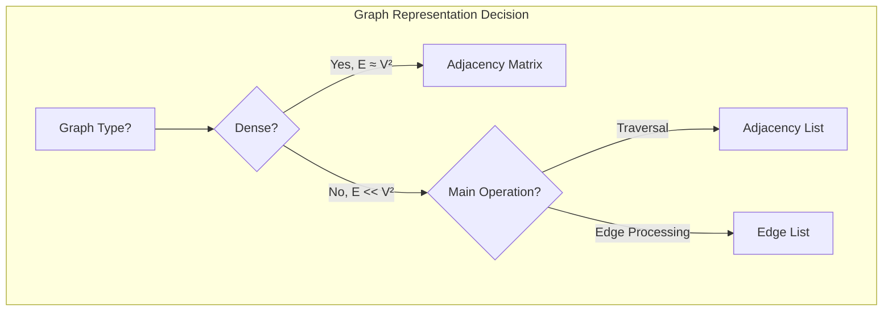

# Graph Representations

## Overview

| Representation | Space | Check Edge | Find Neighbors | Add Edge | Remove Edge |
|----------------|-------|------------|----------------|----------|-------------|
| **Adjacency Matrix** | O(V²) | O(1) | O(V) | O(1) | O(1) |
| **Adjacency List** | O(V + E) | O(degree) | O(1) | O(1) | O(E) |
| **Edge List** | O(E) | O(E) | O(E) | O(1) | O(E) |
| **Source** | [graphs/](../../../graphs/) |

## 1. Mathematical Foundation

### 1.1 Graph Definition

A **Graph** $G = (V, E)$ consists of:
- $V$: Set of vertices (nodes)
- $E$: Set of edges connecting vertices

### 1.2 Types of Graphs

**Directed Graph (Digraph):**
$$E \subseteq V \times V$$

Edge $(u, v)$ goes from $u$ to $v$ (one direction)

**Undirected Graph:**
$$E \subseteq \{\{u, v\} : u, v \in V, u \neq v\}$$

Edge $\{u, v\}$ connects both directions

### 1.3 Graph Properties

| Property | Definition |
|----------|------------|
| **Degree** | Number of edges incident to a vertex |
| **In-degree** (directed) | Number of incoming edges |
| **Out-degree** (directed) | Number of outgoing edges |
| **Path** | Sequence of vertices connected by edges |
| **Cycle** | Path that starts and ends at same vertex |
| **Connected** | Path exists between any two vertices |

### 1.4 Graph Density

$$\text{Density} = \frac{|E|}{|V|^2} \quad \text{(directed)} \quad \text{or} \quad \frac{2|E|}{|V|(|V|-1)} \quad \text{(undirected)}$$

- **Sparse Graph**: $|E| \approx O(V)$
- **Dense Graph**: $|E| \approx O(V^2)$

## 2. Adjacency Matrix

### 2.1 Structure

For graph $G = (V, E)$ with $n = |V|$, adjacency matrix $A$ is an $n \times n$ matrix:

$$A[i][j] = \begin{cases} 1 & \text{if edge } (i, j) \in E \\ 0 & \text{otherwise} \end{cases}$$

For weighted graphs:
$$A[i][j] = \begin{cases} w(i, j) & \text{if edge } (i, j) \in E \\ \infty \text{ or } 0 & \text{otherwise} \end{cases}$$

### 2.2 Properties

- **Symmetric** for undirected graphs: $A[i][j] = A[j][i]$
- **Diagonal** represents self-loops
- **Row sum** = out-degree, **Column sum** = in-degree

### 2.3 Pseudocode

```
class AdjacencyMatrix:
    n: int                    // Number of vertices
    matrix: int[n][n]         // 2D array
    directed: bool


ALGORITHM CreateMatrix(num_vertices, is_directed)
    1. n ← num_vertices
    2. directed ← is_directed
    3. matrix ← 2D array of size n × n, initialized to 0
    4. return AdjacencyMatrix(n, matrix, directed)


ALGORITHM AddEdge(graph, u, v, weight = 1)
    1. graph.matrix[u][v] ← weight
    2. if NOT graph.directed then
           graph.matrix[v][u] ← weight
       end if


ALGORITHM RemoveEdge(graph, u, v)
    1. graph.matrix[u][v] ← 0
    2. if NOT graph.directed then
           graph.matrix[v][u] ← 0
       end if


ALGORITHM HasEdge(graph, u, v)
    1. return graph.matrix[u][v] ≠ 0


ALGORITHM GetNeighbors(graph, v)
    1. neighbors ← []
    2. for i ← 0 to graph.n - 1 do
           if graph.matrix[v][i] ≠ 0 then
               neighbors.append(i)
           end if
       end for
    3. return neighbors
```

### 2.4 Visual Representation

```
Graph:                    Adjacency Matrix:
    0 ─── 1                  0  1  2  3
    │ \   │               0 [0, 1, 1, 0]
    │  \  │               1 [1, 0, 1, 1]
    2 ─── 3               2 [1, 1, 0, 1]
                          3 [0, 1, 1, 0]
```

## 3. Adjacency List

### 3.1 Structure

Each vertex stores a list of its adjacent vertices:
- Array/HashMap where index = vertex
- Each entry contains list of neighbors

For weighted graphs, store (neighbor, weight) pairs.

### 3.2 Pseudocode

```
class AdjacencyList:
    n: int                           // Number of vertices
    adj: List[List[(int, weight)]]   // Adjacency lists
    directed: bool


ALGORITHM CreateAdjList(num_vertices, is_directed)
    1. n ← num_vertices
    2. directed ← is_directed
    3. adj ← array of n empty lists
    4. return AdjacencyList(n, adj, directed)


ALGORITHM AddEdge(graph, u, v, weight = 1)
    1. graph.adj[u].append((v, weight))
    2. if NOT graph.directed then
           graph.adj[v].append((u, weight))
       end if


ALGORITHM RemoveEdge(graph, u, v)
    1. graph.adj[u] ← [x for x in graph.adj[u] if x[0] ≠ v]
    2. if NOT graph.directed then
           graph.adj[v] ← [x for x in graph.adj[v] if x[0] ≠ u]
       end if


ALGORITHM HasEdge(graph, u, v)
    1. for (neighbor, _) in graph.adj[u] do
           if neighbor = v then
               return True
           end if
       end for
    2. return False


ALGORITHM GetNeighbors(graph, v)
    1. return [neighbor for (neighbor, _) in graph.adj[v]]


ALGORITHM GetDegree(graph, v)
    1. return len(graph.adj[v])
```

### 3.3 Visual Representation

```
Graph:                    Adjacency List:
    0 ─── 1               0 → [1, 2]
    │ \   │               1 → [0, 2, 3]
    │  \  │               2 → [0, 1, 3]
    2 ─── 3               3 → [1, 2]

Weighted Graph:           Weighted Adjacency List:
    0 ──5── 1             0 → [(1,5), (2,3)]
    │ \     │             1 → [(0,5), (2,2), (3,1)]
   3│  \2   │1            2 → [(0,3), (1,2), (3,4)]
    │   \   │             3 → [(1,1), (2,4)]
    2 ──4── 3
```

## 4. Edge List

### 4.1 Structure

Simple list of all edges:
- Each edge: $(u, v)$ or $(u, v, weight)$
- Useful for Kruskal's algorithm, sparse graphs

```
class EdgeList:
    edges: List[(int, int, weight)]
    n: int                            // Number of vertices
    directed: bool


ALGORITHM AddEdge(graph, u, v, weight = 1)
    1. graph.edges.append((u, v, weight))


ALGORITHM GetAllEdges(graph)
    1. return graph.edges


ALGORITHM SortByWeight(graph)
    1. sort graph.edges by weight ascending
```

### 4.2 Visual Representation

```
Graph:                    Edge List:
    0 ──5── 1             [(0, 1, 5),
    │       │              (0, 2, 3),
   3│       │1             (1, 2, 2),
    │       │              (1, 3, 1),
    2 ──4── 3              (2, 3, 4)]
```

## 5. Complexity Comparison

### 5.1 Time Complexity

| Operation | Adjacency Matrix | Adjacency List | Edge List |
|-----------|------------------|----------------|-----------|
| Add Edge | O(1) | O(1) | O(1) |
| Remove Edge | O(1) | O(degree) | O(E) |
| Check Edge | O(1) | O(degree) | O(E) |
| Get Neighbors | O(V) | O(1) | O(E) |
| Iterate All Edges | O(V²) | O(V + E) | O(E) |
| BFS/DFS | O(V²) | O(V + E) | O(V·E) |

### 5.2 Space Complexity

| Representation | Space | Best For |
|----------------|-------|----------|
| Adjacency Matrix | O(V²) | Dense graphs, quick edge lookup |
| Adjacency List | O(V + E) | Sparse graphs, most algorithms |
| Edge List | O(E) | Edge-centric algorithms (MST) |

### 5.3 When to Use Each

| Representation | Use When |
|----------------|----------|
| **Adjacency Matrix** | Dense graph, frequent edge queries, small V |
| **Adjacency List** | Sparse graph, traversals, most applications |
| **Edge List** | MST algorithms, edge-sorted operations |

## 6. Visual Comparison



## 7. Real-World Software Engineering Applications

### 7.1 Industry Use Cases

1. **Social Networks**
   - User connections (adjacency list)
   - Friend suggestions (graph traversal)
   - Influence analysis

2. **Maps & Navigation**
   - Road networks (weighted adjacency list)
   - Shortest path (Dijkstra)
   - Traffic optimization

3. **Dependency Management**
   - Package dependencies (DAG)
   - Build systems (topological sort)
   - Circular dependency detection

4. **Computer Networks**
   - Network topology
   - Routing tables
   - Connectivity analysis

5. **Recommendation Systems**
   - Item similarity graphs
   - User-item bipartite graphs
   - Collaborative filtering

### 7.2 Implementation Examples

```python
from typing import Iterator, Optional
from collections import deque
from dataclasses import dataclass


class AdjacencyMatrix:
    """
    Graph representation using adjacency matrix.
    
    >>> g = AdjacencyMatrix(4)
    >>> g.add_edge(0, 1)
    >>> g.add_edge(1, 2)
    >>> g.has_edge(0, 1)
    True
    >>> g.has_edge(0, 2)
    False
    >>> list(g.neighbors(1))
    [0, 2]
    """
    
    def __init__(self, num_vertices: int, directed: bool = False):
        self.n = num_vertices
        self.directed = directed
        self.matrix = [[0] * num_vertices for _ in range(num_vertices)]
    
    def add_edge(self, u: int, v: int, weight: int = 1) -> None:
        """Add edge between u and v. O(1)."""
        self.matrix[u][v] = weight
        if not self.directed:
            self.matrix[v][u] = weight
    
    def remove_edge(self, u: int, v: int) -> None:
        """Remove edge between u and v. O(1)."""
        self.matrix[u][v] = 0
        if not self.directed:
            self.matrix[v][u] = 0
    
    def has_edge(self, u: int, v: int) -> bool:
        """Check if edge exists. O(1)."""
        return self.matrix[u][v] != 0
    
    def get_weight(self, u: int, v: int) -> int:
        """Get edge weight. O(1)."""
        return self.matrix[u][v]
    
    def neighbors(self, v: int) -> Iterator[int]:
        """Get all neighbors of v. O(V)."""
        for i in range(self.n):
            if self.matrix[v][i] != 0:
                yield i
    
    def degree(self, v: int) -> int:
        """Get degree of vertex. O(V)."""
        return sum(1 for i in range(self.n) if self.matrix[v][i] != 0)
    
    def __str__(self) -> str:
        return '\n'.join(' '.join(map(str, row)) for row in self.matrix)


class AdjacencyList:
    """
    Graph representation using adjacency list.
    
    >>> g = AdjacencyList(4)
    >>> g.add_edge(0, 1)
    >>> g.add_edge(1, 2)
    >>> g.add_edge(2, 3)
    >>> list(g.neighbors(1))
    [0, 2]
    >>> g.degree(1)
    2
    """
    
    def __init__(self, num_vertices: int, directed: bool = False):
        self.n = num_vertices
        self.directed = directed
        self.adj: list[list[tuple[int, int]]] = [[] for _ in range(num_vertices)]
    
    def add_edge(self, u: int, v: int, weight: int = 1) -> None:
        """Add edge between u and v. O(1)."""
        self.adj[u].append((v, weight))
        if not self.directed:
            self.adj[v].append((u, weight))
    
    def remove_edge(self, u: int, v: int) -> None:
        """Remove edge between u and v. O(degree)."""
        self.adj[u] = [(n, w) for n, w in self.adj[u] if n != v]
        if not self.directed:
            self.adj[v] = [(n, w) for n, w in self.adj[v] if n != u]
    
    def has_edge(self, u: int, v: int) -> bool:
        """Check if edge exists. O(degree)."""
        return any(n == v for n, _ in self.adj[u])
    
    def get_weight(self, u: int, v: int) -> Optional[int]:
        """Get edge weight. O(degree)."""
        for n, w in self.adj[u]:
            if n == v:
                return w
        return None
    
    def neighbors(self, v: int) -> Iterator[int]:
        """Get all neighbors of v. O(1) to start iteration."""
        for n, _ in self.adj[v]:
            yield n
    
    def neighbors_with_weights(self, v: int) -> Iterator[tuple[int, int]]:
        """Get neighbors with weights."""
        yield from self.adj[v]
    
    def degree(self, v: int) -> int:
        """Get degree of vertex. O(1)."""
        return len(self.adj[v])
    
    def all_edges(self) -> Iterator[tuple[int, int, int]]:
        """Iterate all edges. O(V + E)."""
        seen = set()
        for u in range(self.n):
            for v, w in self.adj[u]:
                edge = (min(u, v), max(u, v)) if not self.directed else (u, v)
                if edge not in seen:
                    seen.add(edge)
                    yield (u, v, w)


@dataclass
class Edge:
    """Edge representation for edge list."""
    u: int
    v: int
    weight: int = 1
    
    def __lt__(self, other: 'Edge') -> bool:
        return self.weight < other.weight


class EdgeList:
    """
    Graph representation using edge list.
    
    >>> g = EdgeList(4)
    >>> g.add_edge(0, 1, 5)
    >>> g.add_edge(1, 2, 3)
    >>> g.add_edge(2, 3, 1)
    >>> sorted_edges = g.sorted_edges()
    >>> sorted_edges[0].weight
    1
    """
    
    def __init__(self, num_vertices: int, directed: bool = False):
        self.n = num_vertices
        self.directed = directed
        self.edges: list[Edge] = []
    
    def add_edge(self, u: int, v: int, weight: int = 1) -> None:
        """Add edge. O(1)."""
        self.edges.append(Edge(u, v, weight))
    
    def sorted_edges(self) -> list[Edge]:
        """Get edges sorted by weight. O(E log E)."""
        return sorted(self.edges)
    
    def all_edges(self) -> Iterator[Edge]:
        """Iterate all edges."""
        yield from self.edges


# Graph Algorithms Using Different Representations

def bfs_matrix(graph: AdjacencyMatrix, start: int) -> list[int]:
    """
    BFS using adjacency matrix. O(V²).
    
    >>> g = AdjacencyMatrix(4)
    >>> g.add_edge(0, 1)
    >>> g.add_edge(0, 2)
    >>> g.add_edge(1, 3)
    >>> bfs_matrix(g, 0)
    [0, 1, 2, 3]
    """
    visited = [False] * graph.n
    result = []
    queue = deque([start])
    visited[start] = True
    
    while queue:
        v = queue.popleft()
        result.append(v)
        
        for neighbor in graph.neighbors(v):
            if not visited[neighbor]:
                visited[neighbor] = True
                queue.append(neighbor)
    
    return result


def bfs_list(graph: AdjacencyList, start: int) -> list[int]:
    """
    BFS using adjacency list. O(V + E).
    
    >>> g = AdjacencyList(4)
    >>> g.add_edge(0, 1)
    >>> g.add_edge(0, 2)
    >>> g.add_edge(1, 3)
    >>> bfs_list(g, 0)
    [0, 1, 2, 3]
    """
    visited = [False] * graph.n
    result = []
    queue = deque([start])
    visited[start] = True
    
    while queue:
        v = queue.popleft()
        result.append(v)
        
        for neighbor in graph.neighbors(v):
            if not visited[neighbor]:
                visited[neighbor] = True
                queue.append(neighbor)
    
    return result


def dfs_recursive(graph: AdjacencyList, start: int) -> list[int]:
    """
    DFS using adjacency list (recursive). O(V + E).
    
    >>> g = AdjacencyList(4)
    >>> g.add_edge(0, 1)
    >>> g.add_edge(0, 2)
    >>> g.add_edge(1, 3)
    >>> dfs_recursive(g, 0)
    [0, 1, 3, 2]
    """
    visited = set()
    result = []
    
    def dfs(v: int):
        visited.add(v)
        result.append(v)
        for neighbor in graph.neighbors(v):
            if neighbor not in visited:
                dfs(neighbor)
    
    dfs(start)
    return result


def shortest_path_unweighted(graph: AdjacencyList, start: int, end: int) -> list[int]:
    """
    Find shortest path in unweighted graph using BFS.
    
    >>> g = AdjacencyList(5)
    >>> g.add_edge(0, 1)
    >>> g.add_edge(0, 2)
    >>> g.add_edge(1, 3)
    >>> g.add_edge(2, 3)
    >>> g.add_edge(3, 4)
    >>> shortest_path_unweighted(g, 0, 4)
    [0, 1, 3, 4]
    """
    if start == end:
        return [start]
    
    visited = [False] * graph.n
    parent = [-1] * graph.n
    queue = deque([start])
    visited[start] = True
    
    while queue:
        v = queue.popleft()
        
        for neighbor in graph.neighbors(v):
            if not visited[neighbor]:
                visited[neighbor] = True
                parent[neighbor] = v
                
                if neighbor == end:
                    # Reconstruct path
                    path = []
                    current = end
                    while current != -1:
                        path.append(current)
                        current = parent[current]
                    return path[::-1]
                
                queue.append(neighbor)
    
    return []  # No path found


def has_cycle_directed(graph: AdjacencyList) -> bool:
    """
    Detect cycle in directed graph using DFS coloring.
    
    >>> g = AdjacencyList(4, directed=True)
    >>> g.add_edge(0, 1)
    >>> g.add_edge(1, 2)
    >>> g.add_edge(2, 0)
    >>> has_cycle_directed(g)
    True
    >>> g2 = AdjacencyList(3, directed=True)
    >>> g2.add_edge(0, 1)
    >>> g2.add_edge(1, 2)
    >>> has_cycle_directed(g2)
    False
    """
    WHITE, GRAY, BLACK = 0, 1, 2
    color = [WHITE] * graph.n
    
    def dfs(v: int) -> bool:
        color[v] = GRAY
        
        for neighbor in graph.neighbors(v):
            if color[neighbor] == GRAY:  # Back edge found
                return True
            if color[neighbor] == WHITE and dfs(neighbor):
                return True
        
        color[v] = BLACK
        return False
    
    for v in range(graph.n):
        if color[v] == WHITE and dfs(v):
            return True
    
    return False


def topological_sort(graph: AdjacencyList) -> list[int]:
    """
    Topological sort using DFS. O(V + E).
    
    >>> g = AdjacencyList(6, directed=True)
    >>> g.add_edge(5, 0)
    >>> g.add_edge(5, 2)
    >>> g.add_edge(4, 0)
    >>> g.add_edge(4, 1)
    >>> g.add_edge(2, 3)
    >>> g.add_edge(3, 1)
    >>> result = topological_sort(g)
    >>> result.index(5) < result.index(0)
    True
    >>> result.index(2) < result.index(3)
    True
    """
    visited = [False] * graph.n
    stack = []
    
    def dfs(v: int):
        visited[v] = True
        for neighbor in graph.neighbors(v):
            if not visited[neighbor]:
                dfs(neighbor)
        stack.append(v)
    
    for v in range(graph.n):
        if not visited[v]:
            dfs(v)
    
    return stack[::-1]


def connected_components(graph: AdjacencyList) -> list[list[int]]:
    """
    Find all connected components. O(V + E).
    
    >>> g = AdjacencyList(6)
    >>> g.add_edge(0, 1)
    >>> g.add_edge(1, 2)
    >>> g.add_edge(3, 4)
    >>> components = connected_components(g)
    >>> len(components)
    3
    """
    visited = [False] * graph.n
    components = []
    
    def dfs(v: int, component: list[int]):
        visited[v] = True
        component.append(v)
        for neighbor in graph.neighbors(v):
            if not visited[neighbor]:
                dfs(neighbor, component)
    
    for v in range(graph.n):
        if not visited[v]:
            component = []
            dfs(v, component)
            components.append(component)
    
    return components


# Conversion between representations

def matrix_to_list(matrix: AdjacencyMatrix) -> AdjacencyList:
    """
    Convert adjacency matrix to adjacency list.
    
    >>> m = AdjacencyMatrix(3)
    >>> m.add_edge(0, 1)
    >>> m.add_edge(1, 2)
    >>> l = matrix_to_list(m)
    >>> list(l.neighbors(1))
    [0, 2]
    """
    adj_list = AdjacencyList(matrix.n, matrix.directed)
    for u in range(matrix.n):
        for v in range(u if not matrix.directed else 0, matrix.n):
            if matrix.matrix[u][v] != 0:
                adj_list.add_edge(u, v, matrix.matrix[u][v])
    return adj_list


def list_to_matrix(adj_list: AdjacencyList) -> AdjacencyMatrix:
    """
    Convert adjacency list to adjacency matrix.
    
    >>> l = AdjacencyList(3)
    >>> l.add_edge(0, 1)
    >>> l.add_edge(1, 2)
    >>> m = list_to_matrix(l)
    >>> m.has_edge(0, 1)
    True
    """
    matrix = AdjacencyMatrix(adj_list.n, adj_list.directed)
    for u in range(adj_list.n):
        for v, w in adj_list.adj[u]:
            matrix.matrix[u][v] = w
    return matrix
```

## 8. Advanced Topics

### 8.1 Implicit Graphs

Some graphs are too large to store explicitly:
- State space in game AI
- Web pages and links
- Infinite grids

Generate neighbors on-the-fly during traversal.

### 8.2 Compressed Representations

For very large sparse graphs:
- **Compressed Sparse Row (CSR)**
- **Compressed Sparse Column (CSC)**
- **Graph databases** (Neo4j, JanusGraph)

### 8.3 Dynamic Graphs

Handling insertions/deletions efficiently:
- **Link-cut trees**
- **Dynamic connectivity**
- **Batch updates**

## 9. References

- Cormen, T. H. et al. "Introduction to Algorithms" - Chapter 22
- Sedgewick, R. "Algorithms in C++, Part 5: Graph Algorithms"
- [Wikipedia: Adjacency Matrix](https://en.wikipedia.org/wiki/Adjacency_matrix)
- [Wikipedia: Adjacency List](https://en.wikipedia.org/wiki/Adjacency_list)
