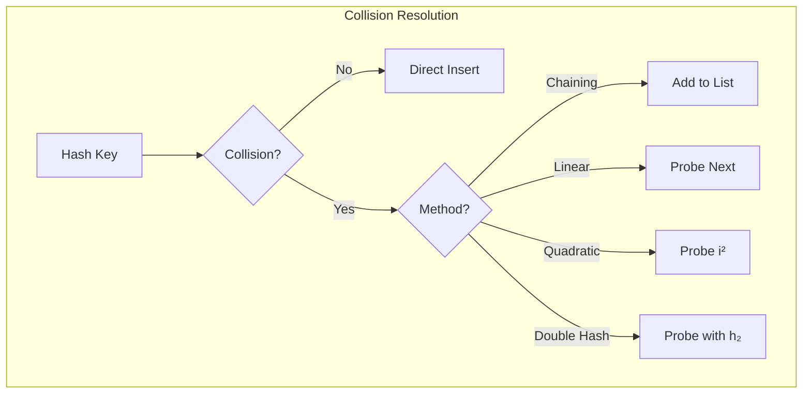

# Hash Table

## Overview

| Property | Value |
|----------|-------|
| **Category** | Associative Array / Dictionary |
| **Search (avg)** | O(1) |
| **Insert (avg)** | O(1) |
| **Delete (avg)** | O(1) |
| **Search (worst)** | O(n) |
| **Space** | O(n) |
| **Source** | [hash_map.py](../../../data_structures/hashing/hash_map.py) |

## 1. Mathematical Foundation

### 1.1 Definition

A **Hash Table** is a data structure that maps keys to values using a **hash function**:

$$
h: U \rightarrow \{0, 1, ..., m-1\}
$$

Where:
- $U$ is the universe of keys
- $m$ is the table size
- $h(k)$ gives the index (bucket) for key $k$

### 1.2 Hash Function Properties

A good hash function should satisfy:

1. **Deterministic**: Same key always produces same hash
2. **Uniform Distribution**: Keys spread evenly across buckets
3. **Efficient**: Computable in O(1) time

$$
P(h(k) = i) \approx \frac{1}{m} \quad \forall i \in \{0, ..., m-1\}
$$

### 1.3 Load Factor

The **load factor** $\alpha$ measures table fullness:

$$
\alpha = \frac{n}{m}
$$

Where $n$ = number of entries, $m$ = table size.

- $\alpha < 1$: Table has empty slots
- $\alpha = 1$: Table is full (for open addressing)
- $\alpha > 1$: Requires chaining

### 1.4 Collision Probability (Birthday Paradox)

For $n$ keys in $m$ buckets, probability of at least one collision:

$$
P(\text{collision}) \approx 1 - e^{-n^2/(2m)}
$$

For 50% collision probability with $m$ buckets:
$$
n \approx 1.177\sqrt{m}
$$

## 2. Hash Functions

### 2.1 Division Method

$$
h(k) = k \mod m
$$

Best when $m$ is prime and not close to a power of 2.

### 2.2 Multiplication Method

$$
h(k) = \lfloor m \cdot (kA \mod 1) \rfloor
$$

Where $0 < A < 1$. Knuth suggests $A \approx \frac{\sqrt{5} - 1}{2} = 0.6180339...$

### 2.3 Universal Hashing

Random selection from a family of hash functions:

$$
h_{a,b}(k) = ((ak + b) \mod p) \mod m
$$

Where $p$ is prime > $|U|$, $a \in \{1,...,p-1\}$, $b \in \{0,...,p-1\}$.

### 2.4 String Hashing (Polynomial Rolling Hash)

$$
h(s) = \sum_{i=0}^{n-1} s[i] \cdot p^i \mod m
$$

Where $p$ is a small prime (e.g., 31 or 53), $m$ is large prime.

```
ALGORITHM PolynomialHash(s)
    INPUT: String s of length n
    OUTPUT: Hash value
    
    1. hash ← 0
    2. p ← 31  // Prime base
    3. m ← 10^9 + 9  // Large prime modulus
    4. p_pow ← 1
    
    5. for i ← 0 to n - 1 do
           hash ← (hash + ord(s[i]) × p_pow) mod m
           p_pow ← (p_pow × p) mod m
       end for
    
    6. return hash
```

## 3. Collision Resolution

### 3.1 Chaining

Each bucket holds a linked list of entries:

```
ALGORITHM ChainedInsert(T, key, value)
    INPUT: Hash table T, key-value pair
    
    1. index ← hash(key) mod T.size
    2. for entry in T.buckets[index] do
           if entry.key = key then
               entry.value ← value  // Update
               return
           end if
       end for
    3. T.buckets[index].append((key, value))
    4. T.count ← T.count + 1


ALGORITHM ChainedSearch(T, key)
    INPUT: Hash table T, key
    OUTPUT: Value or null
    
    1. index ← hash(key) mod T.size
    2. for entry in T.buckets[index] do
           if entry.key = key then
               return entry.value
           end if
       end for
    3. return null
```

### 3.2 Open Addressing

All entries stored in the table itself. Collision → probe for next slot.

#### Linear Probing

$$
h(k, i) = (h'(k) + i) \mod m
$$

```
ALGORITHM LinearProbeInsert(T, key, value)
    INPUT: Hash table T, key-value pair
    
    1. index ← hash(key) mod T.size
    
    2. for i ← 0 to T.size - 1 do
           probe ← (index + i) mod T.size
           
           if T.slots[probe] is empty OR T.slots[probe] is deleted then
               T.slots[probe] ← (key, value)
               T.count ← T.count + 1
               return
           else if T.slots[probe].key = key then
               T.slots[probe].value ← value  // Update
               return
           end if
       end for
    
    3. raise "Table full"
```

**Problem**: Primary clustering - consecutive occupied slots grow.

#### Quadratic Probing

$$
h(k, i) = (h'(k) + c_1 i + c_2 i^2) \mod m
$$

Common: $c_1 = c_2 = 0.5$, $m$ is prime.

**Problem**: Secondary clustering - same initial hash → same probe sequence.

#### Double Hashing

$$
h(k, i) = (h_1(k) + i \cdot h_2(k)) \mod m
$$

Where $h_2(k)$ must never be 0 and be relatively prime to $m$.

```
ALGORITHM DoubleHashInsert(T, key, value)
    INPUT: Hash table T, key-value pair
    
    1. h1 ← hash1(key) mod T.size
    2. h2 ← hash2(key)
    3. if h2 = 0 then h2 ← 1 end if
    
    4. for i ← 0 to T.size - 1 do
           probe ← (h1 + i × h2) mod T.size
           
           if T.slots[probe] is empty OR T.slots[probe] is deleted then
               T.slots[probe] ← (key, value)
               T.count ← T.count + 1
               return
           else if T.slots[probe].key = key then
               T.slots[probe].value ← value
               return
           end if
       end for
    
    5. raise "Table full"
```

### 3.3 Robin Hood Hashing

Variant of linear probing that reduces variance in probe lengths:
- Track probe distance (DIB - Distance from Initial Bucket)
- When inserting, if new key's DIB > existing key's DIB, swap them
- Keeps probe lengths more uniform

### 3.4 Cuckoo Hashing

Use two hash functions and two tables:
- Insert: Try table 1, if occupied kick existing to table 2, recursively
- Guarantees O(1) worst-case lookup
- May require rehashing if cycle detected

## 4. Dynamic Resizing

### 4.1 When to Resize

Resize when load factor exceeds threshold:
- **Chaining**: $\alpha > 1$ or performance degrades
- **Open addressing**: $\alpha > 0.7$ (commonly 0.5-0.75)

### 4.2 Resize Algorithm

```
ALGORITHM Resize(T, new_size)
    INPUT: Hash table T, new capacity
    
    1. old_entries ← CollectAllEntries(T)
    2. T.slots ← CreateNewArray(new_size)
    3. T.size ← new_size
    4. T.count ← 0
    
    5. for (key, value) in old_entries do
           Insert(T, key, value)
       end for
```

**Amortized Analysis**: $n$ insertions → $\log n$ resizes → $O(n)$ total resize cost → $O(1)$ amortized per insertion.

## 5. Complexity Analysis

### 5.1 Time Complexity

| Operation | Average | Worst (no resize) | Worst (with) |
|-----------|---------|-------------------|--------------|
| Search | O(1) | O(n) | O(n) |
| Insert | O(1) | O(n) | O(n)* |
| Delete | O(n) | O(n) | O(n) |

*Amortized O(1) with proper resizing strategy.

### 5.2 Expected Chain Length

With uniform hashing and load factor $\alpha$:
- Expected chain length: $\alpha$
- Expected search (successful): $1 + \alpha/2$
- Expected search (unsuccessful): $1 + \alpha$

### 5.3 Space Complexity

| Method | Space |
|--------|-------|
| Chaining | O(n + m) |
| Open Addressing | O(m) where m ≥ n |

## 6. Visual Representation

### Chaining

```
Hash Table with Chaining (m=7):

Index   Bucket (Linked List)
  0  →  [14, "val14"] → [21, "val21"] → null
  1  →  [1, "val1"] → null
  2  →  null
  3  →  [3, "val3"] → [10, "val10"] → [17, "val17"]
  4  →  null
  5  →  [5, "val5"] → null
  6  →  [6, "val6"] → null

Keys: 14 mod 7 = 0, 21 mod 7 = 0 (collision!)
      1 mod 7 = 1
      3 mod 7 = 3, 10 mod 7 = 3, 17 mod 7 = 3 (collisions!)
```

### Linear Probing

```
Insert 14, 21, 35 with h(k) = k mod 7:

Step 1: Insert 14
Index:  0    1    2    3    4    5    6
       [14] [ ]  [ ]  [ ]  [ ]  [ ]  [ ]

Step 2: Insert 21 (21 mod 7 = 0, collision!)
        Probe: 0→1
       [14] [21] [ ]  [ ]  [ ]  [ ]  [ ]

Step 3: Insert 35 (35 mod 7 = 0, collision!)
        Probe: 0→1→2
       [14] [21] [35] [ ]  [ ]  [ ]  [ ]
```



## 7. Real-World Software Engineering Applications

### 7.1 Industry Use Cases

1. **Programming Languages**
   - Python dict, set
   - Java HashMap, HashSet
   - JavaScript Object, Map
   - C++ unordered_map, unordered_set

2. **Databases**
   - Index structures
   - Join algorithms (hash join)
   - Query result caching
   - Connection pooling

3. **Web Development**
   - Session storage
   - URL routing
   - HTTP header lookup
   - Cookie management

4. **Caching Systems**
   - Redis, Memcached internals
   - DNS caching
   - CDN edge caching
   - Browser caching

5. **Compilers**
   - Symbol tables
   - String interning
   - Constant folding
   - Memoization

### 7.2 Implementation Examples

```python
from typing import Any, Iterator, TypeVar

K = TypeVar('K')
V = TypeVar('V')


class HashMapChaining:
    """
    Hash map using separate chaining.
    
    >>> hm = HashMapChaining()
    >>> hm["a"] = 1
    >>> hm["b"] = 2
    >>> hm["a"]
    1
    >>> "a" in hm
    True
    >>> del hm["a"]
    >>> "a" in hm
    False
    """
    
    def __init__(self, initial_capacity: int = 16, load_factor: float = 0.75):
        self._capacity = initial_capacity
        self._load_factor = load_factor
        self._size = 0
        self._buckets: list[list[tuple[Any, Any]]] = [[] for _ in range(initial_capacity)]
    
    def _hash(self, key: Any) -> int:
        """Compute bucket index for key."""
        return hash(key) % self._capacity
    
    def _resize(self) -> None:
        """Double capacity and rehash all entries."""
        old_buckets = self._buckets
        self._capacity *= 2
        self._buckets = [[] for _ in range(self._capacity)]
        self._size = 0
        
        for bucket in old_buckets:
            for key, value in bucket:
                self[key] = value
    
    def __setitem__(self, key: Any, value: Any) -> None:
        """Insert or update key-value pair. O(1) average."""
        if self._size >= self._capacity * self._load_factor:
            self._resize()
        
        index = self._hash(key)
        bucket = self._buckets[index]
        
        for i, (k, _) in enumerate(bucket):
            if k == key:
                bucket[i] = (key, value)
                return
        
        bucket.append((key, value))
        self._size += 1
    
    def __getitem__(self, key: Any) -> Any:
        """Get value by key. O(1) average."""
        index = self._hash(key)
        for k, v in self._buckets[index]:
            if k == key:
                return v
        raise KeyError(key)
    
    def __delitem__(self, key: Any) -> None:
        """Delete key. O(1) average."""
        index = self._hash(key)
        bucket = self._buckets[index]
        
        for i, (k, _) in enumerate(bucket):
            if k == key:
                bucket.pop(i)
                self._size -= 1
                return
        
        raise KeyError(key)
    
    def __contains__(self, key: Any) -> bool:
        """Check if key exists. O(1) average."""
        try:
            self[key]
            return True
        except KeyError:
            return False
    
    def __len__(self) -> int:
        return self._size
    
    def __iter__(self) -> Iterator[Any]:
        for bucket in self._buckets:
            for key, _ in bucket:
                yield key
    
    def items(self) -> Iterator[tuple[Any, Any]]:
        for bucket in self._buckets:
            yield from bucket


class HashMapOpenAddressing:
    """
    Hash map using linear probing (open addressing).
    
    >>> hm = HashMapOpenAddressing()
    >>> hm.put("x", 10)
    >>> hm.put("y", 20)
    >>> hm.get("x")
    10
    >>> hm.remove("x")
    >>> hm.get("x") is None
    True
    """
    
    DELETED = object()  # Tombstone marker
    
    def __init__(self, initial_capacity: int = 16):
        self._capacity = initial_capacity
        self._size = 0
        self._keys: list[Any] = [None] * initial_capacity
        self._values: list[Any] = [None] * initial_capacity
    
    def _hash(self, key: Any) -> int:
        return hash(key) % self._capacity
    
    def _probe(self, key: Any) -> int:
        """Find slot for key using linear probing."""
        index = self._hash(key)
        first_deleted = -1
        
        for _ in range(self._capacity):
            if self._keys[index] is None:
                return first_deleted if first_deleted != -1 else index
            if self._keys[index] is self.DELETED:
                if first_deleted == -1:
                    first_deleted = index
            elif self._keys[index] == key:
                return index
            
            index = (index + 1) % self._capacity
        
        return first_deleted if first_deleted != -1 else -1
    
    def _resize(self) -> None:
        """Double capacity and rehash."""
        old_keys = self._keys
        old_values = self._values
        
        self._capacity *= 2
        self._keys = [None] * self._capacity
        self._values = [None] * self._capacity
        self._size = 0
        
        for key, value in zip(old_keys, old_values):
            if key is not None and key is not self.DELETED:
                self.put(key, value)
    
    def put(self, key: Any, value: Any) -> None:
        """Insert or update. O(1) average."""
        if self._size >= self._capacity * 0.7:
            self._resize()
        
        index = self._probe(key)
        if self._keys[index] != key:
            self._size += 1
        self._keys[index] = key
        self._values[index] = value
    
    def get(self, key: Any) -> Any:
        """Get value by key. O(1) average."""
        index = self._hash(key)
        
        for _ in range(self._capacity):
            if self._keys[index] is None:
                return None
            if self._keys[index] == key:
                return self._values[index]
            index = (index + 1) % self._capacity
        
        return None
    
    def remove(self, key: Any) -> bool:
        """Remove key. O(1) average."""
        index = self._hash(key)
        
        for _ in range(self._capacity):
            if self._keys[index] is None:
                return False
            if self._keys[index] == key:
                self._keys[index] = self.DELETED
                self._values[index] = None
                self._size -= 1
                return True
            index = (index + 1) % self._capacity
        
        return False


class ConsistentHash:
    """
    Consistent hashing for distributed systems.
    Used in load balancers, distributed caches, databases.
    
    >>> ch = ConsistentHash(["server1", "server2", "server3"])
    >>> ch.get_node("user123")  # Always same server for same key
    'server...'
    """
    
    def __init__(self, nodes: list[str], replicas: int = 100):
        self._replicas = replicas
        self._ring: dict[int, str] = {}
        self._sorted_keys: list[int] = []
        
        for node in nodes:
            self.add_node(node)
    
    def _hash(self, key: str) -> int:
        """Hash function for ring position."""
        return hash(key) % (2**32)
    
    def add_node(self, node: str) -> None:
        """Add node with virtual replicas."""
        for i in range(self._replicas):
            key = self._hash(f"{node}:{i}")
            self._ring[key] = node
            self._sorted_keys.append(key)
        self._sorted_keys.sort()
    
    def remove_node(self, node: str) -> None:
        """Remove node and its replicas."""
        for i in range(self._replicas):
            key = self._hash(f"{node}:{i}")
            del self._ring[key]
            self._sorted_keys.remove(key)
    
    def get_node(self, key: str) -> str:
        """Get node responsible for key."""
        if not self._ring:
            raise ValueError("No nodes in ring")
        
        h = self._hash(key)
        
        # Binary search for first node >= hash
        import bisect
        idx = bisect.bisect_left(self._sorted_keys, h)
        
        if idx == len(self._sorted_keys):
            idx = 0  # Wrap around
        
        return self._ring[self._sorted_keys[idx]]
```

### 7.3 Bloom Filter

```python
import math
from typing import Any


class BloomFilter:
    """
    Probabilistic set membership with no false negatives.
    Space-efficient for large datasets.
    
    >>> bf = BloomFilter(1000, 0.01)  # 1000 items, 1% false positive rate
    >>> bf.add("hello")
    >>> "hello" in bf
    True
    >>> "world" in bf  # Might be True (false positive) or False
    False
    """
    
    def __init__(self, expected_items: int, false_positive_rate: float):
        # Optimal size: m = -n*ln(p) / (ln(2)^2)
        self._size = int(-expected_items * math.log(false_positive_rate) / (math.log(2) ** 2))
        # Optimal hash count: k = m/n * ln(2)
        self._hash_count = int(self._size / expected_items * math.log(2))
        self._bits = [False] * self._size
    
    def _hashes(self, item: Any) -> list[int]:
        """Generate k hash values using double hashing."""
        h1 = hash(item) % self._size
        h2 = hash(str(item) + "salt") % self._size
        if h2 == 0:
            h2 = 1
        return [(h1 + i * h2) % self._size for i in range(self._hash_count)]
    
    def add(self, item: Any) -> None:
        """Add item to filter."""
        for h in self._hashes(item):
            self._bits[h] = True
    
    def __contains__(self, item: Any) -> bool:
        """Check if item might be in set."""
        return all(self._bits[h] for h in self._hashes(item))
```

## 8. Comparison of Collision Methods

| Method | Pros | Cons | Best For |
|--------|------|------|----------|
| Chaining | Simple, α > 1 OK | Extra memory, cache misses | Unknown size |
| Linear | Cache friendly | Primary clustering | Low α |
| Quadratic | Less clustering | May not find slot | Moderate α |
| Double | Best distribution | Extra hash function | High performance |
| Robin Hood | Low variance | Complex | Predictable latency |
| Cuckoo | O(1) worst lookup | May need rehash | Read-heavy |

## 9. References

- Knuth, D. "The Art of Computer Programming, Vol. 3" - Chapter 6
- Cormen, T. et al. "Introduction to Algorithms" - Chapter 11
- [Wikipedia: Hash Table](https://en.wikipedia.org/wiki/Hash_table)
- [Wikipedia: Consistent Hashing](https://en.wikipedia.org/wiki/Consistent_hashing)
- Bloom, B. (1970). "Space/time trade-offs in hash coding with allowable errors"
