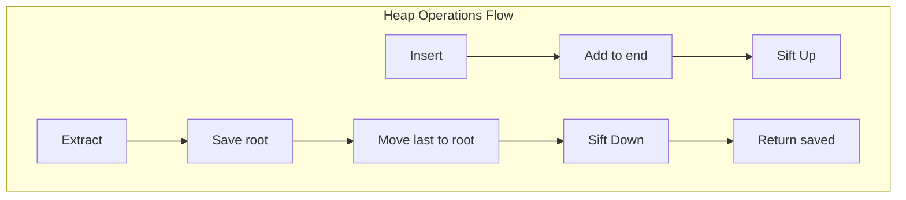

# Heap Data Structures

## Overview

| Property | Min-Heap | Max-Heap |
|----------|----------|----------|
| **Category** | Priority Queue |  Priority Queue |
| **Find Min/Max** | O(1) | O(1) |
| **Extract Min/Max** | O(log n) | O(log n) |
| **Insert** | O(log n) | O(log n) |
| **Build** | O(n) | O(n) |
| **Space** | O(n) | O(n) |
| **Source** | [heap.py](../../../data_structures/heap/) |

## 1. Mathematical Foundation

### 1.1 Definition

A **Binary Heap** is a complete binary tree satisfying the **heap property**:
- **Min-Heap**: Parent ≤ Children → $A[\text{parent}(i)] \leq A[i]$
- **Max-Heap**: Parent ≥ Children → $A[\text{parent}(i)] \geq A[i]$

### 1.2 Array Representation

For 0-indexed array:
$$
\begin{aligned}
\text{parent}(i) &= \lfloor (i-1)/2 \rfloor \\
\text{left}(i) &= 2i + 1 \\
\text{right}(i) &= 2i + 2
\end{aligned}
$$

For 1-indexed array:
$$
\begin{aligned}
\text{parent}(i) &= \lfloor i/2 \rfloor \\
\text{left}(i) &= 2i \\
\text{right}(i) &= 2i + 1
\end{aligned}
$$

### 1.3 Height Property

For a heap with $n$ elements:
$$
h = \lfloor \log_2 n \rfloor
$$

Number of nodes at level $k$: $\min(2^k, n - 2^k + 1)$

### 1.4 Complete Binary Tree Property

A complete binary tree fills levels left-to-right:
- All levels except possibly the last are completely filled
- Last level has all nodes as far left as possible

## 2. Structure Visualization

```
Min-Heap Array: [1, 3, 2, 7, 6, 4, 5]

Tree representation:
            1(0)
          /     \
        3(1)    2(2)
       /   \   /   \
     7(3) 6(4) 4(5) 5(6)

Index relationships:
- parent(3) = (3-1)/2 = 1 → value 3 ✓ (3 < 7)
- left(1) = 2*1+1 = 3 → value 7
- right(1) = 2*1+2 = 4 → value 6
```

## 3. Core Operations

### 3.1 Heapify (Sift Down)

Restore heap property for subtree rooted at index i:

```
ALGORITHM Heapify(A, n, i)
    INPUT: Array A, size n, index i
    
    1. smallest ← i
    2. left ← 2*i + 1
    3. right ← 2*i + 2
    
    // Find smallest among node and children
    4. if left < n AND A[left] < A[smallest] then
           smallest ← left
       end if
    
    5. if right < n AND A[right] < A[smallest] then
           smallest ← right
       end if
    
    // Swap and recurse if needed
    6. if smallest ≠ i then
           Swap(A[i], A[smallest])
           Heapify(A, n, smallest)
       end if
```

### 3.2 Build Heap

Convert array to heap in O(n):

```
ALGORITHM BuildHeap(A)
    INPUT: Array A of size n
    OUTPUT: Array A as valid heap
    
    // Start from last non-leaf node
    1. for i ← n/2 - 1 down to 0 do
           Heapify(A, n, i)
       end for
    
    // Time: O(n) - NOT O(n log n)!
```

**Why O(n)?** Most nodes are near leaves (height 0-1), contributing little work:
$$
\sum_{k=0}^{h} \frac{n}{2^{k+1}} \cdot O(k) = O(n)
$$

### 3.3 Insert (Sift Up)

```
ALGORITHM Insert(heap, value)
    INPUT: Heap array, new value
    
    1. heap.append(value)
    2. i ← len(heap) - 1
    
    // Sift up while heap property violated
    3. while i > 0 AND heap[parent(i)] > heap[i] do
           Swap(heap[i], heap[parent(i)])
           i ← parent(i)
       end while
```

### 3.4 Extract Min/Max

```
ALGORITHM ExtractMin(heap)
    INPUT: Heap array
    OUTPUT: Minimum element
    
    1. if heap is empty then
           raise "Heap underflow"
       end if
    
    2. min_val ← heap[0]
    3. heap[0] ← heap[len(heap) - 1]
    4. heap.pop()
    
    5. if heap is not empty then
           Heapify(heap, len(heap), 0)
       end if
    
    6. return min_val
```

### 3.5 Decrease Key

```
ALGORITHM DecreaseKey(heap, i, new_val)
    INPUT: Heap, index i, new value (must be smaller)
    
    1. if new_val > heap[i] then
           raise "New value larger than current"
       end if
    
    2. heap[i] ← new_val
    
    // Sift up to maintain heap property
    3. while i > 0 AND heap[parent(i)] > heap[i] do
           Swap(heap[i], heap[parent(i)])
           i ← parent(i)
       end while
```

## 4. Heap Sort

```
ALGORITHM HeapSort(A)
    INPUT: Array A of size n
    OUTPUT: Array A sorted in ascending order
    
    // Build max-heap
    1. for i ← n/2 - 1 down to 0 do
           MaxHeapify(A, n, i)
       end for
    
    // Extract elements one by one
    2. for i ← n - 1 down to 1 do
           Swap(A[0], A[i])
           MaxHeapify(A, i, 0)  // Heapify reduced heap
       end for
```

## 5. Priority Queue Operations

```
ALGORITHM PriorityQueue Operations

INSERT(Q, priority, item):
    1. node ← (priority, item)
    2. Q.heap.append(node)
    3. SiftUp(Q, len(Q) - 1)

EXTRACT_MIN(Q):
    1. if Q is empty: raise error
    2. min_item ← Q.heap[0]
    3. Q.heap[0] ← Q.heap[-1]
    4. Q.heap.pop()
    5. SiftDown(Q, 0)
    6. return min_item

PEEK(Q):
    1. if Q is empty: raise error
    2. return Q.heap[0]

DECREASE_PRIORITY(Q, item, new_priority):
    1. i ← find index of item
    2. Q.heap[i].priority ← new_priority
    3. SiftUp(Q, i)
```

## 6. Complexity Analysis

### 6.1 Time Complexity

| Operation | Average | Worst |
|-----------|---------|-------|
| Build Heap | O(n) | O(n) |
| Insert | O(1)* | O(log n) |
| Extract Min/Max | O(log n) | O(log n) |
| Peek Min/Max | O(1) | O(1) |
| Decrease Key | O(log n) | O(log n) |
| Delete | O(log n) | O(log n) |
| Merge (binary) | O(n) | O(n) |

*Average O(1) because most insertions percolate up only a few levels.

### 6.2 Space Complexity

| Implementation | Space |
|----------------|-------|
| Array-based | O(n) |
| Additional | O(1) for operations |

### 6.3 Heap Sort Analysis

| Metric | Complexity |
|--------|------------|
| Time (all cases) | O(n log n) |
| Space | O(1) in-place |
| Stable | No |
| Adaptive | No |

## 7. Visual Representation

### Insert Example

```
Insert 0 into Min-Heap [1, 3, 2, 7, 6, 4, 5]:

Step 1: Append to end
        1
      /   \
     3     2
    /|\   /|\
   7 6 4 5 0  ← New

Step 2: Sift up (0 < 2)
        1
      /   \
     3     0  ← Swapped
    /|\   /|\
   7 6 4 5 2

Step 3: Sift up (0 < 1)
        0      ← Swapped
      /   \
     3     1
    /|\   /|\
   7 6 4 5 2

Final: [0, 3, 1, 7, 6, 4, 5, 2]
```

### Extract Min Example

```
Extract Min from [0, 3, 1, 7, 6, 4, 5, 2]:

Step 1: Save min (0), move last to root
        2      ← Moved from end
      /   \
     3     1
    /|\   /
   7 6 4 5

Step 2: Sift down (2 > min(3,1) = 1)
        1      ← Swapped
      /   \
     3     2
    /|\   /
   7 6 4 5

Step 3: Sift down (2 ≤ min(4,5) = 4) - DONE

Final: [1, 3, 2, 7, 6, 4, 5], returned 0
```



## 8. Heap Variants

### 8.1 Binomial Heap

| Operation | Binary Heap | Binomial Heap |
|-----------|-------------|---------------|
| Insert | O(log n) | O(1) amortized |
| Extract Min | O(log n) | O(log n) |
| Merge | O(n) | O(log n) |
| Decrease Key | O(log n) | O(log n) |

### 8.2 Fibonacci Heap

| Operation | Binary Heap | Fibonacci Heap |
|-----------|-------------|----------------|
| Insert | O(log n) | O(1) |
| Extract Min | O(log n) | O(log n) amortized |
| Merge | O(n) | O(1) |
| Decrease Key | O(log n) | O(1) amortized |

### 8.3 D-ary Heap

Generalization with d children per node:
- Shallower tree: height = $\log_d n$
- Better cache performance
- Trade-off: more comparisons per sift-down

## 9. Real-World Software Engineering Applications

### 9.1 Industry Use Cases

1. **Operating Systems**
   - Process scheduling (priority queues)
   - Memory management (best-fit allocation)
   - Timer management
   - I/O request scheduling

2. **Graph Algorithms**
   - Dijkstra's shortest path
   - Prim's MST
   - A* search
   - Huffman coding

3. **Databases**
   - Top-K queries
   - External sorting (merge phase)
   - Query optimization
   - Buffer pool management

4. **Event-Driven Simulation**
   - Discrete event simulation
   - Game engines (event queues)
   - Network simulation
   - Traffic modeling

5. **Data Streaming**
   - Running median
   - Top-K frequent elements
   - Kth largest/smallest
   - Real-time statistics

### 9.2 Implementation Examples

```python
import heapq
from dataclasses import dataclass, field
from typing import Any, Generic, TypeVar


class MinHeap:
    """
    Min-heap implementation using array.
    
    >>> heap = MinHeap()
    >>> heap.push(3)
    >>> heap.push(1)
    >>> heap.push(2)
    >>> heap.pop()
    1
    >>> heap.peek()
    2
    """
    
    def __init__(self):
        self._data: list[Any] = []
    
    def push(self, item: Any) -> None:
        """Add item to heap. O(log n)"""
        self._data.append(item)
        self._sift_up(len(self._data) - 1)
    
    def pop(self) -> Any:
        """Remove and return minimum. O(log n)"""
        if not self._data:
            raise IndexError("pop from empty heap")
        
        min_val = self._data[0]
        last = self._data.pop()
        
        if self._data:
            self._data[0] = last
            self._sift_down(0)
        
        return min_val
    
    def peek(self) -> Any:
        """Return minimum without removing. O(1)"""
        if not self._data:
            raise IndexError("peek at empty heap")
        return self._data[0]
    
    def _sift_up(self, i: int) -> None:
        while i > 0:
            parent = (i - 1) // 2
            if self._data[parent] <= self._data[i]:
                break
            self._data[parent], self._data[i] = self._data[i], self._data[parent]
            i = parent
    
    def _sift_down(self, i: int) -> None:
        n = len(self._data)
        while True:
            smallest = i
            left = 2 * i + 1
            right = 2 * i + 2
            
            if left < n and self._data[left] < self._data[smallest]:
                smallest = left
            if right < n and self._data[right] < self._data[smallest]:
                smallest = right
            
            if smallest == i:
                break
            
            self._data[i], self._data[smallest] = self._data[smallest], self._data[i]
            i = smallest
    
    def __len__(self) -> int:
        return len(self._data)
    
    def __bool__(self) -> bool:
        return bool(self._data)


T = TypeVar('T')


@dataclass(order=True)
class PrioritizedItem:
    """Item wrapper for priority queue with custom priorities."""
    priority: float
    item: Any = field(compare=False)


class PriorityQueue(Generic[T]):
    """
    Priority queue using min-heap.
    Lower priority value = higher priority.
    
    >>> pq = PriorityQueue()
    >>> pq.push("task1", priority=3)
    >>> pq.push("task2", priority=1)
    >>> pq.push("task3", priority=2)
    >>> pq.pop()
    'task2'
    """
    
    def __init__(self):
        self._heap: list[PrioritizedItem] = []
        self._counter = 0  # Tie-breaker for equal priorities
    
    def push(self, item: T, priority: float = 0) -> None:
        """Add item with given priority. O(log n)"""
        entry = PrioritizedItem(priority, (self._counter, item))
        self._counter += 1
        heapq.heappush(self._heap, entry)
    
    def pop(self) -> T:
        """Remove and return highest priority item. O(log n)"""
        if not self._heap:
            raise IndexError("pop from empty queue")
        entry = heapq.heappop(self._heap)
        return entry.item[1]
    
    def peek(self) -> T:
        """Return highest priority item without removing. O(1)"""
        if not self._heap:
            raise IndexError("peek at empty queue")
        return self._heap[0].item[1]
    
    def __len__(self) -> int:
        return len(self._heap)
    
    def __bool__(self) -> bool:
        return bool(self._heap)


class MedianFinder:
    """
    Find running median using two heaps.
    
    >>> mf = MedianFinder()
    >>> mf.add(1)
    >>> mf.add(2)
    >>> mf.median()
    1.5
    >>> mf.add(3)
    >>> mf.median()
    2.0
    """
    
    def __init__(self):
        self._lo = []  # Max-heap (negated) for lower half
        self._hi = []  # Min-heap for upper half
    
    def add(self, num: int) -> None:
        """Add number to data stream. O(log n)"""
        # Add to max-heap (lower half)
        heapq.heappush(self._lo, -num)
        
        # Balance: ensure max of lo ≤ min of hi
        if self._hi and -self._lo[0] > self._hi[0]:
            val = -heapq.heappop(self._lo)
            heapq.heappush(self._hi, val)
        
        # Balance sizes: lo can have at most 1 more than hi
        if len(self._lo) > len(self._hi) + 1:
            val = -heapq.heappop(self._lo)
            heapq.heappush(self._hi, val)
        elif len(self._hi) > len(self._lo):
            val = heapq.heappop(self._hi)
            heapq.heappush(self._lo, -val)
    
    def median(self) -> float:
        """Return current median. O(1)"""
        if len(self._lo) > len(self._hi):
            return float(-self._lo[0])
        return (-self._lo[0] + self._hi[0]) / 2.0


class TopKTracker:
    """
    Track top K largest elements seen so far.
    
    >>> tracker = TopKTracker(3)
    >>> for x in [5, 1, 9, 3, 7, 2]: tracker.add(x)
    >>> tracker.get_top_k()
    [9, 7, 5]
    """
    
    def __init__(self, k: int):
        self.k = k
        self._heap: list[int] = []  # Min-heap of size k
    
    def add(self, num: int) -> None:
        """Add number. O(log k)"""
        if len(self._heap) < self.k:
            heapq.heappush(self._heap, num)
        elif num > self._heap[0]:
            heapq.heapreplace(self._heap, num)
    
    def get_top_k(self) -> list[int]:
        """Return top K in descending order. O(k log k)"""
        return sorted(self._heap, reverse=True)
    
    def get_kth_largest(self) -> int:
        """Return Kth largest element. O(1)"""
        if len(self._heap) < self.k:
            raise ValueError(f"Less than {self.k} elements")
        return self._heap[0]
```

### 9.3 Task Scheduler Example

```python
import time
from threading import Thread, Lock


class TaskScheduler:
    """
    Priority-based task scheduler using heap.
    Used in OS kernels, game engines, event systems.
    """
    
    def __init__(self):
        self._tasks = []  # (timestamp, priority, id, callback)
        self._counter = 0
        self._lock = Lock()
        self._running = False
    
    def schedule(self, callback, delay: float = 0, priority: int = 0):
        """Schedule task to run after delay. O(log n)"""
        run_at = time.time() + delay
        with self._lock:
            task_id = self._counter
            self._counter += 1
            heapq.heappush(self._tasks, (run_at, priority, task_id, callback))
        return task_id
    
    def cancel(self, task_id: int) -> bool:
        """Cancel scheduled task. O(n)"""
        with self._lock:
            for i, task in enumerate(self._tasks):
                if task[2] == task_id:
                    self._tasks[i] = self._tasks[-1]
                    self._tasks.pop()
                    heapq.heapify(self._tasks)
                    return True
        return False
    
    def run(self):
        """Start scheduler loop."""
        self._running = True
        while self._running:
            with self._lock:
                if not self._tasks:
                    continue
                
                run_at, _, _, callback = self._tasks[0]
                now = time.time()
                
                if now >= run_at:
                    heapq.heappop(self._tasks)
                    callback()
                else:
                    time.sleep(min(0.01, run_at - now))
    
    def stop(self):
        """Stop scheduler loop."""
        self._running = False
```

## 10. References

- Williams, J.W.J. (1964). "Algorithm 232: Heapsort"
- Floyd, R. (1964). "Algorithm 245: Treesort 3"
- Cormen, T. et al. "Introduction to Algorithms" - Chapter 6
- [Wikipedia: Heap](https://en.wikipedia.org/wiki/Heap_(data_structure))
- [Wikipedia: Binary Heap](https://en.wikipedia.org/wiki/Binary_heap)
