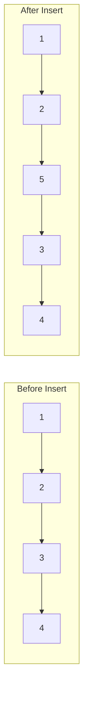

# Linked List Data Structures

## Overview

| Variant | Access | Search | Insert | Delete | Space |
|---------|--------|--------|--------|--------|-------|
| **Singly Linked** | O(n) | O(n) | O(1)* | O(1)* | O(n) |
| **Doubly Linked** | O(n) | O(n) | O(1)* | O(1)* | O(n) |
| **Circular** | O(n) | O(n) | O(1)* | O(1)* | O(n) |
| **Skip List** | O(log n) | O(log n) | O(log n) | O(log n) | O(n) |

*O(1) insertion/deletion when position is known; O(n) to find position.

**Source**: [linked_list/](../../../data_structures/linked_list/)

## 1. Mathematical Foundation

### 1.1 Definition

A **Linked List** is a linear data structure where elements are stored in nodes, each containing:
- **Data**: The value stored
- **Pointer(s)**: Reference(s) to other node(s)

### 1.2 Types

| Type | Pointers per Node | Traversal |
|------|-------------------|-----------|
| Singly Linked | 1 (next) | Forward only |
| Doubly Linked | 2 (prev, next) | Bidirectional |
| Circular | 1-2 (wraps around) | Cyclic |

### 1.3 Memory Model

Unlike arrays with contiguous memory:
$$
\text{Array: } A[i] = \text{base} + i \times \text{sizeof(element)}
$$

Linked list nodes can be anywhere in memory:
$$
\text{Node}_i.\text{next} \rightarrow \text{Node}_{i+1} \text{ (any address)}
$$

### 1.4 Comparison with Arrays

| Operation | Array | Linked List |
|-----------|-------|-------------|
| Access by index | O(1) | O(n) |
| Insert at front | O(n) | O(1) |
| Insert at end | O(1)* | O(n) or O(1)** |
| Insert at position | O(n) | O(n) |
| Delete at position | O(n) | O(n) |
| Memory overhead | Low | High (pointers) |
| Cache locality | Good | Poor |

*Amortized for dynamic arrays
**O(1) with tail pointer

## 2. Singly Linked List

### 2.1 Node Structure

```
class Node:
    data: T         // Value stored
    next: Node      // Pointer to next node (or null)
```

### 2.2 List Structure

```
class SinglyLinkedList:
    head: Node      // First node (or null if empty)
    tail: Node      // Last node (optional, for O(1) append)
    size: int       // Number of elements (optional)
```

### 2.3 Core Operations

#### Insert at Head

```
ALGORITHM InsertAtHead(list, value)
    INPUT: Linked list, value to insert
    
    1. new_node ← CreateNode(value)
    2. new_node.next ← list.head
    3. list.head ← new_node
    
    4. if list.tail = null then
           list.tail ← new_node
       end if
    
    5. list.size ← list.size + 1
```

#### Insert at Tail

```
ALGORITHM InsertAtTail(list, value)
    INPUT: Linked list, value to insert
    
    1. new_node ← CreateNode(value)
    
    2. if list.head = null then
           list.head ← new_node
           list.tail ← new_node
       else
           list.tail.next ← new_node
           list.tail ← new_node
       end if
    
    3. list.size ← list.size + 1
```

#### Insert at Position

```
ALGORITHM InsertAtPosition(list, value, pos)
    INPUT: Linked list, value, position (0-indexed)
    
    1. if pos < 0 OR pos > list.size then
           raise "Invalid position"
       end if
    
    2. if pos = 0 then
           return InsertAtHead(list, value)
       end if
    
    3. current ← list.head
    4. for i ← 1 to pos - 1 do
           current ← current.next
       end for
    
    5. new_node ← CreateNode(value)
    6. new_node.next ← current.next
    7. current.next ← new_node
    
    8. if new_node.next = null then
           list.tail ← new_node
       end if
    
    9. list.size ← list.size + 1
```

#### Delete Node

```
ALGORITHM DeleteNode(list, value)
    INPUT: Linked list, value to delete
    OUTPUT: True if deleted, False otherwise
    
    1. if list.head = null then
           return False
       end if
    
    // Special case: head has the value
    2. if list.head.data = value then
           list.head ← list.head.next
           if list.head = null then
               list.tail ← null
           end if
           list.size ← list.size - 1
           return True
       end if
    
    // Search for node
    3. current ← list.head
    4. while current.next ≠ null AND current.next.data ≠ value do
           current ← current.next
       end while
    
    5. if current.next = null then
           return False  // Not found
       end if
    
    // Delete node
    6. if current.next = list.tail then
           list.tail ← current
       end if
    7. current.next ← current.next.next
    8. list.size ← list.size - 1
    9. return True
```

#### Search

```
ALGORITHM Search(list, value)
    INPUT: Linked list, value to find
    OUTPUT: Index if found, -1 otherwise
    
    1. current ← list.head
    2. index ← 0
    
    3. while current ≠ null do
           if current.data = value then
               return index
           end if
           current ← current.next
           index ← index + 1
       end while
    
    4. return -1
```

#### Reverse

```
ALGORITHM Reverse(list)
    INPUT: Linked list
    OUTPUT: Reversed list
    
    1. prev ← null
    2. current ← list.head
    3. list.tail ← list.head
    
    4. while current ≠ null do
           next ← current.next
           current.next ← prev
           prev ← current
           current ← next
       end while
    
    5. list.head ← prev
```

## 3. Doubly Linked List

### 3.1 Node Structure

```
class DNode:
    data: T         // Value stored
    prev: DNode     // Pointer to previous node
    next: DNode     // Pointer to next node
```

### 3.2 Core Operations

#### Insert After Node

```
ALGORITHM InsertAfter(list, node, value)
    INPUT: List, existing node, value to insert
    
    1. new_node ← CreateDNode(value)
    2. new_node.prev ← node
    3. new_node.next ← node.next
    
    4. if node.next ≠ null then
           node.next.prev ← new_node
       else
           list.tail ← new_node
       end if
    
    5. node.next ← new_node
    6. list.size ← list.size + 1
```

#### Delete Node (with pointer)

```
ALGORITHM DeleteNode(list, node)
    INPUT: List, node to delete
    
    // Update previous node
    1. if node.prev ≠ null then
           node.prev.next ← node.next
       else
           list.head ← node.next
       end if
    
    // Update next node
    2. if node.next ≠ null then
           node.next.prev ← node.prev
       else
           list.tail ← node.prev
       end if
    
    3. list.size ← list.size - 1
```

## 4. Circular Linked List

### 4.1 Structure

```
Singly Circular:
    head → [A] → [B] → [C] → [D] ─┐
           ↑_______________________|

Doubly Circular:
    ┌────────────────────────────────┐
    ↓                                |
   [A] ⇄ [B] ⇄ [C] ⇄ [D]
    ↑                  ↓
    └──────────────────┘
```

### 4.2 Traversal

```
ALGORITHM TraverseCircular(list)
    INPUT: Circular linked list
    
    1. if list.head = null then
           return
       end if
    
    2. current ← list.head
    
    3. do
           Process(current.data)
           current ← current.next
       while current ≠ list.head
```

## 5. Common Algorithms

### 5.1 Detect Cycle (Floyd's Algorithm)

```
ALGORITHM HasCycle(head)
    INPUT: Head of linked list
    OUTPUT: True if cycle exists
    
    1. if head = null then
           return False
       end if
    
    2. slow ← head
    3. fast ← head
    
    4. while fast ≠ null AND fast.next ≠ null do
           slow ← slow.next
           fast ← fast.next.next
           
           if slow = fast then
               return True
           end if
       end while
    
    5. return False
```

### 5.2 Find Cycle Start

```
ALGORITHM FindCycleStart(head)
    INPUT: Head of linked list with cycle
    OUTPUT: Node where cycle begins
    
    // Phase 1: Detect cycle
    1. slow ← head
    2. fast ← head
    
    3. while fast ≠ null AND fast.next ≠ null do
           slow ← slow.next
           fast ← fast.next.next
           if slow = fast then
               break
           end if
       end while
    
    4. if fast = null OR fast.next = null then
           return null  // No cycle
       end if
    
    // Phase 2: Find start
    5. slow ← head
    6. while slow ≠ fast do
           slow ← slow.next
           fast ← fast.next
       end while
    
    7. return slow
```

### 5.3 Find Middle

```
ALGORITHM FindMiddle(head)
    INPUT: Head of linked list
    OUTPUT: Middle node
    
    1. slow ← head
    2. fast ← head
    
    3. while fast ≠ null AND fast.next ≠ null do
           slow ← slow.next
           fast ← fast.next.next
       end while
    
    4. return slow
```

### 5.4 Merge Two Sorted Lists

```
ALGORITHM MergeSorted(l1, l2)
    INPUT: Two sorted linked lists
    OUTPUT: Merged sorted list
    
    1. dummy ← CreateNode(0)
    2. current ← dummy
    
    3. while l1 ≠ null AND l2 ≠ null do
           if l1.data ≤ l2.data then
               current.next ← l1
               l1 ← l1.next
           else
               current.next ← l2
               l2 ← l2.next
           end if
           current ← current.next
       end while
    
    4. if l1 ≠ null then
           current.next ← l1
       else
           current.next ← l2
       end if
    
    5. return dummy.next
```

## 6. Complexity Analysis

### 6.1 Time Complexity

| Operation | Singly | Doubly | With Position |
|-----------|--------|--------|---------------|
| Access | O(n) | O(n) | - |
| Search | O(n) | O(n) | - |
| Insert head | O(1) | O(1) | - |
| Insert tail | O(1)* | O(1)* | - |
| Insert at pos | O(n) | O(n) | O(1) |
| Delete head | O(1) | O(1) | - |
| Delete tail | O(n) | O(1)* | - |
| Delete at pos | O(n) | O(n) | O(1) |

*With tail pointer

### 6.2 Space Complexity

| Type | Per Node | Total |
|------|----------|-------|
| Singly | data + 1 ptr | O(n) |
| Doubly | data + 2 ptrs | O(n) |
| XOR | data + 1 ptr | O(n) |

## 7. Visual Representation

### Singly Linked List

```
head                                  tail
 ↓                                     ↓
┌───┬───┐   ┌───┬───┐   ┌───┬───┐   ┌───┬───┐
│ 1 │ ●─┼──→│ 2 │ ●─┼──→│ 3 │ ●─┼──→│ 4 │ ∅ │
└───┴───┘   └───┴───┘   └───┴───┘   └───┴───┘
```

### Doubly Linked List

```
head                                      tail
 ↓                                         ↓
┌───┬───┬───┐   ┌───┬───┬───┐   ┌───┬───┬───┐
│ ∅ │ 1 │ ●─┼──→│ ●─┼─2─┼─● │──→│ ● │ 3 │ ∅ │
└───┴───┴───┘   └───┴───┴───┘   └───┴───┴───┘
         ↑          |     ↑          |
         └──────────┘     └──────────┘
```

### Insert Operation

```
Insert 5 after node with value 2:

Before:
[1] → [2] → [3] → [4]

After:
[1] → [2] → [5] → [3] → [4]
           ↑
         new node
```



## 8. Real-World Software Engineering Applications

### 8.1 Industry Use Cases

1. **Operating Systems**
   - Process scheduling queues
   - Memory allocation (free list)
   - File system block chains
   - Undo/redo functionality

2. **Web Browsers**
   - Browser history (back/forward)
   - Tab management
   - DOM tree traversal
   - Cache implementation (LRU)

3. **Music/Media Players**
   - Playlist management
   - Previous/next track
   - Shuffle queues
   - Streaming buffers

4. **Text Editors**
   - Line representation
   - Cursor movement
   - Undo stack
   - Gap buffer edges

5. **Databases**
   - Hash table chaining
   - Buffer pool management
   - Transaction logs
   - Index structures

### 8.2 Implementation Examples

```python
from dataclasses import dataclass
from typing import Any, Generic, Iterator, TypeVar

T = TypeVar('T')


@dataclass
class Node(Generic[T]):
    """Node for singly linked list."""
    data: T
    next: "Node[T] | None" = None


class SinglyLinkedList(Generic[T]):
    """
    Singly linked list implementation.
    
    >>> ll = SinglyLinkedList()
    >>> ll.append(1)
    >>> ll.append(2)
    >>> ll.append(3)
    >>> list(ll)
    [1, 2, 3]
    >>> ll.prepend(0)
    >>> list(ll)
    [0, 1, 2, 3]
    >>> ll.delete(2)
    True
    >>> list(ll)
    [0, 1, 3]
    """
    
    def __init__(self):
        self._head: Node[T] | None = None
        self._tail: Node[T] | None = None
        self._size: int = 0
    
    def prepend(self, data: T) -> None:
        """Insert at beginning. O(1)"""
        new_node = Node(data, self._head)
        self._head = new_node
        if self._tail is None:
            self._tail = new_node
        self._size += 1
    
    def append(self, data: T) -> None:
        """Insert at end. O(1)"""
        new_node = Node(data)
        if self._tail is None:
            self._head = self._tail = new_node
        else:
            self._tail.next = new_node
            self._tail = new_node
        self._size += 1
    
    def delete(self, data: T) -> bool:
        """Delete first occurrence of data. O(n)"""
        if self._head is None:
            return False
        
        if self._head.data == data:
            self._head = self._head.next
            if self._head is None:
                self._tail = None
            self._size -= 1
            return True
        
        current = self._head
        while current.next is not None and current.next.data != data:
            current = current.next
        
        if current.next is None:
            return False
        
        if current.next == self._tail:
            self._tail = current
        current.next = current.next.next
        self._size -= 1
        return True
    
    def search(self, data: T) -> int:
        """Find index of data. O(n). Returns -1 if not found."""
        current = self._head
        index = 0
        while current is not None:
            if current.data == data:
                return index
            current = current.next
            index += 1
        return -1
    
    def reverse(self) -> None:
        """Reverse list in place. O(n)"""
        self._tail = self._head
        prev = None
        current = self._head
        
        while current is not None:
            next_node = current.next
            current.next = prev
            prev = current
            current = next_node
        
        self._head = prev
    
    def __len__(self) -> int:
        return self._size
    
    def __iter__(self) -> Iterator[T]:
        current = self._head
        while current is not None:
            yield current.data
            current = current.next


@dataclass
class DNode(Generic[T]):
    """Node for doubly linked list."""
    data: T
    prev: "DNode[T] | None" = None
    next: "DNode[T] | None" = None


class DoublyLinkedList(Generic[T]):
    """
    Doubly linked list with O(1) operations at both ends.
    
    >>> dll = DoublyLinkedList()
    >>> dll.append(1)
    >>> dll.append(2)
    >>> dll.prepend(0)
    >>> list(dll)
    [0, 1, 2]
    >>> list(dll.reverse_iter())
    [2, 1, 0]
    """
    
    def __init__(self):
        self._head: DNode[T] | None = None
        self._tail: DNode[T] | None = None
        self._size: int = 0
    
    def prepend(self, data: T) -> DNode[T]:
        """Insert at beginning. O(1)"""
        new_node = DNode(data, None, self._head)
        if self._head is not None:
            self._head.prev = new_node
        else:
            self._tail = new_node
        self._head = new_node
        self._size += 1
        return new_node
    
    def append(self, data: T) -> DNode[T]:
        """Insert at end. O(1)"""
        new_node = DNode(data, self._tail, None)
        if self._tail is not None:
            self._tail.next = new_node
        else:
            self._head = new_node
        self._tail = new_node
        self._size += 1
        return new_node
    
    def remove_node(self, node: DNode[T]) -> T:
        """Remove specific node. O(1)"""
        if node.prev is not None:
            node.prev.next = node.next
        else:
            self._head = node.next
        
        if node.next is not None:
            node.next.prev = node.prev
        else:
            self._tail = node.prev
        
        self._size -= 1
        return node.data
    
    def move_to_front(self, node: DNode[T]) -> None:
        """Move existing node to front. O(1)"""
        if node == self._head:
            return
        
        # Remove from current position
        if node.prev:
            node.prev.next = node.next
        if node.next:
            node.next.prev = node.prev
        if node == self._tail:
            self._tail = node.prev
        
        # Move to front
        node.prev = None
        node.next = self._head
        if self._head:
            self._head.prev = node
        self._head = node
    
    def __len__(self) -> int:
        return self._size
    
    def __iter__(self) -> Iterator[T]:
        current = self._head
        while current is not None:
            yield current.data
            current = current.next
    
    def reverse_iter(self) -> Iterator[T]:
        current = self._tail
        while current is not None:
            yield current.data
            current = current.prev


class LRUCache(Generic[T]):
    """
    Least Recently Used cache using doubly linked list + hash map.
    O(1) get and put operations.
    
    >>> cache = LRUCache(2)
    >>> cache.put(1, "a")
    >>> cache.put(2, "b")
    >>> cache.get(1)
    'a'
    >>> cache.put(3, "c")  # Evicts key 2
    >>> cache.get(2)  # Returns None (evicted)
    >>> cache.get(3)
    'c'
    """
    
    def __init__(self, capacity: int):
        self._capacity = capacity
        self._cache: dict[Any, DNode] = {}
        self._list = DoublyLinkedList()
    
    def get(self, key: Any) -> T | None:
        """Get value and mark as recently used. O(1)"""
        if key not in self._cache:
            return None
        
        node = self._cache[key]
        self._list.move_to_front(node)
        return node.data[1]  # (key, value)
    
    def put(self, key: Any, value: T) -> None:
        """Add or update value. O(1)"""
        if key in self._cache:
            node = self._cache[key]
            node.data = (key, value)
            self._list.move_to_front(node)
        else:
            if len(self._list) >= self._capacity:
                # Evict LRU (tail)
                evicted = self._list._tail
                if evicted:
                    del self._cache[evicted.data[0]]
                    self._list.remove_node(evicted)
            
            node = self._list.prepend((key, value))
            self._cache[key] = node
```

### 8.3 Browser History Example

```python
class BrowserHistory:
    """
    Browser-style navigation using doubly linked list.
    
    >>> browser = BrowserHistory("google.com")
    >>> browser.visit("facebook.com")
    >>> browser.visit("youtube.com")
    >>> browser.back(1)
    'facebook.com'
    >>> browser.back(1)
    'google.com'
    >>> browser.forward(1)
    'facebook.com'
    >>> browser.visit("linkedin.com")  # Clears forward history
    >>> browser.forward(2)  # Can't go forward
    'linkedin.com'
    """
    
    def __init__(self, homepage: str):
        self._current = DNode(homepage)
    
    def visit(self, url: str) -> None:
        """Visit new URL, clearing forward history."""
        new_node = DNode(url, self._current, None)
        self._current.next = new_node
        self._current = new_node
    
    def back(self, steps: int) -> str:
        """Go back up to 'steps' pages."""
        while steps > 0 and self._current.prev is not None:
            self._current = self._current.prev
            steps -= 1
        return self._current.data
    
    def forward(self, steps: int) -> str:
        """Go forward up to 'steps' pages."""
        while steps > 0 and self._current.next is not None:
            self._current = self._current.next
            steps -= 1
        return self._current.data
```

## 9. Advanced: XOR Linked List

Space-efficient doubly linked list using XOR trick:
```
npx = next XOR prev

To traverse forward:
    next = current.npx XOR prev

To traverse backward:
    prev = current.npx XOR next
```

## 10. References

- Knuth, D. "The Art of Computer Programming, Vol. 1"
- Cormen, T. et al. "Introduction to Algorithms"
- [Wikipedia: Linked List](https://en.wikipedia.org/wiki/Linked_list)
- [Wikipedia: XOR Linked List](https://en.wikipedia.org/wiki/XOR_linked_list)
