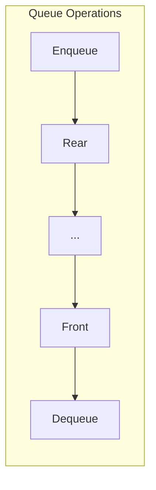

# Queue Data Structures

## Overview

| Variant | Enqueue | Dequeue | Peek | Space |
|---------|---------|---------|------|-------|
| **Array Queue** | O(1)* | O(1)* | O(1) | O(n) |
| **Circular Queue** | O(1) | O(1) | O(1) | O(n) |
| **Linked Queue** | O(1) | O(1) | O(1) | O(n) |
| **Deque** | O(1) | O(1) | O(1) | O(n) |
| **Priority Queue** | O(log n) | O(log n) | O(1) | O(n) |

*Amortized for dynamic array

**Source**: [queue/](../../../data_structures/queue/)

## 1. Mathematical Foundation

### 1.1 Definition

A **Queue** is a linear data structure following the **FIFO** (First-In, First-Out) principle:
- Elements are added at the **rear** (enqueue)
- Elements are removed from the **front** (dequeue)

### 1.2 Abstract Data Type

```
ADT Queue:
    enqueue(item)    // Add item to rear
    dequeue() → item // Remove and return front item
    peek() → item    // Return front item without removing
    is_empty() → bool
    size() → int
```

### 1.3 Queue Invariant

For a sequence of operations, items dequeue in the order they were enqueued:

$$
\text{enqueue}(a), \text{enqueue}(b), \text{enqueue}(c) \Rightarrow \text{dequeue order: } a, b, c
$$

## 2. Array-Based Queue

### 2.1 Naive Implementation

```
class ArrayQueue:
    items: array of T
    front: int = 0
    rear: int = 0
```

**Problem**: Dequeue leaves gaps, wasting space.

### 2.2 Circular Queue

Use modular arithmetic to reuse space:

```
class CircularQueue:
    items: array[capacity] of T
    front: int = 0
    rear: int = 0
    size: int = 0
```

### 2.3 Operations

```
ALGORITHM Enqueue(queue, item)
    INPUT: Circular queue, item to add
    
    1. if queue.size = queue.capacity then
           raise "Queue full"
       end if
    
    2. queue.items[queue.rear] ← item
    3. queue.rear ← (queue.rear + 1) mod queue.capacity
    4. queue.size ← queue.size + 1


ALGORITHM Dequeue(queue)
    INPUT: Circular queue
    OUTPUT: Front item
    
    1. if queue.size = 0 then
           raise "Queue empty"
       end if
    
    2. item ← queue.items[queue.front]
    3. queue.front ← (queue.front + 1) mod queue.capacity
    4. queue.size ← queue.size - 1
    5. return item


ALGORITHM Peek(queue)
    INPUT: Circular queue
    OUTPUT: Front item (without removing)
    
    1. if queue.size = 0 then
           raise "Queue empty"
       end if
    
    2. return queue.items[queue.front]
```

### 2.4 Visual Representation

```
Circular Queue (capacity=5):

Initial state (empty):
front=0, rear=0, size=0
┌───┬───┬───┬───┬───┐
│   │   │   │   │   │
└───┴───┴───┴───┴───┘
  ↑
front/rear

After enqueue(A), enqueue(B), enqueue(C):
front=0, rear=3, size=3
┌───┬───┬───┬───┬───┐
│ A │ B │ C │   │   │
└───┴───┴───┴───┴───┘
  ↑           ↑
front       rear

After dequeue() → A, dequeue() → B:
front=2, rear=3, size=1
┌───┬───┬───┬───┬───┐
│   │   │ C │   │   │
└───┴───┴───┴───┴───┘
          ↑   ↑
        front rear

After enqueue(D), enqueue(E), enqueue(F):
front=2, rear=1, size=4 (wraps around!)
┌───┬───┬───┬───┬───┐
│ F │   │ C │ D │ E │
└───┴───┴───┴───┴───┘
      ↑   ↑
    rear front
```

## 3. Linked List Queue

### 3.1 Structure

```
class Node:
    data: T
    next: Node

class LinkedQueue:
    front: Node = null
    rear: Node = null
    size: int = 0
```

### 3.2 Operations

```
ALGORITHM Enqueue(queue, item)
    INPUT: Linked queue, item to add
    
    1. node ← CreateNode(item)
    
    2. if queue.rear = null then
           queue.front ← node
           queue.rear ← node
       else
           queue.rear.next ← node
           queue.rear ← node
       end if
    
    3. queue.size ← queue.size + 1


ALGORITHM Dequeue(queue)
    INPUT: Linked queue
    OUTPUT: Front item
    
    1. if queue.front = null then
           raise "Queue empty"
       end if
    
    2. item ← queue.front.data
    3. queue.front ← queue.front.next
    
    4. if queue.front = null then
           queue.rear ← null
       end if
    
    5. queue.size ← queue.size - 1
    6. return item
```

## 4. Deque (Double-Ended Queue)

### 4.1 Definition

A **Deque** allows insertion and deletion at both ends:

```
ADT Deque:
    push_front(item)     // Add to front
    push_back(item)      // Add to rear
    pop_front() → item   // Remove from front
    pop_back() → item    // Remove from rear
    peek_front() → item
    peek_back() → item
```

### 4.2 Operations

```
ALGORITHM PushFront(deque, item)
    // For circular array implementation
    1. if deque.size = deque.capacity then
           raise "Deque full"
       end if
    
    2. deque.front ← (deque.front - 1 + deque.capacity) mod deque.capacity
    3. deque.items[deque.front] ← item
    4. deque.size ← deque.size + 1


ALGORITHM PopBack(deque)
    1. if deque.size = 0 then
           raise "Deque empty"
       end if
    
    2. deque.rear ← (deque.rear - 1 + deque.capacity) mod deque.capacity
    3. item ← deque.items[deque.rear]
    4. deque.size ← deque.size - 1
    5. return item
```

## 5. Priority Queue

### 5.1 Definition

Elements are dequeued based on priority, not arrival order:

```
ADT PriorityQueue:
    enqueue(item, priority)
    dequeue() → item  // Returns highest priority item
    peek() → item
```

### 5.2 Implementation Options

| Implementation | Enqueue | Dequeue |
|----------------|---------|---------|
| Unsorted array | O(1) | O(n) |
| Sorted array | O(n) | O(1) |
| Binary heap | O(log n) | O(log n) |
| Fibonacci heap | O(1)* | O(log n)* |

*Amortized

See [heap.md](heap.md) for detailed heap-based priority queue implementation.

## 6. Complexity Analysis

### 6.1 Time Complexity

| Operation | Array | Circular | Linked | Deque |
|-----------|-------|----------|--------|-------|
| Enqueue | O(1)* | O(1) | O(1) | O(1) |
| Dequeue | O(n)** | O(1) | O(1) | O(1) |
| Peek | O(1) | O(1) | O(1) | O(1) |
| Size | O(1) | O(1) | O(1) | O(1) |

*Amortized with dynamic resizing
**O(n) for shifting elements in naive implementation

### 6.2 Space Complexity

| Implementation | Space |
|----------------|-------|
| Array | O(n) |
| Circular Array | O(capacity) |
| Linked List | O(n) + pointer overhead |

## 7. Visual Representation



### Queue vs Stack vs Deque

```
Stack (LIFO):          Queue (FIFO):           Deque (both ends):
    ┌───┐                  ┌───────┐              ┌───────┐
    │ C │ ← top            │       │              │       │
    ├───┤               →  │ A B C │  →        ↔  │ A B C │  ↔
    │ B │                  │       │              │       │
    ├───┤                  └───────┘              └───────┘
    │ A │                    rear→front          front    rear
    └───┘
```

## 8. Real-World Software Engineering Applications

### 8.1 Industry Use Cases

1. **Operating Systems**
   - Process scheduling (ready queue)
   - Print spooling
   - Keyboard buffer
   - I/O request queues

2. **Web Services**
   - Request handling
   - Task queues (Celery, RQ)
   - Message queues (RabbitMQ, Kafka)
   - Rate limiting

3. **Networking**
   - Packet routing
   - Bandwidth management
   - TCP buffer
   - Load balancing

4. **Real-Time Systems**
   - Event handling
   - Simulation
   - BFS traversal
   - Breadth-first search

5. **Customer Service**
   - Call center queues
   - Support ticket systems
   - Appointment scheduling
   - Order processing

### 8.2 Implementation Examples

```python
from collections import deque
from typing import Generic, TypeVar, Iterator

T = TypeVar('T')


class Queue(Generic[T]):
    """
    Basic queue using collections.deque.
    
    >>> q = Queue()
    >>> q.enqueue(1)
    >>> q.enqueue(2)
    >>> q.dequeue()
    1
    >>> q.peek()
    2
    >>> len(q)
    1
    """
    
    def __init__(self):
        self._items: deque[T] = deque()
    
    def enqueue(self, item: T) -> None:
        """Add item to rear. O(1)"""
        self._items.append(item)
    
    def dequeue(self) -> T:
        """Remove and return front item. O(1)"""
        if not self._items:
            raise IndexError("dequeue from empty queue")
        return self._items.popleft()
    
    def peek(self) -> T:
        """Return front item without removing. O(1)"""
        if not self._items:
            raise IndexError("peek at empty queue")
        return self._items[0]
    
    def is_empty(self) -> bool:
        return len(self._items) == 0
    
    def __len__(self) -> int:
        return len(self._items)
    
    def __bool__(self) -> bool:
        return bool(self._items)


class CircularQueue(Generic[T]):
    """
    Fixed-capacity circular queue.
    
    >>> cq = CircularQueue(3)
    >>> cq.enqueue(1)
    >>> cq.enqueue(2)
    >>> cq.enqueue(3)
    >>> cq.is_full()
    True
    >>> cq.dequeue()
    1
    >>> cq.enqueue(4)  # Wraps around
    >>> list(cq)
    [2, 3, 4]
    """
    
    def __init__(self, capacity: int):
        self._capacity = capacity
        self._items: list[T | None] = [None] * capacity
        self._front = 0
        self._rear = 0
        self._size = 0
    
    def enqueue(self, item: T) -> None:
        """Add item. O(1)"""
        if self._size == self._capacity:
            raise IndexError("queue is full")
        
        self._items[self._rear] = item
        self._rear = (self._rear + 1) % self._capacity
        self._size += 1
    
    def dequeue(self) -> T:
        """Remove front item. O(1)"""
        if self._size == 0:
            raise IndexError("queue is empty")
        
        item = self._items[self._front]
        self._items[self._front] = None
        self._front = (self._front + 1) % self._capacity
        self._size -= 1
        return item  # type: ignore
    
    def peek(self) -> T:
        """Return front item. O(1)"""
        if self._size == 0:
            raise IndexError("queue is empty")
        return self._items[self._front]  # type: ignore
    
    def is_full(self) -> bool:
        return self._size == self._capacity
    
    def is_empty(self) -> bool:
        return self._size == 0
    
    def __len__(self) -> int:
        return self._size
    
    def __iter__(self) -> Iterator[T]:
        idx = self._front
        for _ in range(self._size):
            yield self._items[idx]  # type: ignore
            idx = (idx + 1) % self._capacity


class Deque(Generic[T]):
    """
    Double-ended queue implementation.
    
    >>> dq = Deque()
    >>> dq.push_back(1)
    >>> dq.push_front(0)
    >>> dq.push_back(2)
    >>> list(dq)
    [0, 1, 2]
    >>> dq.pop_front()
    0
    >>> dq.pop_back()
    2
    """
    
    def __init__(self):
        self._items: deque[T] = deque()
    
    def push_front(self, item: T) -> None:
        """Add to front. O(1)"""
        self._items.appendleft(item)
    
    def push_back(self, item: T) -> None:
        """Add to rear. O(1)"""
        self._items.append(item)
    
    def pop_front(self) -> T:
        """Remove from front. O(1)"""
        if not self._items:
            raise IndexError("deque is empty")
        return self._items.popleft()
    
    def pop_back(self) -> T:
        """Remove from rear. O(1)"""
        if not self._items:
            raise IndexError("deque is empty")
        return self._items.pop()
    
    def peek_front(self) -> T:
        """Return front item. O(1)"""
        if not self._items:
            raise IndexError("deque is empty")
        return self._items[0]
    
    def peek_back(self) -> T:
        """Return rear item. O(1)"""
        if not self._items:
            raise IndexError("deque is empty")
        return self._items[-1]
    
    def __len__(self) -> int:
        return len(self._items)
    
    def __iter__(self) -> Iterator[T]:
        return iter(self._items)


class SlidingWindowMax:
    """
    Find maximum in sliding window using monotonic deque.
    O(n) for processing entire array.
    
    >>> swm = SlidingWindowMax()
    >>> list(swm.max_sliding_window([1, 3, -1, -3, 5, 3, 6, 7], 3))
    [3, 3, 5, 5, 6, 7]
    """
    
    def max_sliding_window(self, nums: list[int], k: int) -> Iterator[int]:
        """
        Yield maximum for each window of size k.
        Uses monotonic deque to maintain candidates.
        """
        if not nums or k == 0:
            return
        
        dq: deque[int] = deque()  # Store indices
        
        for i, num in enumerate(nums):
            # Remove elements outside window
            while dq and dq[0] <= i - k:
                dq.popleft()
            
            # Remove smaller elements (they can't be max)
            while dq and nums[dq[-1]] < num:
                dq.pop()
            
            dq.append(i)
            
            # Start yielding when window is full
            if i >= k - 1:
                yield nums[dq[0]]


class TaskQueue:
    """
    Simple task queue with worker simulation.
    
    >>> tq = TaskQueue()
    >>> tq.add_task("task1")
    >>> tq.add_task("task2")
    >>> tq.process_next()
    'Processing: task1'
    >>> tq.pending_count()
    1
    """
    
    def __init__(self):
        self._tasks: deque[str] = deque()
        self._completed: list[str] = []
    
    def add_task(self, task: str) -> None:
        """Add task to queue."""
        self._tasks.append(task)
    
    def process_next(self) -> str:
        """Process next task."""
        if not self._tasks:
            return "No tasks pending"
        
        task = self._tasks.popleft()
        self._completed.append(task)
        return f"Processing: {task}"
    
    def pending_count(self) -> int:
        return len(self._tasks)
    
    def completed_count(self) -> int:
        return len(self._completed)


class BFSQueue:
    """
    Queue-based BFS traversal helper.
    
    >>> graph = {0: [1, 2], 1: [3], 2: [3], 3: []}
    >>> list(BFSQueue.bfs(graph, 0))
    [0, 1, 2, 3]
    """
    
    @staticmethod
    def bfs(graph: dict[int, list[int]], start: int) -> Iterator[int]:
        """Yield nodes in BFS order."""
        visited: set[int] = {start}
        queue: deque[int] = deque([start])
        
        while queue:
            node = queue.popleft()
            yield node
            
            for neighbor in graph.get(node, []):
                if neighbor not in visited:
                    visited.add(neighbor)
                    queue.append(neighbor)
    
    @staticmethod
    def shortest_path(graph: dict[int, list[int]], start: int, end: int) -> list[int]:
        """Find shortest path using BFS."""
        if start == end:
            return [start]
        
        visited: set[int] = {start}
        queue: deque[tuple[int, list[int]]] = deque([(start, [start])])
        
        while queue:
            node, path = queue.popleft()
            
            for neighbor in graph.get(node, []):
                if neighbor == end:
                    return path + [neighbor]
                
                if neighbor not in visited:
                    visited.add(neighbor)
                    queue.append((neighbor, path + [neighbor]))
        
        return []  # No path found


class RateLimiter:
    """
    Token bucket rate limiter using queue.
    
    >>> rl = RateLimiter(max_requests=3, window_seconds=1.0)
    >>> rl.allow_request()  # Returns True
    True
    """
    
    def __init__(self, max_requests: int, window_seconds: float):
        self.max_requests = max_requests
        self.window_seconds = window_seconds
        self.requests: deque[float] = deque()
    
    def allow_request(self) -> bool:
        """Check if request should be allowed."""
        import time
        current_time = time.time()
        
        # Remove expired requests
        while self.requests and current_time - self.requests[0] > self.window_seconds:
            self.requests.popleft()
        
        # Check if under limit
        if len(self.requests) < self.max_requests:
            self.requests.append(current_time)
            return True
        
        return False
```

## 9. Queue Patterns

### 9.1 Producer-Consumer Pattern

```python
import threading
from queue import Queue


def producer(q: Queue, items: list) -> None:
    for item in items:
        q.put(item)
        print(f"Produced: {item}")
    q.put(None)  # Signal completion


def consumer(q: Queue) -> None:
    while True:
        item = q.get()
        if item is None:
            break
        print(f"Consumed: {item}")
        q.task_done()
```

### 9.2 Implement Stack Using Two Queues

```python
class StackUsingQueues:
    """
    Stack implementation using two queues.
    
    >>> s = StackUsingQueues()
    >>> s.push(1)
    >>> s.push(2)
    >>> s.pop()
    2
    >>> s.top()
    1
    """
    
    def __init__(self):
        self.q1: deque = deque()
        self.q2: deque = deque()
    
    def push(self, x: int) -> None:
        self.q2.append(x)
        while self.q1:
            self.q2.append(self.q1.popleft())
        self.q1, self.q2 = self.q2, self.q1
    
    def pop(self) -> int:
        return self.q1.popleft()
    
    def top(self) -> int:
        return self.q1[0]
    
    def empty(self) -> bool:
        return not self.q1
```

## 10. References

- Knuth, D. "The Art of Computer Programming, Vol. 1" - Chapter 2
- Cormen, T. et al. "Introduction to Algorithms" - Elementary Data Structures
- [Wikipedia: Queue (abstract data type)](https://en.wikipedia.org/wiki/Queue_(abstract_data_type))
- [Wikipedia: Double-ended queue](https://en.wikipedia.org/wiki/Double-ended_queue)
