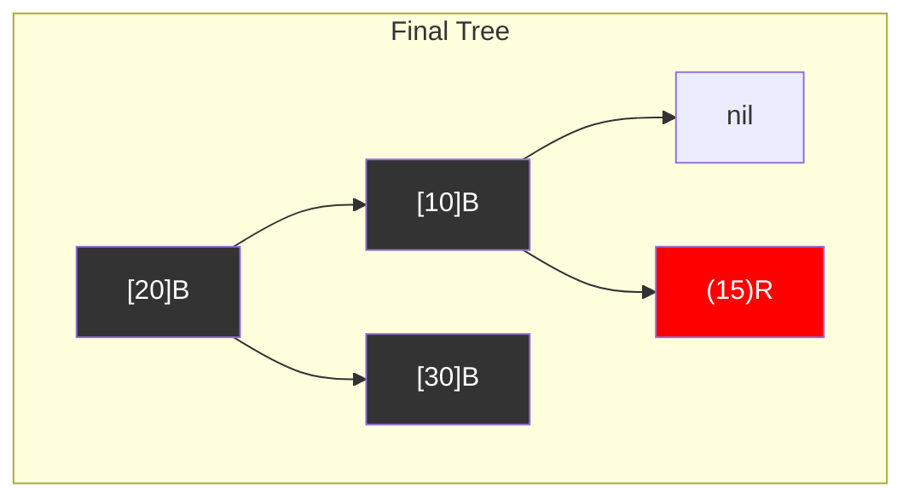
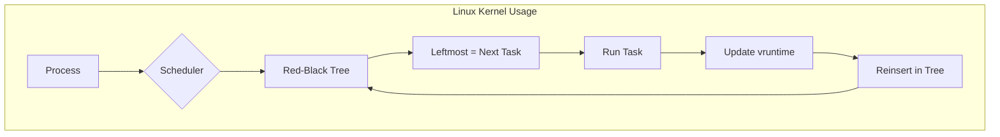

# Red-Black Tree

## Overview
| Property | Value |
|----------|-------|
| **Category** | Self-Balancing Binary Search Tree |
| **Search** | O(log n) guaranteed |
| **Insert** | O(log n) guaranteed |
| **Delete** | O(log n) guaranteed |
| **Space** | O(n) |
| **Source** | [red_black_tree.py](../../../data_structures/binary_tree/red_black_tree.py) |

## 1. Mathematical Foundation

### 1.1 Definition

A Red-Black Tree is a self-balancing BST where each node has a color (red or black) and satisfies:

1. **Node Property**: Every node is either red or black
2. **Root Property**: The root is black
3. **Leaf Property**: All NIL leaves are black
4. **Red Property**: Red nodes cannot have red children (no two consecutive reds)
5. **Black-Height Property**: All paths from a node to descendant NIL leaves have the same number of black nodes

### 1.2 Black-Height

The **black-height** $bh(v)$ of a node $v$ is the number of black nodes on any path from $v$ (not including $v$) to a NIL leaf.

$$
bh(v) = \text{count of black nodes on path to any NIL leaf}
$$

### 1.3 Height Bound

For a Red-Black tree with $n$ internal nodes:
$$
h \leq 2 \log_2(n + 1)
$$

This is derived from:
- A subtree rooted at node $v$ has at least $2^{bh(v)} - 1$ internal nodes
- $bh(root) \geq h/2$ (at least half the nodes on any path are black)

### 1.4 Comparison with AVL

| Property | AVL | Red-Black |
|----------|-----|-----------|
| Balance factor | |bf| ≤ 1 | Color-based |
| Height bound | 1.44 log n | 2 log n |
| Insert rotations | ≤ 2 | ≤ 2 |
| Delete rotations | O(log n) | ≤ 3 |

## 2. Node Structure

```
class RBNode:
    key: T              // Comparable key
    value: V            // Associated value
    color: {RED, BLACK} // Node color
    left: RBNode        // Left child
    right: RBNode       // Right child
    parent: RBNode      // Parent node
```

## 3. Rotations

### 3.1 Left Rotation

```
ALGORITHM LeftRotate(T, x)
    INPUT: Tree T, node x
    
          x                   y
         / \                 / \
        a   y       →       x   c
           / \             / \
          b   c           a   b
    
    1. y ← x.right
    2. x.right ← y.left
    3. if y.left ≠ NIL then
           y.left.parent ← x
       end if
    4. y.parent ← x.parent
    5. if x.parent = NIL then
           T.root ← y
       else if x = x.parent.left then
           x.parent.left ← y
       else
           x.parent.right ← y
       end if
    6. y.left ← x
    7. x.parent ← y
```

### 3.2 Right Rotation

```
ALGORITHM RightRotate(T, y)
    INPUT: Tree T, node y
    
          y                   x
         / \                 / \
        x   c       →       a   y
       / \                     / \
      a   b                   b   c
    
    1. x ← y.left
    2. y.left ← x.right
    3. if x.right ≠ NIL then
           x.right.parent ← y
       end if
    4. x.parent ← y.parent
    5. if y.parent = NIL then
           T.root ← x
       else if y = y.parent.right then
           y.parent.right ← x
       else
           y.parent.left ← x
       end if
    6. x.right ← y
    7. y.parent ← x
```

## 4. Insert Operation

### 4.1 Insert Algorithm

```
ALGORITHM RBInsert(T, key, value)
    INPUT: Tree T, key-value pair
    
    // Standard BST insert
    1. z ← CreateNode(key, value, RED)
    2. y ← NIL
    3. x ← T.root
    
    4. while x ≠ NIL do
           y ← x
           if z.key < x.key then
               x ← x.left
           else
               x ← x.right
           end if
       end while
    
    5. z.parent ← y
    6. if y = NIL then
           T.root ← z
       else if z.key < y.key then
           y.left ← z
       else
           y.right ← z
       end if
    
    7. z.left ← NIL
    8. z.right ← NIL
    9. z.color ← RED
    
    // Fix Red-Black properties
    10. RBInsertFixup(T, z)
```

### 4.2 Insert Fixup

```
ALGORITHM RBInsertFixup(T, z)
    INPUT: Tree T, newly inserted node z
    
    while z.parent.color = RED do
        if z.parent = z.parent.parent.left then
            y ← z.parent.parent.right  // Uncle
            
            // Case 1: Uncle is red
            if y.color = RED then
                z.parent.color ← BLACK
                y.color ← BLACK
                z.parent.parent.color ← RED
                z ← z.parent.parent
            else
                // Case 2: Uncle is black, z is right child
                if z = z.parent.right then
                    z ← z.parent
                    LeftRotate(T, z)
                end if
                
                // Case 3: Uncle is black, z is left child
                z.parent.color ← BLACK
                z.parent.parent.color ← RED
                RightRotate(T, z.parent.parent)
            end if
        else
            // Symmetric: swap left and right
            y ← z.parent.parent.left  // Uncle
            
            if y.color = RED then
                z.parent.color ← BLACK
                y.color ← BLACK
                z.parent.parent.color ← RED
                z ← z.parent.parent
            else
                if z = z.parent.left then
                    z ← z.parent
                    RightRotate(T, z)
                end if
                z.parent.color ← BLACK
                z.parent.parent.color ← RED
                LeftRotate(T, z.parent.parent)
            end if
        end if
    end while
    
    T.root.color ← BLACK
```

## 5. Delete Operation

### 5.1 Delete Algorithm

```
ALGORITHM RBDelete(T, z)
    INPUT: Tree T, node z to delete
    
    1. y ← z
    2. y_original_color ← y.color
    
    3. if z.left = NIL then
           x ← z.right
           RBTransplant(T, z, z.right)
       else if z.right = NIL then
           x ← z.left
           RBTransplant(T, z, z.left)
       else
           y ← Minimum(z.right)  // Successor
           y_original_color ← y.color
           x ← y.right
           
           if y.parent = z then
               x.parent ← y
           else
               RBTransplant(T, y, y.right)
               y.right ← z.right
               y.right.parent ← y
           end if
           
           RBTransplant(T, z, y)
           y.left ← z.left
           y.left.parent ← y
           y.color ← z.color
       end if
    
    4. if y_original_color = BLACK then
           RBDeleteFixup(T, x)
       end if
```

### 5.2 Delete Fixup

```
ALGORITHM RBDeleteFixup(T, x)
    INPUT: Tree T, node x
    
    while x ≠ T.root AND x.color = BLACK do
        if x = x.parent.left then
            w ← x.parent.right  // Sibling
            
            // Case 1: Sibling is red
            if w.color = RED then
                w.color ← BLACK
                x.parent.color ← RED
                LeftRotate(T, x.parent)
                w ← x.parent.right
            end if
            
            // Case 2: Sibling is black with two black children
            if w.left.color = BLACK AND w.right.color = BLACK then
                w.color ← RED
                x ← x.parent
            else
                // Case 3: Sibling's right child is black
                if w.right.color = BLACK then
                    w.left.color ← BLACK
                    w.color ← RED
                    RightRotate(T, w)
                    w ← x.parent.right
                end if
                
                // Case 4: Sibling's right child is red
                w.color ← x.parent.color
                x.parent.color ← BLACK
                w.right.color ← BLACK
                LeftRotate(T, x.parent)
                x ← T.root
            end if
        else
            // Symmetric cases (swap left/right)
        end if
    end while
    
    x.color ← BLACK
```

## 6. Complexity Analysis

### 6.1 Time Complexity

| Operation | Complexity | Max Rotations |
|-----------|------------|---------------|
| Search | O(log n) | 0 |
| Insert | O(log n) | 2 |
| Delete | O(log n) | 3 |
| Min/Max | O(log n) | 0 |

### 6.2 Space Complexity

| Component | Space |
|-----------|-------|
| Tree nodes | O(n) |
| Color bit | O(n) bits total |
| Recursion | O(log n) |

## 7. Visual Representation

### Insert Example

```
Insert: 10, 20, 30, 15

Step 1: Insert 10 (root, make black)
    [10]B

Step 2: Insert 20 (red, parent black - OK)
    [10]B
        \
        (20)R

Step 3: Insert 30 (red, parent red - violation!)
    [10]B               [20]B
        \      →       /    \
        (20)R      [10]B   [30]B
            \
            (30)R
    
    Left rotation at 10, recolor

Step 4: Insert 15
        [20]B
       /    \
   [10]B   [30]B
       \
       (15)R
```



### Insert Fixup Cases

```
Case 1: Red Uncle       Case 2: Black Uncle,    Case 3: Black Uncle,
                        z is inner child        z is outer child
    [G]B                    [G]B                    [G]B
   /    \                  /    \                  /    \
 (P)R   (U)R             (P)R   [U]B             (P)R   [U]B
  /                         \                    /
(z)R                        (z)R               (z)R

Recolor P, U, G          Rotate at P            Rotate at G
→ push problem up        → becomes Case 3       Recolor → done
```

## 8. Real-World Software Engineering Applications

### 8.1 Industry Use Cases

1. **C++ STL**
   - `std::map` - Ordered associative container
   - `std::set` - Ordered unique elements
   - `std::multimap`, `std::multiset`
   - Guaranteed O(log n) operations

2. **Java Collections**
   - `TreeMap` - Sorted map implementation
   - `TreeSet` - Sorted set implementation
   - Used in concurrent collections

3. **Linux Kernel**
   - Completely Fair Scheduler (CFS)
   - Memory management
   - Virtual memory areas (VMAs)
   - I/O scheduling

4. **Databases**
   - Index structures
   - Transaction management
   - Lock management tables
   - Query plan caching

5. **Networking**
   - Connection tracking
   - Routing tables
   - Timer management
   - Packet scheduling

### 8.2 Linux CFS Example

```python
class CFSScheduler:
    """
    Simplified Completely Fair Scheduler using Red-Black Tree.
    Linux kernel uses this for O(1) task selection.
    """
    
    def __init__(self):
        self.tasks = RedBlackTree()  # Key: vruntime
        self.min_vruntime = 0
    
    def add_task(self, task):
        """
        Add task to run queue.
        New tasks get current min_vruntime to prevent starvation.
        """
        task.vruntime = max(task.vruntime, self.min_vruntime)
        self.tasks.insert(task.vruntime, task)
    
    def pick_next_task(self):
        """
        Select task with smallest vruntime (leftmost node).
        O(1) with cached leftmost pointer, O(log n) otherwise.
        """
        node = self.tasks.minimum()
        if node is None:
            return None
        
        task = node.value
        self.tasks.delete(node.key)
        return task
    
    def update_vruntime(self, task, runtime):
        """
        Update virtual runtime after task runs.
        vruntime increases slower for higher-priority tasks.
        """
        weight = self.get_weight(task.nice)
        delta = runtime * NICE_0_WEIGHT / weight
        task.vruntime += delta
        self.min_vruntime = max(self.min_vruntime, 
                                 self.tasks.minimum().key if not self.tasks.empty() else 0)


class IndexedMap:
    """
    Map with ordered keys and efficient range queries.
    Similar to Java TreeMap / C++ std::map.
    """
    
    def __init__(self):
        self._tree = RedBlackTree()
    
    def put(self, key, value):
        """Insert or update key-value pair. O(log n)"""
        self._tree.insert(key, value)
    
    def get(self, key):
        """Get value by key. O(log n)"""
        node = self._tree.search(key)
        return node.value if node else None
    
    def range(self, low, high):
        """
        Return all key-value pairs where low ≤ key ≤ high.
        O(log n + k) where k is result size.
        """
        result = []
        self._range_helper(self._tree.root, low, high, result)
        return result
    
    def floor(self, key):
        """Return largest key ≤ given key. O(log n)"""
        return self._tree.floor(key)
    
    def ceiling(self, key):
        """Return smallest key ≥ given key. O(log n)"""
        return self._tree.ceiling(key)
```

### 8.3 System Integration



## 9. Comparison with Alternatives

| Operation | Red-Black | AVL | B-Tree | Skip List |
|-----------|-----------|-----|--------|-----------|
| Search | O(log n) | O(log n) | O(log n) | O(log n) |
| Insert | O(log n) | O(log n) | O(log n) | O(log n) |
| Delete | O(log n) | O(log n) | O(log n) | O(log n) |
| Range query | O(log n + k) | O(log n + k) | O(log n + k) | O(log n + k) |
| Memory | More | Less | Best for disk | Simple |
| Use case | General | Read-heavy | Disk storage | Concurrent |

## 10. References

- Guibas, L. & Sedgewick, R. (1978). "A dichromatic framework for balanced trees"
- Cormen, T. et al. "Introduction to Algorithms" - Chapter 13
- [Wikipedia: Red-Black Tree](https://en.wikipedia.org/wiki/Red%E2%80%93black_tree)
- Linux Kernel Documentation - CFS Scheduler
