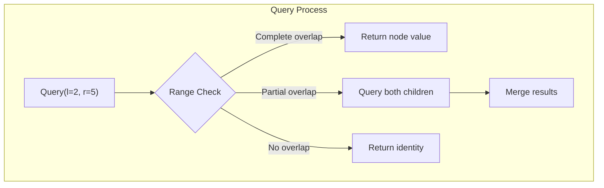

# Segment Tree

## Overview

| Property | Value |
|----------|-------|
| **Category** | Range Query Data Structure |
| **Build** | O(n) |
| **Query** | O(log n) |
| **Update** | O(log n) |
| **Space** | O(n) |
| **Source** | [segment_tree.py](../../../data_structures/binary_tree/segment_tree.py) |

## 1. Mathematical Foundation

### 1.1 Definition

A **Segment Tree** is a binary tree where:
- Each leaf represents an element of the input array
- Each internal node represents the result of a merge operation over a contiguous range
- The root represents the entire array

For an array $A[0..n-1]$, the segment tree supports:
- **Range queries**: Compute $f(A[l], A[l+1], ..., A[r])$ for associative function $f$
- **Point updates**: Modify $A[i]$ and update the tree accordingly

### 1.2 Tree Properties

For array of size $n$:
- Height: $h = \lceil \log_2 n \rceil$
- Number of leaves: First power of 2 ≥ n
- Total nodes: $\leq 2n$ (or exactly $2 \times 2^{\lceil \log_2 n \rceil} - 1$ for complete tree)
- Array representation size: $2n$ to $4n$ depending on implementation

### 1.3 Range Representation

Each node $v$ represents a range $[l_v, r_v]$:

$$
\text{Node at index } i: \begin{cases}
\text{Left child} = 2i + 1 \\
\text{Right child} = 2i + 2 \\
\text{Parent} = \lfloor(i-1)/2\rfloor
\end{cases}
$$

The split point for node range $[l, r]$:
$$
mid = l + \lfloor(r - l) / 2\rfloor
$$

### 1.4 Supported Operations

Common merge functions (must be **associative**):
- **Sum**: $f(a, b) = a + b$
- **Minimum**: $f(a, b) = \min(a, b)$
- **Maximum**: $f(a, b) = \max(a, b)$
- **GCD**: $f(a, b) = \gcd(a, b)$
- **XOR**: $f(a, b) = a \oplus b$

## 2. Tree Structure

```
Array: [1, 3, 5, 7, 9, 11]

Sum Segment Tree:
                   [36]
                 /      \
              [9]        [27]
             /   \      /    \
           [4]   [5]  [16]   [11]
          /   \       /   \
        [1]   [3]   [7]   [9]
        
Index mapping (0-based array representation):
         0
       /   \
      1     2
     / \   / \
    3   4 5   6
   / \   / \
  7  8  9  10
```

## 3. Build Operation

### 3.1 Recursive Build

```
ALGORITHM Build(arr, tree, node, start, end)
    INPUT: Original array arr, tree array, node index, range [start, end]
    OUTPUT: Segment tree populated in tree array
    
    // Base case: leaf node
    1. if start = end then
           tree[node] ← arr[start]
           return
       end if
    
    // Recursive case
    2. mid ← start + (end - start) / 2
    3. leftChild ← 2 × node + 1
    4. rightChild ← 2 × node + 2
    
    // Build left and right subtrees
    5. Build(arr, tree, leftChild, start, mid)
    6. Build(arr, tree, rightChild, mid + 1, end)
    
    // Merge children
    7. tree[node] ← Merge(tree[leftChild], tree[rightChild])


ALGORITHM BuildTree(arr)
    INPUT: Array arr of size n
    OUTPUT: Segment tree
    
    1. tree ← array of size 4n (safe upper bound)
    2. Build(arr, tree, 0, 0, n - 1)
    3. return tree
```

### 3.2 Bottom-Up Build

```
ALGORITHM BuildBottomUp(arr)
    INPUT: Array arr of size n
    OUTPUT: Segment tree in tree array
    
    // Tree size: 2n for 0-indexed leaves starting at n
    1. tree ← array of size 2n
    
    // Copy leaves
    2. for i ← 0 to n - 1 do
           tree[n + i] ← arr[i]
       end for
    
    // Build internal nodes (bottom-up)
    3. for i ← n - 1 down to 1 do
           tree[i] ← Merge(tree[2i], tree[2i + 1])
       end for
    
    4. return tree
```

## 4. Query Operation

### 4.1 Range Query

```
ALGORITHM Query(tree, node, start, end, l, r)
    INPUT: tree array, node index, node range [start, end], query range [l, r]
    OUTPUT: Result for query range
    
    // Case 1: No overlap
    1. if r < start OR l > end then
           return IDENTITY  // Identity element for merge function
       end if
    
    // Case 2: Complete overlap
    2. if l ≤ start AND end ≤ r then
           return tree[node]
       end if
    
    // Case 3: Partial overlap - query both children
    3. mid ← start + (end - start) / 2
    4. leftResult ← Query(tree, 2×node+1, start, mid, l, r)
    5. rightResult ← Query(tree, 2×node+2, mid+1, end, l, r)
    
    6. return Merge(leftResult, rightResult)


ALGORITHM RangeQuery(tree, n, l, r)
    INPUT: Segment tree, size n, query range [l, r]
    OUTPUT: Merge result for range [l, r]
    
    1. return Query(tree, 0, 0, n - 1, l, r)
```

### 4.2 Bottom-Up Query (Iterative)

```
ALGORITHM QueryIterative(tree, n, l, r)
    INPUT: Segment tree (0-indexed leaves at n), query range [l, r]
    OUTPUT: Merge result for range [l, r]
    
    1. l ← l + n  // Convert to tree indices
    2. r ← r + n
    3. result ← IDENTITY
    
    4. while l ≤ r do
           // If l is right child, include it and move to next subtree
           if l mod 2 = 1 then
               result ← Merge(result, tree[l])
               l ← l + 1
           end if
           
           // If r is left child, include it and move to previous subtree
           if r mod 2 = 0 then
               result ← Merge(result, tree[r])
               r ← r - 1
           end if
           
           // Move to parent level
           l ← l / 2
           r ← r / 2
       end while
    
    5. return result
```

## 5. Update Operation

### 5.1 Point Update (Recursive)

```
ALGORITHM Update(tree, node, start, end, idx, value)
    INPUT: tree, node index, range [start, end], position idx, new value
    
    // Base case: leaf node
    1. if start = end then
           tree[node] ← value
           return
       end if
    
    // Navigate to correct child
    2. mid ← start + (end - start) / 2
    
    3. if idx ≤ mid then
           Update(tree, 2×node+1, start, mid, idx, value)
       else
           Update(tree, 2×node+2, mid+1, end, idx, value)
       end if
    
    // Recalculate current node
    4. tree[node] ← Merge(tree[2×node+1], tree[2×node+2])


ALGORITHM PointUpdate(tree, n, idx, value)
    INPUT: Segment tree, size n, position idx, new value
    
    1. Update(tree, 0, 0, n - 1, idx, value)
```

### 5.2 Point Update (Iterative)

```
ALGORITHM UpdateIterative(tree, n, idx, value)
    INPUT: Segment tree (leaves at n), position idx, new value
    
    // Update leaf
    1. idx ← idx + n
    2. tree[idx] ← value
    
    // Propagate up to root
    3. while idx > 1 do
           idx ← idx / 2
           tree[idx] ← Merge(tree[2×idx], tree[2×idx + 1])
       end while
```

## 6. Lazy Propagation

### 6.1 Concept

Lazy propagation enables **range updates** in O(log n) by deferring updates to descendants.

```
ALGORITHM LazyUpdate(tree, lazy, node, start, end, l, r, val)
    INPUT: tree, lazy array, node, range [start, end], update range [l, r], value
    
    // Push pending lazy value
    1. if lazy[node] ≠ 0 then
           tree[node] ← ApplyLazy(tree[node], lazy[node], start, end)
           if start ≠ end then
               lazy[2×node+1] ← CombineLazy(lazy[2×node+1], lazy[node])
               lazy[2×node+2] ← CombineLazy(lazy[2×node+2], lazy[node])
           end if
           lazy[node] ← 0
       end if
    
    // No overlap
    2. if r < start OR l > end then
           return
       end if
    
    // Complete overlap - set lazy and return
    3. if l ≤ start AND end ≤ r then
           tree[node] ← ApplyLazy(tree[node], val, start, end)
           if start ≠ end then
               lazy[2×node+1] ← CombineLazy(lazy[2×node+1], val)
               lazy[2×node+2] ← CombineLazy(lazy[2×node+2], val)
           end if
           return
       end if
    
    // Partial overlap - recurse
    4. mid ← start + (end - start) / 2
    5. LazyUpdate(tree, lazy, 2×node+1, start, mid, l, r, val)
    6. LazyUpdate(tree, lazy, 2×node+2, mid+1, end, l, r, val)
    7. tree[node] ← Merge(tree[2×node+1], tree[2×node+2])
```

### 6.2 Lazy Query

```
ALGORITHM LazyQuery(tree, lazy, node, start, end, l, r)
    INPUT: tree, lazy array, node, range [start, end], query range [l, r]
    
    // Push pending lazy value
    1. if lazy[node] ≠ 0 then
           tree[node] ← ApplyLazy(tree[node], lazy[node], start, end)
           if start ≠ end then
               lazy[2×node+1] ← CombineLazy(lazy[2×node+1], lazy[node])
               lazy[2×node+2] ← CombineLazy(lazy[2×node+2], lazy[node])
           end if
           lazy[node] ← 0
       end if
    
    // No overlap
    2. if r < start OR l > end then
           return IDENTITY
       end if
    
    // Complete overlap
    3. if l ≤ start AND end ≤ r then
           return tree[node]
       end if
    
    // Partial overlap
    4. mid ← start + (end - start) / 2
    5. leftResult ← LazyQuery(tree, lazy, 2×node+1, start, mid, l, r)
    6. rightResult ← LazyQuery(tree, lazy, 2×node+2, mid+1, end, l, r)
    7. return Merge(leftResult, rightResult)
```

## 7. Complexity Analysis

### 7.1 Time Complexity

| Operation | Without Lazy | With Lazy |
|-----------|--------------|-----------|
| Build | O(n) | O(n) |
| Point Update | O(log n) | O(log n) |
| Range Update | O(n log n) | O(log n) |
| Range Query | O(log n) | O(log n) |

### 7.2 Space Complexity

| Implementation | Space |
|----------------|-------|
| Standard | O(n) |
| With Lazy | O(n) |
| Dynamic/Sparse | O(q log n) |

## 8. Visual Representation

### Query Visualization

```
Query sum for range [2, 5] on array [1, 3, 5, 7, 9, 11]

                   [36]           ← Check: [0,5] contains [2,5]? Partial
                 /      \
              [9]        [27]     ← [0,2] partial, [3,5] complete ✓
             /   \      /    \
           [4]   [5]  [16]   [11]  ← [5] complete ✓
          /   \       /   \
        [1]   [3]   [7]   [9]

Result = 5 + 27 = 32 (sum of elements at indices 2,3,4,5)
```

### Update Propagation

```
Update index 2 to value 10:

Before:                After:
     [36]                  [41]  ← 36-5+10
    /    \                /    \
  [9]    [27]     →    [14]    [27]  ← 9-5+10
 /  \    /  \          /  \    /  \
[4] [5] [16][11]     [4] [10][16][11]  ← 5→10
```



## 9. Real-World Software Engineering Applications

### 9.1 Industry Use Cases

1. **Database Systems**
   - Range aggregate queries (SUM, MIN, MAX, COUNT)
   - Time-series data analysis
   - OLAP cube calculations
   - Histogram maintenance

2. **Computational Geometry**
   - Line segment intersection
   - Rectangle union area
   - Stabbing queries
   - Range counting

3. **Graphics and Gaming**
   - Collision detection
   - Ray tracing (BVH acceleration)
   - Terrain level-of-detail
   - Frustum culling

4. **Network Monitoring**
   - Bandwidth utilization queries
   - Traffic analysis over time ranges
   - DDoS detection (anomaly in ranges)

5. **Financial Systems**
   - Moving window calculations
   - Real-time min/max price tracking
   - Volume-weighted average price (VWAP)
   - Risk aggregation

### 9.2 Implementation Examples

```python
class RangeMinQuery:
    """
    Segment Tree for range minimum queries.
    Useful for stock price analysis, finding bottlenecks, etc.
    """
    
    def __init__(self, arr: list[int]):
        self.n = len(arr)
        self.tree = [float('inf')] * (4 * self.n)
        if self.n > 0:
            self._build(arr, 0, 0, self.n - 1)
    
    def _build(self, arr, node, start, end):
        if start == end:
            self.tree[node] = arr[start]
            return
        
        mid = (start + end) // 2
        left_child = 2 * node + 1
        right_child = 2 * node + 2
        
        self._build(arr, left_child, start, mid)
        self._build(arr, right_child, mid + 1, end)
        
        self.tree[node] = min(self.tree[left_child], self.tree[right_child])
    
    def query(self, l: int, r: int) -> int:
        """Query minimum in range [l, r]. O(log n)"""
        return self._query(0, 0, self.n - 1, l, r)
    
    def _query(self, node, start, end, l, r):
        if r < start or l > end:  # No overlap
            return float('inf')
        if l <= start and end <= r:  # Complete overlap
            return self.tree[node]
        
        mid = (start + end) // 2
        left_min = self._query(2*node+1, start, mid, l, r)
        right_min = self._query(2*node+2, mid+1, end, l, r)
        return min(left_min, right_min)
    
    def update(self, idx: int, value: int):
        """Update single element. O(log n)"""
        self._update(0, 0, self.n - 1, idx, value)
    
    def _update(self, node, start, end, idx, value):
        if start == end:
            self.tree[node] = value
            return
        
        mid = (start + end) // 2
        if idx <= mid:
            self._update(2*node+1, start, mid, idx, value)
        else:
            self._update(2*node+2, mid+1, end, idx, value)
        
        self.tree[node] = min(self.tree[2*node+1], self.tree[2*node+2])


class RangeSumWithLazy:
    """
    Segment Tree with lazy propagation for range sum updates.
    Use case: Batch salary adjustments, bulk inventory updates.
    """
    
    def __init__(self, arr: list[int]):
        self.n = len(arr)
        self.tree = [0] * (4 * self.n)
        self.lazy = [0] * (4 * self.n)
        if self.n > 0:
            self._build(arr, 0, 0, self.n - 1)
    
    def _build(self, arr, node, start, end):
        if start == end:
            self.tree[node] = arr[start]
            return
        
        mid = (start + end) // 2
        self._build(arr, 2*node+1, start, mid)
        self._build(arr, 2*node+2, mid+1, end)
        self.tree[node] = self.tree[2*node+1] + self.tree[2*node+2]
    
    def _push_down(self, node, start, end):
        """Propagate lazy value to children."""
        if self.lazy[node] != 0:
            self.tree[node] += self.lazy[node] * (end - start + 1)
            if start != end:
                self.lazy[2*node+1] += self.lazy[node]
                self.lazy[2*node+2] += self.lazy[node]
            self.lazy[node] = 0
    
    def range_add(self, l: int, r: int, val: int):
        """Add val to all elements in [l, r]. O(log n)"""
        self._range_add(0, 0, self.n - 1, l, r, val)
    
    def _range_add(self, node, start, end, l, r, val):
        self._push_down(node, start, end)
        
        if r < start or l > end:
            return
        
        if l <= start and end <= r:
            self.lazy[node] = val
            self._push_down(node, start, end)
            return
        
        mid = (start + end) // 2
        self._range_add(2*node+1, start, mid, l, r, val)
        self._range_add(2*node+2, mid+1, end, l, r, val)
        self.tree[node] = self.tree[2*node+1] + self.tree[2*node+2]
    
    def query_sum(self, l: int, r: int) -> int:
        """Query sum in range [l, r]. O(log n)"""
        return self._query(0, 0, self.n - 1, l, r)
    
    def _query(self, node, start, end, l, r):
        self._push_down(node, start, end)
        
        if r < start or l > end:
            return 0
        if l <= start and end <= r:
            return self.tree[node]
        
        mid = (start + end) // 2
        return (self._query(2*node+1, start, mid, l, r) + 
                self._query(2*node+2, mid+1, end, l, r))
```

### 9.3 Time-Series Analysis

```python
class TimeSeriesAnalyzer:
    """
    Real-time analysis of time-series data using segment trees.
    Applications: Stock monitoring, sensor data, metrics.
    """
    
    def __init__(self, data: list[float]):
        self.sum_tree = RangeSumTree(data)
        self.min_tree = RangeMinQuery(data)
        self.max_tree = RangeMaxQuery(data)
        self.n = len(data)
    
    def average(self, start_time: int, end_time: int) -> float:
        """Calculate average value in time range. O(log n)"""
        total = self.sum_tree.query(start_time, end_time)
        count = end_time - start_time + 1
        return total / count
    
    def volatility(self, start_time: int, end_time: int) -> float:
        """Calculate max - min in time range. O(log n)"""
        max_val = self.max_tree.query(start_time, end_time)
        min_val = self.min_tree.query(start_time, end_time)
        return max_val - min_val
    
    def find_peak(self, start_time: int, end_time: int) -> float:
        """Find peak value in time range. O(log n)"""
        return self.max_tree.query(start_time, end_time)
    
    def find_trough(self, start_time: int, end_time: int) -> float:
        """Find lowest value in time range. O(log n)"""
        return self.min_tree.query(start_time, end_time)
```

## 10. Extensions

### 10.1 2D Segment Tree

For 2D range queries on matrices:
- Query: O(log n × log m)
- Update: O(log n × log m)
- Space: O(n × m)

### 10.2 Persistent Segment Tree

- Keeps history of all versions
- Query any historical version
- Each update creates O(log n) new nodes

### 10.3 Dynamic Segment Tree

- Created on-demand
- Useful for sparse data or large coordinate ranges
- Space: O(q log n) for q operations

## 11. References

- Cormen, T. et al. "Introduction to Algorithms" - Range queries
- [Wikipedia: Segment Tree](https://en.wikipedia.org/wiki/Segment_tree)
- [CP-Algorithms: Segment Tree](https://cp-algorithms.com/data_structures/segment_tree.html)
- Bentley, J. "Solutions to Klee's Rectangle Problems"
