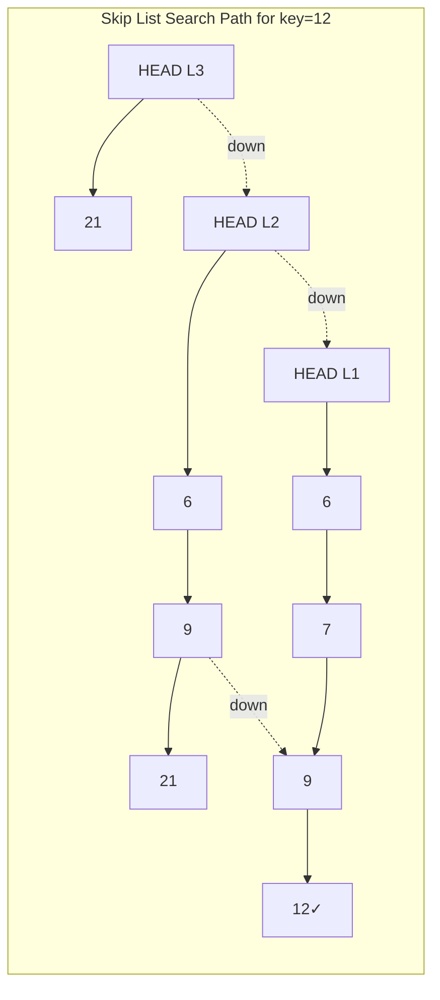

# Skip List

## Overview

| Property | Average Case | Worst Case |
|----------|--------------|------------|
| **Search** | O(log n) | O(n) |
| **Insert** | O(log n) | O(n) |
| **Delete** | O(log n) | O(n) |
| **Space** | O(n) | O(n log n) |
| **Source** | [data_structures/](../../../data_structures/) |

## 1. Mathematical Foundation

### 1.1 Definition

A **Skip List** is a probabilistic data structure that provides expected O(log n) search, insertion, and deletion. It's built as a hierarchy of linked lists:
- Bottom level (level 0) contains all elements
- Each higher level contains a subset of elements
- Element promotion is determined probabilistically

### 1.2 Structure Probability

Each element at level $i$ is promoted to level $i+1$ with probability $p$ (typically $p = 1/2$):

$$P(\text{element at level } k) = p^k$$

### 1.3 Expected Number of Levels

For $n$ elements, expected maximum level:

$$L(n) = \log_{1/p}(n) = O(\log n)$$

For $p = 1/2$:
$$L(n) = \log_2(n)$$

### 1.4 Expected Space

Total expected number of nodes:

$$\sum_{i=0}^{L(n)} \frac{n}{(1/p)^i} = n \sum_{i=0}^{L(n)} p^i = n \cdot \frac{1}{1-p} = O(n)$$

For $p = 1/2$: Expected $2n$ node references total.

### 1.5 Expected Search Time

Expected number of steps at each level: $O(1/p)$

Total expected search time:
$$O\left(\frac{1}{p} \cdot \log_{1/p}(n)\right) = O(\log n)$$

## 2. Skip List Node Structure

```
class SkipListNode:
    key: KeyType
    value: ValueType
    forward: array[0..maxLevel] of SkipListNode   // Forward pointers at each level
    
// The forward array holds pointers to next node at each level
// forward[0] is the lowest level (regular linked list)
// forward[maxLevel-1] is the highest level


class SkipList:
    header: SkipListNode     // Sentinel node (key = -∞)
    level: int               // Current highest level in use
    maxLevel: int            // Maximum level allowed
    p: float                 // Probability for promotion (default 0.5)
```

## 3. Skip List Operations

### 3.1 Random Level Generation

```
ALGORITHM RandomLevel(maxLevel, p)
    INPUT: Maximum level, probability p
    OUTPUT: Random level for new node
    
    1. level ← 0
    2. while Random() < p AND level < maxLevel - 1 do
           level ← level + 1
       end while
    3. return level

// With p = 0.5:
// Level 0: 100% of elements
// Level 1: ~50% of elements  
// Level 2: ~25% of elements
// Level k: ~(1/2)^k of elements
```

### 3.2 Search

```
ALGORITHM Search(list, searchKey)
    INPUT: Skip list, key to find
    OUTPUT: Value if found, null otherwise
    
    1. x ← list.header
    
    // Start from highest level, work down
    2. for i ← list.level downto 0 do
           while x.forward[i] ≠ null AND x.forward[i].key < searchKey do
               x ← x.forward[i]   // Move forward at level i
           end while
       end for
    
    // x is now the largest node with key < searchKey
    3. x ← x.forward[0]
    
    4. if x ≠ null AND x.key = searchKey then
           return x.value
       else
           return null
       end if
```

### 3.3 Insert

```
ALGORITHM Insert(list, searchKey, newValue)
    INPUT: Skip list, key and value to insert
    
    1. update ← array[0..maxLevel-1] of null
    2. x ← list.header
    
    // Find position at each level
    3. for i ← list.level downto 0 do
           while x.forward[i] ≠ null AND x.forward[i].key < searchKey do
               x ← x.forward[i]
           end while
           update[i] ← x   // Remember predecessor at level i
       end for
    
    4. x ← x.forward[0]
    
    // If key exists, update value
    5. if x ≠ null AND x.key = searchKey then
           x.value ← newValue
           return
       end if
    
    // Generate random level for new node
    6. newLevel ← RandomLevel(maxLevel, p)
    
    // If new level is higher, update header references
    7. if newLevel > list.level then
           for i ← list.level + 1 to newLevel do
               update[i] ← list.header
           end for
           list.level ← newLevel
       end if
    
    // Create new node and update pointers
    8. x ← CreateNode(newLevel + 1, searchKey, newValue)
    
    9. for i ← 0 to newLevel do
           x.forward[i] ← update[i].forward[i]
           update[i].forward[i] ← x
       end for
```

### 3.4 Delete

```
ALGORITHM Delete(list, searchKey)
    INPUT: Skip list, key to delete
    OUTPUT: True if deleted, False if not found
    
    1. update ← array[0..maxLevel-1] of null
    2. x ← list.header
    
    // Find node and its predecessors
    3. for i ← list.level downto 0 do
           while x.forward[i] ≠ null AND x.forward[i].key < searchKey do
               x ← x.forward[i]
           end while
           update[i] ← x
       end for
    
    4. x ← x.forward[0]
    
    // Key not found
    5. if x = null OR x.key ≠ searchKey then
           return False
       end if
    
    // Remove node from each level
    6. for i ← 0 to list.level do
           if update[i].forward[i] ≠ x then
               break
           end if
           update[i].forward[i] ← x.forward[i]
       end for
    
    // Adjust list level if needed
    7. while list.level > 0 AND list.header.forward[list.level] = null do
           list.level ← list.level - 1
       end while
    
    8. return True
```

## 4. Complexity Analysis

### 4.1 Time Complexity

| Operation | Expected | Worst Case |
|-----------|----------|------------|
| Search | O(log n) | O(n) |
| Insert | O(log n) | O(n) |
| Delete | O(log n) | O(n) |
| Min/Max | O(1) | O(1) |
| Range Query | O(log n + k) | O(n + k) |

### 4.2 Space Complexity

| Metric | Expected | Worst Case |
|--------|----------|------------|
| Total nodes | O(n) | O(n log n) |
| Total pointers | O(2n) for p=1/2 | O(n log n) |

### 4.3 Comparison with Other Structures

| Operation | Skip List | BST (balanced) | Hash Table |
|-----------|-----------|----------------|------------|
| Search | O(log n) | O(log n) | O(1) avg |
| Insert | O(log n) | O(log n) | O(1) avg |
| Delete | O(log n) | O(log n) | O(1) avg |
| Range Query | O(log n + k) | O(log n + k) | O(n) |
| Implementation | Simple | Complex | Simple |
| Ordering | Yes | Yes | No |

## 5. Visual Representation

```
Skip List with elements: 3, 6, 7, 9, 12, 19, 21, 25, 26

Level 3:  HEAD ──────────────────────────────────> 21 ─────> NIL
          │                                         │
Level 2:  HEAD ──────────> 6 ─────────> 9 ────────> 21 ─────> NIL
          │                │            │           │
Level 1:  HEAD ──────────> 6 ─> 7 ────> 9 ─> 12 ─> 21 ─> 25 > NIL
          │                │    │       │    │      │     │
Level 0:  HEAD ─> 3 ─────> 6 ─> 7 ────> 9 ─> 12 ─> 19 ─> 21 ─> 25 ─> 26 ─> NIL


Search for 12:
1. Start at HEAD, Level 3
2. 21 > 12, go down to Level 2
3. 6 < 12, move right to 6
4. 9 < 12, move right to 9
5. 21 > 12, go down to Level 1
6. 12 = 12, FOUND!

Path: HEAD → 6 → 9 → 12
```



## 6. Real-World Software Engineering Applications

### 6.1 Industry Use Cases

1. **Redis Sorted Sets**
   - ZADD, ZRANGE, ZRANK operations
   - Leaderboards
   - Time-series data

2. **LevelDB/RocksDB**
   - In-memory sorted buffers
   - MemTable implementation

3. **Apache Lucene**
   - Posting lists
   - Term dictionary

4. **Concurrent Data Structures**
   - Lock-free skip lists
   - Java's ConcurrentSkipListMap

5. **Network Routing**
   - Routing tables
   - IP lookup

### 6.2 Advantages Over Balanced Trees

1. **Simpler implementation** - No complex rotations
2. **Better concurrency** - Lock-free versions possible
3. **Memory locality** - Better cache performance
4. **Probabilistic balance** - No worst-case rebalancing

### 6.3 Implementation Examples

```python
import random
from typing import Generic, TypeVar, Optional, Iterator, List, Tuple

K = TypeVar('K')  # Key type
V = TypeVar('V')  # Value type


class SkipListNode(Generic[K, V]):
    """
    Node in skip list with multiple forward pointers.
    
    >>> node = SkipListNode(10, "ten", 3)
    >>> node.key
    10
    >>> len(node.forward)
    3
    """
    
    def __init__(self, key: K, value: V, level: int):
        self.key = key
        self.value = value
        self.forward: List[Optional['SkipListNode[K, V]']] = [None] * level


class SkipList(Generic[K, V]):
    """
    Skip List implementation with probabilistic balancing.
    
    >>> sl = SkipList()
    >>> sl.insert(3, "three")
    >>> sl.insert(1, "one")
    >>> sl.insert(2, "two")
    >>> sl.search(2)
    'two'
    >>> sl.search(4) is None
    True
    >>> sl.delete(2)
    True
    >>> sl.search(2) is None
    True
    >>> list(sl.items())
    [(1, 'one'), (3, 'three')]
    """
    
    MAX_LEVEL = 16
    P = 0.5  # Probability for level promotion
    
    def __init__(self):
        """Initialize empty skip list."""
        self._header: SkipListNode[K, V] = SkipListNode(None, None, self.MAX_LEVEL)  # type: ignore
        self._level = 0  # Current max level in use
        self._size = 0
    
    def _random_level(self) -> int:
        """Generate random level with geometric distribution."""
        level = 0
        while random.random() < self.P and level < self.MAX_LEVEL - 1:
            level += 1
        return level
    
    def search(self, key: K) -> Optional[V]:
        """
        Search for key. O(log n) expected.
        
        >>> sl = SkipList()
        >>> sl.insert(5, "five")
        >>> sl.search(5)
        'five'
        """
        node = self._header
        
        # Traverse from top level down
        for i in range(self._level, -1, -1):
            while node.forward[i] and node.forward[i].key < key:
                node = node.forward[i]
        
        # Move to candidate node
        node = node.forward[0]
        
        if node and node.key == key:
            return node.value
        return None
    
    def insert(self, key: K, value: V) -> None:
        """
        Insert key-value pair. O(log n) expected.
        
        >>> sl = SkipList()
        >>> sl.insert(1, "a")
        >>> sl.insert(2, "b")
        >>> len(sl)
        2
        """
        update: List[Optional[SkipListNode[K, V]]] = [None] * self.MAX_LEVEL
        node = self._header
        
        # Find update positions at each level
        for i in range(self._level, -1, -1):
            while node.forward[i] and node.forward[i].key < key:
                node = node.forward[i]
            update[i] = node
        
        node = node.forward[0]
        
        # Update existing key
        if node and node.key == key:
            node.value = value
            return
        
        # Generate random level for new node
        new_level = self._random_level()
        
        # If new level exceeds current, update header references
        if new_level > self._level:
            for i in range(self._level + 1, new_level + 1):
                update[i] = self._header
            self._level = new_level
        
        # Create new node
        new_node: SkipListNode[K, V] = SkipListNode(key, value, new_level + 1)
        
        # Update forward pointers
        for i in range(new_level + 1):
            if update[i]:
                new_node.forward[i] = update[i].forward[i]
                update[i].forward[i] = new_node
        
        self._size += 1
    
    def delete(self, key: K) -> bool:
        """
        Delete key. O(log n) expected.
        
        >>> sl = SkipList()
        >>> sl.insert(1, "one")
        >>> sl.delete(1)
        True
        >>> sl.delete(1)
        False
        """
        update: List[Optional[SkipListNode[K, V]]] = [None] * self.MAX_LEVEL
        node = self._header
        
        for i in range(self._level, -1, -1):
            while node.forward[i] and node.forward[i].key < key:
                node = node.forward[i]
            update[i] = node
        
        node = node.forward[0]
        
        if not node or node.key != key:
            return False
        
        # Remove node from each level
        for i in range(self._level + 1):
            if update[i] and update[i].forward[i] != node:
                break
            if update[i]:
                update[i].forward[i] = node.forward[i]
        
        # Adjust max level if needed
        while self._level > 0 and self._header.forward[self._level] is None:
            self._level -= 1
        
        self._size -= 1
        return True
    
    def __len__(self) -> int:
        return self._size
    
    def __contains__(self, key: K) -> bool:
        return self.search(key) is not None
    
    def items(self) -> Iterator[Tuple[K, V]]:
        """Iterate all items in order. O(n)."""
        node = self._header.forward[0]
        while node:
            yield (node.key, node.value)
            node = node.forward[0]
    
    def keys(self) -> Iterator[K]:
        """Iterate all keys in order."""
        for key, _ in self.items():
            yield key
    
    def values(self) -> Iterator[V]:
        """Iterate all values in order."""
        for _, value in self.items():
            yield value
    
    def range_query(self, low: K, high: K) -> Iterator[Tuple[K, V]]:
        """
        Find all entries in range [low, high]. O(log n + k).
        
        >>> sl = SkipList()
        >>> for i in range(10):
        ...     sl.insert(i, str(i))
        >>> list(sl.range_query(3, 7))
        [(3, '3'), (4, '4'), (5, '5'), (6, '6'), (7, '7')]
        """
        node = self._header
        
        # Find first node >= low
        for i in range(self._level, -1, -1):
            while node.forward[i] and node.forward[i].key < low:
                node = node.forward[i]
        
        node = node.forward[0]
        
        # Traverse until > high
        while node and node.key <= high:
            yield (node.key, node.value)
            node = node.forward[0]
    
    def min(self) -> Optional[Tuple[K, V]]:
        """Get minimum key-value pair. O(1)."""
        if self._header.forward[0]:
            node = self._header.forward[0]
            return (node.key, node.value)
        return None
    
    def max(self) -> Optional[Tuple[K, V]]:
        """Get maximum key-value pair. O(log n)."""
        node = self._header
        
        for i in range(self._level, -1, -1):
            while node.forward[i]:
                node = node.forward[i]
        
        if node != self._header:
            return (node.key, node.value)
        return None
    
    def floor(self, key: K) -> Optional[Tuple[K, V]]:
        """
        Find largest key <= given key. O(log n).
        
        >>> sl = SkipList()
        >>> for i in [2, 4, 6, 8]:
        ...     sl.insert(i, str(i))
        >>> sl.floor(5)
        (4, '4')
        >>> sl.floor(6)
        (6, '6')
        """
        node = self._header
        
        for i in range(self._level, -1, -1):
            while node.forward[i] and node.forward[i].key <= key:
                node = node.forward[i]
        
        if node != self._header:
            return (node.key, node.value)
        return None
    
    def ceiling(self, key: K) -> Optional[Tuple[K, V]]:
        """
        Find smallest key >= given key. O(log n).
        
        >>> sl = SkipList()
        >>> for i in [2, 4, 6, 8]:
        ...     sl.insert(i, str(i))
        >>> sl.ceiling(5)
        (6, '6')
        >>> sl.ceiling(4)
        (4, '4')
        """
        node = self._header
        
        for i in range(self._level, -1, -1):
            while node.forward[i] and node.forward[i].key < key:
                node = node.forward[i]
        
        node = node.forward[0]
        
        if node:
            return (node.key, node.value)
        return None
    
    def visualize(self) -> str:
        """
        Create ASCII visualization of skip list.
        
        >>> sl = SkipList()
        >>> sl.insert(3, "c")
        >>> sl.insert(6, "f")
        >>> len(sl.visualize()) > 0
        True
        """
        if self._size == 0:
            return "Empty skip list"
        
        # Collect all nodes and their levels
        nodes: List[SkipListNode[K, V]] = []
        node = self._header.forward[0]
        while node:
            nodes.append(node)
            node = node.forward[0]
        
        if not nodes:
            return "Empty skip list"
        
        # Determine level of each node
        node_levels = []
        for n in nodes:
            level = 0
            for i in range(len(n.forward)):
                if n.forward[i] is not None or i == 0:
                    level = i
                else:
                    break
            node_levels.append(len(n.forward) - 1)
        
        lines = []
        for level in range(self._level, -1, -1):
            line = f"L{level}: HEAD"
            for i, n in enumerate(nodes):
                if node_levels[i] >= level:
                    line += f" ──> [{n.key}]"
                else:
                    line += f" ────────"
            line += " ──> NIL"
            lines.append(line)
        
        return "\n".join(lines)


# Practical Applications

class Leaderboard:
    """
    Game leaderboard using skip list for efficient ranking.
    
    >>> lb = Leaderboard()
    >>> lb.add_score("Alice", 100)
    >>> lb.add_score("Bob", 150)
    >>> lb.add_score("Charlie", 120)
    >>> lb.get_rank("Alice")
    3
    >>> lb.top_k(2)
    [('Bob', 150), ('Charlie', 120)]
    """
    
    def __init__(self):
        self._scores = SkipList[int, set]()
        self._players: dict[str, int] = {}
    
    def add_score(self, player: str, score: int) -> None:
        """Add or update player score."""
        # Remove old score if exists
        if player in self._players:
            old_score = self._players[player]
            players_at_score = self._scores.search(old_score)
            if players_at_score:
                players_at_score.discard(player)
                if not players_at_score:
                    self._scores.delete(old_score)
        
        # Add new score
        self._players[player] = score
        players_at_score = self._scores.search(score)
        if players_at_score is None:
            self._scores.insert(score, {player})
        else:
            players_at_score.add(player)
    
    def get_rank(self, player: str) -> int:
        """Get player's rank (1-based, higher score = better rank)."""
        if player not in self._players:
            return -1
        
        player_score = self._players[player]
        rank = 1
        
        # Count players with higher scores
        for score, players in self._scores.items():
            if score > player_score:
                rank += len(players)
        
        return rank
    
    def top_k(self, k: int) -> List[Tuple[str, int]]:
        """Get top k players by score."""
        result = []
        
        # Get max and iterate down
        current = self._scores.max()
        while current and len(result) < k:
            score, players = current
            for player in players:
                result.append((player, score))
                if len(result) >= k:
                    break
            
            # Get next lower score
            floor = self._scores.floor(score - 1)
            current = floor
        
        return result


class TimeRangeStore:
    """
    Store events with timestamp, efficient range queries.
    
    >>> store = TimeRangeStore()
    >>> store.add_event(1000, "event1")
    >>> store.add_event(2000, "event2")
    >>> store.add_event(1500, "event3")
    >>> list(store.get_events_in_range(1000, 1500))
    [(1000, 'event1'), (1500, 'event3')]
    """
    
    def __init__(self):
        self._events = SkipList[int, str]()
    
    def add_event(self, timestamp: int, event: str) -> None:
        """Add event at timestamp."""
        self._events.insert(timestamp, event)
    
    def get_events_in_range(
        self, start: int, end: int
    ) -> Iterator[Tuple[int, str]]:
        """Get all events in time range."""
        yield from self._events.range_query(start, end)
    
    def get_latest(self) -> Optional[Tuple[int, str]]:
        """Get most recent event."""
        return self._events.max()
```

## 7. Variants and Extensions

### 7.1 Deterministic Skip List

Use deterministic promotion instead of random:
- Every 2nd element at level 1
- Every 4th element at level 2
- Guarantees O(log n) but loses simplicity

### 7.2 Concurrent Skip List

Lock-free implementation for multi-threaded access:
- Used in Java's `ConcurrentSkipListMap`
- Compare-and-swap for updates

### 7.3 Indexable Skip List

Maintain subtree sizes for O(log n) rank queries:
- Get element at position k
- Get rank of element

## 8. References

- Pugh, W. (1990). "Skip Lists: A Probabilistic Alternative to Balanced Trees"
- Pugh, W. (1990). "Concurrent Maintenance of Skip Lists"
- [Wikipedia: Skip list](https://en.wikipedia.org/wiki/Skip_list)
- Redis documentation on Sorted Sets
