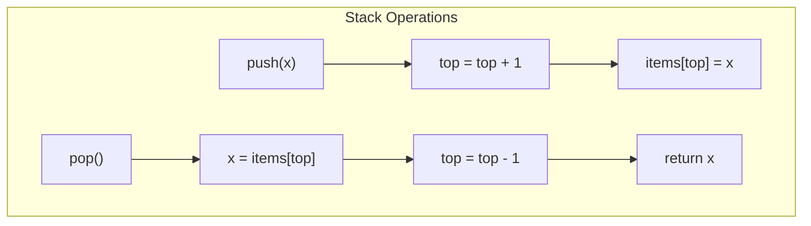

# Stack Data Structure

## Overview

| Property | Value |
|----------|-------|
| **Category** | Linear Data Structure |
| **Push** | O(1) |
| **Pop** | O(1) |
| **Peek/Top** | O(1) |
| **Search** | O(n) |
| **Space** | O(n) |
| **Source** | [stack/](../../../data_structures/stack/) |

## 1. Mathematical Foundation

### 1.1 Definition

A **Stack** is a linear data structure following the **LIFO** (Last-In, First-Out) principle:
- Elements are added at the **top** (push)
- Elements are removed from the **top** (pop)

### 1.2 Abstract Data Type

```
ADT Stack:
    push(item)        // Add item to top
    pop() → item      // Remove and return top item
    peek() → item     // Return top item without removing
    is_empty() → bool
    size() → int
```

### 1.3 Stack Invariant

The last element pushed is the first to be popped:

$$
\text{push}(a), \text{push}(b), \text{push}(c) \Rightarrow \text{pop order: } c, b, a
$$

### 1.4 Stack Operations Model

For a stack $S$ with operations:
- $\text{push}(S, x)$: Adds $x$ to top → $S' = [x, s_1, s_2, ..., s_n]$
- $\text{pop}(S)$: Removes top → returns $s_1$, $S' = [s_2, s_3, ..., s_n]$
- $\text{peek}(S)$: Returns $s_1$ without modification

## 2. Implementations

### 2.1 Array-Based Stack

```
class ArrayStack:
    items: array of T
    top: int = -1     // Index of top element
    capacity: int
```

### 2.2 Operations

```
ALGORITHM Push(stack, item)
    INPUT: Stack, item to add
    
    1. if stack.top = stack.capacity - 1 then
           ResizeArray(stack)  // Or raise "Stack overflow"
       end if
    
    2. stack.top ← stack.top + 1
    3. stack.items[stack.top] ← item


ALGORITHM Pop(stack)
    INPUT: Stack
    OUTPUT: Top item
    
    1. if stack.top = -1 then
           raise "Stack underflow"
       end if
    
    2. item ← stack.items[stack.top]
    3. stack.top ← stack.top - 1
    4. return item


ALGORITHM Peek(stack)
    INPUT: Stack
    OUTPUT: Top item (without removing)
    
    1. if stack.top = -1 then
           raise "Stack is empty"
       end if
    
    2. return stack.items[stack.top]
```

### 2.3 Linked List Stack

```
class LinkedStack:
    top: Node = null
    size: int = 0
    

ALGORITHM Push(stack, item)
    1. node ← CreateNode(item)
    2. node.next ← stack.top
    3. stack.top ← node
    4. stack.size ← stack.size + 1


ALGORITHM Pop(stack)
    1. if stack.top = null then
           raise "Stack underflow"
       end if
    
    2. item ← stack.top.data
    3. stack.top ← stack.top.next
    4. stack.size ← stack.size - 1
    5. return item
```

## 3. Complexity Analysis

### 3.1 Time Complexity

| Operation | Array | Linked List |
|-----------|-------|-------------|
| Push | O(1)* | O(1) |
| Pop | O(1) | O(1) |
| Peek | O(1) | O(1) |
| Search | O(n) | O(n) |
| Size | O(1) | O(1) |

*Amortized O(1) with dynamic resizing

### 3.2 Space Complexity

| Implementation | Space |
|----------------|-------|
| Array (fixed) | O(capacity) |
| Array (dynamic) | O(n) |
| Linked List | O(n) + pointer overhead |

## 4. Visual Representation

```
Stack Operations:

Initial (empty):    After push(A):    After push(B):    After push(C):
   ┌───┐              ┌───┐              ┌───┐              ┌───┐
   │   │              │   │              │   │              │ C │ ← top
   ├───┤              ├───┤              ├───┤              ├───┤
   │   │              │   │              │ B │ ← top        │ B │
   ├───┤              ├───┤              ├───┤              ├───┤
   │   │              │ A │ ← top        │ A │              │ A │
   └───┘              └───┘              └───┘              └───┘

After pop() → C:
   ┌───┐
   │   │
   ├───┤
   │ B │ ← top
   ├───┤
   │ A │
   └───┘
```



## 5. Common Stack Algorithms

### 5.1 Balanced Parentheses

```
ALGORITHM IsBalanced(expression)
    INPUT: String with brackets
    OUTPUT: True if balanced
    
    1. stack ← empty stack
    2. pairs ← {')': '(', ']': '[', '}': '{'}
    
    3. for each char c in expression do
           if c in "([{" then
               stack.push(c)
           else if c in ")]}" then
               if stack.is_empty() OR stack.pop() ≠ pairs[c] then
                   return False
               end if
           end if
       end for
    
    4. return stack.is_empty()
```

### 5.2 Evaluate Postfix Expression

```
ALGORITHM EvaluatePostfix(tokens)
    INPUT: Postfix expression tokens
    OUTPUT: Result value
    
    1. stack ← empty stack
    
    2. for each token in tokens do
           if token is number then
               stack.push(token)
           else  // operator
               b ← stack.pop()
               a ← stack.pop()
               result ← Apply(token, a, b)
               stack.push(result)
           end if
       end for
    
    3. return stack.pop()


// Example: "3 4 + 2 *" → ((3 + 4) * 2) = 14
```

### 5.3 Infix to Postfix (Shunting Yard)

```
ALGORITHM InfixToPostfix(expression)
    INPUT: Infix expression
    OUTPUT: Postfix expression
    
    1. output ← []
    2. operators ← empty stack
    3. precedence ← {'+': 1, '-': 1, '*': 2, '/': 2, '^': 3}
    
    4. for each token in expression do
           if token is number then
               output.append(token)
           else if token = '(' then
               operators.push(token)
           else if token = ')' then
               while operators.peek() ≠ '(' do
                   output.append(operators.pop())
               end while
               operators.pop()  // Remove '('
           else  // operator
               while (operators not empty AND 
                      operators.peek() ≠ '(' AND
                      precedence[operators.peek()] ≥ precedence[token]) do
                   output.append(operators.pop())
               end while
               operators.push(token)
           end if
       end for
    
    5. while operators not empty do
           output.append(operators.pop())
       end while
    
    6. return output
```

### 5.4 Next Greater Element

```
ALGORITHM NextGreaterElement(arr)
    INPUT: Array of numbers
    OUTPUT: Array where result[i] = next greater element of arr[i]
    
    1. n ← len(arr)
    2. result ← [-1] × n
    3. stack ← empty stack  // Store indices
    
    4. for i ← 0 to n - 1 do
           while stack not empty AND arr[stack.peek()] < arr[i] do
               idx ← stack.pop()
               result[idx] ← arr[i]
           end while
           stack.push(i)
       end for
    
    5. return result

// Example: [4, 5, 2, 10] → [5, 10, 10, -1]
```

## 6. Real-World Software Engineering Applications

### 6.1 Industry Use Cases

1. **Compilers & Interpreters**
   - Expression parsing
   - Syntax validation
   - Call stack management
   - Symbol table scoping

2. **Text Editors & IDEs**
   - Undo/redo functionality
   - Bracket matching
   - Syntax highlighting
   - Code folding

3. **Web Browsers**
   - Back button (page history)
   - JavaScript call stack
   - DOM rendering
   - Tab management

4. **Operating Systems**
   - Function call stack
   - Recursion management
   - Context switching
   - Interrupt handling

5. **Algorithm Implementations**
   - DFS traversal
   - Backtracking
   - Tower of Hanoi
   - Expression evaluation

### 6.2 Implementation Examples

```python
from typing import Generic, TypeVar, Iterator

T = TypeVar('T')


class Stack(Generic[T]):
    """
    Stack implementation using Python list.
    
    >>> s = Stack()
    >>> s.push(1)
    >>> s.push(2)
    >>> s.pop()
    2
    >>> s.peek()
    1
    >>> len(s)
    1
    """
    
    def __init__(self):
        self._items: list[T] = []
    
    def push(self, item: T) -> None:
        """Add item to top. O(1) amortized."""
        self._items.append(item)
    
    def pop(self) -> T:
        """Remove and return top item. O(1)."""
        if not self._items:
            raise IndexError("pop from empty stack")
        return self._items.pop()
    
    def peek(self) -> T:
        """Return top item without removing. O(1)."""
        if not self._items:
            raise IndexError("peek at empty stack")
        return self._items[-1]
    
    def is_empty(self) -> bool:
        return len(self._items) == 0
    
    def __len__(self) -> int:
        return len(self._items)
    
    def __bool__(self) -> bool:
        return bool(self._items)
    
    def __iter__(self) -> Iterator[T]:
        """Iterate from top to bottom."""
        return reversed(self._items)


class MinStack:
    """
    Stack that supports O(1) min retrieval.
    
    >>> ms = MinStack()
    >>> ms.push(3)
    >>> ms.push(1)
    >>> ms.push(2)
    >>> ms.get_min()
    1
    >>> ms.pop()
    2
    >>> ms.get_min()
    1
    >>> ms.pop()
    1
    >>> ms.get_min()
    3
    """
    
    def __init__(self):
        self._stack: list[int] = []
        self._min_stack: list[int] = []
    
    def push(self, val: int) -> None:
        """Push with min tracking. O(1)."""
        self._stack.append(val)
        if not self._min_stack or val <= self._min_stack[-1]:
            self._min_stack.append(val)
    
    def pop(self) -> int:
        """Pop with min tracking. O(1)."""
        val = self._stack.pop()
        if val == self._min_stack[-1]:
            self._min_stack.pop()
        return val
    
    def top(self) -> int:
        return self._stack[-1]
    
    def get_min(self) -> int:
        """Return minimum element. O(1)."""
        return self._min_stack[-1]


def is_balanced(expression: str) -> bool:
    """
    Check if parentheses are balanced.
    
    >>> is_balanced("()")
    True
    >>> is_balanced("()[]{}")
    True
    >>> is_balanced("(]")
    False
    >>> is_balanced("([)]")
    False
    >>> is_balanced("{[]}")
    True
    """
    stack: list[str] = []
    pairs = {')': '(', ']': '[', '}': '{'}
    
    for char in expression:
        if char in '([{':
            stack.append(char)
        elif char in ')]}':
            if not stack or stack.pop() != pairs[char]:
                return False
    
    return len(stack) == 0


def evaluate_postfix(tokens: list[str]) -> float:
    """
    Evaluate postfix expression.
    
    >>> evaluate_postfix(['3', '4', '+', '2', '*'])
    14.0
    >>> evaluate_postfix(['2', '3', '1', '*', '+', '9', '-'])
    -4.0
    """
    stack: list[float] = []
    operators = {
        '+': lambda a, b: a + b,
        '-': lambda a, b: a - b,
        '*': lambda a, b: a * b,
        '/': lambda a, b: a / b,
    }
    
    for token in tokens:
        if token in operators:
            b = stack.pop()
            a = stack.pop()
            stack.append(operators[token](a, b))
        else:
            stack.append(float(token))
    
    return stack[0]


def infix_to_postfix(expression: str) -> list[str]:
    """
    Convert infix to postfix using Shunting Yard algorithm.
    
    >>> infix_to_postfix("3 + 4 * 2")
    ['3', '4', '2', '*', '+']
    >>> infix_to_postfix("( 1 + 2 ) * 3")
    ['1', '2', '+', '3', '*']
    """
    output: list[str] = []
    operator_stack: list[str] = []
    precedence = {'+': 1, '-': 1, '*': 2, '/': 2, '^': 3}
    right_associative = {'^'}
    
    tokens = expression.split()
    
    for token in tokens:
        if token.isnumeric():
            output.append(token)
        elif token == '(':
            operator_stack.append(token)
        elif token == ')':
            while operator_stack and operator_stack[-1] != '(':
                output.append(operator_stack.pop())
            operator_stack.pop()  # Remove '('
        elif token in precedence:
            while (operator_stack and 
                   operator_stack[-1] != '(' and
                   operator_stack[-1] in precedence and
                   (precedence[operator_stack[-1]] > precedence[token] or
                    (precedence[operator_stack[-1]] == precedence[token] and
                     token not in right_associative))):
                output.append(operator_stack.pop())
            operator_stack.append(token)
    
    while operator_stack:
        output.append(operator_stack.pop())
    
    return output


def next_greater_element(arr: list[int]) -> list[int]:
    """
    Find next greater element for each position.
    
    >>> next_greater_element([4, 5, 2, 10])
    [5, 10, 10, -1]
    >>> next_greater_element([3, 2, 1])
    [-1, -1, -1]
    """
    n = len(arr)
    result = [-1] * n
    stack: list[int] = []  # Store indices
    
    for i in range(n):
        while stack and arr[stack[-1]] < arr[i]:
            idx = stack.pop()
            result[idx] = arr[i]
        stack.append(i)
    
    return result


class UndoRedoStack:
    """
    Undo/Redo functionality using two stacks.
    
    >>> editor = UndoRedoStack("")
    >>> editor.write("Hello")
    >>> editor.write(" World")
    >>> editor.current
    'Hello World'
    >>> editor.undo()
    'Hello'
    >>> editor.undo()
    ''
    >>> editor.redo()
    'Hello'
    """
    
    def __init__(self, initial: str = ""):
        self.current = initial
        self._undo_stack: list[str] = []
        self._redo_stack: list[str] = []
    
    def write(self, text: str) -> None:
        """Add text and save state for undo."""
        self._undo_stack.append(self.current)
        self.current += text
        self._redo_stack.clear()  # Clear redo after new write
    
    def undo(self) -> str:
        """Undo last write."""
        if not self._undo_stack:
            return self.current
        
        self._redo_stack.append(self.current)
        self.current = self._undo_stack.pop()
        return self.current
    
    def redo(self) -> str:
        """Redo last undone action."""
        if not self._redo_stack:
            return self.current
        
        self._undo_stack.append(self.current)
        self.current = self._redo_stack.pop()
        return self.current


def dfs_iterative(graph: dict[int, list[int]], start: int) -> list[int]:
    """
    Iterative DFS using stack.
    
    >>> graph = {0: [1, 2], 1: [3], 2: [3], 3: []}
    >>> dfs_iterative(graph, 0)
    [0, 2, 3, 1]
    """
    visited: set[int] = set()
    result: list[int] = []
    stack = [start]
    
    while stack:
        node = stack.pop()
        if node not in visited:
            visited.add(node)
            result.append(node)
            
            # Add neighbors in reverse order for left-to-right traversal
            for neighbor in reversed(graph.get(node, [])):
                if neighbor not in visited:
                    stack.append(neighbor)
    
    return result


def largest_rectangle_histogram(heights: list[int]) -> int:
    """
    Find largest rectangle in histogram using monotonic stack.
    
    >>> largest_rectangle_histogram([2, 1, 5, 6, 2, 3])
    10
    >>> largest_rectangle_histogram([2, 4])
    4
    """
    stack: list[int] = []  # Indices of increasing heights
    max_area = 0
    
    for i, h in enumerate(heights + [0]):  # Add 0 to flush remaining
        while stack and heights[stack[-1]] > h:
            height = heights[stack.pop()]
            width = i if not stack else i - stack[-1] - 1
            max_area = max(max_area, height * width)
        stack.append(i)
    
    return max_area
```

## 7. Stack Patterns

### 7.1 Monotonic Stack

Stack where elements maintain a monotonic order (increasing or decreasing):
- Used for: next greater/smaller element problems
- Time complexity: O(n) for the entire array

### 7.2 Two Stacks

Using two stacks for specific problems:
- Implement queue
- Undo/redo functionality
- Min stack (constant time minimum)

### 7.3 Expression Parsing

Common pattern for parsing and evaluating expressions:
- Operator precedence handling
- Parentheses matching
- Infix/postfix/prefix conversion

## 8. Comparison with Queue

| Property | Stack | Queue |
|----------|-------|-------|
| Order | LIFO | FIFO |
| Access | Top only | Front only |
| Use case | Backtracking, DFS | Scheduling, BFS |
| History | Backward traversal | Forward traversal |

## 9. References

- Knuth, D. "The Art of Computer Programming, Vol. 1" - Chapter 2
- Dijkstra, E. (1961). "An ALGOL 60 Translator for the X1"
- [Wikipedia: Stack (abstract data type)](https://en.wikipedia.org/wiki/Stack_(abstract_data_type))
- [Wikipedia: Shunting-yard algorithm](https://en.wikipedia.org/wiki/Shunting-yard_algorithm)
