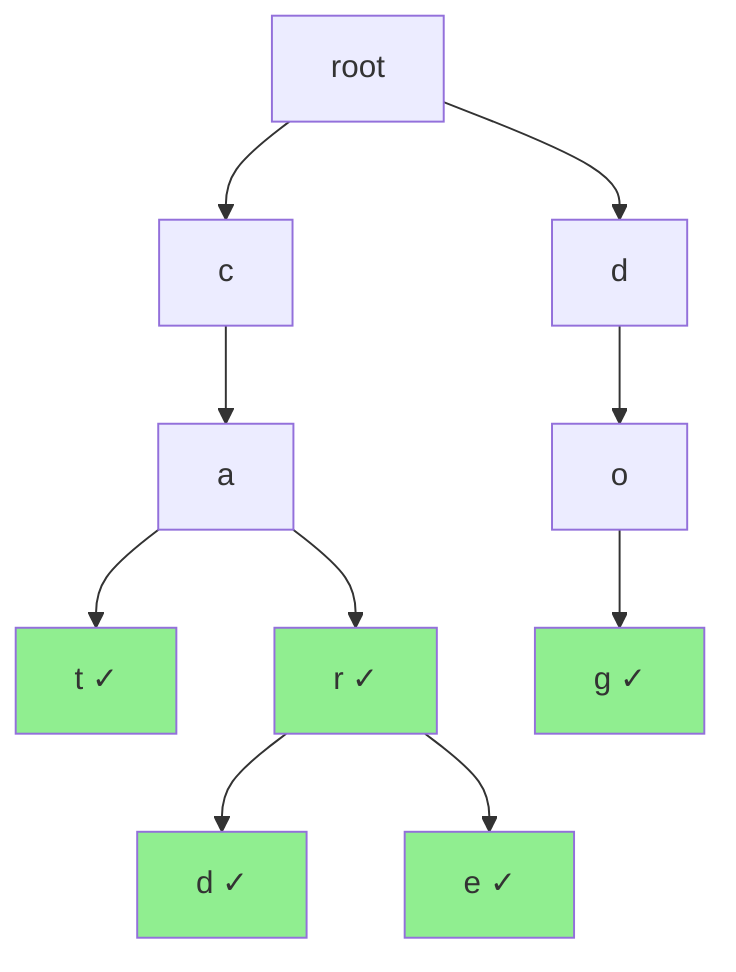

# Trie (Prefix Tree)

## Overview

| Property | Value |
|----------|-------|
| **Category** | String Search Structure |
| **Search** | O(m) where m = key length |
| **Insert** | O(m) |
| **Delete** | O(m) |
| **Prefix Search** | O(p + k) where p = prefix, k = matches |
| **Space** | O(n × m × σ) worst case |
| **Source** | [trie.py](../../../data_structures/trie/trie.py) |

## 1. Mathematical Foundation

### 1.1 Definition

A **Trie** (from re**trie**val) is a tree-like data structure for storing strings where:
- Each node represents a character
- Paths from root to nodes form prefixes
- Nodes may be marked as word endings

### 1.2 Properties

For alphabet size $\sigma$ and $n$ strings of average length $m$:

| Property | Value |
|----------|-------|
| Maximum children per node | $\sigma$ |
| Height | max string length |
| Total nodes | O(n × m) |
| Space (array children) | O(n × m × σ) |
| Space (hash children) | O(total characters) |

### 1.3 Comparison with Other Structures

| Operation | Trie | Hash Map | BST |
|-----------|------|----------|-----|
| Search | O(m) | O(m) avg | O(m log n) |
| Insert | O(m) | O(m) avg | O(m log n) |
| Prefix search | O(p) | O(n × m) | O(n × m) |
| Autocomplete | O(p + k) | O(n × m) | O(n × m) |
| Sorted iteration | O(n × m) | O(n × m log n) | O(n × m) |

## 2. Node Structure

### 2.1 Array-Based (Fixed Alphabet)

```
class TrieNode:
    children: array[σ] of TrieNode  // One slot per character
    is_end: boolean                  // Marks end of word
    count: int                       // Optional: word frequency
```

### 2.2 Hash Map-Based (Variable Alphabet)

```
class TrieNode:
    children: HashMap<char, TrieNode>
    is_end: boolean
    value: V  // Optional: associated value
```

## 3. Core Operations

### 3.1 Insert

```
ALGORITHM Insert(root, word)
    INPUT: Trie root, word to insert
    
    1. node ← root
    
    2. for each char c in word do
           if c not in node.children then
               node.children[c] ← CreateNode()
           end if
           node ← node.children[c]
       end for
    
    3. node.is_end ← true
```

### 3.2 Search

```
ALGORITHM Search(root, word)
    INPUT: Trie root, word to find
    OUTPUT: true if word exists, false otherwise
    
    1. node ← root
    
    2. for each char c in word do
           if c not in node.children then
               return false
           end if
           node ← node.children[c]
       end for
    
    3. return node.is_end
```

### 3.3 Starts With (Prefix Search)

```
ALGORITHM StartsWith(root, prefix)
    INPUT: Trie root, prefix to check
    OUTPUT: true if any word has this prefix
    
    1. node ← root
    
    2. for each char c in prefix do
           if c not in node.children then
               return false
           end if
           node ← node.children[c]
       end for
    
    3. return true  // Node exists = prefix exists
```

### 3.4 Delete

```
ALGORITHM Delete(root, word)
    INPUT: Trie root, word to delete
    OUTPUT: true if deleted, false if not found
    
    FUNCTION DeleteHelper(node, word, depth)
        // Base case: end of word
        if depth = len(word) then
            if not node.is_end then
                return false
            end if
            node.is_end ← false
            return node.children is empty
        end if
        
        // Recursive case
        c ← word[depth]
        if c not in node.children then
            return false
        end if
        
        should_delete ← DeleteHelper(node.children[c], word, depth + 1)
        
        if should_delete then
            delete node.children[c]
            return not node.is_end AND node.children is empty
        end if
        
        return false
    END FUNCTION
    
    1. return DeleteHelper(root, word, 0)
```

### 3.5 Autocomplete

```
ALGORITHM Autocomplete(root, prefix, max_results)
    INPUT: Trie root, prefix, maximum suggestions
    OUTPUT: List of words with given prefix
    
    // Navigate to prefix node
    1. node ← root
    2. for each char c in prefix do
           if c not in node.children then
               return []
           end if
           node ← node.children[c]
       end for
    
    // DFS to find all words
    3. results ← []
    4. CollectWords(node, prefix, results, max_results)
    5. return results
    

FUNCTION CollectWords(node, current_word, results, max_results)
    if len(results) ≥ max_results then
        return
    end if
    
    if node.is_end then
        results.append(current_word)
    end if
    
    for each (c, child) in sorted(node.children) do
        CollectWords(child, current_word + c, results, max_results)
    end for
END FUNCTION
```

## 4. Complexity Analysis

### 4.1 Time Complexity

| Operation | Complexity |
|-----------|------------|
| Insert | O(m) |
| Search | O(m) |
| Delete | O(m) |
| Prefix check | O(p) |
| Autocomplete | O(p + k) |
| Count prefix matches | O(p) with count |

Where m = word length, p = prefix length, k = number of matches.

### 4.2 Space Complexity

| Implementation | Space |
|----------------|-------|
| Array (fixed σ) | O(n × m × σ) |
| HashMap children | O(total chars) |
| Compressed trie | O(n × m) |

## 5. Visual Representation

### Trie for ["cat", "car", "card", "care", "dog"]

```
             root
            / |  \
           c  d   ...
          /   |
         a    o
        /     |
       t*     g*
      /|\
     r* 
    / \
   d*  e*

* = is_end (word boundary)
```

### Detailed View

```
        (root)
       /      \
      c        d
      |        |
      a        o
     / \       |
    t*  r*     g*
        |
       [d*, e*]

Words formed:
- c→a→t = "cat"
- c→a→r = "car"  
- c→a→r→d = "card"
- c→a→r→e = "care"
- d→o→g = "dog"
```



## 6. Variants

### 6.1 Compressed Trie (Radix Tree)

Merge chains of single-child nodes:

```
Standard Trie:          Compressed Trie:
    c                       c
    |                       |
    a                      ar
   / \                    / \
  t   r                  t  [d, e]
      |
     [d, e]
```

### 6.2 Suffix Trie/Tree

Store all suffixes of a string for pattern matching:
- Text: "banana"
- Suffixes: "banana", "anana", "nana", "ana", "na", "a"

### 6.3 PATRICIA Trie

Practical Algorithm to Retrieve Information Coded in Alphanumeric:
- Compressed radix tree
- Stores keys in edges
- Used in IP routing tables

## 7. Real-World Software Engineering Applications

### 7.1 Industry Use Cases

1. **Search Engines**
   - Autocomplete suggestions
   - Query spell correction
   - Search indexing
   - Related searches

2. **IDEs and Text Editors**
   - Code completion
   - Symbol lookup
   - Syntax highlighting keywords
   - Snippet expansion

3. **Spell Checkers**
   - Dictionary lookup
   - Spelling suggestions
   - Word validation
   - Grammar checking

4. **Networking**
   - IP routing (PATRICIA)
   - DNS lookup
   - URL routing in web frameworks
   - Network prefix matching

5. **Natural Language Processing**
   - Tokenization
   - Named entity recognition
   - Morphological analysis
   - Word segmentation

### 7.2 Implementation Examples

```python
from collections import defaultdict
from typing import Iterator


class TrieNode:
    """Node in a Trie data structure."""
    
    def __init__(self):
        self.children: dict[str, TrieNode] = {}
        self.is_end: bool = False
        self.count: int = 0  # Number of words with this prefix


class Trie:
    """
    Trie (prefix tree) implementation.
    
    >>> trie = Trie()
    >>> trie.insert("apple")
    >>> trie.insert("app")
    >>> trie.search("apple")
    True
    >>> trie.search("app")
    True
    >>> trie.search("appl")
    False
    >>> trie.starts_with("app")
    True
    >>> list(trie.autocomplete("app"))
    ['app', 'apple']
    """
    
    def __init__(self):
        self.root = TrieNode()
    
    def insert(self, word: str) -> None:
        """Insert word into trie. O(m)"""
        node = self.root
        for char in word:
            if char not in node.children:
                node.children[char] = TrieNode()
            node = node.children[char]
            node.count += 1
        node.is_end = True
    
    def search(self, word: str) -> bool:
        """Check if word exists. O(m)"""
        node = self._find_node(word)
        return node is not None and node.is_end
    
    def starts_with(self, prefix: str) -> bool:
        """Check if any word starts with prefix. O(p)"""
        return self._find_node(prefix) is not None
    
    def count_prefix(self, prefix: str) -> int:
        """Count words starting with prefix. O(p)"""
        node = self._find_node(prefix)
        return node.count if node else 0
    
    def _find_node(self, prefix: str) -> TrieNode | None:
        """Navigate to node for prefix."""
        node = self.root
        for char in prefix:
            if char not in node.children:
                return None
            node = node.children[char]
        return node
    
    def delete(self, word: str) -> bool:
        """Delete word from trie. O(m)"""
        def _delete(node: TrieNode, word: str, depth: int) -> bool:
            if depth == len(word):
                if not node.is_end:
                    return False
                node.is_end = False
                return len(node.children) == 0
            
            char = word[depth]
            if char not in node.children:
                return False
            
            should_delete = _delete(node.children[char], word, depth + 1)
            
            if should_delete:
                del node.children[char]
                return not node.is_end and len(node.children) == 0
            
            return False
        
        return _delete(self.root, word, 0)
    
    def autocomplete(self, prefix: str, max_results: int = 10) -> Iterator[str]:
        """Yield words starting with prefix. O(p + k)"""
        node = self._find_node(prefix)
        if not node:
            return
        
        yield from self._collect_words(node, prefix, max_results)
    
    def _collect_words(self, node: TrieNode, current: str, max_results: int) -> Iterator[str]:
        """DFS to collect words."""
        count = 0
        stack = [(node, current)]
        
        while stack and count < max_results:
            node, word = stack.pop()
            
            if node.is_end:
                yield word
                count += 1
            
            # Add children in reverse order for alphabetical results
            for char in sorted(node.children.keys(), reverse=True):
                stack.append((node.children[char], word + char))


class AutocompleteSystem:
    """
    Autocomplete with ranking by frequency.
    Used in search engines, IDEs, mobile keyboards.
    
    >>> ac = AutocompleteSystem(["hello", "help", "hello"])
    >>> list(ac.suggest("hel", 3))
    ['hello', 'help']
    >>> ac.add("helicopter")
    >>> ac.add("helicopter")
    >>> list(ac.suggest("hel", 3))
    ['hello', 'helicopter', 'help']
    """
    
    def __init__(self, words: list[str] | None = None):
        self.root = TrieNode()
        self.word_freq: dict[str, int] = defaultdict(int)
        
        if words:
            for word in words:
                self.add(word)
    
    def add(self, word: str) -> None:
        """Add word (increases frequency if exists)."""
        self.word_freq[word] += 1
        
        node = self.root
        for char in word:
            if char not in node.children:
                node.children[char] = TrieNode()
            node = node.children[char]
        node.is_end = True
    
    def suggest(self, prefix: str, k: int = 5) -> Iterator[str]:
        """Suggest top k words by frequency."""
        node = self.root
        for char in prefix:
            if char not in node.children:
                return
            node = node.children[char]
        
        # Collect all words with prefix
        words = []
        self._collect_all(node, prefix, words)
        
        # Sort by frequency (descending), then alphabetically
        words.sort(key=lambda w: (-self.word_freq[w], w))
        
        for word in words[:k]:
            yield word
    
    def _collect_all(self, node: TrieNode, current: str, words: list[str]) -> None:
        """Collect all words from node."""
        if node.is_end:
            words.append(current)
        
        for char, child in node.children.items():
            self._collect_all(child, current + char, words)


class SpellChecker:
    """
    Spell checker with edit distance suggestions.
    
    >>> checker = SpellChecker(["hello", "help", "world", "word"])
    >>> checker.check("hello")
    True
    >>> checker.check("helo")
    False
    >>> checker.suggest("helo", max_distance=1)
    ['hello']
    """
    
    def __init__(self, dictionary: list[str]):
        self.trie = Trie()
        for word in dictionary:
            self.trie.insert(word.lower())
    
    def check(self, word: str) -> bool:
        """Check if word is spelled correctly."""
        return self.trie.search(word.lower())
    
    def suggest(self, word: str, max_distance: int = 2) -> list[str]:
        """Suggest corrections within edit distance."""
        word = word.lower()
        suggestions = []
        
        def search_recursive(node: TrieNode, current: str, prev_row: list[int]) -> None:
            """Search trie with edit distance tracking."""
            # If we've found a word and it's close enough
            if node.is_end and prev_row[-1] <= max_distance:
                suggestions.append((current, prev_row[-1]))
            
            for char, child in node.children.items():
                # Calculate new row of edit distance matrix
                current_row = [prev_row[0] + 1]
                
                for i in range(1, len(word) + 1):
                    insert_cost = current_row[i - 1] + 1
                    delete_cost = prev_row[i] + 1
                    replace_cost = prev_row[i - 1] + (0 if word[i - 1] == char else 1)
                    current_row.append(min(insert_cost, delete_cost, replace_cost))
                
                # Only continue if minimum edit distance is within threshold
                if min(current_row) <= max_distance:
                    search_recursive(child, current + char, current_row)
        
        # Initial row: [0, 1, 2, ..., len(word)]
        initial_row = list(range(len(word) + 1))
        
        for char, child in self.trie.root.children.items():
            current_row = [initial_row[0] + 1]
            for i in range(1, len(word) + 1):
                insert_cost = current_row[i - 1] + 1
                delete_cost = initial_row[i] + 1
                replace_cost = initial_row[i - 1] + (0 if word[i - 1] == char else 1)
                current_row.append(min(insert_cost, delete_cost, replace_cost))
            
            if min(current_row) <= max_distance:
                search_recursive(child, char, current_row)
        
        # Sort by distance, then alphabetically
        suggestions.sort(key=lambda x: (x[1], x[0]))
        return [word for word, _ in suggestions]


class IPRouter:
    """
    Longest prefix matching for IP routing using Trie.
    
    >>> router = IPRouter()
    >>> router.add_route("192.168.0.0/16", "eth0")
    >>> router.add_route("192.168.1.0/24", "eth1")
    >>> router.lookup("192.168.1.100")
    'eth1'
    >>> router.lookup("192.168.2.100")
    'eth0'
    """
    
    def __init__(self):
        self.root = TrieNode()
    
    def _ip_to_binary(self, ip: str) -> str:
        """Convert IP address to binary string."""
        parts = ip.split('.')
        return ''.join(format(int(p), '08b') for p in parts)
    
    def add_route(self, cidr: str, interface: str) -> None:
        """Add routing rule."""
        ip, prefix_len = cidr.split('/')
        prefix_len = int(prefix_len)
        binary = self._ip_to_binary(ip)[:prefix_len]
        
        node = self.root
        for bit in binary:
            if bit not in node.children:
                node.children[bit] = TrieNode()
            node = node.children[bit]
        
        node.is_end = True
        node.interface = interface  # Store interface
    
    def lookup(self, ip: str) -> str | None:
        """Find longest matching prefix route."""
        binary = self._ip_to_binary(ip)
        
        node = self.root
        last_match = None
        
        for bit in binary:
            if node.is_end:
                last_match = node.interface
            
            if bit not in node.children:
                break
            node = node.children[bit]
        
        if node.is_end:
            last_match = node.interface
        
        return last_match
```

## 8. Performance Optimization

### 8.1 Space Optimization

| Technique | Description | Trade-off |
|-----------|-------------|-----------|
| HashMap children | Only store existing children | Slower for small alphabets |
| Compressed trie | Merge single-child chains | Complex implementation |
| Array of arrays | Pool allocator | Fixed alphabet |
| Bit-level | Store at bit level | Limited to binary |

### 8.2 Cache Optimization

- Store nodes contiguously in memory
- Use integer indices instead of pointers
- Align nodes to cache lines

## 9. Extensions

### 9.1 Ternary Search Trie

Three-way branching: less, equal, greater.
- Better space efficiency than standard trie
- Faster than hash table for prefix operations

### 9.2 Double-Array Trie

Ultra-fast lookup with compact representation:
- BASE and CHECK arrays
- O(1) transitions
- Used in Japanese IMEs

## 10. References

- Fredkin, E. (1960). "Trie memory"
- Morrison, D. (1968). "PATRICIA—Practical Algorithm To Retrieve Information Coded in Alphanumeric"
- [Wikipedia: Trie](https://en.wikipedia.org/wiki/Trie)
- [Wikipedia: Radix tree](https://en.wikipedia.org/wiki/Radix_tree)
