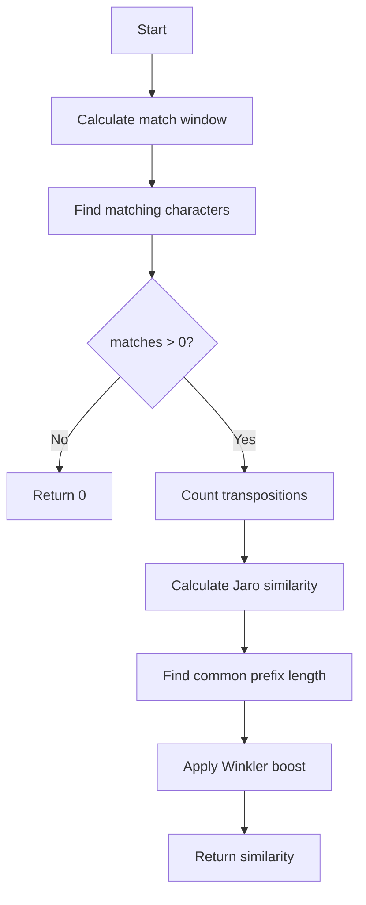

# Jaro-Winkler Similarity

## Overview
- **Category**: String Similarity / Fuzzy Matching
- **Complexity**: Time: O(mn) | Space: O(min(m,n))
- **Type**: Similarity metric (0 to 1)
- **Source File**: [strings/jaro_winkler.py](../../../strings/jaro_winkler.py)

## 1. Mathematical Foundation

### 1.1 Jaro Similarity

The Jaro similarity between strings $s_1$ and $s_2$ is:

$$
sim_j(s_1, s_2) = \begin{cases}
0 & \text{if } m = 0 \\
\frac{1}{3}\left(\frac{c}{|s_1|} + \frac{c}{|s_2|} + \frac{c - t}{c}\right) & \text{otherwise}
\end{cases}
$$

Where:
- $c$ = number of matching characters
- $t$ = number of transpositions / 2
- $|s_1|$, $|s_2|$ = lengths of the strings

### 1.2 Matching Characters

A character in $s_1$ matches a character in $s_2$ if:
- They are the same character
- Their positions are within the **match window**:

$$
w = \left\lfloor\frac{\max(|s_1|, |s_2|)}{2}\right\rfloor - 1
$$

### 1.3 Transpositions

A transposition occurs when matching characters appear in different orders in the two strings. Count pairs of matching characters that are not in sequence, then divide by 2.

### 1.4 Jaro-Winkler Similarity

Jaro-Winkler boosts the score for strings with common prefixes:

$$
sim_{jw}(s_1, s_2) = sim_j + \ell \cdot p \cdot (1 - sim_j)
$$

Where:
- $sim_j$ = Jaro similarity
- $\ell$ = length of common prefix (max 4)
- $p$ = scaling factor (standard value: 0.1)

### 1.5 Properties

- Range: $[0, 1]$ where 1 = identical
- **Not a metric**: doesn't satisfy triangle inequality
- Symmetric: $sim(s_1, s_2) = sim(s_2, s_1)$

## 2. Algorithm Description

### 2.1 Intuition

Jaro-Winkler is designed for short strings like names:
1. Find characters that appear in both strings within a window
2. Count transpositions (out-of-order matches)
3. Boost score if strings share a common prefix

### 2.2 Why Prefix Matters

For name matching, common prefixes are significant:
- "MARTHA" vs "MARHTA" should score high
- "SMITH" vs "SMYTH" should score high
- People often get endings wrong but beginnings right

## 3. Pseudocode

```
ALGORITHM Jaro-Similarity(s1, s2)
    INPUT: Strings s1 of length m, s2 of length n
    OUTPUT: Jaro similarity score in [0, 1]
    
    if m = 0 AND n = 0 then
        return 1.0
    if m = 0 OR n = 0 then
        return 0.0
    
    // Calculate match window
    matchWindow ← max(m, n) / 2 - 1
    
    // Track matched characters
    s1Matches ← array of m booleans, all false
    s2Matches ← array of n booleans, all false
    
    matches ← 0
    transpositions ← 0
    
    // Find matching characters
    for i ← 0 to m-1 do
        start ← max(0, i - matchWindow)
        end ← min(i + matchWindow + 1, n)
        
        for j ← start to end-1 do
            if s2Matches[j] OR s1[i] ≠ s2[j] then
                continue
            s1Matches[i] ← true
            s2Matches[j] ← true
            matches ← matches + 1
            break
    
    if matches = 0 then
        return 0.0
    
    // Count transpositions
    k ← 0
    for i ← 0 to m-1 do
        if NOT s1Matches[i] then
            continue
        while NOT s2Matches[k] do
            k ← k + 1
        if s1[i] ≠ s2[k] then
            transpositions ← transpositions + 1
        k ← k + 1
    
    // Calculate Jaro similarity
    return (matches/m + matches/n + (matches - transpositions/2)/matches) / 3

ALGORITHM Jaro-Winkler(s1, s2, p = 0.1)
    INPUT: Strings s1, s2, scaling factor p
    OUTPUT: Jaro-Winkler similarity score in [0, 1]
    
    jaroSim ← Jaro-Similarity(s1, s2)
    
    // Find common prefix length (max 4)
    prefixLen ← 0
    maxPrefix ← min(4, min(length(s1), length(s2)))
    
    for i ← 0 to maxPrefix-1 do
        if s1[i] = s2[i] then
            prefixLen ← prefixLen + 1
        else
            break
    
    // Apply Winkler modification
    return jaroSim + prefixLen * p * (1 - jaroSim)
```

## 4. Complexity Analysis

### 4.1 Time Complexity

| Operation | Complexity |
|-----------|------------|
| Find matches | O(mn) worst case |
| Count transpositions | O(m) |
| **Total** | O(mn) |

In practice, with small match window, closer to O(n).

### 4.2 Space Complexity
- Match arrays: O(m + n)
- Can be optimized to O(min(m,n))

## 5. Visual Representation

### 5.1 Example: "MARTHA" vs "MARHTA"

```
s1: M A R T H A
s2: M A R H T A

Match window = max(6,6)/2 - 1 = 2

Step 1: Find matches
Position 0: 'M' matches 'M' at position 0 ✓
Position 1: 'A' matches 'A' at position 1 ✓
Position 2: 'R' matches 'R' at position 2 ✓
Position 3: 'T' matches 'T' at position 4 ✓ (within window)
Position 4: 'H' matches 'H' at position 3 ✓ (within window)
Position 5: 'A' matches 'A' at position 5 ✓

matches = 6

Step 2: Count transpositions
s1 matches: M A R T H A
s2 matches: M A R H T A
                ^ ^ 
Transpositions = 2 (H,T are in wrong order)

Step 3: Calculate Jaro
sim_j = (6/6 + 6/6 + (6-1)/6) / 3
      = (1 + 1 + 0.833) / 3
      = 0.944

Step 4: Jaro-Winkler (prefix = "MAR", length 3)
sim_jw = 0.944 + 3 * 0.1 * (1 - 0.944)
       = 0.944 + 0.0168
       = 0.961
```

### 5.2 Match Window Visualization

```
s1: D W A Y N E
s2: D U A N E

Match window for "DWAYNE" (len=6):
window = 6/2 - 1 = 2

For position 0 ('D'), search s2[0:3]: D U A
For position 1 ('W'), search s2[0:4]: D U A N
For position 2 ('A'), search s2[0:5]: D U A N E
For position 3 ('Y'), search s2[1:5]: U A N E
For position 4 ('N'), search s2[2:5]: A N E
For position 5 ('E'), search s2[3:5]: N E
```



## 6. Implementation

```python
def jaro_similarity(s1: str, s2: str) -> float:
    """
    Calculate Jaro similarity between two strings.
    
    >>> round(jaro_similarity("MARTHA", "MARHTA"), 3)
    0.944
    >>> round(jaro_similarity("DWAYNE", "DUANE"), 3)
    0.822
    >>> jaro_similarity("", "")
    1.0
    """
    if not s1 and not s2:
        return 1.0
    if not s1 or not s2:
        return 0.0
    
    m, n = len(s1), len(s2)
    match_window = max(m, n) // 2 - 1
    
    s1_matches = [False] * m
    s2_matches = [False] * n
    
    matches = 0
    transpositions = 0
    
    # Find matches
    for i in range(m):
        start = max(0, i - match_window)
        end = min(i + match_window + 1, n)
        
        for j in range(start, end):
            if s2_matches[j] or s1[i] != s2[j]:
                continue
            s1_matches[i] = True
            s2_matches[j] = True
            matches += 1
            break
    
    if matches == 0:
        return 0.0
    
    # Count transpositions
    k = 0
    for i in range(m):
        if not s1_matches[i]:
            continue
        while not s2_matches[k]:
            k += 1
        if s1[i] != s2[k]:
            transpositions += 1
        k += 1
    
    return (matches/m + matches/n + 
            (matches - transpositions/2)/matches) / 3


def jaro_winkler(s1: str, s2: str, p: float = 0.1) -> float:
    """
    Calculate Jaro-Winkler similarity.
    
    >>> round(jaro_winkler("MARTHA", "MARHTA"), 3)
    0.961
    >>> round(jaro_winkler("DWAYNE", "DUANE"), 3)
    0.84
    >>> jaro_winkler("TRATE", "TRACE")  # Common prefix "TRA"
    0.9066666666666667
    """
    jaro_sim = jaro_similarity(s1, s2)
    
    # Find common prefix (max 4 characters)
    prefix_len = 0
    max_prefix = min(4, min(len(s1), len(s2)))
    
    for i in range(max_prefix):
        if s1[i] == s2[i]:
            prefix_len += 1
        else:
            break
    
    return jaro_sim + prefix_len * p * (1 - jaro_sim)
```

## 7. Comparison Table

| String Pair | Jaro | Jaro-Winkler | Levenshtein (normalized) |
|-------------|------|--------------|-------------------------|
| MARTHA - MARHTA | 0.944 | 0.961 | 0.667 |
| DWAYNE - DUANE | 0.822 | 0.840 | 0.667 |
| DIXON - DICKSONX | 0.767 | 0.814 | 0.500 |
| JONES - JOHNSON | 0.790 | 0.832 | 0.571 |

Jaro-Winkler typically performs better on names and short strings.

## 8. Real-World Software Engineering Applications

### 8.1 Industry Use Cases

1. **Record Linkage / Entity Resolution**
   - Match customer records across databases
   - Detect duplicate entries
   - Census data matching

2. **Name Matching**
   - Identity verification
   - KYC (Know Your Customer) systems
   - Immigration databases

3. **Search Engines**
   - "Did you mean?" suggestions
   - Fuzzy autocomplete
   - Typo tolerance

4. **Data Quality**
   - Address standardization
   - Company name matching
   - Product catalog deduplication

### 8.2 Production Example: Customer Deduplication

```python
from dataclasses import dataclass
from typing import Optional

@dataclass
class Customer:
    id: int
    first_name: str
    last_name: str
    email: Optional[str] = None


class CustomerDeduplicator:
    """
    Identify potential duplicate customer records using Jaro-Winkler.
    """
    
    def __init__(self, threshold: float = 0.85):
        self.threshold = threshold
    
    def _jaro_winkler(self, s1: str, s2: str) -> float:
        """Calculate Jaro-Winkler similarity."""
        if not s1 and not s2:
            return 1.0
        if not s1 or not s2:
            return 0.0
        
        # Normalize: lowercase, strip
        s1 = s1.lower().strip()
        s2 = s2.lower().strip()
        
        m, n = len(s1), len(s2)
        match_window = max(m, n) // 2 - 1
        
        s1_matches = [False] * m
        s2_matches = [False] * n
        matches = 0
        
        for i in range(m):
            start = max(0, i - match_window)
            end = min(i + match_window + 1, n)
            for j in range(start, end):
                if s2_matches[j] or s1[i] != s2[j]:
                    continue
                s1_matches[i] = True
                s2_matches[j] = True
                matches += 1
                break
        
        if matches == 0:
            return 0.0
        
        transpositions = 0
        k = 0
        for i in range(m):
            if not s1_matches[i]:
                continue
            while not s2_matches[k]:
                k += 1
            if s1[i] != s2[k]:
                transpositions += 1
            k += 1
        
        jaro = (matches/m + matches/n + 
                (matches - transpositions/2)/matches) / 3
        
        prefix_len = 0
        for i in range(min(4, m, n)):
            if s1[i] == s2[i]:
                prefix_len += 1
            else:
                break
        
        return jaro + prefix_len * 0.1 * (1 - jaro)
    
    def similarity_score(self, c1: Customer, c2: Customer) -> float:
        """
        Calculate overall similarity between two customers.
        Weighted combination of name and email similarity.
        """
        first_sim = self._jaro_winkler(c1.first_name, c2.first_name)
        last_sim = self._jaro_winkler(c1.last_name, c2.last_name)
        
        # Name similarity (weighted average)
        name_sim = 0.4 * first_sim + 0.6 * last_sim
        
        # Email similarity (if both exist)
        if c1.email and c2.email:
            email_sim = self._jaro_winkler(c1.email, c2.email)
            return 0.6 * name_sim + 0.4 * email_sim
        
        return name_sim
    
    def find_duplicates(self, customers: list[Customer]) -> list[tuple[Customer, Customer, float]]:
        """
        Find potential duplicate customer pairs.
        Returns list of (customer1, customer2, similarity_score).
        """
        duplicates = []
        n = len(customers)
        
        for i in range(n):
            for j in range(i + 1, n):
                score = self.similarity_score(customers[i], customers[j])
                if score >= self.threshold:
                    duplicates.append((customers[i], customers[j], score))
        
        return sorted(duplicates, key=lambda x: -x[2])


# Usage
customers = [
    Customer(1, "John", "Smith", "jsmith@email.com"),
    Customer(2, "Jon", "Smyth", "jsmith@email.com"),
    Customer(3, "Jane", "Doe", "jane.doe@work.com"),
    Customer(4, "John", "Doe", "jdoe@email.com"),
]

deduplicator = CustomerDeduplicator(threshold=0.80)
duplicates = deduplicator.find_duplicates(customers)

for c1, c2, score in duplicates:
    print(f"Potential duplicate: {c1.first_name} {c1.last_name} <-> "
          f"{c2.first_name} {c2.last_name} (score: {score:.3f})")
```

### 8.3 US Census Bureau Usage

The US Census Bureau uses Jaro-Winkler for:
- Matching census responses
- Linking administrative records
- Historical record linkage

## 9. Comparison with Other Metrics

| Metric | Best For | Limitations |
|--------|----------|-------------|
| **Jaro-Winkler** | Short strings, names | Not a true metric |
| Levenshtein | General strings | Doesn't handle transpositions well |
| Soundex | Phonetic matching | English-specific |
| Cosine | Documents | Bag-of-words only |

## 10. Parameters and Tuning

| Parameter | Typical Value | Effect |
|-----------|--------------|--------|
| p (scaling factor) | 0.1 | Higher = more prefix weight |
| Max prefix length | 4 | Standard in Winkler's paper |
| Threshold | 0.85 | Depends on use case |

## 11. Edge Cases

| Case | Jaro | Jaro-Winkler |
|------|------|--------------|
| Both empty | 1.0 | 1.0 |
| One empty | 0.0 | 0.0 |
| Identical | 1.0 | 1.0 |
| No matches | 0.0 | 0.0 |
| All transposed | Variable | Variable |

## 12. References

- Jaro, M.A. (1989). "Advances in Record-Linkage Methodology as Applied to Matching the 1985 Census of Tampa, Florida"
- Winkler, W.E. (1990). "String Comparator Metrics and Enhanced Decision Rules in the Fellegi-Sunter Model of Record Linkage"
- [Wikipedia: Jaro-Winkler Distance](https://en.wikipedia.org/wiki/Jaro%E2%80%93Winkler_distance)
