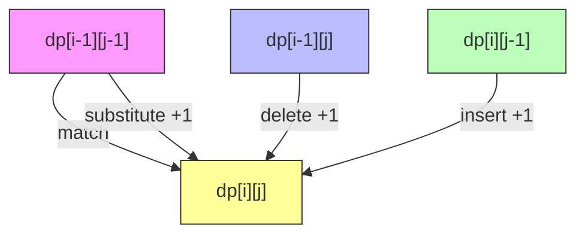

# Levenshtein Distance (Edit Distance)

## Overview
- **Category**: String Similarity / Dynamic Programming
- **Complexity**: Time: O(mn) | Space: O(min(m,n)) optimized
- **Type**: String metric
- **Source File**: [strings/levenshtein_distance.py](../../../strings/levenshtein_distance.py)

## 1. Mathematical Foundation

### 1.1 Problem Definition

The Levenshtein distance $d(s_1, s_2)$ between two strings is the minimum number of single-character edits required to transform $s_1$ into $s_2$.

**Allowed operations:**
- **Insert**: Add a character
- **Delete**: Remove a character  
- **Substitute**: Replace a character

### 1.2 Formal Definition

$$
d(s_1, s_2) = \min\{k : s_1 \xrightarrow{e_1} \cdots \xrightarrow{e_k} s_2\}
$$

Where each $e_i$ is an edit operation.

### 1.3 Recurrence Relation

Let $dp[i][j]$ = edit distance between $s_1[0..i-1]$ and $s_2[0..j-1]$:

$$
dp[i][j] = \begin{cases}
i & \text{if } j = 0 \\
j & \text{if } i = 0 \\
dp[i-1][j-1] & \text{if } s_1[i-1] = s_2[j-1] \\
1 + \min\begin{cases}
dp[i-1][j] & \text{(delete)} \\
dp[i][j-1] & \text{(insert)} \\
dp[i-1][j-1] & \text{(substitute)}
\end{cases} & \text{otherwise}
\end{cases}
$$

### 1.4 Properties

1. **Non-negativity**: $d(s_1, s_2) \geq 0$
2. **Identity**: $d(s_1, s_2) = 0 \Leftrightarrow s_1 = s_2$
3. **Symmetry**: $d(s_1, s_2) = d(s_2, s_1)$
4. **Triangle inequality**: $d(s_1, s_3) \leq d(s_1, s_2) + d(s_2, s_3)$

These properties make Levenshtein distance a proper **metric**.

## 2. Algorithm Description

### 2.1 Intuition

Build a matrix where each cell represents the cost of transforming a prefix of one string into a prefix of another. The final answer is in the bottom-right cell.

### 2.2 Decision at Each Step

At position $(i, j)$:
- If characters match: copy diagonal value (no cost)
- If characters differ: take minimum of three options plus 1

## 3. Pseudocode

```
ALGORITHM Levenshtein-Distance(s1, s2)
    INPUT: Strings s1 of length m, s2 of length n
    OUTPUT: Minimum edit distance
    
    // Create DP table
    dp ← (m+1) × (n+1) matrix
    
    // Base cases: transforming to/from empty string
    for i ← 0 to m do
        dp[i][0] ← i  // delete all characters
    for j ← 0 to n do
        dp[0][j] ← j  // insert all characters
    
    // Fill DP table
    for i ← 1 to m do
        for j ← 1 to n do
            if s1[i-1] = s2[j-1] then
                dp[i][j] ← dp[i-1][j-1]  // characters match
            else
                dp[i][j] ← 1 + min(
                    dp[i-1][j],    // delete from s1
                    dp[i][j-1],    // insert into s1
                    dp[i-1][j-1]   // substitute
                )
    
    return dp[m][n]
```

### Space-Optimized Version

```
ALGORITHM Levenshtein-Space-Optimized(s1, s2)
    INPUT: Strings s1 of length m, s2 of length n
    OUTPUT: Minimum edit distance
    
    // Ensure s2 is shorter for space efficiency
    if m < n then
        swap(s1, s2)
        swap(m, n)
    
    // Use two rows instead of full matrix
    prev ← array of size n+1
    curr ← array of size n+1
    
    // Initialize first row
    for j ← 0 to n do
        prev[j] ← j
    
    for i ← 1 to m do
        curr[0] ← i
        for j ← 1 to n do
            if s1[i-1] = s2[j-1] then
                curr[j] ← prev[j-1]
            else
                curr[j] ← 1 + min(prev[j], curr[j-1], prev[j-1])
        swap(prev, curr)
    
    return prev[n]
```

## 4. Complexity Analysis

### 4.1 Time Complexity

| Approach | Complexity |
|----------|------------|
| Naive recursive | O(3^max(m,n)) |
| DP with memoization | O(mn) |
| DP table | O(mn) |
| Space-optimized | O(mn) |

### 4.2 Space Complexity

| Approach | Complexity |
|----------|------------|
| Full DP table | O(mn) |
| Two rows | O(min(m,n)) |
| Single row + variable | O(min(m,n)) |

## 5. Visual Representation

### 5.1 DP Table Example: "kitten" → "sitting"

```
        ""  s  i  t  t  i  n  g
    ""   0  1  2  3  4  5  6  7
    k    1  1  2  3  4  5  6  7
    i    2  2  1  2  3  4  5  6
    t    3  3  2  1  2  3  4  5
    t    4  4  3  2  1  2  3  4
    e    5  5  4  3  2  2  3  4
    n    6  6  5  4  3  3  2  3

Edit distance: 3
Operations: 
1. k → s (substitute)
2. e → i (substitute)  
3. → g (insert at end)
```

### 5.2 Backtracking Path

```
     s  i  t  t  i  n  g
  k [S] .  .  .  .  .  .
  i  . [M] .  .  .  .  .
  t  .  . [M] .  .  .  .
  t  .  .  . [M] .  .  .
  e  .  .  .  . [S] .  .
  n  .  .  .  .  . [M] .
     .  .  .  .  .  . [I]

S = Substitute, M = Match, I = Insert, D = Delete
```

### 5.3 State Transition Diagram



## 6. Variations

### 6.1 Damerau-Levenshtein Distance

Adds **transposition** (swap adjacent characters) as a fourth operation:

$$
dp[i][j] = \min\begin{cases}
dp[i-1][j] + 1 \\
dp[i][j-1] + 1 \\
dp[i-1][j-1] + [s_1[i] \neq s_2[j]] \\
dp[i-2][j-2] + 1 & \text{if } s_1[i] = s_2[j-1] \land s_1[i-1] = s_2[j]
\end{cases}
$$

### 6.2 Weighted Edit Distance

Different costs for different operations:

```python
def weighted_edit_distance(s1: str, s2: str, 
                           insert_cost: float = 1,
                           delete_cost: float = 1,
                           substitute_cost: float = 1) -> float:
    """Edit distance with customizable operation costs."""
    m, n = len(s1), len(s2)
    dp = [[0] * (n + 1) for _ in range(m + 1)]
    
    for i in range(m + 1):
        dp[i][0] = i * delete_cost
    for j in range(n + 1):
        dp[0][j] = j * insert_cost
    
    for i in range(1, m + 1):
        for j in range(1, n + 1):
            if s1[i-1] == s2[j-1]:
                dp[i][j] = dp[i-1][j-1]
            else:
                dp[i][j] = min(
                    dp[i-1][j] + delete_cost,
                    dp[i][j-1] + insert_cost,
                    dp[i-1][j-1] + substitute_cost
                )
    
    return dp[m][n]
```

### 6.3 Normalized Edit Distance

$$
d_{norm}(s_1, s_2) = \frac{d(s_1, s_2)}{\max(|s_1|, |s_2|)}
$$

Range: $[0, 1]$ where 0 = identical, 1 = completely different.

## 7. Extracting Edit Operations

```python
def edit_operations(s1: str, s2: str) -> list[tuple]:
    """Return sequence of edit operations."""
    m, n = len(s1), len(s2)
    dp = [[0] * (n + 1) for _ in range(m + 1)]
    
    for i in range(m + 1):
        dp[i][0] = i
    for j in range(n + 1):
        dp[0][j] = j
    
    for i in range(1, m + 1):
        for j in range(1, n + 1):
            if s1[i-1] == s2[j-1]:
                dp[i][j] = dp[i-1][j-1]
            else:
                dp[i][j] = 1 + min(dp[i-1][j], dp[i][j-1], dp[i-1][j-1])
    
    # Backtrack to find operations
    operations = []
    i, j = m, n
    
    while i > 0 or j > 0:
        if i > 0 and j > 0 and s1[i-1] == s2[j-1]:
            i, j = i - 1, j - 1
        elif i > 0 and j > 0 and dp[i][j] == dp[i-1][j-1] + 1:
            operations.append(('substitute', i-1, s1[i-1], s2[j-1]))
            i, j = i - 1, j - 1
        elif j > 0 and dp[i][j] == dp[i][j-1] + 1:
            operations.append(('insert', i, s2[j-1]))
            j -= 1
        else:
            operations.append(('delete', i-1, s1[i-1]))
            i -= 1
    
    return operations[::-1]
```

## 8. Real-World Software Engineering Applications

### 8.1 Industry Use Cases

1. **Spell Checkers**
   - Suggest corrections for misspelled words
   - Rank suggestions by edit distance
   - Auto-correct features

2. **DNA Sequence Analysis**
   - Measure genetic similarity
   - Detect mutations
   - Sequence alignment

3. **Plagiarism Detection**
   - Compare document similarity
   - Detect paraphrasing
   - Code clone detection

4. **Fuzzy Search**
   - Search with typo tolerance
   - Database record matching
   - Customer name matching

5. **Version Control (diff)**
   - Show minimal changes between versions
   - Merge conflict resolution

### 8.2 Production Example: Fuzzy Search

```python
class FuzzySearchEngine:
    """Search engine with typo tolerance using Levenshtein distance."""
    
    def __init__(self, dictionary: list[str]):
        self.dictionary = dictionary
        self.max_distance = 2
    
    def levenshtein(self, s1: str, s2: str) -> int:
        """Space-optimized Levenshtein distance."""
        if len(s1) < len(s2):
            s1, s2 = s2, s1
        
        m, n = len(s1), len(s2)
        prev = list(range(n + 1))
        
        for i in range(1, m + 1):
            curr = [i] + [0] * n
            for j in range(1, n + 1):
                if s1[i-1] == s2[j-1]:
                    curr[j] = prev[j-1]
                else:
                    curr[j] = 1 + min(prev[j], curr[j-1], prev[j-1])
            prev = curr
        
        return prev[n]
    
    def search(self, query: str, max_results: int = 5) -> list[tuple[str, int]]:
        """
        Search for words similar to query.
        Returns list of (word, distance) tuples.
        """
        results = []
        query = query.lower()
        
        for word in self.dictionary:
            # Early termination optimization
            if abs(len(word) - len(query)) > self.max_distance:
                continue
            
            distance = self.levenshtein(query, word.lower())
            if distance <= self.max_distance:
                results.append((word, distance))
        
        # Sort by distance, then alphabetically
        results.sort(key=lambda x: (x[1], x[0]))
        return results[:max_results]
    
    def auto_correct(self, word: str) -> str:
        """Return best correction or original word."""
        results = self.search(word, max_results=1)
        if results and results[0][1] < len(word) // 2:
            return results[0][0]
        return word


# Usage example
dictionary = ["apple", "application", "apply", "banana", "band", "bandana"]
engine = FuzzySearchEngine(dictionary)

print(engine.search("aple"))      # [('apple', 1), ('apply', 2)]
print(engine.search("banan"))     # [('banana', 1), ('band', 2), ('bandana', 2)]
print(engine.auto_correct("appl")) # 'apple'
```

### 8.3 Optimizations for Production

```python
def levenshtein_early_exit(s1: str, s2: str, max_dist: int) -> int:
    """
    Optimized version that exits early if distance exceeds max_dist.
    Returns actual distance or max_dist+1 if exceeded.
    """
    m, n = len(s1), len(s2)
    
    # Quick check: length difference already exceeds max
    if abs(m - n) > max_dist:
        return max_dist + 1
    
    # Ensure s1 is shorter for memory efficiency
    if m > n:
        s1, s2 = s2, s1
        m, n = n, m
    
    prev = list(range(n + 1))
    
    for i in range(1, m + 1):
        curr = [i] + [0] * n
        min_in_row = i
        
        for j in range(1, n + 1):
            if s1[i-1] == s2[j-1]:
                curr[j] = prev[j-1]
            else:
                curr[j] = 1 + min(prev[j], curr[j-1], prev[j-1])
            
            min_in_row = min(min_in_row, curr[j])
        
        # Early exit if minimum in row exceeds threshold
        if min_in_row > max_dist:
            return max_dist + 1
        
        prev = curr
    
    return prev[n]
```

## 9. Comparison with Related Metrics

| Metric | Operations | Use Case |
|--------|------------|----------|
| **Levenshtein** | Insert, Delete, Substitute | General purpose |
| Damerau-Levenshtein | + Transposition | Typo correction |
| Hamming | Substitute only | Fixed-length strings |
| Jaro-Winkler | Complex formula | Short strings, names |
| LCS-based | Insert, Delete only | Diff computation |

## 10. Edge Cases

| Edge Case | Distance | Notes |
|-----------|----------|-------|
| Both empty | 0 | Base case |
| One empty | len(other) | All inserts/deletes |
| Identical | 0 | No operations |
| Completely different | max(m, n) | All substitutes + inserts/deletes |
| Single char diff | 1 | One substitute |
| Prefix/suffix | len difference | Just inserts/deletes |

## 11. References

- Levenshtein, V.I. (1966). "Binary codes capable of correcting deletions, insertions, and reversals"
- Wagner, R.A., Fischer, M.J. (1974). "The String-to-String Correction Problem"
- [Wikipedia: Levenshtein Distance](https://en.wikipedia.org/wiki/Levenshtein_distance)
