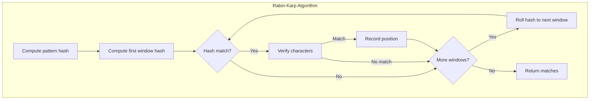

# Rabin-Karp Algorithm

## Overview

| Property | Value |
|----------|-------|
| **Category** | String Pattern Matching |
| **Preprocessing** | O(m) |
| **Average Case** | O(n + m) |
| **Worst Case** | O(nm) |
| **Space** | O(1) |
| **Source** | [rabin_karp.py](../../../strings/rabin_karp.py) |

## 1. Mathematical Foundation

### 1.1 Core Idea

Rabin-Karp uses **rolling hash** to efficiently compute hash values for substrings. Instead of comparing characters, it compares hash values first.

### 1.2 Polynomial Rolling Hash

For a string $S = s_0 s_1 ... s_{m-1}$, the hash is computed as:

$$H(S) = \left(\sum_{i=0}^{m-1} s_i \cdot d^{m-1-i}\right) \mod q$$

Where:
- $d$ = base (typically size of alphabet or prime)
- $q$ = large prime modulus
- $s_i$ = numeric value of character at position $i$

### 1.3 Rolling Hash Update

When sliding the window from position $i$ to $i+1$:

$$H(S[i+1..i+m]) = \left(d \cdot (H(S[i..i+m-1]) - s_i \cdot d^{m-1}) + s_{i+m}\right) \mod q$$

This allows O(1) hash computation for each position.

### 1.4 Hash Collision

When $H(T[i..i+m-1]) = H(P)$:
- **Spurious hit**: Hash matches but strings differ
- **True match**: Both hash and strings match

Must verify matches to avoid false positives.

### 1.5 Modular Arithmetic Properties

$$
\begin{align}
(a + b) \mod q &= ((a \mod q) + (b \mod q)) \mod q \\
(a \cdot b) \mod q &= ((a \mod q) \cdot (b \mod q)) \mod q \\
(a - b) \mod q &= ((a \mod q) - (b \mod q) + q) \mod q
\end{align}
$$

## 2. Algorithm Pseudocode

### 2.1 Basic Rabin-Karp

```
ALGORITHM RabinKarp(text, pattern)
    INPUT: Text T of length n, Pattern P of length m
    OUTPUT: List of starting positions where P occurs in T
    
    CONSTANTS:
        d ← 256        // Number of characters in alphabet
        q ← 101        // A prime number
    
    1. n ← length(T)
    2. m ← length(P)
    3. h ← d^(m-1) mod q    // Precompute for rolling
    4. p_hash ← 0           // Hash of pattern
    5. t_hash ← 0           // Hash of current window
    6. matches ← []
    
    // Compute initial hashes
    7. for i ← 0 to m - 1 do
           p_hash ← (d * p_hash + P[i]) mod q
           t_hash ← (d * t_hash + T[i]) mod q
       end for
    
    // Slide pattern over text
    8. for i ← 0 to n - m do
           // Check if hashes match
           if p_hash = t_hash then
               // Verify character by character (avoid spurious hits)
               if T[i..i+m-1] = P[0..m-1] then
                   matches.append(i)
               end if
           end if
           
           // Compute next hash (rolling)
           if i < n - m then
               t_hash ← (d * (t_hash - T[i] * h) + T[i + m]) mod q
               
               // Handle negative values
               if t_hash < 0 then
                   t_hash ← t_hash + q
               end if
           end if
       end for
    
    9. return matches
```

### 2.2 Multiple Pattern Search

```
ALGORITHM RabinKarpMultiple(text, patterns)
    INPUT: Text T, Set of patterns P₁, P₂, ..., Pₖ
    OUTPUT: Map of pattern to list of positions
    
    1. results ← empty map
    2. pattern_hashes ← empty map
    
    // Group patterns by length
    3. by_length ← group patterns by length
    
    4. for each length m in by_length do
           // Compute pattern hashes
           for each pattern P of length m do
               h ← ComputeHash(P)
               if h not in pattern_hashes then
                   pattern_hashes[h] ← []
               end if
               pattern_hashes[h].append(P)
           end for
           
           // Search for all patterns of this length
           h ← d^(m-1) mod q
           t_hash ← ComputeHash(T[0..m-1])
           
           for i ← 0 to n - m do
               if t_hash in pattern_hashes then
                   for each P in pattern_hashes[t_hash] do
                       if T[i..i+m-1] = P then
                           results[P].append(i)
                       end if
                   end for
               end if
               
               // Roll hash
               if i < n - m then
                   t_hash ← Roll(t_hash, T[i], T[i+m], h)
               end if
           end for
       end for
    
    5. return results
```

## 3. Complexity Analysis

### 3.1 Time Complexity

**Preprocessing:**
- Compute initial hash: O(m)
- Precompute $h = d^{m-1}$: O(m) or O(log m) with fast exponentiation

**Search:**
- Rolling hash updates: O(n) total
- Hash comparisons: O(n)
- String verification (worst case): O(nm) if many spurious hits
- **Average case**: O(n + m) with good hash function

### 3.2 Space Complexity

- Only constant extra space needed: O(1)
- Multiple pattern variant: O(k) for k patterns

### 3.3 Expected Number of Spurious Hits

With prime modulus $q$, expected spurious hits:

$$E[\text{spurious hits}] = \frac{n - m + 1}{q}$$

For $q \gg n$, spurious hits are rare.

## 4. Visual Representation

```
Text:    A B C D A B C D A B C
Pattern: A B C D
Hash base d=10, q=13

Initial:
Pattern hash: (A×10³ + B×10² + C×10 + D) mod 13
            = (0×1000 + 1×100 + 2×10 + 3) mod 13
            = 123 mod 13 = 6

Window 0: "ABCD" → hash = 6
          Match! Verify: ABCD = ABCD ✓
          Found at position 0

Window 1: "BCDA"
          Roll: (10 × (6 - 0×1000) + 0) mod 13
              = (60 + 0) mod 13 = 8
          6 ≠ 8, no match

Window 2: "CDAB"
          Roll: (10 × (8 - 1×1000 + 13×...)) mod 13 = ...
          
...

Window 4: "ABCD" → hash = 6
          Match! Verify: ABCD = ABCD ✓
          Found at position 4
```



## 5. Real-World Software Engineering Applications

### 5.1 Industry Use Cases

1. **Plagiarism Detection**
   - Document fingerprinting
   - Code similarity detection
   - Academic integrity tools

2. **Bioinformatics**
   - DNA/RNA sequence searching
   - Multiple motif finding
   - Genome analysis

3. **Network Security**
   - Content-based filtering
   - Virus signature detection
   - Network intrusion detection

4. **Text Editors**
   - Find all occurrences
   - Global search and replace
   - Multi-file search

5. **Data Deduplication**
   - File chunking (rsync)
   - Content-defined chunking
   - Backup systems

### 5.2 Implementation Examples

```python
from typing import List, Set, Dict


def rabin_karp_search(text: str, pattern: str) -> List[int]:
    """
    Find all occurrences of pattern in text using Rabin-Karp algorithm.
    
    Time: O(n + m) average, O(nm) worst case
    Space: O(1)
    
    >>> rabin_karp_search("AABAACAADAABAABA", "AABA")
    [0, 9, 12]
    >>> rabin_karp_search("ABCABC", "ABC")
    [0, 3]
    >>> rabin_karp_search("HELLO", "XYZ")
    []
    """
    if not pattern or not text or len(pattern) > len(text):
        return []
    
    n, m = len(text), len(pattern)
    d = 256  # Number of characters in alphabet
    q = 101  # A prime number
    
    # Precompute d^(m-1) mod q
    h = pow(d, m - 1, q)
    
    # Compute initial hashes
    p_hash = 0
    t_hash = 0
    for i in range(m):
        p_hash = (d * p_hash + ord(pattern[i])) % q
        t_hash = (d * t_hash + ord(text[i])) % q
    
    matches = []
    
    # Slide pattern over text
    for i in range(n - m + 1):
        # Check hash match
        if p_hash == t_hash:
            # Verify character by character
            if text[i:i + m] == pattern:
                matches.append(i)
        
        # Compute next hash
        if i < n - m:
            t_hash = (d * (t_hash - ord(text[i]) * h) + ord(text[i + m])) % q
            if t_hash < 0:
                t_hash += q
    
    return matches


def rabin_karp_multiple(text: str, patterns: List[str]) -> Dict[str, List[int]]:
    """
    Search for multiple patterns in text.
    Efficient when patterns have similar lengths.
    
    >>> result = rabin_karp_multiple("AABABAAB", ["AB", "BA"])
    >>> sorted(result.items())
    [('AB', [1, 5]), ('BA', [2, 4])]
    """
    if not text or not patterns:
        return {}
    
    results: Dict[str, List[int]] = {p: [] for p in patterns}
    
    # Group patterns by length
    by_length: Dict[int, List[str]] = {}
    for pattern in patterns:
        length = len(pattern)
        if length not in by_length:
            by_length[length] = []
        by_length[length].append(pattern)
    
    n = len(text)
    d = 256
    q = 101
    
    # Process each length group
    for m, pattern_group in by_length.items():
        if m > n:
            continue
        
        # Compute pattern hashes
        pattern_hashes: Dict[int, List[str]] = {}
        for pattern in pattern_group:
            p_hash = 0
            for c in pattern:
                p_hash = (d * p_hash + ord(c)) % q
            if p_hash not in pattern_hashes:
                pattern_hashes[p_hash] = []
            pattern_hashes[p_hash].append(pattern)
        
        # Precompute h = d^(m-1) mod q
        h = pow(d, m - 1, q)
        
        # Compute initial text hash
        t_hash = 0
        for i in range(m):
            t_hash = (d * t_hash + ord(text[i])) % q
        
        # Search
        for i in range(n - m + 1):
            if t_hash in pattern_hashes:
                substring = text[i:i + m]
                for pattern in pattern_hashes[t_hash]:
                    if substring == pattern:
                        results[pattern].append(i)
            
            # Roll hash
            if i < n - m:
                t_hash = (d * (t_hash - ord(text[i]) * h) + ord(text[i + m])) % q
                if t_hash < 0:
                    t_hash += q
    
    return results


class RollingHash:
    """
    Rolling hash implementation for string fingerprinting.
    
    >>> rh = RollingHash("hello", 3)
    >>> h1 = rh.current_hash
    >>> rh.roll()
    >>> h2 = rh.current_hash
    >>> rh.text_window()
    'ell'
    """
    
    def __init__(self, text: str, window_size: int, 
                 base: int = 256, mod: int = 10**9 + 7):
        self.text = text
        self.window_size = window_size
        self.base = base
        self.mod = mod
        self.start = 0
        
        # Precompute base^(window_size-1)
        self.h = pow(base, window_size - 1, mod)
        
        # Compute initial hash
        self.current_hash = 0
        for i in range(window_size):
            self.current_hash = (self.base * self.current_hash + 
                                 ord(text[i])) % self.mod
    
    def roll(self) -> bool:
        """Roll window one position right. Returns False if at end."""
        if self.start + self.window_size >= len(self.text):
            return False
        
        # Remove leftmost character
        old_char = ord(self.text[self.start])
        # Add new rightmost character
        new_char = ord(self.text[self.start + self.window_size])
        
        self.current_hash = ((self.base * (self.current_hash - old_char * self.h) +
                              new_char) % self.mod + self.mod) % self.mod
        self.start += 1
        return True
    
    def text_window(self) -> str:
        """Get current window substring."""
        return self.text[self.start:self.start + self.window_size]
    
    @staticmethod
    def compute_hash(s: str, base: int = 256, mod: int = 10**9 + 7) -> int:
        """Compute hash for a string."""
        h = 0
        for c in s:
            h = (base * h + ord(c)) % mod
        return h


def find_duplicate_substrings(text: str, length: int) -> List[str]:
    """
    Find all duplicate substrings of given length using rolling hash.
    
    >>> sorted(find_duplicate_substrings("ABCABC", 3))
    ['ABC']
    >>> sorted(find_duplicate_substrings("AAAA", 2))
    ['AA']
    """
    if length > len(text):
        return []
    
    seen: Dict[int, List[int]] = {}  # hash -> list of start positions
    duplicates: Set[str] = set()
    
    rh = RollingHash(text, length)
    
    # Check first window
    h = rh.current_hash
    seen[h] = [0]
    
    # Roll through text
    pos = 1
    while rh.roll():
        h = rh.current_hash
        
        if h in seen:
            # Verify (handle collisions)
            current = rh.text_window()
            for prev_pos in seen[h]:
                if text[prev_pos:prev_pos + length] == current:
                    duplicates.add(current)
                    break
            seen[h].append(pos)
        else:
            seen[h] = [pos]
        
        pos += 1
    
    return list(duplicates)


def plagiarism_check(doc1: str, doc2: str, chunk_size: int = 10) -> float:
    """
    Simple plagiarism detection using Rabin-Karp fingerprinting.
    Returns similarity ratio.
    
    >>> plagiarism_check("Hello World ABC", "Hello World XYZ", 5) > 0.5
    True
    """
    if len(doc1) < chunk_size or len(doc2) < chunk_size:
        return 0.0
    
    # Get all chunk hashes from doc1
    doc1_hashes: Set[int] = set()
    rh1 = RollingHash(doc1, chunk_size)
    doc1_hashes.add(rh1.current_hash)
    while rh1.roll():
        doc1_hashes.add(rh1.current_hash)
    
    # Count matching chunks in doc2
    matches = 0
    total = 0
    
    rh2 = RollingHash(doc2, chunk_size)
    if rh2.current_hash in doc1_hashes:
        matches += 1
    total += 1
    
    while rh2.roll():
        if rh2.current_hash in doc1_hashes:
            matches += 1
        total += 1
    
    return matches / total if total > 0 else 0.0


def longest_common_substring_hash(s1: str, s2: str) -> str:
    """
    Find longest common substring using binary search + rolling hash.
    
    >>> longest_common_substring_hash("ABCDEF", "XBCDEY")
    'BCDE'
    >>> longest_common_substring_hash("ABC", "XYZ")
    ''
    """
    def has_common_substring(length: int) -> str:
        """Check if there's a common substring of given length."""
        if length == 0:
            return ""
        
        # Get all hashes from s1
        hashes: Dict[int, int] = {}  # hash -> start position
        rh1 = RollingHash(s1, length)
        hashes[rh1.current_hash] = 0
        pos = 1
        while rh1.roll():
            hashes[rh1.current_hash] = pos
            pos += 1
        
        # Check s2
        rh2 = RollingHash(s2, length)
        if rh2.current_hash in hashes:
            # Verify
            start1 = hashes[rh2.current_hash]
            if s1[start1:start1 + length] == rh2.text_window():
                return rh2.text_window()
        
        while rh2.roll():
            if rh2.current_hash in hashes:
                start1 = hashes[rh2.current_hash]
                if s1[start1:start1 + length] == rh2.text_window():
                    return rh2.text_window()
        
        return ""
    
    # Binary search for longest length
    lo, hi = 0, min(len(s1), len(s2))
    result = ""
    
    while lo <= hi:
        mid = (lo + hi) // 2
        found = has_common_substring(mid)
        if found:
            result = found
            lo = mid + 1
        else:
            hi = mid - 1
    
    return result
```

## 6. Hash Function Considerations

### 6.1 Choosing Base and Modulus

| Parameter | Recommendation |
|-----------|----------------|
| Base $d$ | Prime ≥ alphabet size (e.g., 31, 37, 256) |
| Modulus $q$ | Large prime (e.g., 10^9 + 7, 10^9 + 9) |

### 6.2 Double Hashing

To reduce collision probability, use two independent hash functions:

```python
def double_hash(s: str) -> tuple[int, int]:
    """Use two hash functions for better collision resistance."""
    h1 = h2 = 0
    for c in s:
        h1 = (31 * h1 + ord(c)) % (10**9 + 7)
        h2 = (37 * h2 + ord(c)) % (10**9 + 9)
    return (h1, h2)
```

## 7. Comparison with Other Algorithms

| Aspect | Rabin-Karp | KMP | Boyer-Moore |
|--------|------------|-----|-------------|
| Average | O(n+m) | O(n+m) | O(n/m) |
| Worst | O(nm) | O(n+m) | O(nm) |
| Space | O(1) | O(m) | O(m+σ) |
| Multiple patterns | Easy | Hard | Hard |
| Best for | Multi-pattern | Single pattern | Long patterns |

## 8. References

- Rabin, M. O., Karp, R. M. (1987). "Efficient Randomized Pattern-Matching Algorithms"
- Cormen, T. H. et al. "Introduction to Algorithms" - Chapter 32
- [Wikipedia: Rabin–Karp algorithm](https://en.wikipedia.org/wiki/Rabin%E2%80%93Karp_algorithm)
