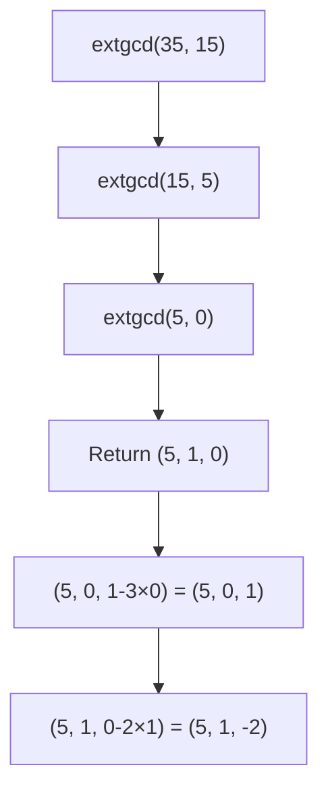

# Extended Euclidean Algorithm

## Overview
- **Category**: Number Theory
- **Complexity**: Time: O(log(min(a,b))) | Space: O(log(min(a,b)))
- **Type**: Mathematical algorithm
- **Source File**: [maths/extended_euclidean_algorithm.py](../../../maths/extended_euclidean_algorithm.py)

## 1. Mathematical Foundation

### 1.1 Bézout's Identity

For any integers $a$ and $b$ (not both zero), there exist integers $x$ and $y$ such that:

$$
ax + by = \gcd(a, b)
$$

The Extended Euclidean Algorithm finds both $\gcd(a, b)$ and the coefficients $x$ and $y$.

### 1.2 Linear Diophantine Equations

A linear Diophantine equation $ax + by = c$ has integer solutions if and only if $\gcd(a, b) | c$.

If $(x_0, y_0)$ is a particular solution, the general solution is:
$$
x = x_0 + \frac{b}{\gcd(a,b)} \cdot t, \quad y = y_0 - \frac{a}{\gcd(a,b)} \cdot t
$$

### 1.3 Algorithm Derivation

Starting from the standard Euclidean algorithm:
$$
\begin{aligned}
a &= q_0 \cdot b + r_0 \\
b &= q_1 \cdot r_0 + r_1 \\
r_0 &= q_2 \cdot r_1 + r_2 \\
&\vdots \\
r_{n-2} &= q_n \cdot r_{n-1} + 0
\end{aligned}
$$

Back-substitute to express $\gcd(a, b) = r_{n-1}$ as a linear combination.

### 1.4 Recurrence Relations

At each step, we maintain:
$$
\begin{aligned}
r_i &= a \cdot x_i + b \cdot y_i
\end{aligned}
$$

Update rules:
$$
\begin{aligned}
x_{i+1} &= x_{i-1} - q_i \cdot x_i \\
y_{i+1} &= y_{i-1} - q_i \cdot y_i
\end{aligned}
$$

Initial values: $(x_0, y_0) = (1, 0)$ and $(x_1, y_1) = (0, 1)$.

## 2. Algorithm Description

### 2.1 Intuition

1. Run the standard GCD algorithm
2. Track how each remainder can be expressed as $ax + by$
3. When we reach GCD, we have the Bézout coefficients

### 2.2 Properties of Output

- If $\gcd(a, b) = g$, then $|x| \leq b/(2g)$ and $|y| \leq a/(2g)$
- The solution is unique up to adding multiples of $(b/g, -a/g)$

## 3. Pseudocode

```
ALGORITHM ExtendedEuclidean(a, b)
    INPUT: Two integers a and b
    OUTPUT: (gcd, x, y) such that a*x + b*y = gcd
    
    if b = 0 then
        return (a, 1, 0)
    
    // Recursive call
    (g, x₁, y₁) ← ExtendedEuclidean(b, a mod b)
    
    // Back-substitute
    x ← y₁
    y ← x₁ - (a div b) × y₁
    
    return (g, x, y)

ALGORITHM ExtendedEuclidean-Iterative(a, b)
    INPUT: Two integers a and b
    OUTPUT: (gcd, x, y) such that a*x + b*y = gcd
    
    // Track original sign
    sign_a ← 1 if a ≥ 0 else -1
    sign_b ← 1 if b ≥ 0 else -1
    a ← |a|
    b ← |b|
    
    // Initialize
    old_r, r ← a, b
    old_x, x ← 1, 0
    old_y, y ← 0, 1
    
    while r ≠ 0 do
        q ← old_r div r
        
        old_r, r ← r, old_r - q × r
        old_x, x ← x, old_x - q × x
        old_y, y ← y, old_y - q × y
    
    // Adjust signs
    return (old_r, sign_a × old_x, sign_b × old_y)
```

## 4. Step-by-Step Example

### Example: Find $x, y$ such that $35x + 15y = \gcd(35, 15)$

| Step | $r_{old}$ | $r$ | $q$ | $x_{old}$ | $x$ | $y_{old}$ | $y$ |
|------|-----------|-----|-----|-----------|-----|-----------|-----|
| Init | 35 | 15 | - | 1 | 0 | 0 | 1 |
| 1 | 15 | 5 | 2 | 0 | 1 | 1 | -2 |
| 2 | 5 | 0 | 3 | 1 | -3 | -2 | 7 |

**Result**: $\gcd(35, 15) = 5$, with $x = 1$, $y = -2$

**Verification**: $35 \times 1 + 15 \times (-2) = 35 - 30 = 5$ ✓

## 5. Complexity Analysis

### 5.1 Time Complexity

Same as standard Euclidean algorithm:
- **Worst case**: $O(\log(\min(a, b)))$ iterations
- **Fibonacci numbers** are worst case: $\gcd(F_n, F_{n-1})$ takes $n-2$ steps

### 5.2 Space Complexity

| Version | Space |
|---------|-------|
| Recursive | O(log(min(a,b))) - call stack |
| Iterative | O(1) |

## 6. Visual Representation

### 6.1 Back-Substitution Diagram

```
gcd(35, 15):
35 = 2 × 15 + 5     →    5 = 35 - 2 × 15
15 = 3 × 5 + 0      →    gcd = 5

Back-substitute:
5 = 35 - 2 × 15
5 = 35 × 1 + 15 × (-2)

Therefore: x = 1, y = -2
```

### 6.2 Extended GCD Tree



## 7. Implementation

```python
from typing import Tuple


def extended_gcd_recursive(a: int, b: int) -> Tuple[int, int, int]:
    """
    Recursive Extended Euclidean Algorithm.
    
    Returns (gcd, x, y) such that a*x + b*y = gcd.
    
    >>> extended_gcd_recursive(35, 15)
    (5, 1, -2)
    >>> extended_gcd_recursive(15, 35)
    (5, -2, 1)
    >>> extended_gcd_recursive(0, 5)
    (5, 0, 1)
    >>> extended_gcd_recursive(5, 0)
    (5, 1, 0)
    >>> extended_gcd_recursive(-35, 15)
    (5, -1, -2)
    """
    if b == 0:
        return (abs(a), 1 if a >= 0 else -1, 0)
    
    g, x1, y1 = extended_gcd_recursive(b, a % b)
    x = y1
    y = x1 - (a // b) * y1
    
    return (g, x, y)


def extended_gcd_iterative(a: int, b: int) -> Tuple[int, int, int]:
    """
    Iterative Extended Euclidean Algorithm.
    
    Returns (gcd, x, y) such that a*x + b*y = gcd.
    
    >>> extended_gcd_iterative(35, 15)
    (5, 1, -2)
    >>> extended_gcd_iterative(240, 46)
    (2, -9, 47)
    >>> extended_gcd_iterative(17, 13)
    (1, -3, 4)
    """
    # Handle signs
    sign_a = 1 if a >= 0 else -1
    sign_b = 1 if b >= 0 else -1
    a, b = abs(a), abs(b)
    
    # Initialize
    old_r, r = a, b
    old_x, x = 1, 0
    old_y, y = 0, 1
    
    while r != 0:
        q = old_r // r
        old_r, r = r, old_r - q * r
        old_x, x = x, old_x - q * x
        old_y, y = y, old_y - q * y
    
    return (old_r, sign_a * old_x, sign_b * old_y)


def modular_inverse(a: int, m: int) -> int:
    """
    Find modular multiplicative inverse of a modulo m.
    
    Returns x such that (a * x) % m = 1.
    Raises ValueError if inverse doesn't exist.
    
    >>> modular_inverse(3, 7)
    5
    >>> modular_inverse(17, 43)
    38
    >>> modular_inverse(2, 6)
    Traceback (most recent call last):
        ...
    ValueError: Modular inverse does not exist
    """
    g, x, _ = extended_gcd_iterative(a, m)
    
    if g != 1:
        raise ValueError("Modular inverse does not exist")
    
    return x % m


def solve_linear_diophantine(a: int, b: int, c: int) -> Tuple[int, int, int, int]:
    """
    Solve linear Diophantine equation: ax + by = c
    
    Returns (x0, y0, dx, dy) where:
    - (x0, y0) is a particular solution
    - General solution: x = x0 + t*dx, y = y0 + t*dy
    
    >>> solve_linear_diophantine(6, 9, 21)
    (-7, 7, 3, -2)
    >>> # Verify: 6*(-7) + 9*7 = -42 + 63 = 21 ✓
    """
    g, x, y = extended_gcd_iterative(a, b)
    
    if c % g != 0:
        raise ValueError(f"No solution: gcd({a},{b})={g} does not divide {c}")
    
    # Scale particular solution
    scale = c // g
    x0 = x * scale
    y0 = y * scale
    
    # General solution increments
    dx = b // g
    dy = -a // g
    
    return (x0, y0, dx, dy)


def chinese_remainder_simple(r1: int, m1: int, r2: int, m2: int) -> int:
    """
    Solve system: x ≡ r1 (mod m1), x ≡ r2 (mod m2)
    
    Uses Extended Euclidean Algorithm.
    
    >>> chinese_remainder_simple(2, 3, 3, 5)
    8
    >>> chinese_remainder_simple(1, 5, 2, 7)
    16
    """
    g, p, q = extended_gcd_iterative(m1, m2)
    
    if (r2 - r1) % g != 0:
        raise ValueError("No solution exists")
    
    lcm = m1 * m2 // g
    x = (r1 + m1 * p * ((r2 - r1) // g)) % lcm
    
    return x if x >= 0 else x + lcm
```

## 8. Applications

### 8.1 Modular Multiplicative Inverse

Find $a^{-1} \pmod{m}$ (when $\gcd(a, m) = 1$):

$$
ax \equiv 1 \pmod{m}
$$

Use Extended GCD: if $ax + my = 1$, then $x \equiv a^{-1} \pmod{m}$.

### 8.2 RSA Cryptography

Key generation:
1. Choose primes $p, q$, compute $n = pq$
2. Compute $\phi(n) = (p-1)(q-1)$
3. Choose $e$ coprime to $\phi(n)$
4. Find $d \equiv e^{-1} \pmod{\phi(n)}$ using Extended GCD

### 8.3 Chinese Remainder Theorem

Solve systems of congruences by combining equations using Extended GCD.

## 9. Real-World Software Engineering Applications

### 9.1 Industry Use Cases

1. **Cryptography**
   - RSA key generation
   - Modular arithmetic in elliptic curves
   - Signature schemes

2. **Computer Algebra Systems**
   - Simplifying rational expressions
   - Polynomial GCD computations

3. **Error Correction Codes**
   - Reed-Solomon decoding
   - BCH codes

4. **Number Theory Libraries**
   - SymPy, SageMath implementations

### 9.2 Production Example: RSA Key Generator

```python
import random
from typing import Tuple


class RSAKeyGenerator:
    """
    RSA key pair generator using Extended Euclidean Algorithm.
    """
    
    @staticmethod
    def is_prime(n: int, k: int = 10) -> bool:
        """Miller-Rabin primality test."""
        if n < 2:
            return False
        if n == 2 or n == 3:
            return True
        if n % 2 == 0:
            return False
        
        # Write n-1 as 2^r * d
        r, d = 0, n - 1
        while d % 2 == 0:
            r += 1
            d //= 2
        
        # Witness loop
        for _ in range(k):
            a = random.randrange(2, n - 1)
            x = pow(a, d, n)
            
            if x == 1 or x == n - 1:
                continue
            
            for _ in range(r - 1):
                x = pow(x, 2, n)
                if x == n - 1:
                    break
            else:
                return False
        
        return True
    
    @staticmethod
    def generate_prime(bits: int) -> int:
        """Generate a random prime of specified bit length."""
        while True:
            # Generate odd number of correct size
            candidate = random.getrandbits(bits) | (1 << bits - 1) | 1
            if RSAKeyGenerator.is_prime(candidate):
                return candidate
    
    @staticmethod
    def mod_inverse(a: int, m: int) -> int:
        """Modular inverse using Extended Euclidean Algorithm."""
        g, x, _ = extended_gcd_iterative(a, m)
        if g != 1:
            raise ValueError("Modular inverse doesn't exist")
        return x % m
    
    def generate_keypair(self, bits: int = 2048) -> Tuple[Tuple[int, int], Tuple[int, int]]:
        """
        Generate RSA public/private key pair.
        
        Returns:
            ((e, n), (d, n)) - public key and private key
        """
        # Generate two distinct primes
        p = self.generate_prime(bits // 2)
        q = self.generate_prime(bits // 2)
        while p == q:
            q = self.generate_prime(bits // 2)
        
        n = p * q
        phi_n = (p - 1) * (q - 1)
        
        # Choose e (commonly 65537)
        e = 65537
        
        # Compute d using Extended Euclidean Algorithm
        d = self.mod_inverse(e, phi_n)
        
        return ((e, n), (d, n))
    
    @staticmethod
    def encrypt(message: int, public_key: Tuple[int, int]) -> int:
        """Encrypt message using public key."""
        e, n = public_key
        return pow(message, e, n)
    
    @staticmethod
    def decrypt(ciphertext: int, private_key: Tuple[int, int]) -> int:
        """Decrypt ciphertext using private key."""
        d, n = private_key
        return pow(ciphertext, d, n)


# Example usage (small keys for demo)
generator = RSAKeyGenerator()

# Generate small keypair for demonstration
p, q = 61, 53
n = p * q  # 3233
phi_n = (p - 1) * (q - 1)  # 3120
e = 17

# Find d using Extended GCD
d = RSAKeyGenerator.mod_inverse(e, phi_n)  # d = 2753

public_key = (e, n)
private_key = (d, n)

# Encrypt and decrypt
message = 42
encrypted = pow(message, e, n)
decrypted = pow(encrypted, d, n)
print(f"Original: {message}, Encrypted: {encrypted}, Decrypted: {decrypted}")
```

### 9.3 Fraction Arithmetic

```python
from typing import Tuple


class Fraction:
    """
    Rational number implementation using Extended GCD.
    """
    
    def __init__(self, numerator: int, denominator: int = 1):
        if denominator == 0:
            raise ValueError("Denominator cannot be zero")
        
        # Normalize sign
        if denominator < 0:
            numerator, denominator = -numerator, -denominator
        
        # Reduce to lowest terms
        g = self._gcd(abs(numerator), abs(denominator))
        self.num = numerator // g
        self.den = denominator // g
    
    @staticmethod
    def _gcd(a: int, b: int) -> int:
        while b:
            a, b = b, a % b
        return a
    
    def __add__(self, other: 'Fraction') -> 'Fraction':
        """Add fractions: a/b + c/d = (ad + bc) / bd"""
        return Fraction(
            self.num * other.den + other.num * self.den,
            self.den * other.den
        )
    
    def __sub__(self, other: 'Fraction') -> 'Fraction':
        return Fraction(
            self.num * other.den - other.num * self.den,
            self.den * other.den
        )
    
    def __mul__(self, other: 'Fraction') -> 'Fraction':
        return Fraction(self.num * other.num, self.den * other.den)
    
    def __truediv__(self, other: 'Fraction') -> 'Fraction':
        if other.num == 0:
            raise ValueError("Division by zero")
        return Fraction(self.num * other.den, self.den * other.num)
    
    def __repr__(self) -> str:
        if self.den == 1:
            return str(self.num)
        return f"{self.num}/{self.den}"
```

## 10. Comparison with Alternatives

| Algorithm | Purpose | When to Use |
|-----------|---------|-------------|
| **Extended GCD** | Find GCD + Bézout coefficients | Modular inverse, Diophantine equations |
| **Standard GCD** | Find GCD only | When coefficients not needed |
| **Binary GCD** | Find GCD only | Potentially faster for large numbers |

## 11. Edge Cases

| Input | Output | Notes |
|-------|--------|-------|
| (0, 0) | (0, 0, 0) | Undefined, handle specially |
| (0, b) | (b, 0, 1) | GCD is b |
| (a, 0) | (a, 1, 0) | GCD is a |
| (-a, b) | (gcd, -x, y) | Handle negative inputs |
| (a, a) | (a, 0, 1) | GCD is a itself |

## 12. References

- [Wikipedia: Extended Euclidean Algorithm](https://en.wikipedia.org/wiki/Extended_Euclidean_algorithm)
- [Wikipedia: Bézout's Identity](https://en.wikipedia.org/wiki/B%C3%A9zout%27s_identity)
- Knuth, D.E. "The Art of Computer Programming, Volume 2: Seminumerical Algorithms"
