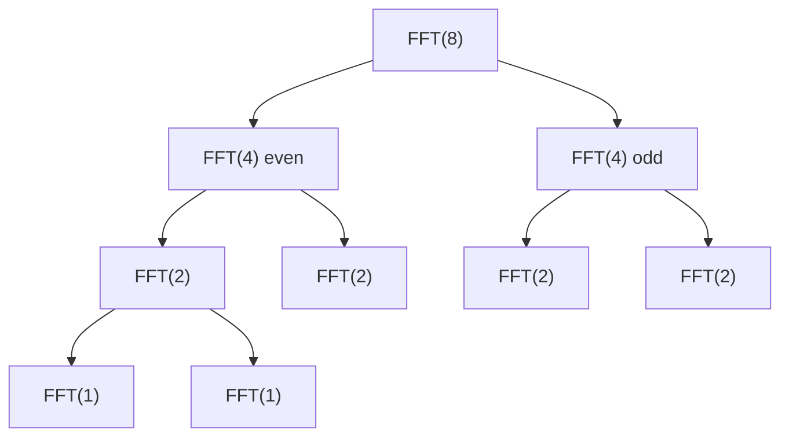

# Fast Fourier Transform (FFT)

## Overview
- **Category**: Signal Processing / Numerical Algorithms
- **Complexity**: Time: O(n log n) | Space: O(n)
- **Type**: Divide and conquer transformation
- **Source File**: [maths/radix2_fft.py](../../../maths/radix2_fft.py)

## 1. Mathematical Foundation

### 1.1 Discrete Fourier Transform (DFT)

The DFT of a sequence $x_0, x_1, \ldots, x_{n-1}$ is:

$$
X_k = \sum_{j=0}^{n-1} x_j \cdot e^{-2\pi i jk/n} = \sum_{j=0}^{n-1} x_j \cdot \omega_n^{jk}
$$

Where $\omega_n = e^{-2\pi i/n}$ is the **n-th root of unity**.

### 1.2 Roots of Unity

The n-th roots of unity are solutions to $z^n = 1$:

$$
\omega_n^k = e^{2\pi i k/n} = \cos\left(\frac{2\pi k}{n}\right) + i\sin\left(\frac{2\pi k}{n}\right)
$$

**Key properties:**
1. $\omega_n^n = 1$ (periodicity)
2. $\omega_n^{k+n/2} = -\omega_n^k$ (half-period negation)
3. $\omega_n^2 = \omega_{n/2}$ (halving property)

### 1.3 Cooley-Tukey Factorization

For $n = 2^m$, split into even and odd indices:

$$
X_k = \underbrace{\sum_{j=0}^{n/2-1} x_{2j} \cdot \omega_{n/2}^{jk}}_{E_k} + \omega_n^k \underbrace{\sum_{j=0}^{n/2-1} x_{2j+1} \cdot \omega_{n/2}^{jk}}_{O_k}
$$

Using the **butterfly operation**:
$$
\begin{aligned}
X_k &= E_k + \omega_n^k O_k \\
X_{k+n/2} &= E_k - \omega_n^k O_k
\end{aligned}
$$

### 1.4 Inverse FFT

$$
x_j = \frac{1}{n} \sum_{k=0}^{n-1} X_k \cdot e^{2\pi i jk/n}
$$

Same as forward FFT with:
- Replace $\omega_n$ with $\omega_n^{-1}$ (or use conjugate)
- Divide result by $n$

## 2. Algorithm Description

### 2.1 Intuition

FFT exploits symmetry in DFT computation:
1. **Divide**: Split input into even/odd indexed elements
2. **Conquer**: Recursively compute FFT of each half
3. **Combine**: Merge using butterfly operations

### 2.2 Why It's Fast

- **Naive DFT**: $O(n^2)$ - each of $n$ outputs requires $n$ multiplications
- **FFT**: $O(n \log n)$ - $\log n$ levels, each with $n$ operations
- Speedup factor: $n / \log n$ (e.g., 100× for $n = 1024$)

## 3. Pseudocode

```
ALGORITHM FFT-Recursive(x)
    INPUT: Array x of length n (n is power of 2)
    OUTPUT: DFT of x
    
    n ← length(x)
    if n = 1 then
        return x
    
    // Split into even and odd
    x_even ← [x[0], x[2], x[4], ..., x[n-2]]
    x_odd ← [x[1], x[3], x[5], ..., x[n-1]]
    
    // Recursive calls
    E ← FFT-Recursive(x_even)
    O ← FFT-Recursive(x_odd)
    
    // Combine with butterfly
    X ← array of n complex numbers
    for k ← 0 to n/2 - 1 do
        ω ← exp(-2πik/n)
        X[k] ← E[k] + ω × O[k]
        X[k + n/2] ← E[k] - ω × O[k]
    
    return X

ALGORITHM FFT-Iterative(x)
    INPUT: Array x of length n (n is power of 2)
    OUTPUT: DFT of x
    
    n ← length(x)
    
    // Bit-reversal permutation
    x ← BitReverseCopy(x)
    
    // Butterfly stages
    for s ← 1 to log₂(n) do
        m ← 2^s
        ω_m ← exp(-2πi/m)
        
        for k ← 0 to n-1 step m do
            ω ← 1
            for j ← 0 to m/2 - 1 do
                t ← ω × x[k + j + m/2]
                u ← x[k + j]
                x[k + j] ← u + t
                x[k + j + m/2] ← u - t
                ω ← ω × ω_m
    
    return x

ALGORITHM BitReverseCopy(x)
    n ← length(x)
    A ← new array of size n
    for k ← 0 to n-1 do
        A[ReverseBits(k)] ← x[k]
    return A
```

## 4. Complexity Analysis

### 4.1 Time Complexity

**Recurrence:**
$$
T(n) = 2T(n/2) + O(n)
$$

By Master Theorem: $T(n) = O(n \log n)$

| Algorithm | Time | Best For |
|-----------|------|----------|
| Naive DFT | O(n²) | Educational |
| Radix-2 FFT | O(n log n) | Power of 2 sizes |
| Mixed-radix FFT | O(n log n) | Any composite n |

### 4.2 Space Complexity

| Version | Space |
|---------|-------|
| Recursive | O(n log n) stack |
| Iterative (in-place) | O(1) auxiliary |
| Out-of-place | O(n) |

### 4.3 Numerical Stability

FFT is numerically stable with error growth of $O(\sqrt{n})$.

## 5. Visual Representation

### 5.1 Butterfly Diagram (n=8)

```
Input: x[0] x[1] x[2] x[3] x[4] x[5] x[6] x[7]
       ↓    ↓    ↓    ↓    ↓    ↓    ↓    ↓
       
Stage 1 (pairs):
x[0]──●───────────────●──X[0]
x[4]──╳───────────────╳──X[4]
       ╲             ╱
x[2]──●───────────────●──X[2]
x[6]──╳───────────────╳──X[6]
       ╲             ╱
x[1]──●───────────────●──X[1]
x[5]──╳───────────────╳──X[5]
       ╲             ╱
x[3]──●───────────────●──X[3]
x[7]──╳───────────────╳──X[7]

● = addition, ╳ = twiddle factor multiplication
```

### 5.2 Bit-Reversal Permutation

```
Index (binary) → Reversed → New Index
0 (000)        → 000       → 0
1 (001)        → 100       → 4
2 (010)        → 010       → 2
3 (011)        → 110       → 6
4 (100)        → 001       → 1
5 (101)        → 101       → 5
6 (110)        → 011       → 3
7 (111)        → 111       → 7

Original: [x0, x1, x2, x3, x4, x5, x6, x7]
Reversed: [x0, x4, x2, x6, x1, x5, x3, x7]
```

### 5.3 Recursion Tree



## 6. Implementation

```python
import cmath
from typing import List

def fft_recursive(x: List[complex]) -> List[complex]:
    """
    Recursive Cooley-Tukey FFT.
    
    >>> import cmath
    >>> x = [1, 2, 3, 4]
    >>> result = fft_recursive(x)
    >>> [round(r.real, 2) for r in result]
    [10.0, -2.0, -2.0, -2.0]
    """
    n = len(x)
    if n <= 1:
        return x
    
    # Split
    even = fft_recursive(x[0::2])
    odd = fft_recursive(x[1::2])
    
    # Combine
    X = [0j] * n
    for k in range(n // 2):
        t = cmath.exp(-2j * cmath.pi * k / n) * odd[k]
        X[k] = even[k] + t
        X[k + n // 2] = even[k] - t
    
    return X


def fft_iterative(x: List[complex]) -> List[complex]:
    """
    Iterative in-place FFT using bit-reversal.
    
    >>> x = [1, 2, 3, 4, 5, 6, 7, 8]
    >>> result = fft_iterative(x)
    >>> round(result[0].real)
    36
    """
    n = len(x)
    if n == 0 or (n & (n - 1)) != 0:
        raise ValueError("Size must be a power of 2")
    
    # Bit-reversal permutation
    x = list(x)
    log_n = n.bit_length() - 1
    for i in range(n):
        j = int(bin(i)[2:].zfill(log_n)[::-1], 2)
        if i < j:
            x[i], x[j] = x[j], x[i]
    
    # Butterfly stages
    size = 2
    while size <= n:
        half = size // 2
        w = cmath.exp(-2j * cmath.pi / size)
        
        for start in range(0, n, size):
            omega = 1
            for j in range(half):
                a = start + j
                b = start + j + half
                t = omega * x[b]
                x[b] = x[a] - t
                x[a] = x[a] + t
                omega *= w
        
        size *= 2
    
    return x


def ifft(X: List[complex]) -> List[complex]:
    """
    Inverse FFT.
    
    >>> x = [1, 2, 3, 4]
    >>> X = fft_recursive(x)
    >>> recovered = ifft(X)
    >>> [round(r.real) for r in recovered]
    [1, 2, 3, 4]
    """
    n = len(X)
    # Conjugate, apply FFT, conjugate, scale
    X_conj = [z.conjugate() for z in X]
    x = fft_recursive(X_conj)
    return [z.conjugate() / n for z in x]


def polynomial_multiply(a: List[float], b: List[float]) -> List[float]:
    """
    Multiply two polynomials using FFT.
    
    >>> polynomial_multiply([1, 2, 3], [1, 2])  # (1+2x+3x²)(1+2x)
    [1.0, 4.0, 7.0, 6.0]
    """
    # Pad to next power of 2
    n = 1
    while n < len(a) + len(b) - 1:
        n *= 2
    
    a_padded = a + [0] * (n - len(a))
    b_padded = b + [0] * (n - len(b))
    
    # FFT of both
    fa = fft_iterative([complex(x) for x in a_padded])
    fb = fft_iterative([complex(x) for x in b_padded])
    
    # Point-wise multiplication
    fc = [fa[i] * fb[i] for i in range(n)]
    
    # Inverse FFT
    c = ifft(fc)
    
    # Extract real parts and trim
    result = [round(x.real, 10) for x in c]
    return result[:len(a) + len(b) - 1]
```

## 7. Applications

### 7.1 Polynomial Multiplication

Multiply two degree-$n$ polynomials in $O(n \log n)$:

$$
C(x) = A(x) \cdot B(x)
$$

1. Evaluate $A$ and $B$ at $2n$ points using FFT
2. Multiply point-wise
3. Interpolate using inverse FFT

### 7.2 Big Integer Multiplication

Treat digits as polynomial coefficients:
- 12345 → $1 + 2x + 3x^2 + 4x^3 + 5x^4$
- Multiply polynomials, handle carries

### 7.3 Convolution

Circular convolution of sequences $a$ and $b$:
$$
(a * b)[k] = \sum_{j=0}^{n-1} a[j] \cdot b[(k-j) \mod n]
$$

Convolution theorem: $\mathcal{F}(a * b) = \mathcal{F}(a) \cdot \mathcal{F}(b)$

## 8. Real-World Software Engineering Applications

### 8.1 Industry Use Cases

1. **Audio Processing**
   - Spectrum analysis
   - Audio compression (MP3, AAC)
   - Noise reduction
   - Equalizers

2. **Image Processing**
   - JPEG compression (DCT variant)
   - Filtering and convolution
   - Pattern recognition

3. **Telecommunications**
   - OFDM modulation (WiFi, 4G/5G)
   - Channel estimation
   - Signal demodulation

4. **Scientific Computing**
   - Solving PDEs
   - Spectral methods
   - Astronomical data analysis

5. **Finance**
   - Signal analysis in trading
   - Time series decomposition

### 8.2 Production Example: Audio Spectrum Analyzer

```python
import numpy as np
from typing import Tuple, List

class AudioSpectrumAnalyzer:
    """
    Real-time audio spectrum analysis using FFT.
    """
    
    def __init__(self, sample_rate: int = 44100, window_size: int = 2048):
        self.sample_rate = sample_rate
        self.window_size = window_size
        self.window = self._hanning_window(window_size)
    
    def _hanning_window(self, n: int) -> np.ndarray:
        """Generate Hanning window to reduce spectral leakage."""
        return 0.5 * (1 - np.cos(2 * np.pi * np.arange(n) / (n - 1)))
    
    def analyze(self, samples: np.ndarray) -> Tuple[np.ndarray, np.ndarray]:
        """
        Perform FFT and return frequencies and magnitudes.
        
        Returns:
            frequencies: Array of frequency bins (Hz)
            magnitudes: Array of magnitude values (dB)
        """
        # Apply window
        windowed = samples[:self.window_size] * self.window
        
        # Compute FFT
        spectrum = np.fft.fft(windowed)
        
        # Get positive frequencies only
        n = len(spectrum)
        frequencies = np.fft.fftfreq(n, 1/self.sample_rate)[:n//2]
        magnitudes = np.abs(spectrum)[:n//2]
        
        # Convert to dB
        magnitudes_db = 20 * np.log10(magnitudes + 1e-10)
        
        return frequencies, magnitudes_db
    
    def find_dominant_frequency(self, samples: np.ndarray) -> float:
        """Find the dominant frequency in the signal."""
        freqs, mags = self.analyze(samples)
        return freqs[np.argmax(mags)]
    
    def get_frequency_bands(self, samples: np.ndarray) -> dict:
        """
        Get energy in standard frequency bands.
        
        Returns dict with bass, mid, treble energy levels.
        """
        freqs, mags = self.analyze(samples)
        
        # Convert from dB back to linear for averaging
        linear_mags = 10 ** (mags / 20)
        
        bands = {
            'sub_bass': (20, 60),
            'bass': (60, 250),
            'low_mid': (250, 500),
            'mid': (500, 2000),
            'high_mid': (2000, 4000),
            'treble': (4000, 20000)
        }
        
        result = {}
        for name, (low, high) in bands.items():
            mask = (freqs >= low) & (freqs < high)
            if mask.any():
                result[name] = 20 * np.log10(np.mean(linear_mags[mask]) + 1e-10)
            else:
                result[name] = -100  # Very low
        
        return result


# Usage example
analyzer = AudioSpectrumAnalyzer()

# Generate test signal (440 Hz + 880 Hz)
t = np.linspace(0, 1, 44100)
signal = np.sin(2 * np.pi * 440 * t) + 0.5 * np.sin(2 * np.pi * 880 * t)

freqs, mags = analyzer.analyze(signal[:2048])
dominant = analyzer.find_dominant_frequency(signal[:2048])
print(f"Dominant frequency: {dominant:.1f} Hz")
```

### 8.3 Image Filtering with FFT

```python
import numpy as np

class FFTImageFilter:
    """
    Image filtering using 2D FFT.
    """
    
    @staticmethod
    def low_pass_filter(image: np.ndarray, cutoff: float) -> np.ndarray:
        """
        Apply low-pass filter (blur) using FFT.
        
        Args:
            image: 2D grayscale image
            cutoff: Cutoff frequency (0 to 1, fraction of max frequency)
        """
        rows, cols = image.shape
        crow, ccol = rows // 2, cols // 2
        
        # 2D FFT
        f_transform = np.fft.fft2(image)
        f_shift = np.fft.fftshift(f_transform)
        
        # Create low-pass mask
        mask = np.zeros((rows, cols))
        radius = int(cutoff * min(rows, cols) / 2)
        
        y, x = np.ogrid[:rows, :cols]
        mask_area = (x - ccol)**2 + (y - crow)**2 <= radius**2
        mask[mask_area] = 1
        
        # Apply filter
        f_shift_filtered = f_shift * mask
        
        # Inverse FFT
        f_ishift = np.fft.ifftshift(f_shift_filtered)
        filtered = np.fft.ifft2(f_ishift)
        
        return np.abs(filtered)
    
    @staticmethod
    def high_pass_filter(image: np.ndarray, cutoff: float) -> np.ndarray:
        """Apply high-pass filter (edge detection) using FFT."""
        rows, cols = image.shape
        crow, ccol = rows // 2, cols // 2
        
        f_transform = np.fft.fft2(image)
        f_shift = np.fft.fftshift(f_transform)
        
        # Create high-pass mask (inverse of low-pass)
        mask = np.ones((rows, cols))
        radius = int(cutoff * min(rows, cols) / 2)
        
        y, x = np.ogrid[:rows, :cols]
        mask_area = (x - ccol)**2 + (y - crow)**2 <= radius**2
        mask[mask_area] = 0
        
        f_shift_filtered = f_shift * mask
        f_ishift = np.fft.ifftshift(f_shift_filtered)
        filtered = np.fft.ifft2(f_ishift)
        
        return np.abs(filtered)
```

## 9. Comparison with Alternatives

| Algorithm | Time | Use Case |
|-----------|------|----------|
| **Radix-2 FFT** | O(n log n) | Power-of-2 sizes |
| **Mixed-radix FFT** | O(n log n) | Any composite n |
| **Bluestein's FFT** | O(n log n) | Any size n |
| **Number Theoretic Transform** | O(n log n) | Modular arithmetic |
| **Naive DFT** | O(n²) | Educational, tiny n |

## 10. Practical Considerations

### 10.1 Choosing FFT Size

- **Power of 2**: Fastest (radix-2)
- **Zero-padding**: Pad to next power of 2
- **Frequency resolution**: $\Delta f = f_s / n$

### 10.2 Windowing

Apply window functions to reduce spectral leakage:
- Hanning, Hamming, Blackman, Kaiser

### 10.3 Numerical Issues

- Use double precision for accuracy
- Normalize appropriately for inverse FFT

## 11. Edge Cases

| Input | Output | Notes |
|-------|--------|-------|
| Empty array | Error | Invalid |
| Single element | Same element | Trivial |
| Not power of 2 | Pad or use mixed-radix | Handle appropriately |
| All zeros | All zeros | DC component only |

## 12. References

- Cooley, J.W., Tukey, J.W. (1965). "An Algorithm for the Machine Calculation of Complex Fourier Series"
- [Wikipedia: FFT](https://en.wikipedia.org/wiki/Fast_Fourier_transform)
- Brigham, E.O. (1988). "The Fast Fourier Transform and Its Applications"
