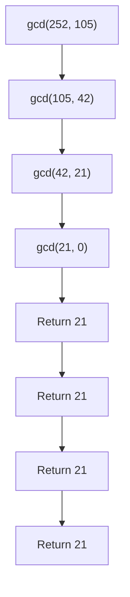

# Greatest Common Divisor (GCD) - Euclidean Algorithm

## Overview
- **Category**: Number Theory
- **Complexity**: Time: O(log min(a,b)) | Space: O(1) iterative, O(log min(a,b)) recursive
- **Type**: Fundamental arithmetic algorithm
- **Source File**: [maths/greatest_common_divisor.py](../../../maths/greatest_common_divisor.py)

## 1. Mathematical Foundation

### 1.1 Definition

The greatest common divisor of two integers $a$ and $b$, denoted $\gcd(a, b)$, is the largest positive integer that divides both $a$ and $b$.

$$
\gcd(a, b) = \max\{d \in \mathbb{Z}^+ : d \mid a \text{ and } d \mid b\}
$$

### 1.2 Euclidean Algorithm

Based on the fundamental property:

$$
\gcd(a, b) = \gcd(b, a \mod b)
$$

**Proof:**
Let $d = \gcd(a, b)$. Then $d \mid a$ and $d \mid b$.
Since $a = bq + r$ where $r = a \mod b$:
- $r = a - bq$
- Since $d \mid a$ and $d \mid b$, we have $d \mid r$
- Therefore $d$ divides both $b$ and $r$
- Conversely, any common divisor of $b$ and $r$ divides $a$
- Thus $\gcd(a, b) = \gcd(b, r)$

### 1.3 Termination

The algorithm terminates because:
1. $r = a \mod b < b$ (strict decrease)
2. All values remain non-negative
3. Eventually reaches $\gcd(d, 0) = d$

### 1.4 Properties

1. **Commutativity**: $\gcd(a, b) = \gcd(b, a)$
2. **Associativity**: $\gcd(a, \gcd(b, c)) = \gcd(\gcd(a, b), c)$
3. **Identity**: $\gcd(a, 0) = |a|$
4. **Idempotence**: $\gcd(a, a) = |a|$
5. **Distributivity**: $\gcd(ka, kb) = k \cdot \gcd(a, b)$ for $k > 0$

## 2. Algorithm Description

### 2.1 Intuition

Repeatedly replace the larger number with the remainder when divided by the smaller, until one number becomes zero. The other number is the GCD.

### 2.2 Binary GCD (Stein's Algorithm)

An alternative that uses only subtraction and bit shifts:
- If both even: $\gcd(a, b) = 2 \cdot \gcd(a/2, b/2)$
- If one even: $\gcd(a, b) = \gcd(a/2, b)$ (if $a$ even)
- If both odd: $\gcd(a, b) = \gcd(|a-b|/2, \min(a,b))$

## 3. Pseudocode

```
ALGORITHM Euclidean-GCD(a, b)
    INPUT: Two non-negative integers a, b
    OUTPUT: gcd(a, b)
    
    while b ≠ 0 do
        temp ← b
        b ← a mod b
        a ← temp
    
    return a

ALGORITHM Euclidean-GCD-Recursive(a, b)
    INPUT: Two non-negative integers a, b
    OUTPUT: gcd(a, b)
    
    if b = 0 then
        return a
    return Euclidean-GCD-Recursive(b, a mod b)

ALGORITHM Binary-GCD(a, b)
    INPUT: Two non-negative integers a, b
    OUTPUT: gcd(a, b)
    
    if a = 0 then return b
    if b = 0 then return a
    
    // Find common factor of 2
    shift ← 0
    while (a OR b) is even do
        if a is even AND b is even then
            a ← a / 2
            b ← b / 2
            shift ← shift + 1
        else if a is even then
            a ← a / 2
        else
            b ← b / 2
    
    // Now a is odd
    while b ≠ 0 do
        while b is even do
            b ← b / 2
        
        // Both odd
        if a > b then
            swap(a, b)
        b ← b - a
    
    return a × 2^shift
```

## 4. Complexity Analysis

### 4.1 Time Complexity

**Euclidean Algorithm:**
- **Worst case**: O(log min(a, b)) - occurs with consecutive Fibonacci numbers
- **Average case**: O(log min(a, b))

**Lamé's Theorem**: The number of steps is at most $5 \times$ (number of digits in smaller number).

**Proof of logarithmic bound:**
Each step reduces the larger number by at least half:
- If $a \geq b$, then $a \mod b < a/2$
- After two steps, both numbers reduced by factor of 2
- Total steps: O(log min(a, b))

### 4.2 Space Complexity

| Version | Space |
|---------|-------|
| Iterative | O(1) |
| Recursive | O(log min(a, b)) stack |
| Binary GCD | O(1) |

## 5. Visual Representation

### 5.1 Step-by-Step Example: gcd(252, 105)

```
Step 1: gcd(252, 105)
        252 = 105 × 2 + 42
        → gcd(105, 42)

Step 2: gcd(105, 42)
        105 = 42 × 2 + 21
        → gcd(42, 21)

Step 3: gcd(42, 21)
        42 = 21 × 2 + 0
        → gcd(21, 0)

Step 4: gcd(21, 0) = 21

Result: gcd(252, 105) = 21
```

### 5.2 Geometric Interpretation

```
Rectangle 252 × 105:

+--------------------------------------------------+
|                                                  |
|    105×105    |    105×105    |  42×105          |
|               |               |                  | 105
|               |               +------------------+
|               |               |  42×42  | 42×21  |
+---------------+---------------+---------+--------+

Repeatedly tile with largest square that fits.
Final square size = GCD = 21
```

### 5.3 Recursion Tree



## 6. Implementation

```python
def gcd_iterative(a: int, b: int) -> int:
    """
    Calculate GCD using iterative Euclidean algorithm.
    
    >>> gcd_iterative(252, 105)
    21
    >>> gcd_iterative(48, 18)
    6
    >>> gcd_iterative(0, 5)
    5
    >>> gcd_iterative(7, 0)
    7
    """
    a, b = abs(a), abs(b)
    while b:
        a, b = b, a % b
    return a


def gcd_recursive(a: int, b: int) -> int:
    """
    Calculate GCD using recursive Euclidean algorithm.
    
    >>> gcd_recursive(252, 105)
    21
    """
    a, b = abs(a), abs(b)
    return a if b == 0 else gcd_recursive(b, a % b)


def binary_gcd(a: int, b: int) -> int:
    """
    Calculate GCD using binary (Stein's) algorithm.
    Uses only subtraction and bit shifts.
    
    >>> binary_gcd(252, 105)
    21
    """
    a, b = abs(a), abs(b)
    
    if a == 0:
        return b
    if b == 0:
        return a
    
    # Find common factors of 2
    shift = 0
    while ((a | b) & 1) == 0:
        a >>= 1
        b >>= 1
        shift += 1
    
    # Remove remaining factors of 2 from a
    while (a & 1) == 0:
        a >>= 1
    
    while b != 0:
        # Remove factors of 2 from b
        while (b & 1) == 0:
            b >>= 1
        
        # Ensure a <= b
        if a > b:
            a, b = b, a
        
        b -= a
    
    return a << shift


def gcd_multiple(*numbers: int) -> int:
    """
    Calculate GCD of multiple numbers.
    
    >>> gcd_multiple(12, 18, 24)
    6
    >>> gcd_multiple(100, 75, 50, 25)
    25
    """
    from functools import reduce
    return reduce(gcd_iterative, numbers)
```

## 7. Extended Applications

### 7.1 Least Common Multiple (LCM)

$$
\text{lcm}(a, b) = \frac{|a \cdot b|}{\gcd(a, b)}
$$

```python
def lcm(a: int, b: int) -> int:
    """Calculate LCM using GCD."""
    if a == 0 or b == 0:
        return 0
    return abs(a * b) // gcd_iterative(a, b)
```

### 7.2 Coprime Check

Two numbers are coprime if $\gcd(a, b) = 1$.

```python
def are_coprime(a: int, b: int) -> bool:
    """Check if two numbers are coprime."""
    return gcd_iterative(a, b) == 1
```

### 7.3 Fraction Simplification

```python
from dataclasses import dataclass

@dataclass
class Fraction:
    numerator: int
    denominator: int
    
    def simplify(self) -> 'Fraction':
        """Reduce fraction to lowest terms."""
        d = gcd_iterative(self.numerator, self.denominator)
        return Fraction(self.numerator // d, self.denominator // d)
```

## 8. Real-World Software Engineering Applications

### 8.1 Industry Use Cases

1. **Cryptography (RSA)**
   - Computing modular multiplicative inverse
   - Key generation requires coprime numbers
   - Extended Euclidean algorithm for decryption

2. **Fraction Arithmetic**
   - Simplifying fractions in rational number libraries
   - Computer algebra systems
   - Financial calculations

3. **Scheduling and Timing**
   - Finding common periods (LCM)
   - Task synchronization
   - Clock synchronization

4. **Computer Graphics**
   - Aspect ratio reduction (16:9, 4:3)
   - Texture tiling
   - Grid alignment

5. **Music Theory**
   - Rhythm patterns
   - Time signature simplification

### 8.2 Production Example: RSA Key Generation

```python
import random

class RSAKeyGenerator:
    """
    Simplified RSA key generation using GCD.
    """
    
    @staticmethod
    def gcd(a: int, b: int) -> int:
        while b:
            a, b = b, a % b
        return a
    
    @staticmethod
    def extended_gcd(a: int, b: int) -> tuple[int, int, int]:
        """Return (gcd, x, y) such that a*x + b*y = gcd."""
        if a == 0:
            return b, 0, 1
        gcd, x1, y1 = RSAKeyGenerator.extended_gcd(b % a, a)
        x = y1 - (b // a) * x1
        y = x1
        return gcd, x, y
    
    @staticmethod
    def mod_inverse(e: int, phi: int) -> int:
        """Find modular multiplicative inverse of e mod phi."""
        gcd, x, _ = RSAKeyGenerator.extended_gcd(e, phi)
        if gcd != 1:
            raise ValueError("Modular inverse does not exist")
        return x % phi
    
    @staticmethod
    def is_prime(n: int, k: int = 10) -> bool:
        """Miller-Rabin primality test."""
        if n < 2:
            return False
        if n == 2 or n == 3:
            return True
        if n % 2 == 0:
            return False
        
        # Write n-1 as 2^r * d
        r, d = 0, n - 1
        while d % 2 == 0:
            r += 1
            d //= 2
        
        # Witness loop
        for _ in range(k):
            a = random.randrange(2, n - 1)
            x = pow(a, d, n)
            
            if x == 1 or x == n - 1:
                continue
            
            for _ in range(r - 1):
                x = pow(x, 2, n)
                if x == n - 1:
                    break
            else:
                return False
        
        return True
    
    @staticmethod
    def generate_prime(bits: int) -> int:
        """Generate a random prime of given bit length."""
        while True:
            p = random.getrandbits(bits) | (1 << bits - 1) | 1
            if RSAKeyGenerator.is_prime(p):
                return p
    
    def generate_keypair(self, bits: int = 512) -> dict:
        """
        Generate RSA public and private key pair.
        
        >>> gen = RSAKeyGenerator()
        >>> keys = gen.generate_keypair(64)  # Small for demo
        >>> 'public' in keys and 'private' in keys
        True
        """
        # Generate two large primes
        p = self.generate_prime(bits // 2)
        q = self.generate_prime(bits // 2)
        
        n = p * q
        phi = (p - 1) * (q - 1)
        
        # Choose e such that gcd(e, phi) = 1
        e = 65537  # Common choice
        while self.gcd(e, phi) != 1:
            e += 2
        
        # Calculate d (private exponent)
        d = self.mod_inverse(e, phi)
        
        return {
            'public': {'n': n, 'e': e},
            'private': {'n': n, 'd': d},
            'primes': {'p': p, 'q': q}  # Keep secret!
        }


# Usage
gen = RSAKeyGenerator()
keys = gen.generate_keypair(512)
print(f"Public key: e={keys['public']['e']}")
```

### 8.3 Aspect Ratio Calculator

```python
class AspectRatio:
    """Calculate and simplify aspect ratios using GCD."""
    
    COMMON_RATIOS = {
        (16, 9): "16:9 (HD Video)",
        (4, 3): "4:3 (Traditional)",
        (21, 9): "21:9 (Ultrawide)",
        (1, 1): "1:1 (Square)",
        (3, 2): "3:2 (35mm Film)",
    }
    
    @staticmethod
    def gcd(a: int, b: int) -> int:
        while b:
            a, b = b, a % b
        return a
    
    @classmethod
    def simplify(cls, width: int, height: int) -> tuple[int, int]:
        """
        Simplify aspect ratio.
        
        >>> AspectRatio.simplify(1920, 1080)
        (16, 9)
        >>> AspectRatio.simplify(1024, 768)
        (4, 3)
        """
        d = cls.gcd(width, height)
        return width // d, height // d
    
    @classmethod
    def identify(cls, width: int, height: int) -> str:
        """
        Identify common aspect ratio.
        
        >>> AspectRatio.identify(1920, 1080)
        '16:9 (HD Video)'
        """
        ratio = cls.simplify(width, height)
        return cls.COMMON_RATIOS.get(ratio, f"{ratio[0]}:{ratio[1]}")
    
    @classmethod
    def resize_to_ratio(cls, width: int, height: int, 
                        target_ratio: tuple[int, int]) -> tuple[int, int]:
        """
        Calculate new dimensions maintaining target aspect ratio.
        
        >>> AspectRatio.resize_to_ratio(1000, 800, (16, 9))
        (1000, 562)
        """
        target_w, target_h = target_ratio
        
        # Try fitting by width
        new_height = (width * target_h) // target_w
        if new_height <= height:
            return width, new_height
        
        # Fit by height
        new_width = (height * target_w) // target_h
        return new_width, height
```

## 9. Comparison of GCD Algorithms

| Algorithm | Time | Operations | Best For |
|-----------|------|------------|----------|
| Euclidean | O(log n) | Division | General purpose |
| Binary GCD | O(log n) | Bit shifts | Hardware, embedded |
| Prime factorization | O(√n) | Division | Educational |

## 10. Edge Cases

| Input | Result | Notes |
|-------|--------|-------|
| gcd(0, 0) | 0 | By convention |
| gcd(a, 0) | |a| | Any number divides 0 |
| gcd(a, a) | |a| | Trivial |
| gcd(a, 1) | 1 | 1 divides everything |
| gcd(-a, b) | gcd(a, b) | GCD is always positive |

## 11. References

- Knuth, D.E. "The Art of Computer Programming, Vol. 2: Seminumerical Algorithms"
- [Wikipedia: Euclidean Algorithm](https://en.wikipedia.org/wiki/Euclidean_algorithm)
- [Wikipedia: Binary GCD](https://en.wikipedia.org/wiki/Binary_GCD_algorithm)
