# Modular Exponentiation (Fast Power)

## Overview
- **Category**: Number Theory / Cryptography
- **Complexity**: Time: O(log n) | Space: O(1)
- **Type**: Mathematical algorithm
- **Source File**: [maths/modular_exponential.py](../../../maths/modular_exponential.py)

## 1. Mathematical Foundation

### 1.1 Problem Definition

Compute $a^n \mod m$ efficiently where $a$, $n$, and $m$ are integers.

Direct computation is infeasible for large $n$ because:
- $a^n$ can be astronomically large
- Computing then reducing is too slow

### 1.2 Binary Exponentiation

Express $n$ in binary: $n = \sum_{i=0}^{k} b_i \cdot 2^i$

Then:
$$
a^n = a^{\sum b_i \cdot 2^i} = \prod_{i: b_i = 1} a^{2^i}
$$

### 1.3 Key Properties

**Property 1: Modular Multiplication**
$$
(a \times b) \mod m = ((a \mod m) \times (b \mod m)) \mod m
$$

**Property 2: Squaring Recurrence**
$$
a^{2^{i+1}} = (a^{2^i})^2
$$

**Property 3: Fermat's Little Theorem** (when $m$ is prime)
$$
a^{m-1} \equiv 1 \pmod{m}
$$

So $a^n \equiv a^{n \mod (m-1)} \pmod{m}$

### 1.4 Euler's Theorem (Generalization)

For $\gcd(a, m) = 1$:
$$
a^{\phi(m)} \equiv 1 \pmod{m}
$$

Where $\phi(m)$ is Euler's totient function.

## 2. Algorithm Description

### 2.1 Intuition

Instead of multiplying $a$ by itself $n$ times:
1. Square repeatedly: $a, a^2, a^4, a^8, \ldots$
2. Multiply only powers corresponding to 1-bits in $n$
3. Take mod at each step to keep numbers small

### 2.2 Example: $3^{13} \mod 7$

Binary: $13 = 1101_2 = 8 + 4 + 1$

$$
3^{13} = 3^8 \times 3^4 \times 3^1
$$

Computing (mod 7):
- $3^1 = 3$
- $3^2 = 9 \equiv 2 \pmod 7$
- $3^4 = (3^2)^2 = 4 \equiv 4 \pmod 7$
- $3^8 = (3^4)^2 = 16 \equiv 2 \pmod 7$

Result: $3 \times 4 \times 2 = 24 \equiv 3 \pmod 7$

## 3. Pseudocode

```
ALGORITHM ModularExponentiation(base, exp, mod)
    INPUT: base a, exponent n, modulus m
    OUTPUT: a^n mod m
    
    result ← 1
    base ← base mod mod
    
    while exp > 0 do
        // If current bit is 1, multiply result
        if exp is odd then
            result ← (result × base) mod mod
        
        // Square the base
        base ← (base × base) mod mod
        exp ← exp / 2  // Right shift
    
    return result

ALGORITHM ModularExponentiation-Recursive(base, exp, mod)
    INPUT: base a, exponent n, modulus m
    OUTPUT: a^n mod m
    
    if exp = 0 then
        return 1
    
    half ← ModularExponentiation-Recursive(base, exp / 2, mod)
    
    if exp is even then
        return (half × half) mod mod
    else
        return (half × half × base) mod mod
```

## 4. Step-by-Step Trace

### Example: $5^{117} \mod 19$

| Step | exp (binary) | base | result | Action |
|------|--------------|------|--------|--------|
| 0 | 117 = 1110101 | 5 | 1 | exp odd: result = 1×5 = 5 |
| 1 | 58 = 111010 | 6 | 5 | exp even: skip |
| 2 | 29 = 11101 | 17 | 5 | exp odd: result = 5×17 = 9 |
| 3 | 14 = 1110 | 4 | 9 | exp even: skip |
| 4 | 7 = 111 | 16 | 9 | exp odd: result = 9×16 = 11 |
| 5 | 3 = 11 | 9 | 11 | exp odd: result = 11×9 = 4 |
| 6 | 1 = 1 | 5 | 4 | exp odd: result = 4×5 = 1 |

**Result**: $5^{117} \mod 19 = 1$

## 5. Complexity Analysis

### 5.1 Time Complexity

- **Number of iterations**: $\lfloor \log_2 n \rfloor + 1$
- Each iteration: O(1) multiplications
- **Total**: $O(\log n)$

For cryptographic applications with $n$ being $k$-bit number:
- Time: $O(k)$ multiplications
- Each multiplication of $k$-bit numbers: $O(k^2)$ or $O(k \log k)$ with FFT
- **Total**: $O(k^3)$ or $O(k^2 \log k)$

### 5.2 Space Complexity

| Version | Space |
|---------|-------|
| Iterative | O(1) |
| Recursive | O(log n) stack |

## 6. Visual Representation

### 6.1 Binary Exponentiation Tree

```
3^13 = 3^(1101₂)

        3^13
       /    \
    3^6      × 3^1
    /  \
 3^3   (squared)
 / \
3^1  × 3^1
 |
 3    (squared twice more)
```

### 6.2 Iterative Process

```
exp: 13 → 6 → 3 → 1 → 0
     ↓    ↓   ↓   ↓
bit:  1    0   1   1
     ↓    ↓   ↓   ↓
mul: yes  no yes yes

base: 3 → 9 → 81 → 6561
            (all mod m)
```

### 6.3 Complexity Comparison

```mermaid
graph LR
    A[Naive: O&#40;n&#41;] --> B[n multiplications]
    C[Binary: O&#40;log n&#41;] --> D[log n multiplications]
    
    style A fill:#f99
    style C fill:#9f9
```



## 7. Implementation

```python
def mod_exp_iterative(base: int, exp: int, mod: int) -> int:
    """
    Compute base^exp mod mod using binary exponentiation.
    
    Time: O(log exp), Space: O(1)
    
    >>> mod_exp_iterative(3, 13, 7)
    3
    >>> mod_exp_iterative(2, 10, 1000)
    24
    >>> mod_exp_iterative(5, 0, 13)
    1
    >>> mod_exp_iterative(0, 5, 13)
    0
    """
    if mod == 1:
        return 0
    
    result = 1
    base = base % mod
    
    while exp > 0:
        if exp & 1:  # exp is odd
            result = (result * base) % mod
        exp >>= 1  # exp = exp // 2
        base = (base * base) % mod
    
    return result


def mod_exp_recursive(base: int, exp: int, mod: int) -> int:
    """
    Recursive binary exponentiation.
    
    >>> mod_exp_recursive(3, 13, 7)
    3
    >>> mod_exp_recursive(2, 100, 13)
    3
    """
    if mod == 1:
        return 0
    if exp == 0:
        return 1
    
    base = base % mod
    
    half = mod_exp_recursive(base, exp // 2, mod)
    
    if exp % 2 == 0:
        return (half * half) % mod
    else:
        return (half * half * base) % mod


def power_no_mod(base: int, exp: int) -> int:
    """
    Binary exponentiation without modulus.
    
    >>> power_no_mod(2, 10)
    1024
    >>> power_no_mod(3, 5)
    243
    """
    if exp == 0:
        return 1
    if exp < 0:
        return 1 / power_no_mod(base, -exp)
    
    result = 1
    while exp > 0:
        if exp & 1:
            result *= base
        base *= base
        exp >>= 1
    
    return result


def matrix_power(matrix: list, n: int, mod: int) -> list:
    """
    Compute matrix^n mod mod using binary exponentiation.
    Useful for Fibonacci, linear recurrences.
    
    >>> matrix_power([[1, 1], [1, 0]], 10, 1000000007)
    [[89, 55], [55, 34]]
    """
    size = len(matrix)
    
    def multiply(A, B):
        result = [[0] * size for _ in range(size)]
        for i in range(size):
            for j in range(size):
                for k in range(size):
                    result[i][j] = (result[i][j] + A[i][k] * B[k][j]) % mod
        return result
    
    # Identity matrix
    result = [[1 if i == j else 0 for j in range(size)] for i in range(size)]
    
    while n > 0:
        if n & 1:
            result = multiply(result, matrix)
        matrix = multiply(matrix, matrix)
        n >>= 1
    
    return result


def fibonacci_fast(n: int, mod: int = 10**9 + 7) -> int:
    """
    Compute nth Fibonacci number using matrix exponentiation.
    
    F(n) = [[1,1],[1,0]]^n [1,0]^T
    
    >>> fibonacci_fast(10)
    55
    >>> fibonacci_fast(50)
    586268941
    """
    if n <= 1:
        return n
    
    M = [[1, 1], [1, 0]]
    result = matrix_power(M, n - 1, mod)
    return result[0][0]
```

## 8. Applications

### 8.1 RSA Encryption

Encryption: $C = M^e \mod n$
Decryption: $M = C^d \mod n$

Both use modular exponentiation with large numbers (2048+ bits).

### 8.2 Diffie-Hellman Key Exchange

$$
A = g^a \mod p, \quad B = g^b \mod p
$$

Shared secret: $K = B^a = A^b = g^{ab} \mod p$

### 8.3 Miller-Rabin Primality Test

Tests if $a^{n-1} \equiv 1 \pmod n$ for random witnesses $a$.

### 8.4 Computing Fibonacci Numbers

$$
\begin{pmatrix} F_{n+1} \\ F_n \end{pmatrix} = \begin{pmatrix} 1 & 1 \\ 1 & 0 \end{pmatrix}^n \begin{pmatrix} 1 \\ 0 \end{pmatrix}
$$

## 9. Real-World Software Engineering Applications

### 9.1 Industry Use Cases

1. **Cryptography**
   - RSA, DSA, ElGamal
   - Elliptic curve operations
   - Digital signatures

2. **Competitive Programming**
   - Large Fibonacci numbers
   - Linear recurrence relations
   - Combinatorics mod prime

3. **Blockchain**
   - Proof of work
   - Signature verification

4. **Random Number Generation**
   - Linear congruential generators

### 9.2 Production Example: RSA Implementation

```python
import random
from typing import Tuple


class RSA:
    """
    RSA encryption/decryption using modular exponentiation.
    """
    
    def __init__(self, key_size: int = 2048):
        self.key_size = key_size
        self.public_key = None
        self.private_key = None
    
    def _mod_exp(self, base: int, exp: int, mod: int) -> int:
        """Fast modular exponentiation."""
        result = 1
        base = base % mod
        while exp > 0:
            if exp & 1:
                result = (result * base) % mod
            exp >>= 1
            base = (base * base) % mod
        return result
    
    def _is_prime(self, n: int, rounds: int = 40) -> bool:
        """Miller-Rabin primality test using mod_exp."""
        if n < 2:
            return False
        if n == 2 or n == 3:
            return True
        if n % 2 == 0:
            return False
        
        # Write n-1 as 2^r * d
        r, d = 0, n - 1
        while d % 2 == 0:
            r += 1
            d //= 2
        
        # Witness loop
        for _ in range(rounds):
            a = random.randrange(2, n - 1)
            x = self._mod_exp(a, d, n)  # Using our modular exponentiation
            
            if x == 1 or x == n - 1:
                continue
            
            for _ in range(r - 1):
                x = self._mod_exp(x, 2, n)
                if x == n - 1:
                    break
            else:
                return False
        
        return True
    
    def _generate_prime(self, bits: int) -> int:
        """Generate a random prime of specified bits."""
        while True:
            candidate = random.getrandbits(bits) | (1 << bits - 1) | 1
            if self._is_prime(candidate):
                return candidate
    
    def _mod_inverse(self, a: int, m: int) -> int:
        """Extended Euclidean Algorithm for modular inverse."""
        old_r, r = a, m
        old_s, s = 1, 0
        
        while r != 0:
            quotient = old_r // r
            old_r, r = r, old_r - quotient * r
            old_s, s = s, old_s - quotient * s
        
        return old_s % m
    
    def generate_keys(self) -> Tuple[Tuple[int, int], Tuple[int, int]]:
        """Generate RSA key pair."""
        # Generate two primes
        p = self._generate_prime(self.key_size // 2)
        q = self._generate_prime(self.key_size // 2)
        
        n = p * q
        phi_n = (p - 1) * (q - 1)
        
        # Public exponent
        e = 65537
        
        # Private exponent using mod inverse
        d = self._mod_inverse(e, phi_n)
        
        self.public_key = (e, n)
        self.private_key = (d, n)
        
        return self.public_key, self.private_key
    
    def encrypt(self, message: int) -> int:
        """Encrypt using public key: C = M^e mod n"""
        e, n = self.public_key
        return self._mod_exp(message, e, n)
    
    def decrypt(self, ciphertext: int) -> int:
        """Decrypt using private key: M = C^d mod n"""
        d, n = self.private_key
        return self._mod_exp(ciphertext, d, n)
    
    def sign(self, message_hash: int) -> int:
        """Sign message hash using private key."""
        d, n = self.private_key
        return self._mod_exp(message_hash, d, n)
    
    def verify(self, message_hash: int, signature: int) -> bool:
        """Verify signature using public key."""
        e, n = self.public_key
        decrypted = self._mod_exp(signature, e, n)
        return decrypted == message_hash


# Demo
rsa = RSA(key_size=512)  # Small for demo
public, private = rsa.generate_keys()

message = 12345678
encrypted = rsa.encrypt(message)
decrypted = rsa.decrypt(encrypted)

print(f"Original: {message}")
print(f"Encrypted: {encrypted}")
print(f"Decrypted: {decrypted}")
print(f"Match: {message == decrypted}")
```

### 9.3 Linear Recurrence Solver

```python
from typing import List


class LinearRecurrenceSolver:
    """
    Solve linear recurrences using matrix exponentiation.
    """
    
    def __init__(self, coefficients: List[int], initial_values: List[int], mod: int = 10**9 + 7):
        """
        Initialize with recurrence: f(n) = c[0]*f(n-1) + c[1]*f(n-2) + ... + c[k-1]*f(n-k)
        
        Args:
            coefficients: [c[0], c[1], ..., c[k-1]]
            initial_values: [f(0), f(1), ..., f(k-1)]
            mod: Modulus for computation
        """
        self.coefficients = coefficients
        self.initial_values = initial_values
        self.k = len(coefficients)
        self.mod = mod
        
        # Build transformation matrix
        self.matrix = self._build_matrix()
    
    def _build_matrix(self) -> List[List[int]]:
        """
        Build k×k transformation matrix:
        [[c0, c1, c2, ..., c(k-1)]
         [1,  0,  0,  ..., 0     ]
         [0,  1,  0,  ..., 0     ]
         ...
         [0,  0,  0,  ..., 0     ]]
        """
        M = [[0] * self.k for _ in range(self.k)]
        
        # First row: coefficients
        for j, c in enumerate(self.coefficients):
            M[0][j] = c % self.mod
        
        # Sub-diagonal: ones
        for i in range(1, self.k):
            M[i][i-1] = 1
        
        return M
    
    def _matrix_mult(self, A: List[List[int]], B: List[List[int]]) -> List[List[int]]:
        """Multiply two matrices mod self.mod."""
        n = len(A)
        C = [[0] * n for _ in range(n)]
        for i in range(n):
            for j in range(n):
                for k in range(n):
                    C[i][j] = (C[i][j] + A[i][k] * B[k][j]) % self.mod
        return C
    
    def _matrix_power(self, n: int) -> List[List[int]]:
        """Compute matrix^n using binary exponentiation."""
        # Identity matrix
        result = [[1 if i == j else 0 for j in range(self.k)] for i in range(self.k)]
        base = [row[:] for row in self.matrix]
        
        while n > 0:
            if n & 1:
                result = self._matrix_mult(result, base)
            base = self._matrix_mult(base, base)
            n >>= 1
        
        return result
    
    def compute(self, n: int) -> int:
        """
        Compute f(n) in O(k^3 log n) time.
        
        >>> solver = LinearRecurrenceSolver([1, 1], [0, 1])  # Fibonacci
        >>> solver.compute(10)
        55
        >>> solver.compute(50)
        586268941
        """
        if n < self.k:
            return self.initial_values[n] % self.mod
        
        # Compute matrix^(n-k+1)
        M_power = self._matrix_power(n - self.k + 1)
        
        # Multiply with initial state vector [f(k-1), f(k-2), ..., f(0)]
        state = list(reversed(self.initial_values))
        
        result = 0
        for j in range(self.k):
            result = (result + M_power[0][j] * state[j]) % self.mod
        
        return result


# Examples
# Fibonacci: f(n) = f(n-1) + f(n-2), f(0)=0, f(1)=1
fib_solver = LinearRecurrenceSolver([1, 1], [0, 1])
print(f"F(100) mod 10^9+7 = {fib_solver.compute(100)}")

# Tribonacci: f(n) = f(n-1) + f(n-2) + f(n-3), f(0)=0, f(1)=0, f(2)=1
trib_solver = LinearRecurrenceSolver([1, 1, 1], [0, 0, 1])
print(f"T(100) mod 10^9+7 = {trib_solver.compute(100)}")
```

## 10. Comparison with Alternatives

| Method | Time | When to Use |
|--------|------|-------------|
| **Binary Exponentiation** | O(log n) | Standard choice |
| **Naive Multiplication** | O(n) | Very small n only |
| **Montgomery Multiplication** | O(log n) | Many modular ops with same modulus |
| **Barret Reduction** | O(log n) | Optimize division |

## 11. Edge Cases

| Input | Output | Notes |
|-------|--------|-------|
| exp = 0 | 1 | Any base^0 = 1 |
| base = 0, exp > 0 | 0 | 0^n = 0 |
| mod = 1 | 0 | Everything mod 1 = 0 |
| Negative exp | N/A | Use modular inverse first |
| Very large numbers | Works | Keep mod at each step |

## 12. References

- [Wikipedia: Modular Exponentiation](https://en.wikipedia.org/wiki/Modular_exponentiation)
- [Wikipedia: Exponentiation by Squaring](https://en.wikipedia.org/wiki/Exponentiation_by_squaring)
- Knuth, D.E. "The Art of Computer Programming, Volume 2"
- Cormen et al. "Introduction to Algorithms" (Chapter 31)
