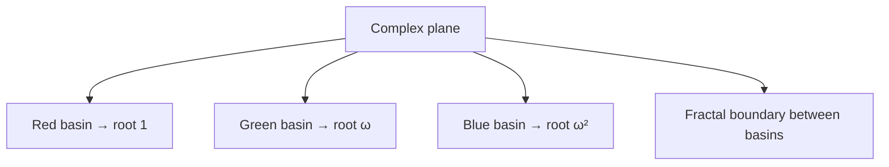

# Newton-Raphson Method

## Overview
- **Category**: Numerical Methods / Root Finding
- **Complexity**: Time: O(log(1/ε)) per iteration | Space: O(1)
- **Type**: Iterative approximation
- **Source File**: [maths/newton_raphson.py](../../../maths/newton_raphson.py)

## 1. Mathematical Foundation

### 1.1 Problem Definition

Find $x^*$ such that $f(x^*) = 0$ for a differentiable function $f$.

### 1.2 Derivation

**Idea**: Approximate $f$ with its tangent line at current point.

At point $(x_n, f(x_n))$, the tangent line is:
$$
y - f(x_n) = f'(x_n)(x - x_n)
$$

Setting $y = 0$ (x-intercept):
$$
x_{n+1} = x_n - \frac{f(x_n)}{f'(x_n)}
$$

### 1.3 Convergence Analysis

**Quadratic Convergence**: Near a simple root $x^*$:
$$
|x_{n+1} - x^*| \leq C |x_n - x^*|^2
$$

This means the number of correct digits approximately **doubles** each iteration!

**Convergence condition**: If $f''$ is continuous and $f'(x^*) \neq 0$:
$$
|x_0 - x^*| < \frac{2|f'(x^*)|}{M}
$$
where $M = \max|f''(x)|$ in the region.

### 1.4 Error Analysis

Taylor expansion around root $x^*$:
$$
0 = f(x^*) = f(x_n) + f'(x_n)(x^* - x_n) + \frac{f''(\xi)}{2}(x^* - x_n)^2
$$

Leading to:
$$
x^* - x_{n+1} = \frac{f''(\xi)}{2f'(x_n)}(x^* - x_n)^2
$$

## 2. Algorithm Description

### 2.1 Intuition

1. Start with initial guess $x_0$
2. Draw tangent line at $(x_0, f(x_0))$
3. Find where tangent crosses x-axis → new estimate $x_1$
4. Repeat until convergence

### 2.2 Geometric Interpretation

```
      y │
        │      f(x)
        │    ╱
        │   ╱
        │  ●───────────── tangent at x₀
        │ ╱ ╲
        │╱   ╲
     ───┼─────●───────── x
        │    x₁   x₀
        │
```

## 3. Pseudocode

```
ALGORITHM Newton-Raphson(f, f', x₀, ε, maxIter)
    INPUT: Function f, derivative f', initial guess x₀,
           tolerance ε, maximum iterations
    OUTPUT: Approximate root x*
    
    x ← x₀
    for i ← 1 to maxIter do
        fx ← f(x)
        fpx ← f'(x)
        
        if |fpx| < ε then
            ERROR "Derivative too small"
        
        x_new ← x - fx / fpx
        
        // Check convergence
        if |x_new - x| < ε then
            return x_new
        
        x ← x_new
    
    WARNING "Did not converge"
    return x

ALGORITHM Newton-Raphson-Safe(f, f', x₀, a, b, ε)
    INPUT: Function f, derivative f', initial guess x₀,
           bracket [a, b], tolerance ε
    OUTPUT: Approximate root x* in [a, b]
    
    x ← x₀
    while TRUE do
        fx ← f(x)
        fpx ← f'(x)
        
        dx ← fx / fpx
        x_new ← x - dx
        
        // If Newton step goes outside bracket, use bisection
        if x_new < a OR x_new > b then
            x_new ← (a + b) / 2
        
        // Update bracket
        if f(a) × f(x_new) < 0 then
            b ← x_new
        else
            a ← x_new
        
        if |dx| < ε OR |x_new - x| < ε then
            return x_new
        
        x ← x_new
```

## 4. Step-by-Step Example

### Example: Find $\sqrt{2}$ (solve $x^2 - 2 = 0$)

$f(x) = x^2 - 2$, $f'(x) = 2x$

Starting with $x_0 = 1$:

| Iteration | $x_n$ | $f(x_n)$ | $f'(x_n)$ | $x_{n+1}$ | Error |
|-----------|-------|----------|-----------|-----------|-------|
| 0 | 1.0 | -1.0 | 2.0 | 1.5 | 0.086 |
| 1 | 1.5 | 0.25 | 3.0 | 1.4167 | 0.0025 |
| 2 | 1.4167 | 0.00694 | 2.833 | 1.41422 | 0.000002 |
| 3 | 1.41422 | 0.000006 | 2.828 | 1.414214 | ~10⁻¹² |

**Note**: Error squares each iteration (quadratic convergence)!

## 5. Complexity Analysis

### 5.1 Convergence Rate

| Convergence Type | Rate | Condition |
|-----------------|------|-----------|
| Quadratic | $O(\log\log(1/\epsilon))$ | Simple root, good initial guess |
| Linear | $O(\log(1/\epsilon))$ | Multiple root |
| No convergence | N/A | Poor initial guess |

### 5.2 Per-Iteration Cost

- Function evaluation: $O(T_f)$
- Derivative evaluation: $O(T_{f'})$
- Division: $O(1)$

**Total**: $O(T_f + T_{f'})$ per iteration

### 5.3 Comparison with Other Methods

| Method | Convergence | Function Evals | Derivative |
|--------|-------------|----------------|------------|
| Newton-Raphson | Quadratic | 1 | Required |
| Secant | Superlinear (~1.618) | 1 | Not needed |
| Bisection | Linear | 1 | Not needed |
| Brent | Superlinear | 1-2 | Not needed |

## 6. Visual Representation

### 6.1 Convergence Illustration

```
        y
        │         f(x) = x² - 2
        │        /
        │       /
      2 │      ● x₀ = 2
        │     /│
        │    / │
      1 │   ●──┘ x₁ = 1.5
        │  /│
        │ / │
      0 ├──●────────── x
        │ √2  1  1.5  2
        │
     -1 │
        │
```

### 6.2 Basin of Attraction (for z³ - 1)



## 7. Implementation

```python
from typing import Callable, Optional, Tuple
import math


def newton_raphson(
    f: Callable[[float], float],
    df: Callable[[float], float],
    x0: float,
    tol: float = 1e-10,
    max_iter: int = 100
) -> Tuple[float, int]:
    """
    Newton-Raphson root finding.
    
    Args:
        f: Function to find root of
        df: Derivative of f
        x0: Initial guess
        tol: Convergence tolerance
        max_iter: Maximum iterations
    
    Returns:
        (root, iterations)
    
    >>> def f(x): return x**2 - 2
    >>> def df(x): return 2*x
    >>> root, iters = newton_raphson(f, df, 1.0)
    >>> abs(root - math.sqrt(2)) < 1e-10
    True
    """
    x = x0
    
    for i in range(max_iter):
        fx = f(x)
        dfx = df(x)
        
        if abs(dfx) < 1e-15:
            raise ValueError(f"Derivative near zero at x = {x}")
        
        x_new = x - fx / dfx
        
        if abs(x_new - x) < tol:
            return x_new, i + 1
        
        x = x_new
    
    raise RuntimeError(f"Did not converge after {max_iter} iterations")


def newton_with_history(
    f: Callable[[float], float],
    df: Callable[[float], float],
    x0: float,
    tol: float = 1e-10,
    max_iter: int = 100
) -> Tuple[float, list]:
    """
    Newton-Raphson with iteration history.
    
    Returns:
        (root, history of x values)
    """
    history = [x0]
    x = x0
    
    for i in range(max_iter):
        fx = f(x)
        dfx = df(x)
        
        if abs(dfx) < 1e-15:
            raise ValueError("Derivative near zero")
        
        x_new = x - fx / dfx
        history.append(x_new)
        
        if abs(x_new - x) < tol:
            return x_new, history
        
        x = x_new
    
    return x, history


def newton_for_sqrt(n: float, x0: Optional[float] = None, tol: float = 1e-15) -> float:
    """
    Compute square root using Newton's method.
    
    Solves x² - n = 0, which gives x = √n
    
    >>> abs(newton_for_sqrt(2) - math.sqrt(2)) < 1e-14
    True
    >>> abs(newton_for_sqrt(144) - 12) < 1e-14
    True
    """
    if n < 0:
        raise ValueError("Cannot compute square root of negative number")
    if n == 0:
        return 0.0
    
    # Good initial guess
    x = x0 if x0 is not None else n / 2
    
    while True:
        # x_new = x - (x² - n) / (2x) = (x + n/x) / 2
        x_new = (x + n / x) / 2
        
        if abs(x_new - x) < tol:
            return x_new
        
        x = x_new


def newton_for_nth_root(n: float, k: int, tol: float = 1e-15) -> float:
    """
    Compute k-th root of n using Newton's method.
    
    Solves x^k - n = 0
    
    >>> abs(newton_for_nth_root(8, 3) - 2) < 1e-14
    True
    >>> abs(newton_for_nth_root(16, 4) - 2) < 1e-14
    True
    """
    if n < 0 and k % 2 == 0:
        raise ValueError("Even root of negative number")
    
    if n == 0:
        return 0.0
    
    # Initial guess
    x = n / k
    
    while True:
        # x_new = x - (x^k - n) / (k * x^(k-1))
        #       = ((k-1)*x + n/x^(k-1)) / k
        x_new = ((k - 1) * x + n / (x ** (k - 1))) / k
        
        if abs(x_new - x) < tol:
            return x_new
        
        x = x_new


def newton_multivariate(
    F: Callable[[list], list],
    J: Callable[[list], list],
    x0: list,
    tol: float = 1e-10,
    max_iter: int = 100
) -> list:
    """
    Multivariate Newton's method.
    
    Solves F(x) = 0 where F: R^n → R^n
    
    Args:
        F: Vector function
        J: Jacobian matrix function
        x0: Initial guess vector
    """
    import numpy as np
    
    x = np.array(x0, dtype=float)
    
    for _ in range(max_iter):
        Fx = np.array(F(x))
        Jx = np.array(J(x))
        
        # Solve J(x) * dx = -F(x)
        dx = np.linalg.solve(Jx, -Fx)
        x_new = x + dx
        
        if np.linalg.norm(dx) < tol:
            return x_new.tolist()
        
        x = x_new
    
    return x.tolist()


def secant_method(
    f: Callable[[float], float],
    x0: float,
    x1: float,
    tol: float = 1e-10,
    max_iter: int = 100
) -> float:
    """
    Secant method - derivative-free alternative to Newton.
    
    Uses finite difference approximation of derivative.
    
    >>> def f(x): return x**2 - 2
    >>> abs(secant_method(f, 1.0, 2.0) - math.sqrt(2)) < 1e-10
    True
    """
    f0, f1 = f(x0), f(x1)
    
    for _ in range(max_iter):
        if abs(f1 - f0) < 1e-15:
            raise ValueError("Division by zero in secant method")
        
        x2 = x1 - f1 * (x1 - x0) / (f1 - f0)
        
        if abs(x2 - x1) < tol:
            return x2
        
        x0, x1 = x1, x2
        f0, f1 = f1, f(x2)
    
    return x1
```

## 8. Applications

### 8.1 Square Root Computation

The Babylonian method (Heron's method) is Newton-Raphson for $x^2 - n = 0$:
$$
x_{n+1} = \frac{1}{2}\left(x_n + \frac{n}{x_n}\right)
$$

### 8.2 Reciprocal Computation

To compute $1/a$ without division, solve $f(x) = 1/x - a = 0$:
$$
x_{n+1} = x_n(2 - ax_n)
$$

Used in hardware for fast division!

### 8.3 Optimization

Finding minimum of $g(x)$: apply Newton to $g'(x) = 0$:
$$
x_{n+1} = x_n - \frac{g'(x_n)}{g''(x_n)}
$$

## 9. Real-World Software Engineering Applications

### 9.1 Industry Use Cases

1. **Financial Calculations**
   - Bond yield calculations
   - Option pricing (implied volatility)
   - IRR computation

2. **Computer Graphics**
   - Ray-surface intersection
   - Inverse kinematics
   - Bezier curve operations

3. **Scientific Computing**
   - ODE/PDE solvers
   - Nonlinear system solving
   - Parameter estimation

4. **Hardware Design**
   - Fast reciprocal/square root units
   - Division algorithms
   - Floating-point operations

### 9.2 Production Example: Implied Volatility Calculator

```python
import math
from typing import Optional
from scipy import stats


class BlackScholesCalculator:
    """
    Black-Scholes option pricing with implied volatility using Newton-Raphson.
    """
    
    @staticmethod
    def d1(S: float, K: float, T: float, r: float, sigma: float) -> float:
        """Calculate d1 in Black-Scholes formula."""
        return (math.log(S / K) + (r + sigma**2 / 2) * T) / (sigma * math.sqrt(T))
    
    @staticmethod
    def d2(S: float, K: float, T: float, r: float, sigma: float) -> float:
        """Calculate d2 in Black-Scholes formula."""
        return BlackScholesCalculator.d1(S, K, T, r, sigma) - sigma * math.sqrt(T)
    
    @staticmethod
    def call_price(S: float, K: float, T: float, r: float, sigma: float) -> float:
        """
        Calculate European call option price.
        
        Args:
            S: Current stock price
            K: Strike price
            T: Time to expiration (years)
            r: Risk-free interest rate
            sigma: Volatility
        """
        d1 = BlackScholesCalculator.d1(S, K, T, r, sigma)
        d2 = BlackScholesCalculator.d2(S, K, T, r, sigma)
        
        N = stats.norm.cdf
        return S * N(d1) - K * math.exp(-r * T) * N(d2)
    
    @staticmethod
    def vega(S: float, K: float, T: float, r: float, sigma: float) -> float:
        """
        Calculate option vega (sensitivity to volatility).
        
        This is the derivative of price with respect to sigma.
        """
        d1 = BlackScholesCalculator.d1(S, K, T, r, sigma)
        return S * stats.norm.pdf(d1) * math.sqrt(T)
    
    @staticmethod
    def implied_volatility(
        market_price: float,
        S: float,
        K: float,
        T: float,
        r: float,
        sigma0: float = 0.2,
        tol: float = 1e-6,
        max_iter: int = 100
    ) -> Optional[float]:
        """
        Calculate implied volatility using Newton-Raphson.
        
        Finds sigma such that BS_price(sigma) = market_price.
        
        Args:
            market_price: Observed option price in market
            S: Current stock price
            K: Strike price
            T: Time to expiration
            r: Risk-free rate
            sigma0: Initial volatility guess
        
        Returns:
            Implied volatility, or None if not found
        
        >>> bs = BlackScholesCalculator()
        >>> # Price a call with known volatility
        >>> true_vol = 0.25
        >>> price = bs.call_price(100, 100, 1, 0.05, true_vol)
        >>> # Recover volatility from price
        >>> iv = bs.implied_volatility(price, 100, 100, 1, 0.05)
        >>> abs(iv - true_vol) < 1e-5
        True
        """
        sigma = sigma0
        
        for _ in range(max_iter):
            # f(sigma) = BS_price(sigma) - market_price
            price = BlackScholesCalculator.call_price(S, K, T, r, sigma)
            f = price - market_price
            
            # f'(sigma) = vega
            vega = BlackScholesCalculator.vega(S, K, T, r, sigma)
            
            if abs(vega) < 1e-10:
                # Vega too small, try bisection or give up
                return None
            
            sigma_new = sigma - f / vega
            
            # Keep sigma positive
            sigma_new = max(sigma_new, 0.001)
            
            if abs(sigma_new - sigma) < tol:
                return sigma_new
            
            sigma = sigma_new
        
        return None  # Did not converge


# Example usage
bs = BlackScholesCalculator()

# Given parameters
S = 100  # Stock price
K = 105  # Strike price
T = 0.5  # 6 months
r = 0.05  # 5% risk-free rate

# Calculate price at known volatility
true_vol = 0.3
theoretical_price = bs.call_price(S, K, T, r, true_vol)
print(f"Theoretical price at σ={true_vol}: ${theoretical_price:.4f}")

# Recover implied volatility from price
implied_vol = bs.implied_volatility(theoretical_price, S, K, T, r)
print(f"Implied volatility: {implied_vol:.6f}")
print(f"Error: {abs(implied_vol - true_vol):.2e}")
```

### 9.3 Fast Inverse Square Root

```python
import struct


def fast_inv_sqrt(x: float) -> float:
    """
    Fast inverse square root (famous Quake III algorithm).
    
    Uses Newton-Raphson with clever initial approximation.
    
    >>> abs(fast_inv_sqrt(4.0) - 0.5) < 0.01
    True
    """
    # Magic constant and bit manipulation for initial guess
    # (This is the famous 0x5f3759df trick)
    
    # Pack float as int
    packed = struct.pack('f', x)
    i = struct.unpack('i', packed)[0]
    
    # Magic bit manipulation for initial approximation
    i = 0x5f3759df - (i >> 1)
    
    # Unpack back to float
    packed = struct.pack('i', i)
    y = struct.unpack('f', packed)[0]
    
    # One Newton-Raphson iteration
    # For f(y) = 1/y² - x, we want f(y) = 0
    # y_new = y * (1.5 - 0.5 * x * y²)
    y = y * (1.5 - 0.5 * x * y * y)
    
    return y


# Modern version using Python's math
def inv_sqrt_newton(x: float, iterations: int = 2) -> float:
    """
    Inverse square root using Newton-Raphson.
    
    Solving y² = 1/x, or f(y) = y² - 1/x = 0
    """
    # Initial approximation
    y = 1.0 / (x ** 0.5)  # Good starting point
    
    # Newton iterations for y = 1/√x
    # f(y) = 1/y² - x, f'(y) = -2/y³
    # y_new = y - f(y)/f'(y) = y(3 - xy²)/2
    
    for _ in range(iterations):
        y = y * (3 - x * y * y) / 2
    
    return y
```

## 10. Pitfalls and Solutions

### 10.1 Common Problems

| Problem | Cause | Solution |
|---------|-------|----------|
| Divergence | Poor initial guess | Use bracketing hybrid |
| Cycling | Multiple roots | Increase tolerance |
| Slow convergence | Root multiplicity | Modified Newton |
| Division by zero | f'(x) = 0 | Handle explicitly |

### 10.2 Modified Newton for Multiple Roots

For root of multiplicity $m$:
$$
x_{n+1} = x_n - m \cdot \frac{f(x_n)}{f'(x_n)}
$$

## 11. Edge Cases

| Scenario | Behavior | Handling |
|----------|----------|----------|
| f'(x₀) = 0 | Division by zero | Perturb or use bisection |
| Oscillation | No convergence | Damped Newton |
| Multiple roots | Linear convergence | Modified formula |
| Complex roots | Real method fails | Use complex arithmetic |

## 12. References

- Burden, R.L., Faires, J.D. "Numerical Analysis"
- [Wikipedia: Newton's Method](https://en.wikipedia.org/wiki/Newton%27s_method)
- Press, W.H. et al. "Numerical Recipes"
- Goldstine, H.H. "A History of Numerical Analysis"
