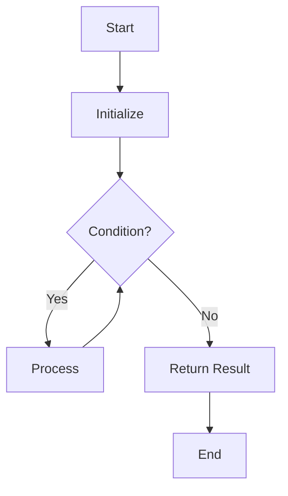
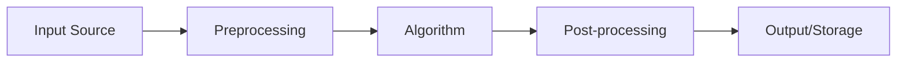

# [Algorithm Name]

## Overview

| Property | Value |
|----------|-------|
| **Category** | [e.g., Sorting, Graph Traversal] |
| **Time Complexity (Best)** | O(?) |
| **Time Complexity (Average)** | O(?) |
| **Time Complexity (Worst)** | O(?) |
| **Space Complexity** | O(?) |
| **Stability** | Yes/No |
| **In-place** | Yes/No |
| **Source File** | [`path/to/file.py`](../../../path/to/file.py) |

---

## 1. Mathematical Foundation

### 1.1 Problem Definition

[Formal mathematical definition of the problem the algorithm solves]

$$
\text{Given: } X = \{x_1, x_2, \ldots, x_n\}
$$

$$
\text{Find: } Y \text{ such that } f(Y) = \text{optimal}
$$

### 1.2 Core Mathematical Concepts

[Key mathematical principles underlying the algorithm]

### 1.3 Key Formulas/Equations

[Essential mathematical formulas with LaTeX notation]

$$
\text{Formula: } result = f(input)
$$

### 1.4 Proof of Correctness

[Mathematical proof or invariant-based correctness argument]

**Loop Invariant** (if applicable):
- **Initialization**: [Proof that invariant holds before first iteration]
- **Maintenance**: [Proof that invariant is preserved by each iteration]
- **Termination**: [Proof that algorithm terminates with correct result]

---

## 2. Algorithm Description

### 2.1 Intuition

[Plain English explanation of the algorithm's core idea]

### 2.2 Key Insights

1. [Insight 1]
2. [Insight 2]
3. [Insight 3]

### 2.3 Step-by-Step Process

1. **Step 1**: [Description]
2. **Step 2**: [Description]
3. **Step 3**: [Description]
4. **Step n**: [Description]

---

## 3. Pseudocode

```
ALGORITHM AlgorithmName(input)
────────────────────────────────────────
INPUT:  input - description of input parameters
OUTPUT: output - description of what the algorithm returns

1.  INITIALIZE variables
2.  
3.  FOR i ← 1 TO n DO
4.      PROCESS element[i]
5.  END FOR
6.  
7.  IF condition THEN
8.      ACTION
9.  ELSE
10.     ALTERNATIVE
11. END IF
12. 
13. WHILE condition DO
14.     ITERATE
15. END WHILE
16. 
17. RETURN result
────────────────────────────────────────
```

---

## 4. Complexity Analysis

### 4.1 Time Complexity

| Case | Complexity | Condition |
|------|------------|-----------|
| **Best** | O(?) | [When this occurs] |
| **Average** | O(?) | [Typical case analysis] |
| **Worst** | O(?) | [When this occurs] |

**Detailed Analysis:**

```
Line-by-line breakdown:
- Line 1: O(1) - constant initialization
- Line 3-5: O(n) - single loop over n elements
- Line 7-11: O(1) - constant time conditional
- Total: O(n)
```

### 4.2 Space Complexity

| Type | Complexity | Description |
|------|------------|-------------|
| **Auxiliary Space** | O(?) | Additional memory beyond input |
| **Input Space** | O(n) | Memory for input storage |
| **Total Space** | O(?) | Sum of all allocations |

**Memory Breakdown:**
- Variables: O(1) - fixed number of primitives
- Recursion Stack: O(?) - if recursive
- Temporary Storage: O(?) - for intermediate results

### 4.3 Recurrence Relation (if applicable)

$$
T(n) = aT\left(\frac{n}{b}\right) + f(n)
$$

**Solution via Master Theorem:**
- Case [1/2/3]: Results in O(?)

---

## 5. Implementation Details

### 5.1 Key Data Structures

| Data Structure | Purpose | Operations Used |
|----------------|---------|-----------------|
| [Structure 1] | [Why used] | [O(?) operations] |
| [Structure 2] | [Why used] | [O(?) operations] |

### 5.2 Important Variables

| Variable | Type | Purpose |
|----------|------|---------|
| `var1` | int | [Description] |
| `var2` | list | [Description] |

### 5.3 Edge Cases

| Edge Case | Expected Behavior | Handling |
|-----------|-------------------|----------|
| Empty input | Return empty/error | [How handled] |
| Single element | Return as-is | [How handled] |
| All duplicates | [Behavior] | [How handled] |
| Already sorted | [Behavior] | [How handled] |
| Reverse sorted | [Behavior] | [How handled] |

---

## 6. Visual Representation

### 6.1 Algorithm Flow



### 6.2 Step-by-Step Example

**Input:** `[example input]`

| Step | State | Action |
|------|-------|--------|
| 0 | [Initial state] | Start |
| 1 | [State after step 1] | [Action taken] |
| 2 | [State after step 2] | [Action taken] |
| n | [Final state] | Complete |

**Output:** `[example output]`

---

## 7. Comparison with Related Algorithms

| Algorithm | Time (Avg) | Time (Worst) | Space | Stable | In-Place | Best Use Case |
|-----------|------------|--------------|-------|--------|----------|---------------|
| **This Algorithm** | O(?) | O(?) | O(?) | ? | ? | [Use case] |
| Alternative 1 | O(?) | O(?) | O(?) | ? | ? | [Use case] |
| Alternative 2 | O(?) | O(?) | O(?) | ? | ? | [Use case] |

### When to Choose This Algorithm

- ✅ [Scenario where this algorithm excels]
- ✅ [Another favorable scenario]
- ❌ [Scenario where alternatives are better]
- ❌ [Another unfavorable scenario]

---

## 8. Real-World Applications in Software Engineering

### 8.1 Industry Use Cases

| Industry | Application | Why This Algorithm |
|----------|-------------|-------------------|
| [Industry 1] | [Specific application] | [Reason for choice] |
| [Industry 2] | [Specific application] | [Reason for choice] |
| [Industry 3] | [Specific application] | [Reason for choice] |

### 8.2 Practical Examples

#### Example 1: [Application Name]

**Problem:** [Description of real-world problem]

**Solution:** [How this algorithm solves it]

```python
# Example usage in production context
def solve_real_problem(data):
    # Apply algorithm
    result = algorithm(data)
    return result
```

#### Example 2: [Application Name]

**Problem:** [Description]

**Solution:** [How applied]

### 8.3 Libraries and Frameworks

| Library/Framework | Language | Usage |
|-------------------|----------|-------|
| [Library 1] | Python | [How it uses this algorithm] |
| [Library 2] | Java | [How it uses this algorithm] |
| [Library 3] | C++ | [How it uses this algorithm] |

### 8.4 System Design Integration



**Integration Points:**
- **Input**: [How data typically arrives]
- **Output**: [How results are typically used]
- **Scaling**: [How to handle large scale]

---

## 9. Optimizations and Variants

### 9.1 Common Optimizations

| Optimization | Benefit | Trade-off |
|--------------|---------|-----------|
| [Optimization 1] | [Improvement] | [Cost] |
| [Optimization 2] | [Improvement] | [Cost] |

### 9.2 Popular Variants

1. **[Variant Name]**: [Description and when to use]
2. **[Variant Name]**: [Description and when to use]

---

## 10. References

### Academic Sources
- [Original Paper/Author, Year]
- [Important Follow-up Work]

### Online Resources
- [Wikipedia: Algorithm Name](https://en.wikipedia.org/wiki/Algorithm_Name)
- [Visualization Tool](https://visualgo.net/)

### Books
- [Book Title, Author, Chapter/Page]

---

*Last Updated: [Date]*
*Implementation: [Link to source file]*
